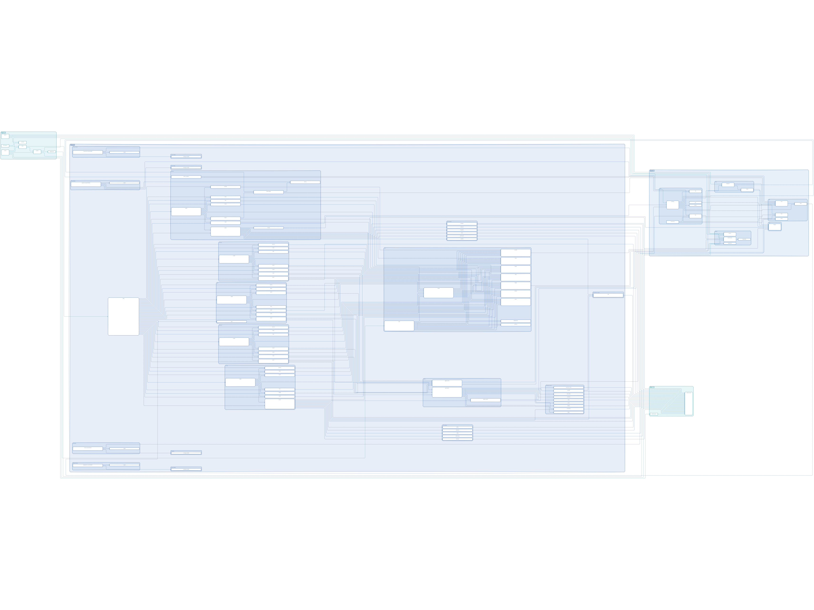
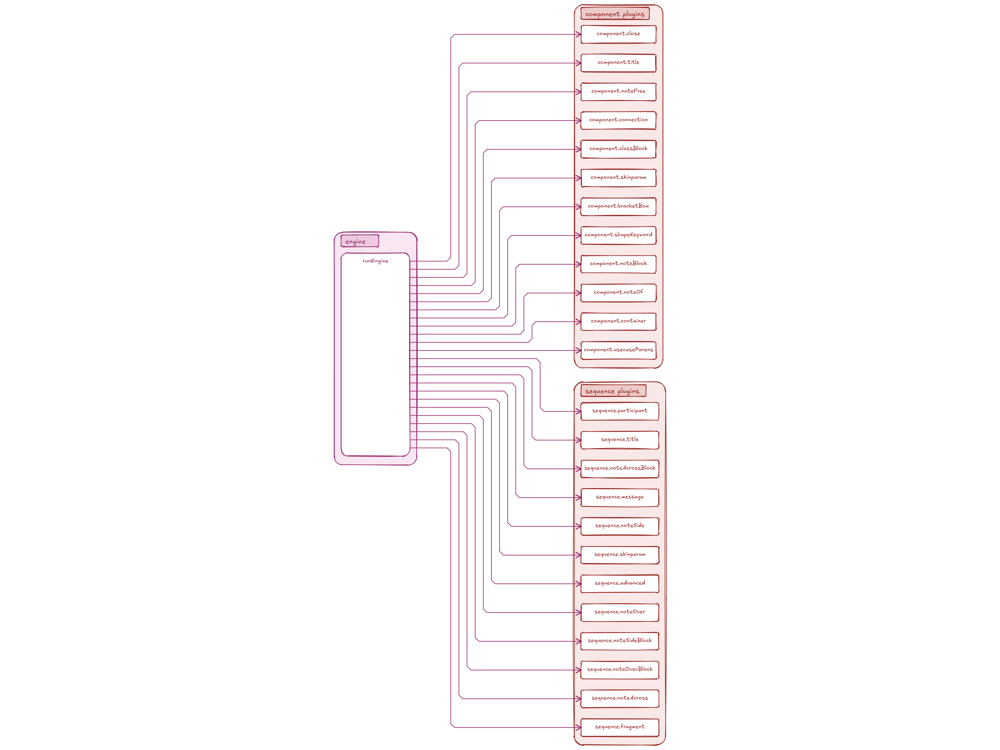

# excaliplant

PlantUML → ELK layout → Excalidraw renderer with a plugin-based parser.

**Version:** `0.1.1`

## Self-rendered diagrams

The diagrams below are generated **by excaliplant itself** at build
time (`npm run build:docs`) from PlantUML sources that describe this
very repository. The doc snippets under each image are extracted
from the source code via `@diagram` JSDoc tags.

> ⚠️  Do not edit `README.md` directly. The file is generated from
> [`docs/README.template.md.njk`](./docs/README.template.md.njk).
> Edit the template and run `npm run build:docs`.


### Module structure



_PlantUML source: [`docs/ressources/generated/puml/modules.puml`](docs/ressources/generated/puml/modules.puml) · SVG: [`docs/ressources/generated/svg/modules.svg`](docs/ressources/generated/svg/modules.svg)_

The module graph reflects how the source is laid out under
[`src/`](./src/). Note in particular how the parser is split into a
single tiny `engine` plus a stack of plugins under `parser/plugins/`,
each plugin handling one PlantUML construct.


### renderPlantUml flow


_PlantUML source: [`docs/ressources/generated/puml/sequence.puml`](docs/ressources/generated/puml/sequence.puml) · SVG: [`docs/ressources/generated/svg/sequence.svg`](docs/ressources/generated/svg/sequence.svg)_

The call graph for `renderPlantUml(text)` walks three subsystems:

1. **parser** turns PlantUML text into a model (`Diagram` /
   `SequenceDiagram`). The parser is plugin-driven; see the next
   diagram for the plugin breakdown.
2. **layout** decides positions. Component diagrams go through ELK
   (layered + orthogonal routing); sequence diagrams use a small
   deterministic tabular layout.
3. **renderer** walks the laid-out model and emits Excalidraw JSON.
   The same model can also be exported to SVG via
   [`src/render/svg.mjs`](./src/render/svg.mjs) — used by the
   documentation pipeline.


### Parser plugins



_PlantUML source: [`docs/ressources/generated/puml/plugins.puml`](docs/ressources/generated/puml/plugins.puml) · SVG: [`docs/ressources/generated/svg/plugins.svg`](docs/ressources/generated/svg/plugins.svg)_

Each parser plugin is a tiny self-contained file that handles ONE
PlantUML construct. The engine offers each input line to plugins
in registration order; the first plugin that returns `true` wins.

To add support for a new PlantUML keyword, drop a new file in
`src/parser/plugins/` and append it to the default array in
[`plantuml.mjs`](./src/parser/plantuml.mjs). No engine change required.


## Module documentation


#### layout

Layout chooses positions for every shape and routes every edge.
Component / use-case / deployment diagrams flow through ELK
(`elkjs`) using the `layered` algorithm with orthogonal edge
routing. After ELK returns we chamfer 90° corners so the result
matches Excalidraw's diagonal-corner aesthetic.

Sequence diagrams skip ELK entirely — their layout is strictly
tabular (lifelines on the X axis, time on the Y axis), so a
deterministic ~90-line algorithm produces better, more compact
results than a force-directed solver could.


#### model

Input-agnostic diagram model. Two top-level kinds:

- **`Diagram`** — component / deployment / use-case style
  (planes, subplanes, boxes, connections).
- **`SequenceDiagram`** — lifelines + messages + notes.

Layout and renderer dispatch on the model class. Anything that
can be expressed as one of these two shapes flows through the
pipeline; the parser is just one possible source. Callers can
also build a `Diagram` programmatically and feed it to
`renderDiagram()`.


#### parser/engine

A ~50-line line-walker. The engine itself knows nothing about
PlantUML syntax; that lives entirely in plugins. Block plugins
(multi-line notes, class bodies) take exclusive ownership of
subsequent lines until they release.

Plugin contract:
```js
{
  name,
  tryStart?(line, ctx): null | { onLine, tryEnd },
  tryLine?(line, ctx): boolean,
}
```


#### render

Emits Excalidraw JSON. Each model shape is dispatched to a
dedicated `renderXxx()` function that produces one or more
Excalidraw primitive elements (rectangle, ellipse, line, arrow,
text). The output document is a stand-alone `.excalidraw` file
that any Excalidraw front-end can open. The companion module
[`src/render/svg.mjs`](./src/render/svg.mjs) converts the same
JSON to SVG for the build-time documentation pipeline.


## Pipeline

```
PlantUML text
     │ parsePlantUml()
     ▼
  Diagram (planes, subplanes, boxes, connections)
     │ layoutDiagram()  (sizing → ELK layered + orthogonal routing → chamfer)
     ▼
  Diagram with absolute positions and edge paths
     │ exportDiagram()
     ▼
  Excalidraw JSON
```

## API

```js
import { renderPlantUml } from "@grethel-labs/excaliplant";

const excalidraw = await renderPlantUml(plantumlText, { sourceLabel: "demo" });
```

Lower-level entry points (`parsePlantUml`, `layoutDiagram`,
`exportDiagram`) are also exported.

## Tests

```sh
npm test
```

@grethel-labs/excaliplant ships with 66 tests across functional,
edge-case, security (XSS / ReDoS / prototype-pollution), and
self-introspection suites.

## License

MIT © grethel-labs
