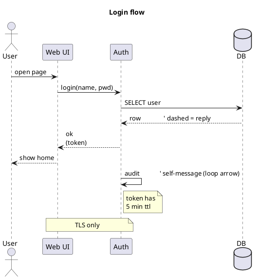

# excaliplant

PlantUML → Excalidraw renderer with a plugin-based parser. Standalone library.

## Pipeline

```
PlantUML text
     │ parsePlantUml()
     ▼
  Diagram (planes, subplanes, boxes, connections)
     │ layoutDiagram()  (sizing → ELK layered + orthogonal routing → chamfer)
     ▼
  Diagram with absolute positions and edge paths
     │ exportDiagram()
     ▼
  Excalidraw JSON
```

## API

```js
import { renderPlantUml } from "./index.mjs";

const excalidraw = await renderPlantUml(plantumlText, { sourceLabel: "demo" });
```

Lower-level entry points (`parsePlantUml`, `layoutDiagram`,
`exportDiagram`, `renderDiagram`) are also exported. The model classes
(`Diagram`, `Plane`, `Subplane`, `Box`, `Connection`) are exported for
callers that want to construct shapes programmatically.

## Supported PlantUML subset

### Component / use-case / deployment diagrams

```plantuml
@startuml
title "<free text>"

' --- containers (any nest the others) -------------------------------
package   "<Title>" as <id> { ... }
frame     "<Title>" as <id> { ... }
folder    "<Title>" as <id> { ... }
node      "<Title>" as <id> { ... }
rectangle "<Title>" as <id> { ... }
together  { ... }

' --- shapes --------------------------------------------------------
[Title] as <id> [: description]
component "Title"  <<stereo>> as <id> [: description]
rectangle "Title"  as <id>
actor     "Title"  as <id>     ' or just `actor User`
usecase   "Title"  as <id>     ' or `(Title) as <id>`
database  "Title"  as <id>
node      "Title"  as <id>     ' (no `{}` → 3-D box shape)
cloud     "Title"  as <id>
interface "Title"  as <id>     ' rendered as a small "lollipop" circle
entity    "Title"  as <id>
class     "Title"  as <id> { member; member }

' --- connections ---------------------------------------------------
a -->   b : label              ' solid arrow
a <--   b
a <-->  b
a -up-> b                      ' direction hint (up|down|left|right)
a ..>   b                      ' dependency (dashed)
a <|--  b                      ' inheritance (triangle on parent)
a ..|>  b                      ' realization (dashed + triangle)
a *--   b                      ' composition (filled diamond)
a o--   b                      ' aggregation (open diamond)

' --- notes ---------------------------------------------------------
note left  of <id> : text
note right of <id> : text
note top   of <id> : text
note bottom of <id> : text
note "free standing text" as N1
N1 .. <id>

' Multi-line text everywhere via \n.
@enduml
```

### Sequence diagrams

The parser auto-switches to the sequence pipeline as soon as it sees a
`participant`/`boundary`/`control`/`collections`/`queue` keyword.



Sequence diagrams use a separate, deterministic tabular layout (no ELK),
since lifelines + time form a strictly tabular structure.

## Architecture

The parser is built around a tiny line-driven engine plus a list of
self-contained **plugins** (one per PlantUML construct):

```
src/parser/
├── engine.mjs              ← ~50 lines, walks lines + dispatches to plugins
├── utils.mjs               ← shared regexes / helpers (slug, classifyArrow, …)
├── component_context.mjs   ← mutable state for component-style parses
├── sequence_context.mjs    ← mutable state for sequence parses
├── plantuml.mjs            ← entry: dispatch + plugin registry
└── plugins/
    ├── component/
    │   ├── preamble.mjs    ← title, closing brace
    │   ├── containers.mjs  ← package / frame / folder / node / rectangle / together
    │   ├── shapes.mjs      ← [X], (Y), shape keywords, class { members }
    │   ├── connections.mjs ← all arrow flavours
    │   └── notes.mjs       ← note of, free notes, multi-line note blocks
    └── sequence/
        ├── preamble.mjs    ← title
        ├── participants.mjs
        ├── messages.mjs
        └── notes.mjs       ← side / over notes (single + multi-line)
```

A plugin is just `{ name, tryLine?(line, ctx), tryStart?(line, ctx) }`
— see `engine.mjs` for the full contract. Block plugins (notes, class
bodies) take over the engine until they decide to release.

### Adding a new construct

1. Create a new plugin file in `plugins/component/` or `plugins/sequence/`.
2. Register it in `DEFAULT_COMPONENT_PLUGINS` / `DEFAULT_SEQUENCE_PLUGINS`
   in `plantuml.mjs`. Order matters only when several plugins might match
   the same line.

### Injecting plugins from outside

Without forking, callers can append their own plugins:

```js
parsePlantUml(src, {
  plugins: {
    component: [...DEFAULT_COMPONENT_PLUGINS, myCustomPlugin],
  },
});
```

## Dependencies

- [`elkjs`](https://www.npmjs.com/package/elkjs) — Eclipse Layout Kernel
  (port to JS). Provides hierarchical layered layout + orthogonal edge
  routing.
- Excalidraw is consumed via its **file-format API**: this lib emits
  the JSON document that any Excalidraw front-end can open. We do not
  bundle the Excalidraw React component (47 MB, browser/DOM-bound;
  not usable in Node).

### Why not delegate parsing / rendering to a third-party library?

We evaluated:

| Candidate | Outcome |
|---|---|
| `plantuml-parser` (Enteee) | Drops `title`, `note`, `actor`/`database`/`cloud`/`entity`/`rectangle` shape declarations, sequence participants, and `-up->` direction hints — too lossy to replace our parser without re-introducing the same regex code as a "supplementary scanner". |
| `@excalidraw/excalidraw` | 47 MB React component, depends on `window` / `canvas`. Not usable in a Node library. |
| `@excalidraw/utils` | 96 MB, same DOM dependencies. Not usable. |
| `@excalidraw/mermaid-to-excalidraw` | Mermaid-only input; doesn't expose a generic skeleton API. |

So instead we make our **own** parser easy to extend (plugin
architecture above) and our renderer talks to Excalidraw via its
documented JSON file format.

## Tests

```sh
npm test
```
