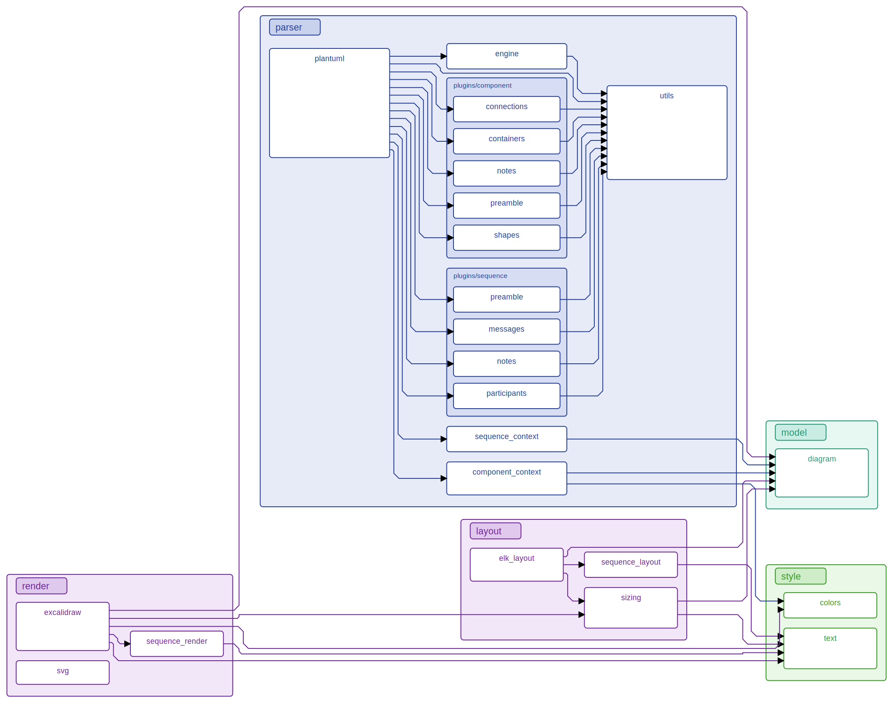
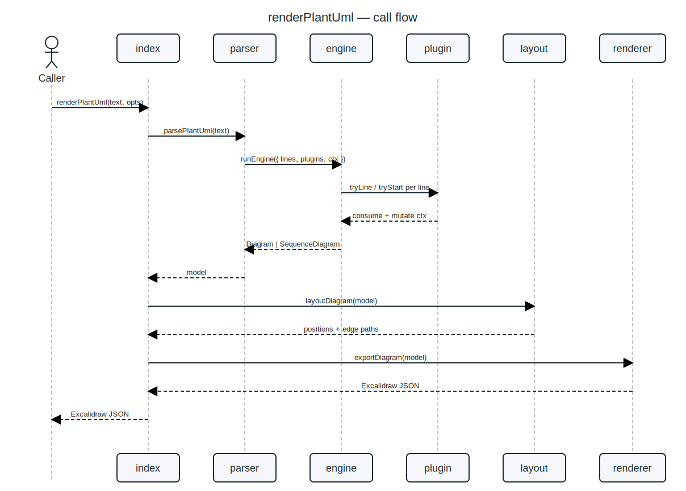
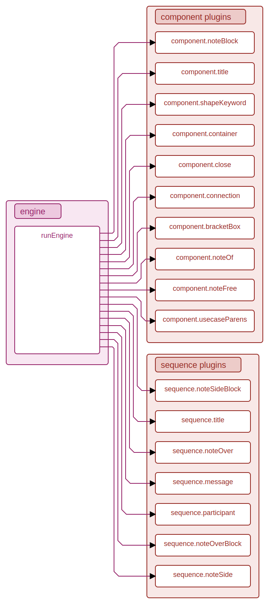
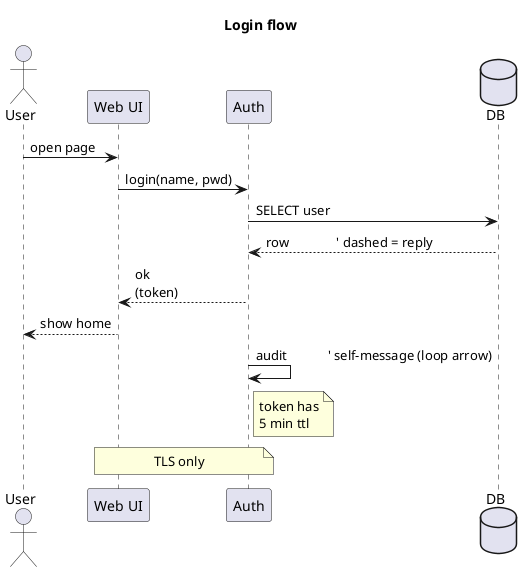

# excaliplant

PlantUML → Excalidraw renderer with a plugin-based parser. Standalone library.

<!-- BEGIN:version -->
**Version:** `0.1.0`
<!-- END:version -->

## Self-rendered diagrams

The diagrams below are generated **by excaliplant itself** at build time
(`npm run build:docs`) from PlantUML sources that describe this very
repository. The doc snippets under each image are extracted from the
source code via `@diagram` JSDoc tags.

<!-- BEGIN:diagrams -->
### Module structure



The module graph reflects how the source is laid out under
[`src/`](./src/). Note in particular how the parser is split into a
single tiny `engine` plus a stack of plugins under `parser/plugins/`,
each plugin handling one PlantUML construct.

### renderPlantUml flow



The call graph for `renderPlantUml(text)` walks three subsystems:

1. **parser** turns PlantUML text into a model (`Diagram` /
   `SequenceDiagram`). The parser is plugin-driven; see the next
   diagram for the plugin breakdown.
2. **layout** decides positions. Component diagrams go through ELK
   (layered + orthogonal routing); sequence diagrams use a small
   deterministic tabular layout.
3. **renderer** walks the laid-out model and emits Excalidraw JSON.
   The same model can also be exported to SVG via
   [`src/render/svg.mjs`](./src/render/svg.mjs) — used by the
   documentation pipeline.

### Parser plugins



Each parser plugin is a tiny self-contained file that handles ONE
PlantUML construct. The engine offers each input line to plugins
in registration order; the first plugin that returns `true` wins.

To add support for a new PlantUML keyword, drop a new file in
`src/parser/plugins/` and append it to the default array in
[`plantuml.mjs`](./src/parser/plantuml.mjs). No engine change required.

<!-- END:diagrams -->

## Module documentation

<!-- BEGIN:module-docs -->
#### layout

Layout chooses positions for every shape and routes every edge.
Component / use-case / deployment diagrams flow through ELK
(`elkjs`) using the `layered` algorithm with orthogonal edge
routing. After ELK returns we chamfer 90° corners so the result
matches Excalidraw's diagonal-corner aesthetic.

Sequence diagrams skip ELK entirely — their layout is strictly
tabular (lifelines on the X axis, time on the Y axis), so a
deterministic ~90-line algorithm produces better, more compact
results than a force-directed solver could.

#### model

Input-agnostic diagram model. Two top-level kinds:

- **`Diagram`** — component / deployment / use-case style
  (planes, subplanes, boxes, connections).
- **`SequenceDiagram`** — lifelines + messages + notes.

Layout and renderer dispatch on the model class. Anything that
can be expressed as one of these two shapes flows through the
pipeline; the parser is just one possible source. Callers can
also build a `Diagram` programmatically and feed it to
`renderDiagram()`.

#### parser/engine

A ~50-line line-walker. The engine itself knows nothing about
PlantUML syntax; that lives entirely in plugins. Block plugins
(multi-line notes, class bodies) take exclusive ownership of
subsequent lines until they release.

Plugin contract:
```js
{
  name,
  tryStart?(line, ctx): null | { onLine, tryEnd },
  tryLine?(line, ctx): boolean,
}
```

#### render

Emits Excalidraw JSON. Each model shape is dispatched to a
dedicated `renderXxx()` function that produces one or more
Excalidraw primitive elements (rectangle, ellipse, line, arrow,
text). The output document is a stand-alone `.excalidraw` file
that any Excalidraw front-end can open. The companion module
[`src/render/svg.mjs`](./src/render/svg.mjs) converts the same
JSON to SVG for the build-time documentation pipeline.

<!-- END:module-docs -->

## Pipeline

```
PlantUML text
     │ parsePlantUml()
     ▼
  Diagram (planes, subplanes, boxes, connections)
     │ layoutDiagram()  (sizing → ELK layered + orthogonal routing → chamfer)
     ▼
  Diagram with absolute positions and edge paths
     │ exportDiagram()
     ▼
  Excalidraw JSON
```

## API

```js
import { renderPlantUml } from "./index.mjs";

const excalidraw = await renderPlantUml(plantumlText, { sourceLabel: "demo" });
```

Lower-level entry points (`parsePlantUml`, `layoutDiagram`,
`exportDiagram`, `renderDiagram`) are also exported. The model classes
(`Diagram`, `Plane`, `Subplane`, `Box`, `Connection`) are exported for
callers that want to construct shapes programmatically.

## Supported PlantUML subset

### Component / use-case / deployment diagrams

```plantuml
@startuml
title "<free text>"

' --- containers (any nest the others) -------------------------------
package   "<Title>" as <id> { ... }
frame     "<Title>" as <id> { ... }
folder    "<Title>" as <id> { ... }
node      "<Title>" as <id> { ... }
rectangle "<Title>" as <id> { ... }
together  { ... }

' --- shapes --------------------------------------------------------
[Title] as <id> [: description]
component "Title"  <<stereo>> as <id> [: description]
rectangle "Title"  as <id>
actor     "Title"  as <id>     ' or just `actor User`
usecase   "Title"  as <id>     ' or `(Title) as <id>`
database  "Title"  as <id>
node      "Title"  as <id>     ' (no `{}` → 3-D box shape)
cloud     "Title"  as <id>
interface "Title"  as <id>     ' rendered as a small "lollipop" circle
entity    "Title"  as <id>
class     "Title"  as <id> { member; member }

' --- connections ---------------------------------------------------
a -->   b : label              ' solid arrow
a <--   b
a <-->  b
a -up-> b                      ' direction hint (up|down|left|right)
a ..>   b                      ' dependency (dashed)
a <|--  b                      ' inheritance (triangle on parent)
a ..|>  b                      ' realization (dashed + triangle)
a *--   b                      ' composition (filled diamond)
a o--   b                      ' aggregation (open diamond)

' --- notes ---------------------------------------------------------
note left  of <id> : text
note right of <id> : text
note top   of <id> : text
note bottom of <id> : text
note "free standing text" as N1
N1 .. <id>

' Multi-line text everywhere via \n.
@enduml
```

### Sequence diagrams

The parser auto-switches to the sequence pipeline as soon as it sees a
`participant`/`boundary`/`control`/`collections`/`queue` keyword.



Sequence diagrams use a separate, deterministic tabular layout (no ELK),
since lifelines + time form a strictly tabular structure.

## Architecture

The parser is built around a tiny line-driven engine plus a list of
self-contained **plugins** (one per PlantUML construct):

```
src/parser/
├── engine.mjs              ← ~50 lines, walks lines + dispatches to plugins
├── utils.mjs               ← shared regexes / helpers (slug, classifyArrow, …)
├── component_context.mjs   ← mutable state for component-style parses
├── sequence_context.mjs    ← mutable state for sequence parses
├── plantuml.mjs            ← entry: dispatch + plugin registry
└── plugins/
    ├── component/
    │   ├── preamble.mjs    ← title, closing brace
    │   ├── containers.mjs  ← package / frame / folder / node / rectangle / together
    │   ├── shapes.mjs      ← [X], (Y), shape keywords, class { members }
    │   ├── connections.mjs ← all arrow flavours
    │   └── notes.mjs       ← note of, free notes, multi-line note blocks
    └── sequence/
        ├── preamble.mjs    ← title
        ├── participants.mjs
        ├── messages.mjs
        └── notes.mjs       ← side / over notes (single + multi-line)
```

A plugin is just `{ name, tryLine?(line, ctx), tryStart?(line, ctx) }`
— see `engine.mjs` for the full contract. Block plugins (notes, class
bodies) take over the engine until they decide to release.

### Adding a new construct

1. Create a new plugin file in `plugins/component/` or `plugins/sequence/`.
2. Register it in `DEFAULT_COMPONENT_PLUGINS` / `DEFAULT_SEQUENCE_PLUGINS`
   in `plantuml.mjs`. Order matters only when several plugins might match
   the same line.

### Injecting plugins from outside

Without forking, callers can append their own plugins:

```js
parsePlantUml(src, {
  plugins: {
    component: [...DEFAULT_COMPONENT_PLUGINS, myCustomPlugin],
  },
});
```

## Dependencies

- [`elkjs`](https://www.npmjs.com/package/elkjs) — Eclipse Layout Kernel
  (port to JS). Provides hierarchical layered layout + orthogonal edge
  routing.
- Excalidraw is consumed via its **file-format API**: this lib emits
  the JSON document that any Excalidraw front-end can open. We do not
  bundle the Excalidraw React component (47 MB, browser/DOM-bound;
  not usable in Node).

### Why not delegate parsing / rendering to a third-party library?

We evaluated:

| Candidate | Outcome |
|---|---|
| `plantuml-parser` (Enteee) | Drops `title`, `note`, `actor`/`database`/`cloud`/`entity`/`rectangle` shape declarations, sequence participants, and `-up->` direction hints — too lossy to replace our parser without re-introducing the same regex code as a "supplementary scanner". |
| `@excalidraw/excalidraw` | 47 MB React component, depends on `window` / `canvas`. Not usable in a Node library. |
| `@excalidraw/utils` | 96 MB, same DOM dependencies. Not usable. |
| `@excalidraw/mermaid-to-excalidraw` | Mermaid-only input; doesn't expose a generic skeleton API. |

So instead we make our **own** parser easy to extend (plugin
architecture above) and our renderer talks to Excalidraw via its
documented JSON file format.

## Tests

```sh
npm test
```
