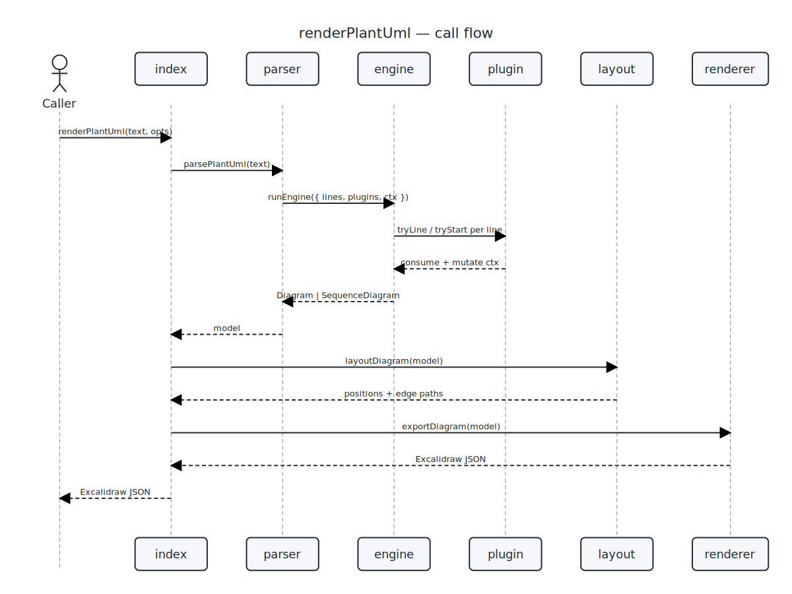
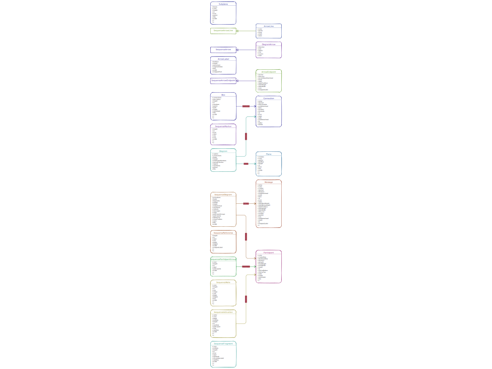

# excaliplant

[](https://www.npmjs.com/package/@grethel-labs/excaliplant)
[](https://www.npmjs.com/package/@grethel-labs/excaliplant)
[](https://github.com/grethel-labs/excaliplant/actions/workflows/ci.yml)
[](https://nodejs.org)
[](./LICENSE)

> PlantUML → ELK layout → Excalidraw renderer with a plugin-based parser. &nbsp;·&nbsp; **v0.8.0** &nbsp;·&nbsp; 192 tests &nbsp;·&nbsp; MIT

`@grethel-labs/excaliplant` takes PlantUML source, runs it through a plugin-based
parser, lays it out with [ELK](https://github.com/kieler/elkjs), and
emits a `.excalidraw` JSON document — opening cleanly in any
Excalidraw front-end. Optional helpers convert the result to SVG or
PNG so the same pipeline can also produce static documentation
artefacts.

<table>
  <tr>
    <td align="center" width="50%">
      <a href="docs/ressources/generated/svg/modules.svg"></a><br/>
      <sub><b>Module structure</b> — rendered by excaliplant itself</sub>
    </td>
    <td align="center" width="50%">
      <a href="docs/ressources/generated/svg/sequence.svg"></a><br/>
      <sub><b>renderPlantUml flow</b> — rendered by excaliplant itself</sub>
    </td>
  </tr>
</table>

> ⚠️ This README is generated. Edit
> [`docs/README.template.md.njk`](./docs/README.template.md.njk) and
> run `npm run build:docs`.

> **AI-generated project notice:** This repository, including source code,
> documentation, comments, and generated artefacts, was created almost entirely
> with AI assistance. The maintainer does not adopt every generated sentence,
> implementation detail, or artefact as a personal statement, endorsement, or
> guarantee. Review everything carefully and use the code at your own risk; the
> MIT License warranty disclaimer applies.

---

## How to use

### Install

```sh
npm install @grethel-labs/excaliplant
```

`@resvg/resvg-js` is pulled in as a runtime dependency so the SVG and
PNG export paths work out of the box.

### Render PlantUML to an Excalidraw document

```js
import { renderPlantUml } from "@grethel-labs/excaliplant";

const excalidraw = await renderPlantUml(plantumlText, { sourceLabel: "demo" });
// → write `excalidraw` to disk as <name>.excalidraw, or hand it to an
//   Excalidraw embed.
```

### Render to SVG / PNG

The result of `renderPlantUml(...)` is a thenable — you can `await` it
to get the Excalidraw JSON, or chain `.toSvg()` / `.toPng()` on it to
get the rasterised diagram in a single line. Both outputs keep the
hand-drawn Excalidraw look (strokes are produced via `roughjs`, the
same library Excalidraw uses internally).

```js
import { renderPlantUml } from "@grethel-labs/excaliplant";

const svg = await renderPlantUml(plantumlText).toSvg();
const png = await renderPlantUml(plantumlText).toPng({ width: 4800 });
```

The lower-level helpers are still exported if you need them:

```js
import {
  renderPlantUml,
  excalidrawJsonToCanvasSvg,
  svgToPng,
} from "@grethel-labs/excaliplant";

const doc = await renderPlantUml(plantumlText);
const svg = excalidrawJsonToCanvasSvg(doc, { width: 1200 });
const png = svgToPng(svg, { width: 4800 });   // 4× SVG width
```

Lower-level entry points are also exported:

| Export                          | Purpose                                          |
| ------------------------------- | ------------------------------------------------ |
| `parsePlantUml(text)`           | PlantUML → `Diagram` model                       |
| `layoutDiagram(diagram)`        | Sizing + ELK layout + edge routing               |
| `exportDiagram(diagram)`        | Diagram → Excalidraw JSON                        |
| `excalidrawToSvg(doc)`          | Excalidraw JSON → tightly-cropped SVG            |
| `excalidrawJsonToCanvasSvg(…)`  | …same, letter-boxed onto a fixed-aspect canvas   |
| `svgToPng(svg)`                 | Rasterise SVG to PNG (`@resvg/resvg-js`)         |

The complete list of exported symbols, with parameter tables and
return types, lives in [`docs/API.md`](./docs/API.md). It is
regenerated from JSDoc on every `npm run build:docs` run.

### Sequence diagram coverage

Sequence diagrams support participants (`participant`, `actor`,
`boundary`, `control`, `entity`, `database`, `collections`, `queue`),
message arrows including async/reply/reverse/bidirectional variants,
notes, participant `box ... end box` groups, `ref over` references,
dividers (`== label ==`), delays (`... label ...`), spacers (`|||` /
`||45||`), `autonumber`, lifecycle controls (`create`, `activate`,
`deactivate`, `destroy`) and inline message lifecycle suffixes
(`++`, `--`, `**`, `!!`). Combined fragments render for `opt`,
`loop`, `alt`/`else`, `par`/`and`, `break`, `critical`/`option`, and
`group`/`option` blocks. A small sequence `skinparam` subset maps
directly to output colours in block or compact form: `ArrowColor`,
`ParticipantBackgroundColor`, `ParticipantBorderColor`, and
`LifeLineBorderColor`.

See the full [Sequence Diagram Component Coverage](./docs/sequence-components.md) for detailed examples and support matrix.

### Run the tests

```sh
npm test
```

Ships with **192 tests** across functional, edge-case,
security (XSS / ReDoS / prototype-pollution), and self-introspection
suites.

---

## Self-rendered architecture diagrams

The diagrams below are produced **by excaliplant itself** at build
time from PlantUML sources that describe this very repository. The
text under each image is extracted from the source via `@diagram`
JSDoc tags.

### Module structure


_Sources: [PlantUML](docs/ressources/generated/puml/modules.puml) · [SVG](docs/ressources/generated/svg/modules.svg)_

The module graph reflects how the source is laid out under
[`src/`](./src/). Diagram-type behavior is collected in first-class
module folders under `src/diagrams/`, orchestration lives under
`src/main/`, and host capabilities live under `src/general/platform/`.

### renderPlantUml flow


_Sources: [PlantUML](docs/ressources/generated/puml/sequence.puml) · [SVG](docs/ressources/generated/svg/sequence.svg)_

The call graph for `renderPlantUml(text)` walks three subsystems:

1. **parser** turns PlantUML text into a model (`Diagram` /
   `SequenceDiagram`). The parser is plugin-driven; see the next
   diagram for the plugin breakdown.
2. **layout** decides positions. Component diagrams go through ELK
   (layered + orthogonal routing); sequence diagrams use a small
   deterministic tabular layout.
3. **renderer** walks the laid-out model and emits Excalidraw JSON.
   The same model can also be exported to SVG via
   [`src/general/render/svg.mjs`](./src/general/render/svg.mjs) — used by the
   documentation pipeline.

### Parser plugins


_Sources: [PlantUML](docs/ressources/generated/puml/plugins.puml) · [SVG](docs/ressources/generated/svg/plugins.svg)_

Each parser plugin is a tiny self-contained file that handles ONE
PlantUML construct. The engine offers each input line to plugins
in registration order; the first plugin that returns `true` wins.

To add support for a new PlantUML keyword, drop a new file in the
owning diagram module folder and append it to that module's parser
contract. No engine change required.

### Model classes



_Sources: [PlantUML](docs/ressources/generated/puml/model.puml) · [SVG](docs/ressources/generated/svg/model.svg)_

The model diagram is generated dynamically from exported classes in
[`src/general/model/diagram.mjs`](./src/general/model/diagram.mjs). It shows how the
reusable arrow classes sit underneath both component connections and
sequence messages, so future model classes appear in the README without
hand-maintained PlantUML.

## Pipeline

```text
PlantUML text
     │ parsePlantUml()
     ▼
  Diagram (planes, subplanes, boxes, connections)
     │ layoutDiagram()  (sizing → ELK layered + orthogonal routing → chamfer)
     ▼
  Diagram with absolute positions and edge paths
     │ exportDiagram()
     ▼
  Excalidraw JSON
     │ excalidrawJsonToCanvasSvg()  (optional)
     ▼
  SVG  ── svgToPng() ──▶  PNG  (both optional, no headless browser)
```

## Repository layout

```text
excaliplant
├── assets
│   ├── arrowheads
│   │   ├── arrowheads.svg
│   │   └── manifest.json
│   └── fonts
│       ├── Excalifont-Regular.ttf
│       ├── Excalifont-Regular.woff2
│       └── LICENSE.txt
├── bin
│   └── excaliplant.mjs
├── docs
│   ├── ressources
│   │   └── sequence
│   │       ├── puml
│   │       └── svg
│   ├── scripts
│   │   ├── build-docs.mjs
│   │   ├── build-sequence-coverage.mjs
│   │   ├── check-build-manifest.mjs
│   │   ├── config.mjs
│   │   ├── extract-api.mjs
│   │   ├── extract-docs.mjs
│   │   ├── file-tree.mjs
│   │   └── self-diagrams.mjs
│   ├── API.md
│   ├── API.template.md.njk
│   ├── README.template.md.njk
│   ├── sequence-components.md
│   ├── sequence-components.template.md.njk
│   └── src-structure-refactor-plan.md
├── scripts
│   ├── auto-patch-deps.mjs
│   ├── bump-release-version.mjs
│   ├── clean-test-output.mjs
│   ├── merge-driver-prefer-higher-version.mjs
│   ├── prepublish-guard.mjs
│   ├── setup-merge-drivers.mjs
│   └── smoke.mjs
├── src
│   ├── diagrams
│   │   ├── base
│   │   │   ├── artifacts.mjs
│   │   │   ├── assets.mjs
│   │   │   ├── dependencies.mjs
│   │   │   ├── docs.mjs
│   │   │   ├── index.mjs
│   │   │   ├── layout.mjs
│   │   │   ├── module.mjs
│   │   │   ├── parser.mjs
│   │   │   ├── renderer.mjs
│   │   │   ├── security.mjs
│   │   │   └── tests.mjs
│   │   ├── class
│   │   │   ├── docs
│   │   │   ├── tests
│   │   │   ├── assets.mjs
│   │   │   ├── docs.mjs
│   │   │   ├── layout.mjs
│   │   │   ├── module.mjs
│   │   │   ├── parser.mjs
│   │   │   ├── render.mjs
│   │   │   ├── security.mjs
│   │   │   ├── style.mjs
│   │   │   └── tests.mjs
│   │   ├── component
│   │   │   ├── docs
│   │   │   ├── tests
│   │   │   ├── assets.mjs
│   │   │   ├── docs.mjs
│   │   │   ├── layout.mjs
│   │   │   ├── module.mjs
│   │   │   ├── parser.mjs
│   │   │   ├── render.mjs
│   │   │   ├── security.mjs
│   │   │   └── tests.mjs
│   │   ├── deployment
│   │   │   ├── docs
│   │   │   ├── tests
│   │   │   ├── assets.mjs
│   │   │   ├── docs.mjs
│   │   │   ├── layout.mjs
│   │   │   ├── module.mjs
│   │   │   ├── parser.mjs
│   │   │   ├── render.mjs
│   │   │   ├── security.mjs
│   │   │   └── tests.mjs
│   │   ├── sequence
│   │   │   ├── docs
│   │   │   ├── plugins
│   │   │   ├── tests
│   │   │   ├── assets.mjs
│   │   │   ├── context.mjs
│   │   │   ├── docs.mjs
│   │   │   ├── layout.mjs
│   │   │   ├── layout_engine.mjs
│   │   │   ├── module.mjs
│   │   │   ├── parser.mjs
│   │   │   ├── render.mjs
│   │   │   ├── render_excalidraw.mjs
│   │   │   ├── security.mjs
│   │   │   ├── spacing.mjs
│   │   │   └── tests.mjs
│   │   ├── shared
│   │   │   ├── common_plugins
│   │   │   ├── graph_plugins
│   │   │   ├── graph_context.mjs
│   │   │   ├── graph_parser.mjs
│   │   │   └── graph_runtime.mjs
│   │   └── index.mjs
│   ├── general
│   │   ├── layout
│   │   │   ├── elk_layout.mjs
│   │   │   └── sizing.mjs
│   │   ├── model
│   │   │   └── diagram.mjs
│   │   ├── platform
│   │   │   ├── asset_base.mjs
│   │   │   ├── diagnostics.mjs
│   │   │   ├── security_base.mjs
│   │   │   └── services.mjs
│   │   ├── render
│   │   │   ├── canvas_svg.mjs
│   │   │   ├── excalidraw.mjs
│   │   │   ├── png.mjs
│   │   │   ├── rng.mjs
│   │   │   ├── schema.mjs
│   │   │   └── svg.mjs
│   │   └── style
│   │       ├── colors.mjs
│   │       ├── font.mjs
│   │       ├── style.mjs
│   │       └── text.mjs
│   ├── main
│   │   ├── builtin.mjs
│   │   ├── dependencies.mjs
│   │   ├── introspection.mjs
│   │   ├── metadata.mjs
│   │   ├── parser.mjs
│   │   ├── pipeline.mjs
│   │   └── registry.mjs
│   └── util
│       ├── parser_engine.mjs
│       └── plantuml_utils.mjs
├── tests
│   ├── helpers
│   │   └── output.mjs
│   ├── class_components.test.mjs
│   ├── component_components.test.mjs
│   ├── deployment_components.test.mjs
│   ├── edge_cases.test.mjs
│   ├── functional_more.test.mjs
│   ├── merge_driver.test.mjs
│   ├── modular_architecture.test.mjs
│   ├── plantuml.test.mjs
│   ├── security.test.mjs
│   ├── self_introspection.test.mjs
│   ├── sequence_components.test.mjs
│   └── style.test.mjs
├── AGENTS.md
├── CHANGELOG.md
├── CLAUDE.md
├── CONTRIBUTING.md
├── GEMINI.md
├── LICENSE
├── README.md
├── SECURITY.md
├── THIRD_PARTY_NOTICES.md
├── index.mjs
├── lifecycle-test.svg
├── package.json
├── style.example.json
├── style.example.yaml
└── tsconfig.json
```

Generated artefacts (`docs/ressources/generated/`) live in
`.gitignore` — they are rebuilt by `npm run build:docs`. The
single-page API reference at [`docs/API.md`](./docs/API.md) is
generated by the same command from JSDoc.

## Module documentation

### diagrams


### diagrams/base


### diagrams/base/artifacts


### diagrams/base/assets


### diagrams/base/dependencies


### diagrams/base/docs


### diagrams/base/layout


### diagrams/base/module


### diagrams/base/parser


### diagrams/base/renderer


### diagrams/base/security


### diagrams/base/tests


### diagrams/class/assets


### diagrams/class/docs


### diagrams/class/docs/coverage_examples


### diagrams/class/layout


### diagrams/class/module


### diagrams/class/parser


### diagrams/class/render


### diagrams/class/security


### diagrams/class/style


### diagrams/class/tests


### diagrams/component/assets


### diagrams/component/docs


### diagrams/component/docs/coverage_examples


### diagrams/component/layout


### diagrams/component/module


### diagrams/component/parser


### diagrams/component/render


### diagrams/component/security


### diagrams/component/tests


### diagrams/deployment/assets


### diagrams/deployment/docs


### diagrams/deployment/layout


### diagrams/deployment/module


### diagrams/deployment/parser


### diagrams/deployment/render


### diagrams/deployment/security


### diagrams/deployment/tests


### diagrams/sequence/assets


### diagrams/sequence/docs


### diagrams/sequence/layout


### diagrams/sequence/module


### diagrams/sequence/parser


### diagrams/sequence/render


### diagrams/sequence/security


### diagrams/sequence/tests


### diagrams/shared/graph_parser


### diagrams/shared/graph_runtime


### layout

Layout chooses positions for every shape and routes every edge.
Component / use-case / deployment diagrams flow through ELK
(`elkjs`) using the `layered` algorithm with orthogonal edge
routing. After ELK returns we chamfer 90° corners so the result
matches Excalidraw's diagonal-corner aesthetic.

Sequence diagrams skip ELK entirely — their layout is strictly
tabular (lifelines on the X axis, time on the Y axis), so a
deterministic ~90-line algorithm produces better, more compact
results than a force-directed solver could.

### main/builtin


### model

Input-agnostic diagram model. Two top-level kinds:

- **`Diagram`** — component / deployment / use-case style
  (planes, subplanes, boxes, connections).
- **`SequenceDiagram`** — lifelines + messages + notes.

Layout and renderer dispatch on the model class. Anything that
can be expressed as one of these two shapes flows through the
pipeline; the parser is just one possible source. Callers can
also build a `Diagram` programmatically and feed it to
`renderDiagram()`.

### modules/dependencies


### modules/introspection


### modules/metadata


### modules/pipeline


### modules/registry


### parser/engine

A ~50-line line-walker. The engine itself knows nothing about
PlantUML syntax; that lives entirely in plugins. Block plugins
(multi-line notes, class bodies) take exclusive ownership of
subsequent lines until they release.

### platform/asset-base


### platform/diagnostics


### platform/security-base


### platform/services


### render

Emits Excalidraw JSON. Each model shape is dispatched to a
dedicated `renderXxx()` function that produces one or more
Excalidraw primitive elements (rectangle, ellipse, line, arrow,
text). The output document is a stand-alone `.excalidraw` file
that any Excalidraw front-end can open. The companion module
`src/general/render/svg.mjs` converts the same JSON to SVG for the
build-time documentation pipeline.

### sequence-spacing

Central spacing contract for sequence diagrams.

Sequence layout has many visual item types (messages, notes, refs,
dividers, fragments, lifecycle bars). They all reserve vertical space
through this module so adding a new timeline item does not introduce a
one-off top/bottom rhythm.

## License

MIT © grethel-labs
