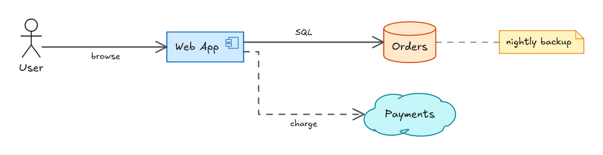
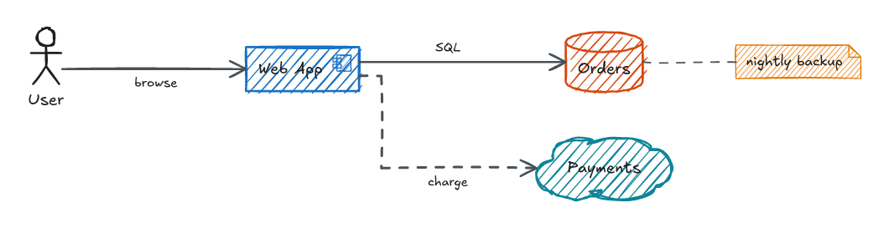
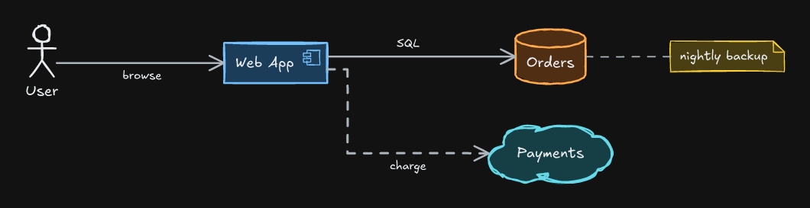

<!-- This README is generated by `npm run docs` from docs/README.template.md. Edit the template, not this file. -->

<h1 align="center">excaliplant</h1>

<p align="center">
  <b>PlantUML in, hand-drawn diagrams out.</b><br />
  Render PlantUML as editable <a href="https://excalidraw.com">Excalidraw</a> scenes, SVG and PNG — 29 diagram types, zero Java, zero network.
</p>

<p align="center">
  <a href="https://www.npmjs.com/package/@grethel-labs/excaliplant"></a>
  <a href="https://www.npmjs.com/package/@grethel-labs/excaliplant"></a>
  <a href="https://github.com/grethel-labs/excaliplant/actions/workflows/ci.yml"></a>
  
  <a href="./LICENSE"></a>
</p>

<p align="center">
  <a href="https://grethel-labs.github.io/excaliplant/"></a>
</p>

<p align="center">
  <a href="https://grethel-labs.github.io/excaliplant/#sequence"><kbd>Sequence</kbd></a>
  <a href="https://grethel-labs.github.io/excaliplant/#class"><kbd>Class & IE</kbd></a>
  <a href="https://grethel-labs.github.io/excaliplant/#activity"><kbd>Activity</kbd></a>
  <a href="https://grethel-labs.github.io/excaliplant/#state"><kbd>State</kbd></a>
  <a href="https://grethel-labs.github.io/excaliplant/#component"><kbd>Component & C4</kbd></a>
  <a href="https://grethel-labs.github.io/excaliplant/#usecase"><kbd>Use case</kbd></a>
  <a href="https://grethel-labs.github.io/excaliplant/#deployment"><kbd>Deployment</kbd></a>
  <a href="https://grethel-labs.github.io/excaliplant/#object"><kbd>Object</kbd></a>
  <a href="https://grethel-labs.github.io/excaliplant/#timing"><kbd>Timing</kbd></a>
  <a href="https://grethel-labs.github.io/excaliplant/#gantt"><kbd>Gantt</kbd></a>
  <a href="https://grethel-labs.github.io/excaliplant/#mindmap"><kbd>Mind map</kbd></a>
  <a href="https://grethel-labs.github.io/excaliplant/#wbs"><kbd>WBS</kbd></a>
  <a href="https://grethel-labs.github.io/excaliplant/#json"><kbd>JSON</kbd></a>
  <a href="https://grethel-labs.github.io/excaliplant/#yaml"><kbd>YAML</kbd></a>
  <a href="https://grethel-labs.github.io/excaliplant/#archimate"><kbd>ArchiMate</kbd></a>
  <a href="https://grethel-labs.github.io/excaliplant/#chen"><kbd>Chen ER</kbd></a>
  <a href="https://grethel-labs.github.io/excaliplant/#nwdiag"><kbd>Network</kbd></a>
  <a href="https://grethel-labs.github.io/excaliplant/#salt"><kbd>Salt wireframe</kbd></a>
  <a href="https://grethel-labs.github.io/excaliplant/#ebnf"><kbd>EBNF</kbd></a>
  <a href="https://grethel-labs.github.io/excaliplant/#regex"><kbd>Regex</kbd></a>
  <a href="https://grethel-labs.github.io/excaliplant/#dot"><kbd>Graphviz DOT</kbd></a>
  <a href="https://grethel-labs.github.io/excaliplant/#chronology"><kbd>Chronology</kbd></a>
  <a href="https://grethel-labs.github.io/excaliplant/#files"><kbd>Files</kbd></a>
  <a href="https://grethel-labs.github.io/excaliplant/#chart"><kbd>Chart</kbd></a>
  <a href="https://grethel-labs.github.io/excaliplant/#math"><kbd>AsciiMath</kbd></a>
  <a href="https://grethel-labs.github.io/excaliplant/#latex"><kbd>LaTeX</kbd></a>
  <a href="https://grethel-labs.github.io/excaliplant/#ditaa"><kbd>Ditaa</kbd></a>
  <a href="https://grethel-labs.github.io/excaliplant/#legacy-activity"><kbd>Legacy activity</kbd></a>
  <a href="https://grethel-labs.github.io/excaliplant/#creole"><kbd>Creole</kbd></a>
</p>

<p align="center">
  <a href="https://grethel-labs.github.io/excaliplant/"><b>▶ Click through all 41 examples in the interactive gallery</b></a><br />
  <sub>Every diagram is rendered by excaliplant from <a href="examples/"><code>examples/</code></a> — with PlantUML source, SVG and <code>.excalidraw</code> downloads.</sub>
</p>

## Why excaliplant?

- **Looks like a whiteboard, stays a diagram.** Output is a real Excalidraw scene: open it in Excalidraw, move boxes, arrows stay bound.
- **Broad PlantUML coverage.** Sequence, class, activity, state, component, C4, Gantt, mind maps, JSON, regex, math — see the [full list](#supported-diagrams).
- **The PlantUML language, not just diagrams.** Preprocessor (`!procedure`, `!function`, loops, JSON variables, `!include`), Creole markup, `skinparam`, `<style>`, themes, colours and bundled C4/ArchiMate libraries.
- **Pure JavaScript.** No Java, no Graphviz, no PlantUML server. Layout runs on [ELK](https://github.com/kieler/elkjs) and purpose-built engines.
- **Deterministic.** Same input, same bytes — ideal for docs in git.
- **Safe for untrusted input.** Resource limits, escaped output, no file or network access unless you opt in.

## Quick start

```sh
npm install @grethel-labs/excaliplant
```

### Command line

```sh
npx excaliplant diagram.puml -o diagram.svg          # hand-drawn SVG
npx excaliplant diagram.puml -o diagram.png --width 1600
npx excaliplant diagram.puml -o diagram.excalidraw   # open in excalidraw.com
cat diagram.puml | npx excaliplant -f svg --theme dark > diagram.svg
```

### JavaScript

```js
import { render } from "@grethel-labs/excaliplant";

const result = await render(`
@startuml
Alice -> Bob : hello
Bob --> Alice : hi!
@enduml
`);

result.kind; //           "sequence"
result.excalidraw; //     Excalidraw scene (JSON)
await result.toSvg(); //  standalone SVG with embedded Excalifont
await result.toPng({ width: 1200 }); // PNG Buffer
result.diagnostics; //    warnings with line numbers
```

## How it works


Each diagram type is a small module with four hooks — `detect`, `parse`, `layout`, `draw` — on top of a shared core (preprocessor, PlantUML syntax helpers, text measurement with real font metrics, a drawing canvas and the renderers). Modules never touch Excalidraw or SVG directly; they draw shapes on a canvas, which keeps the three output formats in sync. See [`docs/architecture.md`](docs/architecture.md).

## Supported diagrams

| Diagram | Examples | Highlights |
| --- | --- | --- |
| [Sequence](https://grethel-labs.github.io/excaliplant/#sequence) | [4](docs/gallery.md#sequence) | Participants, all arrow styles, activations, notes, fragments, dividers, autonumber, boxes. |
| [Class & IE](https://grethel-labs.github.io/excaliplant/#class) | [3](docs/gallery.md#class) | Classes, interfaces, enums, generics, members, packages, all UML relations, IE crow's feet. |
| [Activity](https://grethel-labs.github.io/excaliplant/#activity) | [3](docs/gallery.md#activity) | New syntax with if/switch/while/repeat/fork/split, partitions, notes and swimlanes. |
| [State](https://grethel-labs.github.io/excaliplant/#state) | [2](docs/gallery.md#state) | Composite states, concurrent regions, choice, fork/join, history, entry/exit actions. |
| [Component & C4](https://grethel-labs.github.io/excaliplant/#component) | [2](docs/gallery.md#component) | Components, interfaces, ports, packages, nodes — and C4 via `!include <C4/...>`. |
| [Use case](https://grethel-labs.github.io/excaliplant/#usecase) | [2](docs/gallery.md#usecase) | Actors, use cases, system boundaries, include/extend. |
| [Deployment](https://grethel-labs.github.io/excaliplant/#deployment) | [2](docs/gallery.md#deployment) | Nodes, clouds, databases, queues, artifacts and nested deployment targets. |
| [Object](https://grethel-labs.github.io/excaliplant/#object) | [1](docs/gallery.md#object) | Objects with fields, maps (`key => value`) and links. |
| [Timing](https://grethel-labs.github.io/excaliplant/#timing) | [2](docs/gallery.md#timing) | Robust, concise, clock, binary and analog signals with messages and constraints. |
| [Gantt](https://grethel-labs.github.io/excaliplant/#gantt) | [1](docs/gallery.md#gantt) | Tasks, dependencies, milestones, progress, resources, closed days, today marker. |
| [Mind map](https://grethel-labs.github.io/excaliplant/#mindmap) | [1](docs/gallery.md#mindmap) | OrgMode/Markdown outlines on both sides, colours, boxless nodes. |
| [WBS](https://grethel-labs.github.io/excaliplant/#wbs) | [1](docs/gallery.md#wbs) | Work breakdown structures as org charts. |
| [JSON](https://grethel-labs.github.io/excaliplant/#json) | [1](docs/gallery.md#json) | JSON documents as linked tables with highlights. |
| [YAML](https://grethel-labs.github.io/excaliplant/#yaml) | [1](docs/gallery.md#yaml) | YAML documents as linked tables. |
| [ArchiMate](https://grethel-labs.github.io/excaliplant/#archimate) | [1](docs/gallery.md#archimate) | ArchiMate elements by layer with icons, junctions and `Rel_*` macros. |
| [Chen ER](https://grethel-labs.github.io/excaliplant/#chen) | [1](docs/gallery.md#chen) | Chen ER diagrams: entities, weak entities, relationships, attributes, cardinalities. |
| [Network](https://grethel-labs.github.io/excaliplant/#nwdiag) | [1](docs/gallery.md#nwdiag) | Networks, addresses, multi-homed nodes, groups and peer links. |
| [Salt wireframe](https://grethel-labs.github.io/excaliplant/#salt) | [1](docs/gallery.md#salt) | Wireframes: grids, buttons, inputs, check boxes, trees, tabs, group boxes. |
| [EBNF](https://grethel-labs.github.io/excaliplant/#ebnf) | [1](docs/gallery.md#ebnf) | EBNF grammars as railroad diagrams. |
| [Regex](https://grethel-labs.github.io/excaliplant/#regex) | [1](docs/gallery.md#regex) | Regular expressions as railroad diagrams. |
| [Graphviz DOT](https://grethel-labs.github.io/excaliplant/#dot) | [1](docs/gallery.md#dot) | Graphviz DOT graphs laid out with ELK. |
| [Chronology](https://grethel-labs.github.io/excaliplant/#chronology) | [1](docs/gallery.md#chronology) | Events and spans on a time line with links. |
| [Files](https://grethel-labs.github.io/excaliplant/#files) | [1](docs/gallery.md#files) | File trees from path lists with notes. |
| [Chart](https://grethel-labs.github.io/excaliplant/#chart) | [1](docs/gallery.md#chart) | Bar, line, area and scatter charts. |
| [AsciiMath](https://grethel-labs.github.io/excaliplant/#math) | [1](docs/gallery.md#math) | AsciiMath formulas. |
| [LaTeX](https://grethel-labs.github.io/excaliplant/#latex) | [1](docs/gallery.md#latex) | LaTeX formulas. |
| [Ditaa](https://grethel-labs.github.io/excaliplant/#ditaa) | [1](docs/gallery.md#ditaa) | ASCII art boxes, lines, arrows and colour tags. |
| [Legacy activity](https://grethel-labs.github.io/excaliplant/#legacy-activity) | [1](docs/gallery.md#legacy-activity) | The classic `(*) --> "Activity"` syntax with sync bars and branches. |
| [Creole](https://grethel-labs.github.io/excaliplant/#creole) | [1](docs/gallery.md#creole) | Rich text with headings, lists, tables and links. |

## PlantUML language support

| Feature          | Notes                                                                                                                                                                                                                                                                                                                |
| ---------------- | -------------------------------------------------------------------------------------------------------------------------------------------------------------------------------------------------------------------------------------------------------------------------------------------------------------------- |
| Preprocessor     | `!$var`, `!define`/`!definelong`, `!if`/`!elseif`/`!else`, `!ifdef`, `!while`, `!foreach`, `!procedure`, `!function`/`!return`, default and keyword arguments, JSON variables, builtins (`%strlen`, `%upper`, `%date`, `%lighten`, …), `!include`/`!includesub` via resolver, `!theme`, `!pragma`, `!log`, `!assert` |
| Standard library | Bundled, offline implementations of `<C4/C4_Context>`, `<C4/C4_Container>`, `<C4/C4_Component>`, … and `<archimate/Archimate>`                                                                                                                                                                                       |
| Creole           | `**bold**`, `//italic//`, `""mono""`, `--strike--`, `__underline__`, `~~wave~~`, headings, bullet and numbered lists, tables, separators, `<b>`, `<i>`, `<color>`, `<size>`, `<back>`, `<sub>`, `<sup>`, `[[links]]`, `<U+XXXX>`                                                                                     |
| Styling          | `skinparam` (single line and blocks), `<style>` sheets, inline colours `#back;line:red;line.dashed;text:blue`, all HTML colour names, gradients (first colour)                                                                                                                                                       |
| Commons          | `title`, `caption`, `header`, `footer`, `legend`, `mainframe`, `hide`/`show`, `left to right direction`, `newpage`, multiple `@start…@end` blocks                                                                                                                                                                    |

## Themes

Pick a theme with `--theme` / `{ theme }`, or let PlantUML's `!theme` choose the closest match. Available: `sketch`, `plain`, `hachure`, `mono`, `dark`, `blueprint`. Add `--clean` / `{ sketch: false }` for straight lines.

<table>
  <tr>
    <td align="center"><br /><code>sketch</code></td>
    <td align="center"><br /><code>plain</code></td>
    <td align="center"><br /><code>hachure</code></td>
  </tr>
  <tr>
    <td align="center"><br /><code>mono</code></td>
    <td align="center"><br /><code>dark</code></td>
    <td align="center"><br /><code>blueprint</code></td>
  </tr>
</table>

## API

| Export                                    | Description                                                       |
| ----------------------------------------- | ----------------------------------------------------------------- |
| `render(source, options?)`                | Render the first (or `options.block`) diagram → `RenderResult`    |
| `renderAll(source, options?)`             | Render every `@start…@end` block                                  |
| `parse(source, options?)`                 | Parse without layout → `{ kind, model, diagnostics }`             |
| `detectKind(source)`                      | Detected diagram kind                                             |
| `listDiagramTypes()`                      | Supported kinds and their start keywords                          |
| `renderPlantUml(source)`                  | 0.x-compatible: `await` → Excalidraw JSON, `.toSvg()`, `.toPng()` |
| `preprocessText(source, options?)`        | Run only the preprocessor                                         |
| `DiagramRegistry`, `defineDiagram`        | Register your own diagram modules                                 |
| `THEMES`, `THEME_NAMES`, `DEFAULT_LIMITS` | Built-in themes and resource limits                               |

`RenderResult` has `kind`, `name`, `excalidraw`, `diagnostics`, `pages`, `model`, `toJSON()`, `toSvg({ padding, background, embedFont })` and `toPng({ width, scale, background })`.

<details>
<summary><b>Render options</b></summary>

| Option     | Default          | Description                                                               |
| ---------- | ---------------- | ------------------------------------------------------------------------- |
| `theme`    | `"sketch"`       | Theme name or theme object                                                |
| `sketch`   | theme default    | `false` for clean strokes                                                 |
| `seed`     | `"excaliplant"`  | Seed for ids and stroke wobble                                            |
| `block`    | `0`              | Block index or `@startuml name`                                           |
| `page`     | `0`              | Page of a `newpage` document                                              |
| `strict`   | `false`          | Throw on unrecognised lines instead of warning                            |
| `include`  | —                | `(target, { from, kind }) => string \| null` resolver for `!include`      |
| `defines`  | —                | Predefined preprocessor variables                                         |
| `date`     | `null`           | Date returned by `%date()` (empty by default for reproducible output)     |
| `limits`   | `DEFAULT_LIMITS` | Input size, lines, nodes, edges, elements, preprocessor budget, PNG width |
| `kind`     | auto             | Force a diagram module                                                    |
| `registry` | built-in         | Custom `DiagramRegistry`                                                  |

</details>

<details>
<summary><b>CLI options</b></summary>

```text
excaliplant [input.puml] [-o output] [options]

  -o, --output <file>       Output file (format from extension unless -f is given)
  -f, --format <fmt>        excalidraw | svg | png
  -t, --theme <name>        sketch | plain | hachure | mono | dark | blueprint
      --clean               Clean strokes instead of the hand-drawn look
      --width <px>          PNG width (16–16000)
      --scale <n>           PNG scale relative to the SVG size (default 2)
      --background <color>  Background colour for SVG/PNG
      --seed <value>        Seed for stroke wobble and element ids
      --page <n>            Page of a newpage document
      --all                 Render every block ("{n}" in -o is the block number)
      --include-dir <dir>   Allow !include of files below <dir>
  -D, --define NAME=value   Predefine a preprocessor variable
      --strict              Fail on unrecognised lines
      --list-types          List supported diagram types
```

</details>

## Security

excaliplant is built to render untrusted PlantUML:

- No file-system or network access while rendering. `!include` only works through a resolver you pass in (the CLI's `--include-dir` restricts includes to one directory tree); `!includeurl` and `!import` are refused.
- Every text and attribute in SVG output is escaped; colours are validated; links are limited to `http(s)` and `mailto`.
- Budgets for input size, lines, preprocessor steps/recursion/loop iterations, nodes, edges, drawing elements and PNG size (see `DEFAULT_LIMITS`).
- Parsers are scanner-based or use bounded regular expressions; hostile inputs are covered by [`test/security.test.mjs`](test/security.test.mjs).

Please report vulnerabilities as described in [SECURITY.md](SECURITY.md).

## Compatibility notes

excaliplant re-implements PlantUML in JavaScript, so diagrams look different from PlantUML's output — that is the point. Layout decisions differ (ELK instead of Graphviz), sprites and `<&icons>` render as placeholder glyphs, and the bundled standard library covers C4 and ArchiMate only. Unknown lines are reported as warnings (or errors with `strict`), never silently dropped.

## Development

```sh
npm ci
npm test            # node:test suite (examples, syntax, security, CLI)
npm run typecheck   # tsc --checkJs
npm run format      # prettier
npm run docs        # regenerate gallery, screenshots and this README
npm run check       # everything CI checks
```

Add a diagram example by dropping a `.puml` file into `examples/<kind>/` — it becomes a test case and a gallery entry. Contribution guidelines live in [CONTRIBUTING.md](CONTRIBUTING.md).

Releases are fully automated: every pull request carries one `release:major|minor|patch|none` label, and merging publishes the next version to npm with provenance (see [`docs/releasing.md`](docs/releasing.md)).

## License

[MIT](LICENSE). Excalifont is licensed under the SIL Open Font License; see [THIRD_PARTY_NOTICES.md](THIRD_PARTY_NOTICES.md).

> **AI-generated project notice:** this repository was created almost entirely with AI assistance. Review the code before relying on it; the MIT warranty disclaimer applies.
