# Diagram gallery

> Generated by `npm run docs` from [`examples/`](../examples). Every example is also a test fixture. Prefer clicking? Browse the [interactive gallery](https://grethel-labs.github.io/excaliplant/#gallery) or edit any example in the [live playground](https://grethel-labs.github.io/excaliplant/#play).

[Sequence](#sequence) · [Class & IE](#class) · [Activity](#activity) · [State](#state) · [Component & C4](#component) · [Use case](#usecase) · [Deployment](#deployment) · [Object](#object) · [Timing](#timing) · [Gantt](#gantt) · [Mind map](#mindmap) · [WBS](#wbs) · [JSON](#json) · [YAML](#yaml) · [ArchiMate](#archimate) · [Chen ER](#chen) · [Network](#nwdiag) · [Salt wireframe](#salt) · [EBNF](#ebnf) · [Regex](#regex) · [Graphviz DOT](#dot) · [Chronology](#chronology) · [Files](#files) · [Chart](#chart) · [AsciiMath](#math) · [LaTeX](#latex) · [Ditaa](#ditaa) · [Legacy activity](#legacy-activity) · [Creole](#creole)

## sequence

**Sequence** — Participants, all arrow styles, activations, notes, fragments, dividers, autonumber, boxes.

### checkout-flow

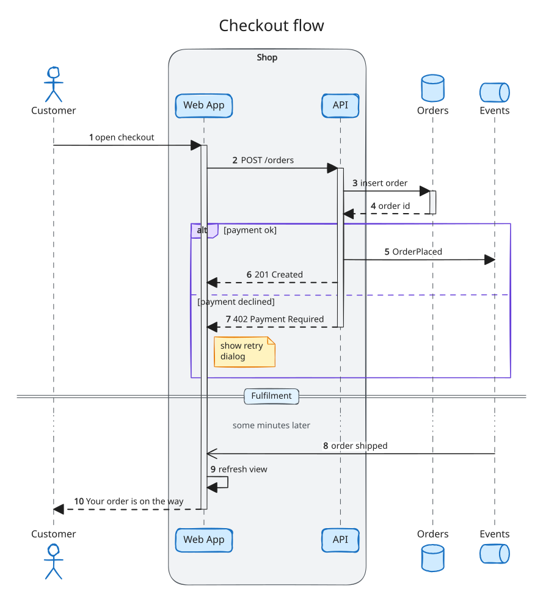

Source

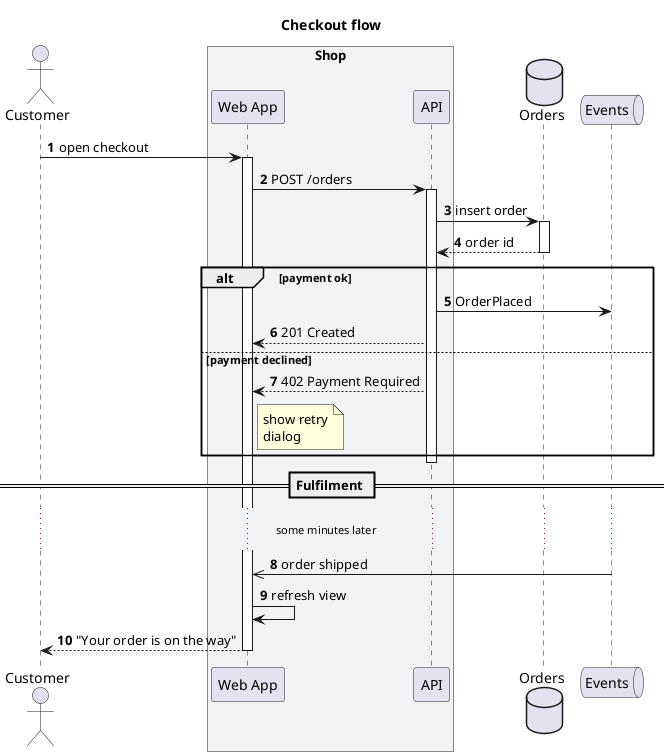
```plantuml
@startuml
title Checkout flow
autonumber
actor Customer as C
box "Shop" #f1f3f5
  participant "Web App" as W
  participant API
end box
database Orders as DB
queue Events as Q

C -> W ++ : open checkout
W -> API ++ : POST /orders
API -> DB ++ : insert order
DB --> API -- : order id
alt payment ok
  API -> Q : OrderPlaced
  API --> W : 201 Created
else payment declined
  API --> W : 402 Payment Required
  note right of W : show retry\ndialog
end
deactivate API
== Fulfilment ==
... some minutes later ...
Q ->> W : order shipped
W -> W : refresh view
W --> C -- : "Your order is on the way"
@enduml
```

### fragments-notes

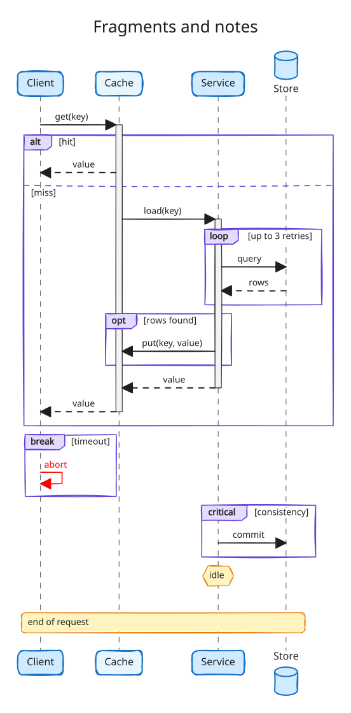

Source

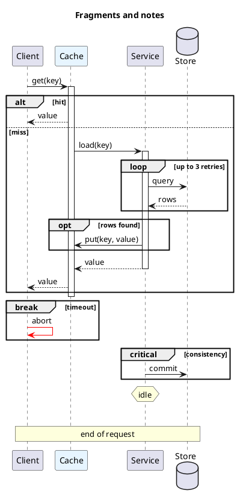
```plantuml
@startuml
title Fragments and notes
participant Client
participant Cache #e7f5ff
participant Service
database Store
Client -> Cache ++ : get(key)
alt hit
  Cache --> Client : value
else miss
  Cache -> Service ++ : load(key)
  loop up to 3 retries
    Service -> Store : query
    Store --> Service : rows
  end
  opt rows found
    Service -> Cache : put(key, value)
  end
  Service --> Cache -- : value
  Cache --> Client : value
end
deactivate Cache
break timeout
  Client -[#red]> Client : abort
end
critical consistency
  Service -> Store : commit
end
hnote over Service : idle
||30||
rnote over Client, Store : end of request
@enduml
```

### lifecycle

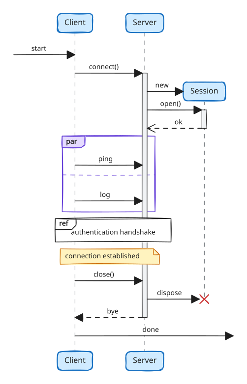

Source

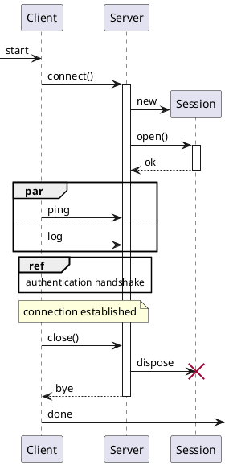
```plantuml
@startuml
participant Client
participant Server
[-> Client : start
Client -> Server ++ : connect()
create Session
Server -> Session ** : new
Server -> Session ++ : open()
return ok
par
  Client -> Server : ping
else
  Client -> Server : log
end
ref over Client, Server : authentication handshake
note over Client, Server : connection established
Client -> Server : close()
Server -> Session !! : dispose
Server --> Client -- : bye
Client ->] : done
@enduml
```

### preprocessor

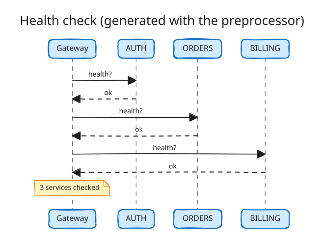

Source

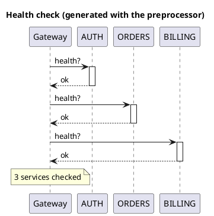
```plantuml
@startuml
!$services = ["auth", "orders", "billing"]
!procedure $call($svc, $msg="ping")
Gateway -> $svc : $msg
$svc --> Gateway : ok
!endprocedure
!function $upper($s) !return %upper($s)
title Health check (generated with the preprocessor)
autoactivate on
participant Gateway
!foreach $s in $services
participant "$upper($s)" as $s
!endfor
!foreach $s in $services
$call($s, "health?")
!endfor
!if %size($services) > 2
note over Gateway : %size($services) services checked
!endif
@enduml
```

## class

**Class & IE** — Classes, interfaces, enums, generics, members, packages, all UML relations, IE crow's feet.

### shop-domain

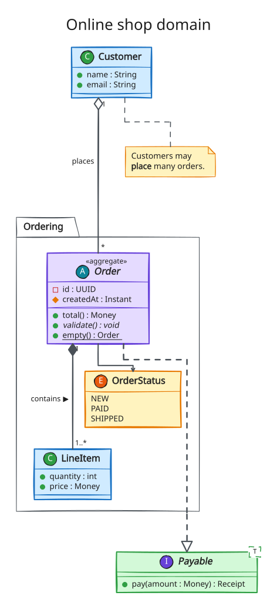

Source

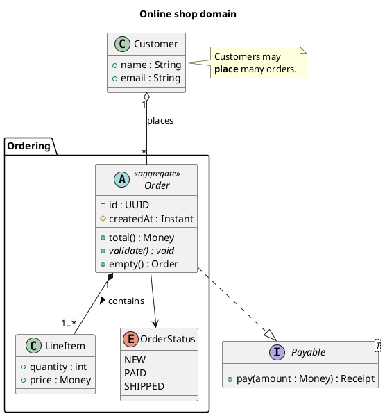
```plantuml
@startuml
title Online shop domain
package "Ordering" {
  abstract class Order <<aggregate>> {
    - id : UUID
    # createdAt : Instant
    + total() : Money
    + {abstract} validate() : void
    + {static} empty() : Order
  }
  class LineItem {
    + quantity : int
    + price : Money
  }
  enum OrderStatus {
    NEW
    PAID
    SHIPPED
  }
}
interface Payable<T> {
  + pay(amount : Money) : Receipt
}
class Customer {
  + name : String
  + email : String
}
Order "1" *-- "1..*" LineItem : contains >
Order --> OrderStatus
Order ..|> Payable
Customer "1" o-- "*" Order : places
note right of Customer : Customers may\n**place** many orders.
@enduml
```

### ie-schema

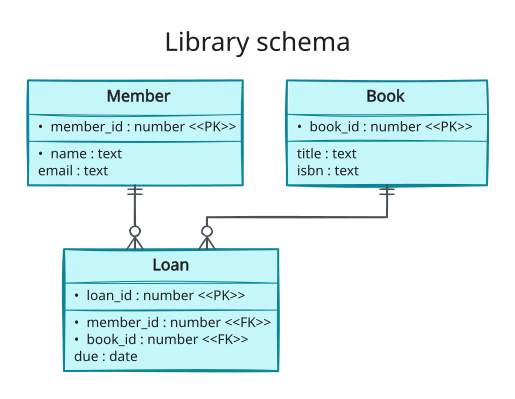

Source

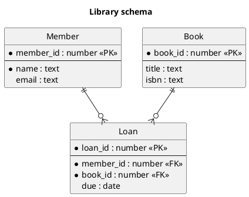
```plantuml
@startuml
title Library schema
hide circle
entity Member {
  * member_id : number <<PK>>
  --
  * name : text
  email : text
}
entity Loan {
  * loan_id : number <<PK>>
  --
  * member_id : number <<FK>>
  * book_id : number <<FK>>
  due : date
}
entity Book {
  * book_id : number <<PK>>
  --
  title : text
  isbn : text
}
Member ||--o{ Loan
Book ||--o{ Loan
@enduml
```

### relations

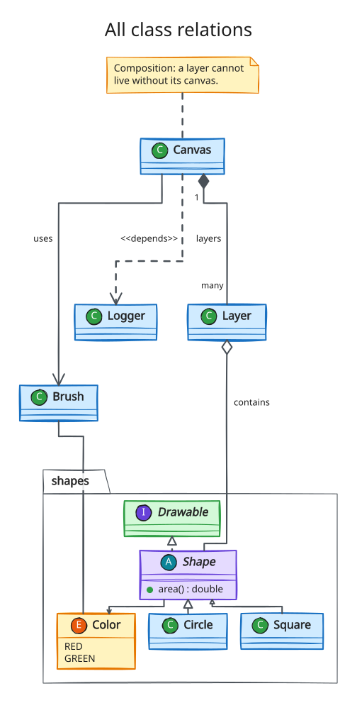

Source

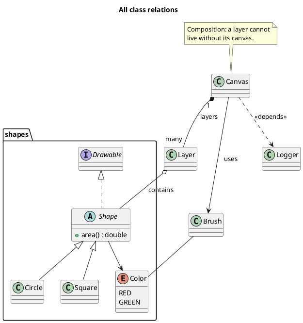
```plantuml
@startuml
title All class relations
namespace shapes {
  abstract class Shape {
    + area() : double
  }
  class Circle
  class Square
  interface Drawable
  enum Color {
    RED
    GREEN
  }
}
class Canvas
class Layer
class Brush
class Logger
Shape <|-- Circle
Shape <|-- Square
Drawable <|.. Shape
Canvas "1" *-- "many" Layer : layers
Layer o-- Shape : contains
Canvas --> Brush : uses
Canvas ..> Logger : <<depends>>
Shape --> Color
Brush -- Color
note "Composition: a layer cannot\nlive without its canvas." as N1
N1 .. Canvas
@enduml
```

## activity

**Activity** — New syntax with if/switch/while/repeat/fork/split, partitions, notes and swimlanes.

### order-processing

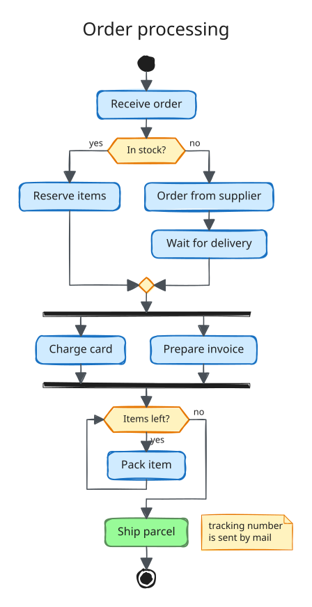

Source

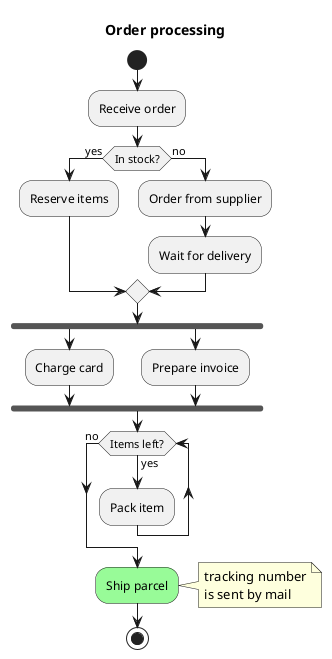
```plantuml
@startuml
title Order processing
start
:Receive order;
if (In stock?) then (yes)
  :Reserve items;
else (no)
  :Order from supplier;
  :Wait for delivery;
endif
fork
  :Charge card;
fork again
  :Prepare invoice;
end fork
while (Items left?) is (yes)
  :Pack item;
endwhile (no)
#palegreen:Ship parcel;
note right: tracking number\nis sent by mail
stop
@enduml
```

### repeat-switch

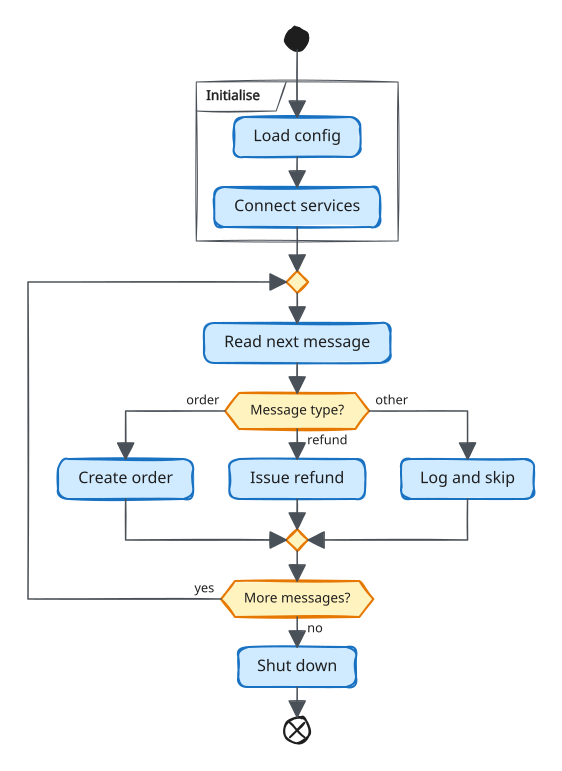

Source

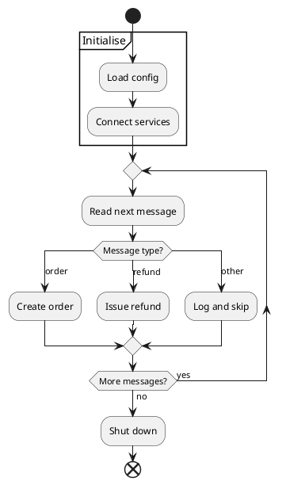
```plantuml
@startuml
start
partition Initialise {
  :Load config;
  :Connect services;
}
repeat
  :Read next message;
  switch (Message type?)
  case (order)
    :Create order;
  case (refund)
    :Issue refund;
  case (other)
    :Log and skip;
  endswitch
repeat while (More messages?) is (yes) not (no)
:Shut down;
end
@enduml
```

### swimlanes

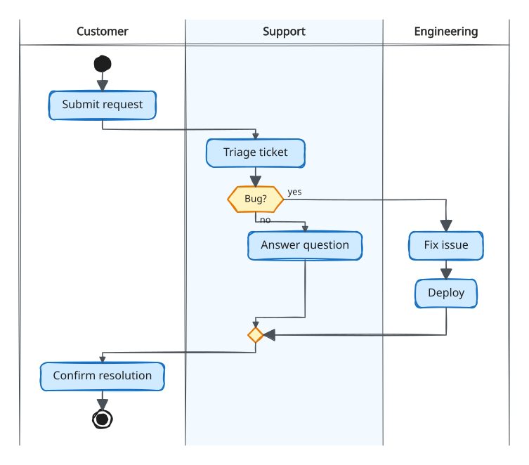

Source

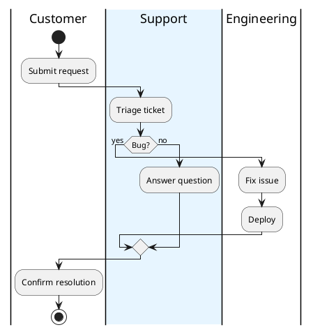
```plantuml
@startuml
|Customer|
start
:Submit request;
|#e7f5ff|Support|
:Triage ticket;
if (Bug?) then (yes)
  |Engineering|
  :Fix issue;
  :Deploy;
else (no)
  |Support|
  :Answer question;
endif
|Customer|
:Confirm resolution;
stop
@enduml
```

## state

**State** — Composite states, concurrent regions, choice, fork/join, history, entry/exit actions.

### order-lifecycle

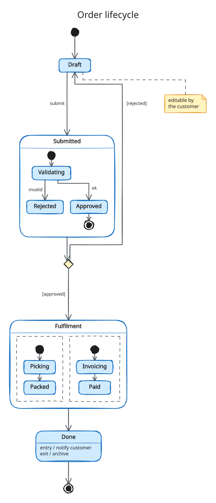

Source

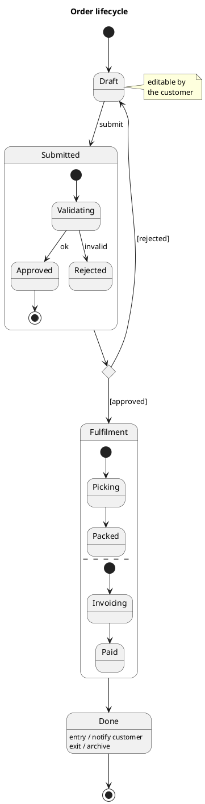
```plantuml
@startuml
title Order lifecycle
[*] --> Draft
Draft --> Submitted : submit
state Submitted {
  [*] --> Validating
  Validating --> Approved : ok
  Validating --> Rejected : invalid
  Approved --> [*]
}
state Fulfilment {
  [*] --> Picking
  Picking --> Packed
  --
  [*] --> Invoicing
  Invoicing --> Paid
}
state decide <<choice>>
Submitted --> decide
decide --> Fulfilment : [approved]
decide --> Draft : [rejected]
Fulfilment --> Done
Done : entry / notify customer
Done : exit / archive
Done --> [*]
note right of Draft : editable by\nthe customer
@enduml
```

### fork-history

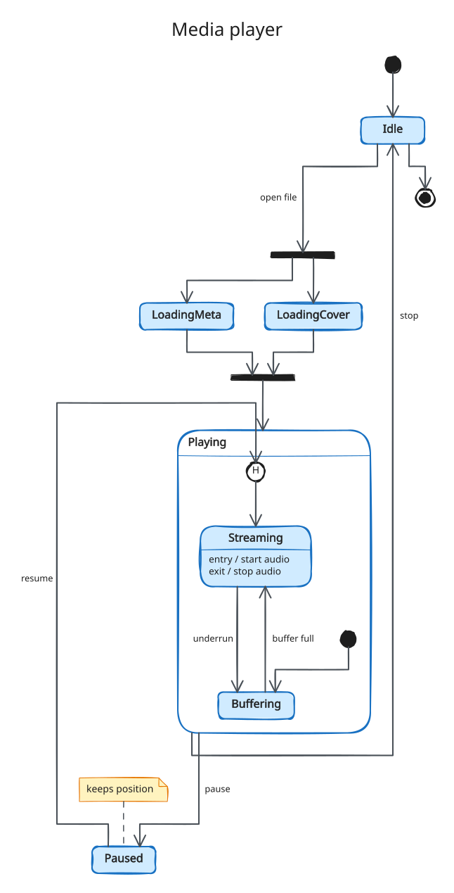

Source

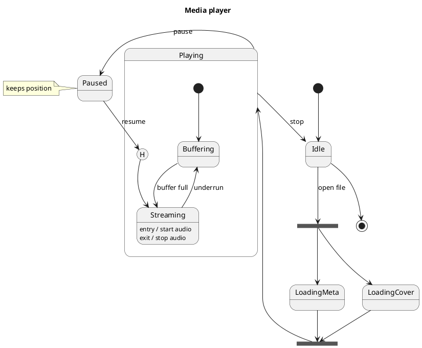
```plantuml
@startuml
title Media player
state Playing {
  [*] --> Buffering
  Buffering --> Streaming : buffer full
  Streaming --> Buffering : underrun
  Streaming : entry / start audio
  Streaming : exit / stop audio
  [H] --> Streaming
}
state fork_state <<fork>>
state join_state <<join>>
[*] --> Idle
Idle --> fork_state : open file
fork_state --> LoadingMeta
fork_state --> LoadingCover
LoadingMeta --> join_state
LoadingCover --> join_state
join_state --> Playing
Playing --> Paused : pause
Paused --> Playing[H] : resume
Playing --> Idle : stop
Idle --> [*]
note left of Paused : keeps position
@enduml
```

## component

**Component & C4** — Components, interfaces, ports, packages, nodes — and C4 via `!include <C4/...>`.

### c4-container

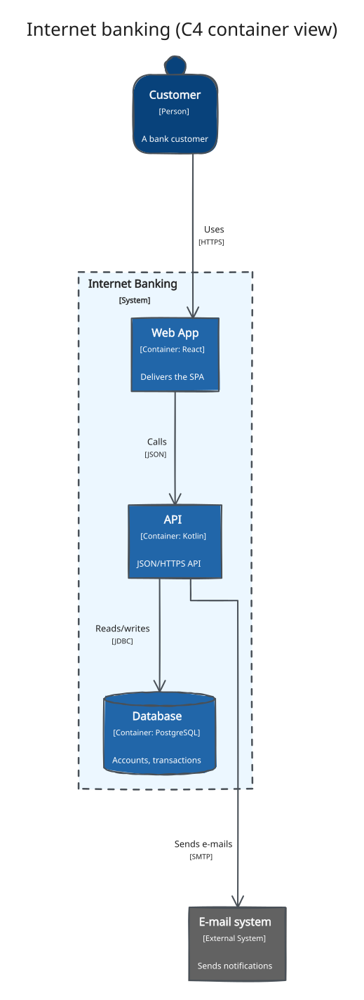

Source

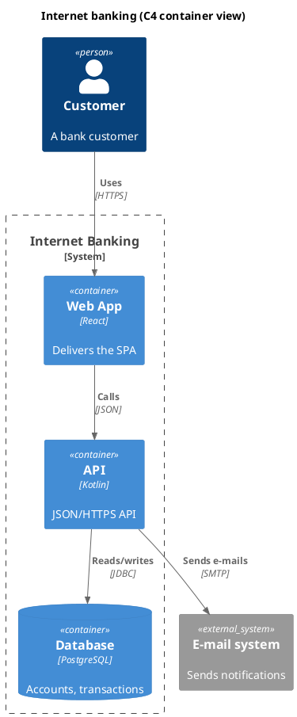
```plantuml
@startuml
!include <C4/C4_Container>
title Internet banking (C4 container view)
Person(customer, "Customer", "A bank customer")
System_Boundary(bank, "Internet Banking") {
  Container(web, "Web App", "React", "Delivers the SPA")
  Container(api, "API", "Kotlin", "JSON/HTTPS API")
  ContainerDb(db, "Database", "PostgreSQL", "Accounts, transactions")
}
System_Ext(mail, "E-mail system", "Sends notifications")
Rel(customer, web, "Uses", "HTTPS")
Rel(web, api, "Calls", "JSON")
Rel(api, db, "Reads/writes", "JDBC")
Rel(api, mail, "Sends e-mails", "SMTP")
@enduml
```

### web-platform

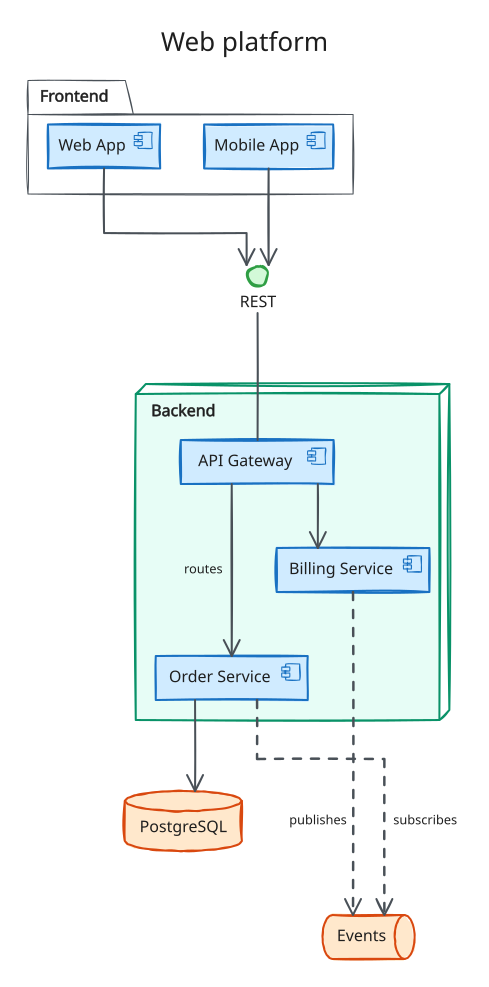

Source

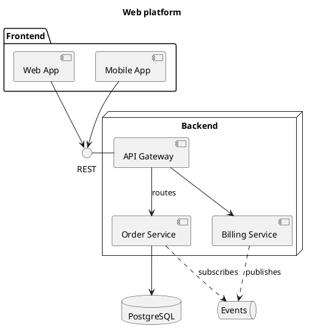
```plantuml
@startuml
title Web platform
package "Frontend" {
  [Web App] as web
  [Mobile App] as mobile
}
node "Backend" {
  [API Gateway] as gw
  [Order Service] as orders
  [Billing Service] as billing
}
database "PostgreSQL" as db
queue "Events" as bus
() "REST" as rest
web --> rest
mobile --> rest
rest - gw
gw --> orders : routes
gw --> billing
orders --> db
billing ..> bus : publishes
orders ..> bus : subscribes
@enduml
```

## usecase

**Use case** — Actors, use cases, system boundaries, include/extend.

### checkout

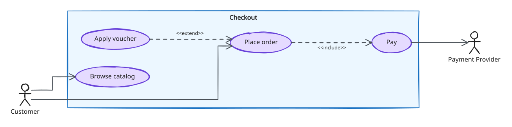

Source

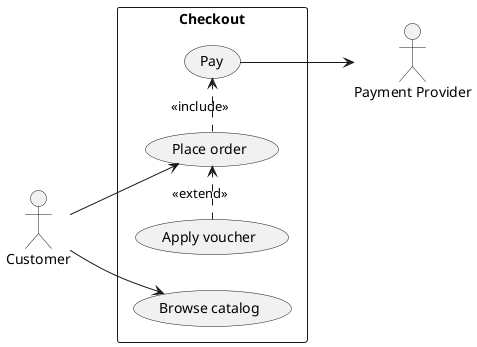
```plantuml
@startuml
left to right direction
actor Customer as c
actor "Payment Provider" as pp
rectangle Checkout {
  usecase "Browse catalog" as UC1
  usecase "Place order" as UC2
  usecase "Pay" as UC3
  (Apply voucher) as UC4
}
c --> UC1
c --> UC2
UC2 .> UC3 : <<include>>
UC4 .> UC2 : <<extend>>
UC3 --> pp
@enduml
```

### library

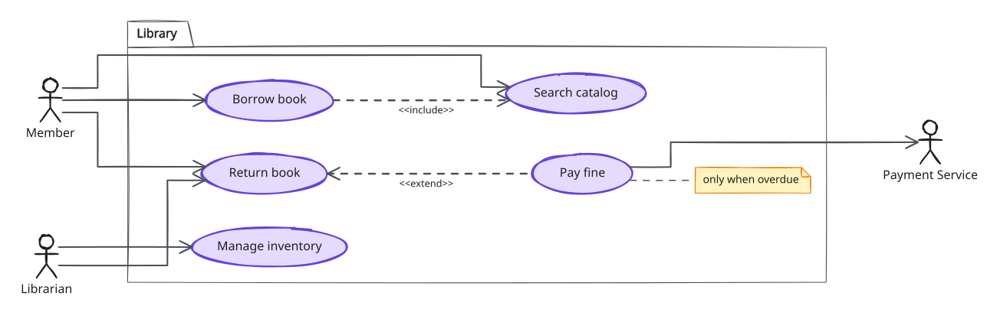

Source

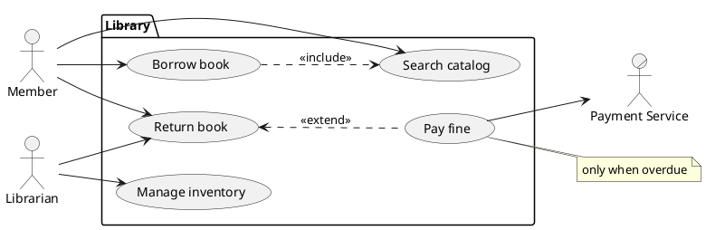
```plantuml
@startuml
left to right direction
actor Member as m
actor Librarian as l
actor/ "Payment Service" as pay
package Library {
  usecase "Search catalog" as search
  usecase "Borrow book" as borrow
  usecase "Return book" as ret
  usecase "Pay fine" as fine
  usecase "Manage inventory" as inv
}
m --> search
m --> borrow
m --> ret
ret <.. fine : <<extend>>
borrow ..> search : <<include>>
l --> inv
l --> ret
fine --> pay
note right of fine : only when overdue
@enduml
```

## deployment

**Deployment** — Nodes, clouds, databases, queues, artifacts and nested deployment targets.

### kubernetes

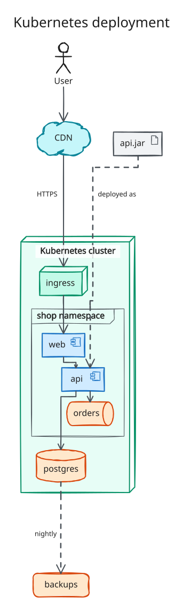

Source

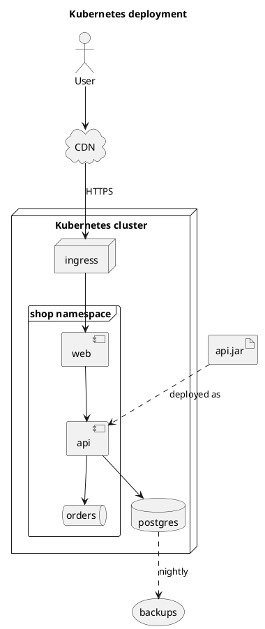
```plantuml
@startuml
title Kubernetes deployment
actor User
cloud "CDN" as cdn
node "Kubernetes cluster" as k8s {
  node "ingress" as ing
  frame "shop namespace" {
    component "web" as web
    component "api" as api
    queue "orders" as q
  }
  database "postgres" as pg
}
storage "backups" as bk
artifact "api.jar" as jar
User --> cdn
cdn --> ing : HTTPS
ing --> web
web --> api
api --> q
api --> pg
pg ..> bk : nightly
jar ..> api : deployed as
@enduml
```

### shapes

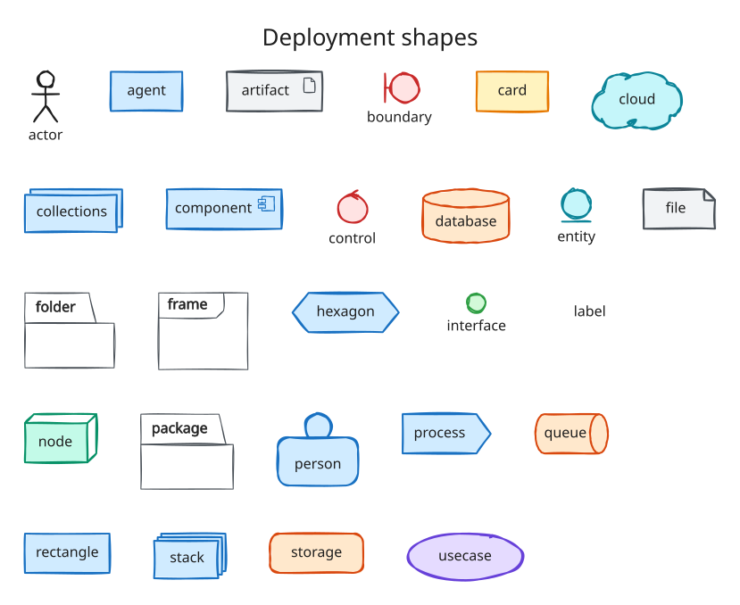

Source

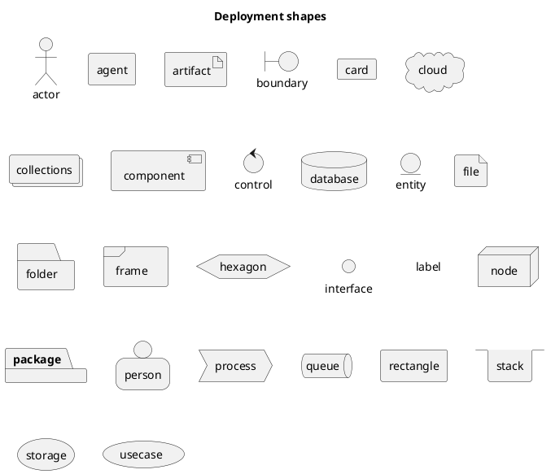
```plantuml
@startuml
title Deployment shapes
actor actor
agent agent
artifact artifact
boundary boundary
card card
cloud cloud
collections collections
component component
control control
database database
entity entity
file file
folder folder
frame frame
hexagon hexagon
interface interface
label label
node node
package package
person person
process process
queue queue
rectangle rectangle
stack stack
storage storage
usecase usecase
@enduml
```

## object

**Object** — Objects with fields, maps (`key => value`) and links.

### runtime-snapshot

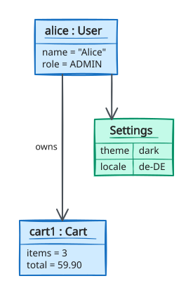

Source

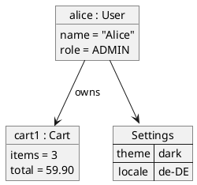
```plantuml
@startuml
object "alice : User" as alice {
  name = "Alice"
  role = ADMIN
}
object "cart1 : Cart" as cart {
  items = 3
  total = 59.90
}
map "Settings" as settings {
  theme => dark
  locale => de-DE
}
alice --> cart : owns
alice --> settings
@enduml
```

## timing

**Timing** — Robust, concise, clock, binary and analog signals with messages and constraints.

### sensor

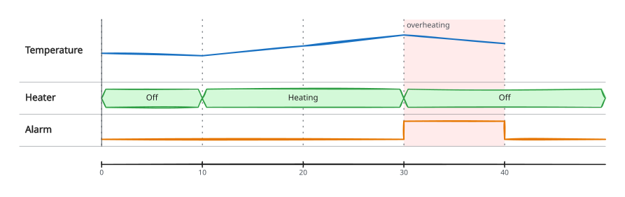

Source

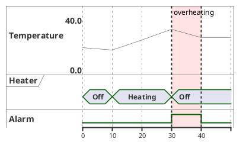
```plantuml
@startuml
analog "Temperature" between 0 and 40 as T
concise "Heater" as H
binary "Alarm" as A
@0
T is 18
H is Off
A is low
@10
T is 16
H is Heating
@20
T is 24
@30
T is 33
H is Off
A is high
@40
T is 26
A is low
highlight 30 to 40 #ffe3e3 : overheating
@enduml
```

### web-request

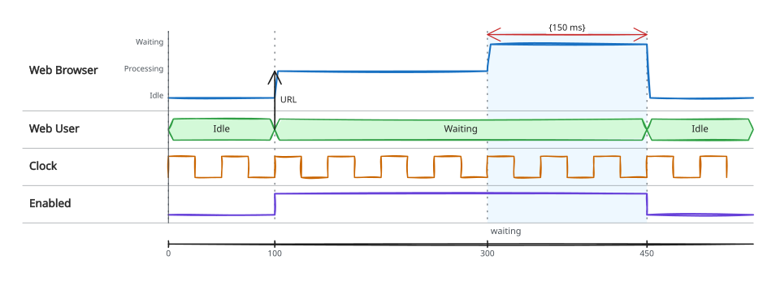

Source

```plantuml
@startuml
robust "Web Browser" as WB
concise "Web User" as WU
clock "Clock" as CLK with period 50
binary "Enabled" as EN

@0
WU is Idle
WB is Idle
EN is low

@100
WU is Waiting
WB is Processing
EN is high
WU -> WB : URL

@300
WB is Waiting

@450
WU is Idle
WB is Idle
EN is low

WB@300 <-> @450 : {150 ms}
highlight 300 to 450 #e7f5ff : waiting
@enduml
```

## gantt

**Gantt** — Tasks, dependencies, milestones, progress, resources, closed days, today marker.

### release-plan

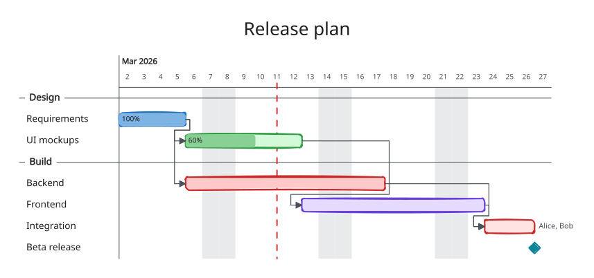

Source

```plantuml
@startgantt
title Release plan
Project starts 2026-03-02
saturday are closed
sunday are closed
-- Design --
[Requirements] lasts 4 days and is 100% completed
[UI mockups] lasts 5 days and starts at [Requirements]'s end and is 60% completed
-- Build --
[Backend] as [BE] lasts 8 days and starts at [Requirements]'s end
[Frontend] lasts 7 days and starts at [UI mockups]'s end
[Integration] lasts 3 days
[BE] -> [Integration]
[Frontend] -> [Integration]
[Integration] on {Alice} {Bob}
[Beta release] happens at [Integration]'s end
[Backend] is colored in #ffc9c9/#c92a2a
today is 2026-03-11
@endgantt
```

## mindmap

**Mind map** — OrgMode/Markdown outlines on both sides, colours, boxless nodes.

### excaliplant

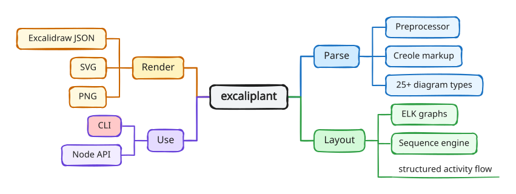

Source

```plantuml
@startmindmap
* excaliplant
** Parse
*** Preprocessor
*** Creole markup
*** 25+ diagram types
** Layout
*** ELK graphs
*** Sequence engine
***_ structured activity flow
left side
** Render
*** Excalidraw JSON
*** SVG
*** PNG
** Use
***[#ffc9c9] CLI
*** Node API
@endmindmap
```

## wbs

**WBS** — Work breakdown structures as org charts.

### website-relaunch

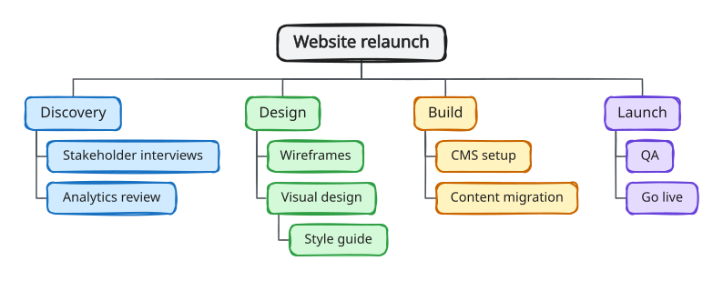

Source

```plantuml
@startwbs
* Website relaunch
** Discovery
*** Stakeholder interviews
*** Analytics review
** Design
*** Wireframes
*** Visual design
**** Style guide
** Build
*** CMS setup
*** Content migration
** Launch
*** QA
*** Go live
@endwbs
```

## json

**JSON** — JSON documents as linked tables with highlights.

### api-response

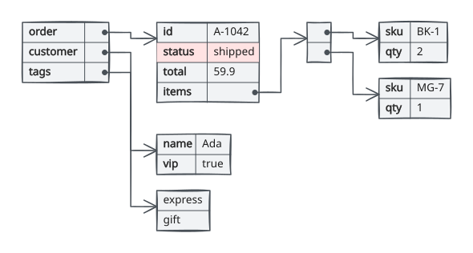

Source

```plantuml
@startjson
#highlight "order" / "status"
{
  "order": {
    "id": "A-1042",
    "status": "shipped",
    "total": 59.9,
    "items": [
      { "sku": "BK-1", "qty": 2 },
      { "sku": "MG-7", "qty": 1 }
    ]
  },
  "customer": { "name": "Ada", "vip": true },
  "tags": ["express", "gift"]
}
@endjson
```

## yaml

**YAML** — YAML documents as linked tables.

### ci-config

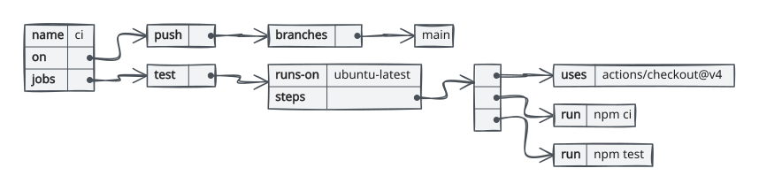

Source

```plantuml
@startyaml
name: ci
on:
  push:
    branches: [main]
jobs:
  test:
    runs-on: ubuntu-latest
    steps:
      - uses: actions/checkout@v4
      - run: npm ci
      - run: npm test
@endyaml
```

## archimate

**ArchiMate** — ArchiMate elements by layer with icons, junctions and `Rel_*` macros.

### insurance

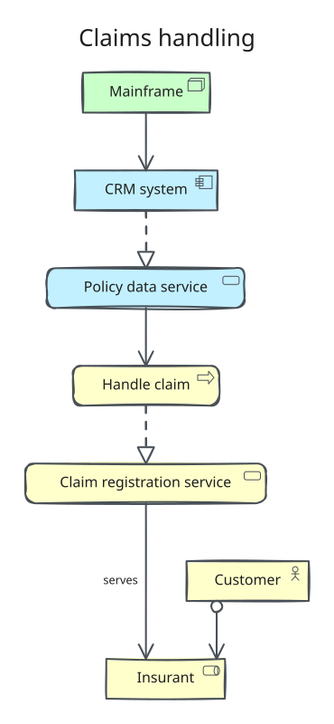

Source

```plantuml
@startuml
!include <archimate/Archimate>
title Claims handling
Business_Actor(customer, "Customer")
Business_Role(insurant, "Insurant")
Business_Service(claimService, "Claim registration service")
Business_Process(handle, "Handle claim")
Application_Component(crm, "CRM system")
Application_Service(policyData, "Policy data service")
Technology_Node(server, "Mainframe")
Rel_Assignment(customer, insurant)
Rel_Serving(claimService, insurant, "serves")
Rel_Realization(handle, claimService)
Rel_Serving(policyData, handle)
Rel_Realization(crm, policyData)
Rel_Serving(server, crm)
@enduml
```

## chen

**Chen ER** — Chen ER diagrams: entities, weak entities, relationships, attributes, cardinalities.

### movie-rental

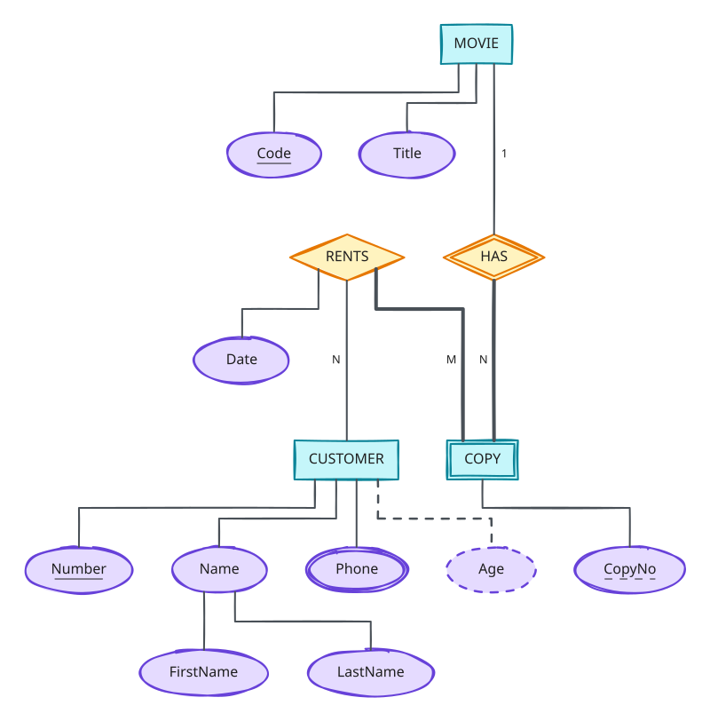

Source

```plantuml
@startchen
entity CUSTOMER {
  Number <<key>>
  Name {
    FirstName
    LastName
  }
  Phone <<multi>>
  Age <<derived>>
}
entity MOVIE {
  Code <<key>>
  Title
}
entity COPY <<weak>> {
  CopyNo <<partial>>
}
relationship RENTS {
  Date
}
relationship HAS <<identifying>>
RENTS -N- CUSTOMER
RENTS =M= COPY
MOVIE -1- HAS
HAS =N= COPY
@endchen
```

## nwdiag

**Network** — Networks, addresses, multi-homed nodes, groups and peer links.

### office-network

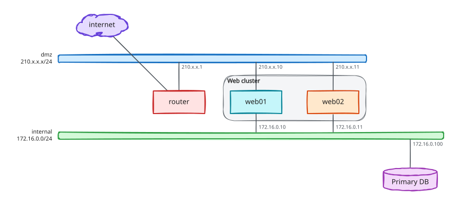

Source

```plantuml
@startnwdiag
nwdiag {
  internet [shape = cloud];
  internet -- router;
  network dmz {
    address = "210.x.x.x/24"
    router [address = "210.x.x.1"];
    web01 [address = "210.x.x.10"];
    web02 [address = "210.x.x.11"];
  }
  network internal {
    address = "172.16.0.0/24";
    web01 [address = "172.16.0.10"];
    web02 [address = "172.16.0.11"];
    db01 [address = "172.16.0.100", shape = database, description = "Primary DB"];
  }
  group web {
    web01;
    web02;
    description = "Web cluster";
  }
}
@endnwdiag
```

## salt

**Salt wireframe** — Wireframes: grids, buttons, inputs, check boxes, trees, tabs, group boxes.

### login-dialog

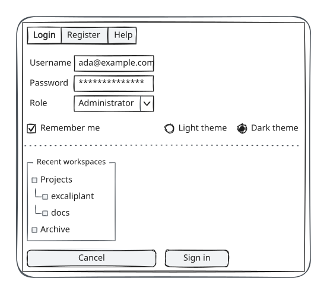

Source

```plantuml
@startsalt
{+
  {/ <b>Login | Register | Help }
  {
    Username | "ada@example.com "
    Password | "**************  "
    Role     | ^Administrator^
  }
  [X] Remember me | () Light theme | (X) Dark theme
  ..
  {^"Recent workspaces"
    {T
      + Projects
      ++ excaliplant
      ++ docs
      + Archive
    }
  }
  [Cancel] | [  Sign in  ]
}
@endsalt
```

## ebnf

**EBNF** — EBNF grammars as railroad diagrams.

### json-grammar

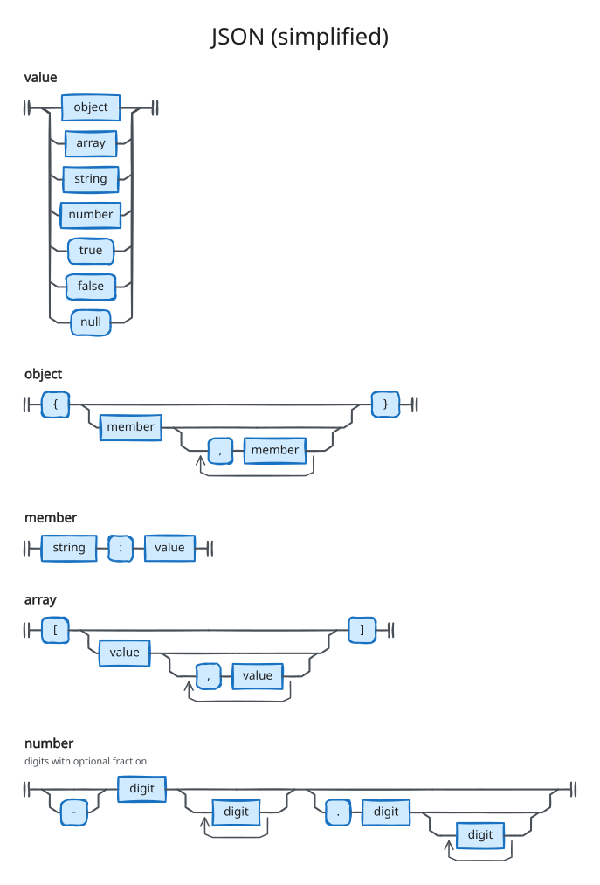

Source

```plantuml
@startebnf
title JSON (simplified)
value = object | array | string | number | "true" | "false" | "null" ;
object = "{", [ member, { ",", member } ], "}" ;
member = string, ":", value ;
array = "[", [ value, { ",", value } ], "]" ;
(* digits with optional fraction *)
number = [ "-" ], digit, { digit }, [ ".", digit, { digit } ] ;
@endebnf
```

## regex

**Regex** — Regular expressions as railroad diagrams.

### email

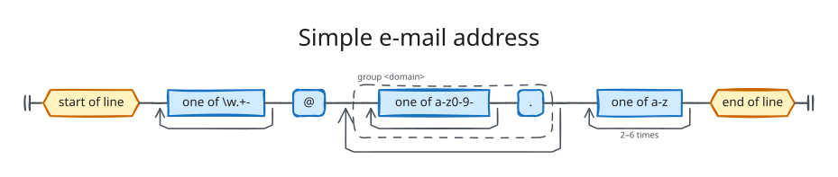

Source

```plantuml
@startregex
title Simple e-mail address
^[\w.+-]+@(?<domain>[a-z0-9-]+\.)+[a-z]{2,6}$
@endregex
```

## dot

**Graphviz DOT** — Graphviz DOT graphs laid out with ELK.

### pipeline

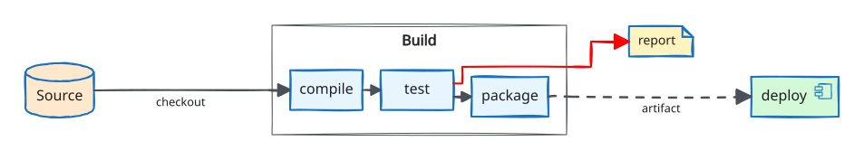

Source

```plantuml
@startdot
digraph pipeline {
  rankdir=LR;
  node [shape=box, style=filled, fillcolor="#e7f5ff"];
  source [label="Source", shape=cylinder, fillcolor="#ffe8cc"];
  subgraph cluster_build {
    label="Build";
    compile -> test -> package;
  }
  source -> compile [label="checkout"];
  package -> deploy [label="artifact", style=dashed];
  deploy [shape=component, fillcolor="#d3f9d8"];
  test -> report [color=red];
  report [shape=note, fillcolor="#fff3bf"];
}
@enddot
```

## chronology

**Chronology** — Events and spans on a time line with links.

### project-history

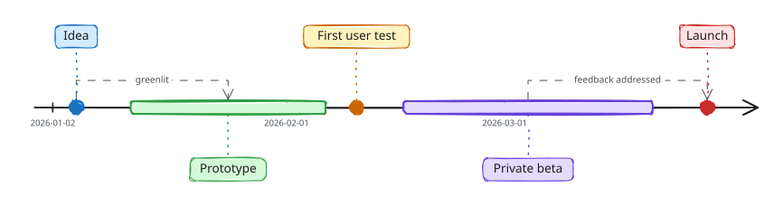

Source

```plantuml
@startchronology
[Idea] happens on 2026-01-05
[Prototype] lasts from 2026-01-12 to 2026-02-06
[First user test] happens on 2026-02-10
[Private beta] lasts from 2026-02-16 to 2026-03-20
[Launch] happens on 2026-03-27
[Idea] -> [Prototype] : greenlit
[Private beta] -> [Launch] : feedback addressed
@endchronology
```

## files

**Files** — File trees from path lists with notes.

### project-layout

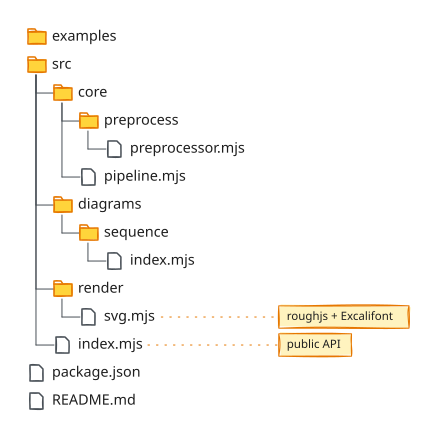

Source

```plantuml
@startfiles
/src/index.mjs : public API
/src/core/pipeline.mjs
/src/core/preprocess/preprocessor.mjs
/src/diagrams/sequence/index.mjs
/src/render/svg.mjs : roughjs + Excalifont
/examples/
/package.json
/README.md
@endfiles
```

## chart

**Chart** — Bar, line, area and scatter charts.

### quarterly

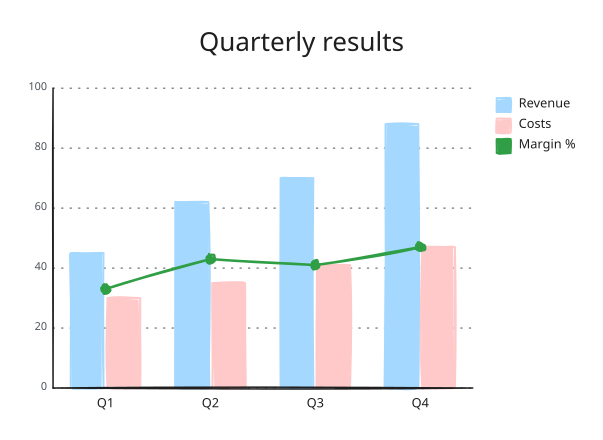

Source

```plantuml
@startchart
title Quarterly results
h-axis [Q1, Q2, Q3, Q4]
v-axis 0 --> 100
grid true
bar "Revenue" [45, 62, 70, 88] #a5d8ff
bar "Costs" [30, 35, 41, 47] #ffc9c9
line "Margin %" [33, 43, 41, 47] #2f9e44
@endchart
```

## math

**AsciiMath** — AsciiMath formulas.

### sum-of-cubes

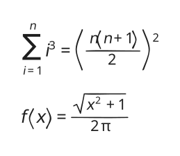

Source

```plantuml
@startmath
sum_(i=1)^n i^3=((n(n+1))/2)^2
f(x) = sqrt(x^2 + 1) / (2 pi)
@endmath
```

## latex

**LaTeX** — LaTeX formulas.

### gaussian

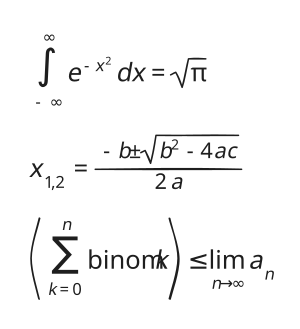

Source

```plantuml
@startlatex
\int_{-\infty}^{\infty} e^{-x^2} dx = \sqrt{\pi}
x_{1,2} = \frac{-b \pm \sqrt{b^2 - 4ac}}{2a}
\left( \sum_{k=0}^{n} \binom{n}{k} \right) \leq \lim_{n \to \infty} a_n
@endlatex
```

## ditaa

**Ditaa** — ASCII art boxes, lines, arrows and colour tags.

### pipeline

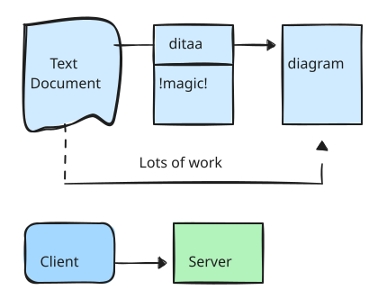

Source

```plantuml
@startditaa
+--------+   +-------+    +-------+
|        +---+ ditaa +--->|       |
|  Text  |   +-------+    |diagram|
|Document|   |!magic!|    |       |
|     {d}|   |       |    |       |
+---+----+   +-------+    +-------+
    :                         ^
    |       Lots of work      |
    +-------------------------+

/--------\     +--------+
| cBLU   |     | cGRE   |
| Client +---->| Server |
\--------/     +--------+
@endditaa
```

## legacy-activity

**Legacy activity** — The classic `(*) --> "Activity"` syntax with sync bars and branches.

### approval

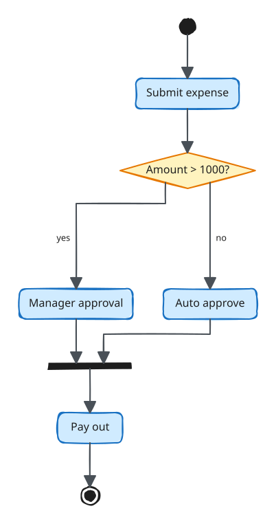

Source

```plantuml
@startuml
(*) --> "Submit expense"
if "Amount > 1000?" then
  -->[yes] "Manager approval"
  --> ===SYNC===
else
  -->[no] "Auto approve"
  --> ===SYNC===
endif
===SYNC=== --> "Pay out"
--> (*)
@enduml
```

## creole

**Creole** — Rich text with headings, lists, tables and links.

### release-notes

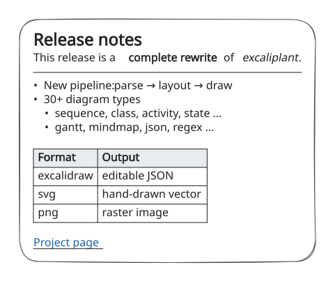

Source

```plantuml
@startcreole
= Release notes
This release is a **complete rewrite** of //excaliplant//.
----
* New pipeline: ""parse → layout → draw""
* 30+ diagram types
** sequence, class, activity, state …
** gantt, mindmap, json, regex …
|= Format |= Output |
| excalidraw | editable JSON |
| svg | hand-drawn vector |
| png | raster image |
[[https://github.com/grethel-labs/excaliplant Project page]]
@endcreole
```

