# Diagram Module Coverage

This page is generated from each module's
`src/diagrams/<kind>/docs/coverage_examples.mjs` file. The examples are
rendered through the same PlantUML -> Excalidraw -> SVG pipeline used by the
library, so the gallery doubles as documentation and as visual regression
surface for layout, overlap, edge-case, functional and design decisions.

The expected shape follows the sequence-diagram coverage model: several small
fixtures should document focused syntax decisions, and complex fixtures should
combine supported features in ways that stress labels, wrapping, dense layouts
and unusual but intentional combinations. Dynamic examples are marked where they
are generated from the current repository tree.

Generated examples: 106

## Sequence

### Basic messages

Covers normal sync arrows, dashed replies, reverse-readable arrows, compact arrows without spaces, multiline message labels, and safe plain-text markup.

[PlantUML source](./ressources/module-coverage/sequence/puml/basics.puml) · [SVG artifact](./ressources/module-coverage/sequence/svg/basics.svg)

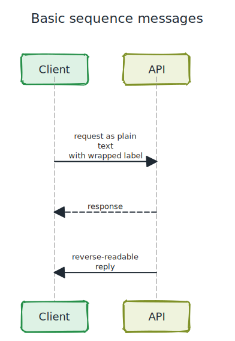

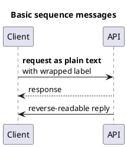
```plantuml
@startuml
title Basic sequence messages
participant Client
participant API
Client->API: **request** <b>as plain text</b>\nwith wrapped label
API --> Client: response
Client <- API: reverse-readable reply
@enduml
```

### Participant declarations

Covers explicit participant kinds, aliases, colors, stereotypes, PlantUML order values, and multiline participant blocks.

[PlantUML source](./ressources/module-coverage/sequence/puml/participants.puml) · [SVG artifact](./ressources/module-coverage/sequence/svg/participants.svg)

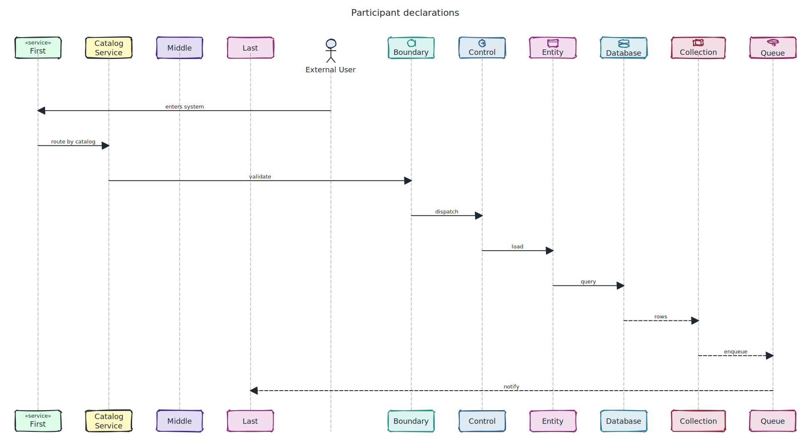

```plantuml
@startuml
title Participant declarations
participant Last order 30
participant Middle order 20
actor "External User" as User #LightBlue
boundary Boundary
control Control
entity Entity
database Database
collections Collection
queue Queue
participant First <<service>> #LightGreen order 10
participant "Catalog Service" as Catalog #LightYellow order 15 [
=Catalog
Service
]
User -> First: enters system
First -> Catalog: route by catalog
Catalog -> Boundary: validate
Boundary -> Control: dispatch
Control -> Entity: load
Entity -> Database: query
Database --> Collection: rows
Collection --> Queue: enqueue
Queue --> Last: notify
@enduml
```

### Arrow variants and endpoints

Covers open, dashed, bidirectional, circle, cross/lost, partial, colored, incoming/outgoing, and short boundary arrows.

[PlantUML source](./ressources/module-coverage/sequence/puml/arrow-variants.puml) · [SVG artifact](./ressources/module-coverage/sequence/svg/arrow-variants.svg)

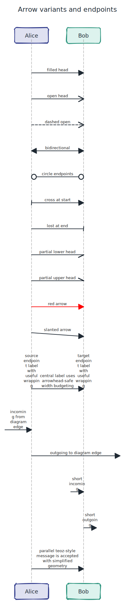

```plantuml
@startuml
title Arrow variants and endpoints
participant Alice as A
participant Bob as B
A -> B: filled head
A ->> B: open head
A -->> B: dashed open
A <-> B: bidirectional
A o->o B: circle endpoints
A x-> B: cross at start
A ->x B: lost at end
A -\ B: partial lower head
A -/ B: partial upper head
A -[#red]> B: red arrow
A -(12)> B: slanted arrow
A "source endpoint label with useful wrapping" -> "target endpoint label with useful wrapping" B: central label uses arrowhead-safe width budgeting
[-> A: incoming from diagram edge
A ->]: outgoing to diagram edge
?-> B: short incoming
B ->?: short outgoing
& A -> B: parallel teoz-style message is accepted with simplified geometry
@enduml
```

### Arrow label wrapping

Covers dynamic wrapping for long message labels and endpoint labels using arrow length minus arrowhead size as the available width.

[PlantUML source](./ressources/module-coverage/sequence/puml/label-wrapping.puml) · [SVG artifact](./ressources/module-coverage/sequence/svg/label-wrapping.svg)

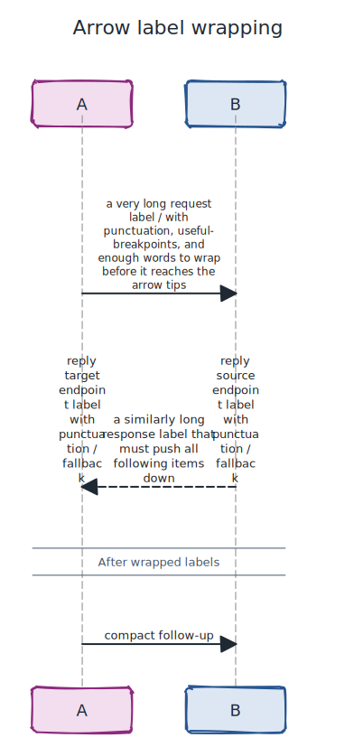

```plantuml
@startuml
title Arrow label wrapping
participant A
participant B
A -> B: a very long request label / with punctuation, useful-breakpoints, and enough words to wrap before it reaches the arrow tips
B "reply source endpoint label with punctuation / fallback" --> "reply target endpoint label with punctuation / fallback" A: a similarly long response label that must push all following items down
== After wrapped labels ==
A -> B: compact follow-up
@enduml
```

### Notes

Covers side notes, over notes, colored notes, hnote/rnote variants, note across, and block notes.

[PlantUML source](./ressources/module-coverage/sequence/puml/notes.puml) · [SVG artifact](./ressources/module-coverage/sequence/svg/notes.svg)

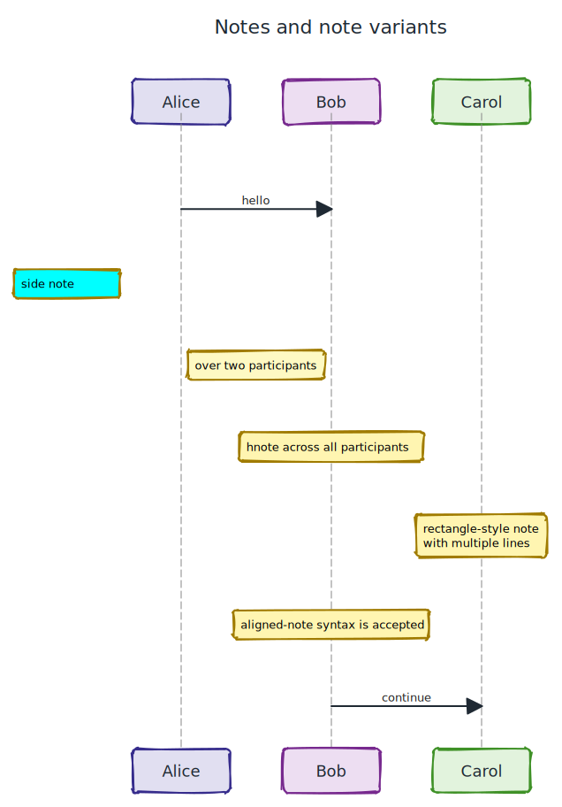

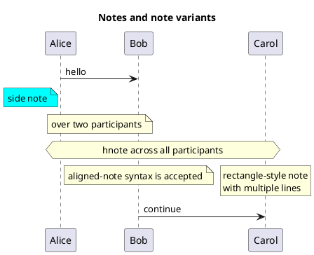
```plantuml
@startuml
title Notes and note variants
participant Alice
participant Bob
participant Carol
Alice -> Bob: hello
note left of Alice #aqua: side note
note over Alice, Bob #LightYellow: over two participants
hnote across: hnote across all participants
rnote over Carol
rectangle-style note
with multiple lines
endrnote
/ note over Bob: aligned-note syntax is accepted
Bob -> Carol: continue
@enduml
```

### Combined fragments

Covers opt, loop, alt/else, par/and, break, critical/option, group/option, nesting, operand labels, and uniform fragment margins.

[PlantUML source](./ressources/module-coverage/sequence/puml/fragments.puml) · [SVG artifact](./ressources/module-coverage/sequence/svg/fragments.svg)

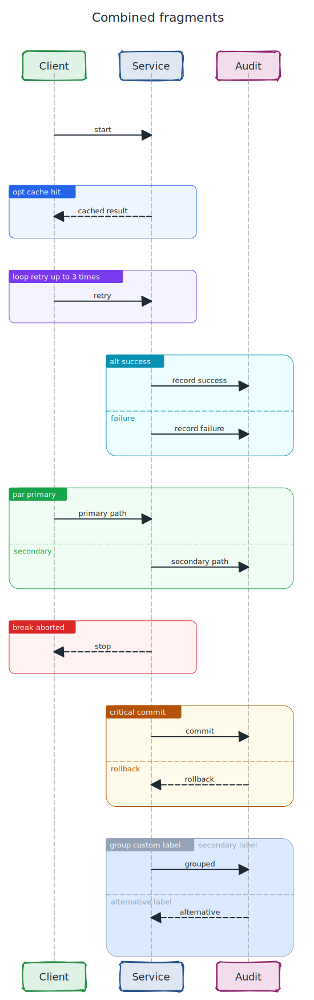

```plantuml
@startuml
title Combined fragments
participant Client
participant Service
participant Audit
Client -> Service: start
opt cache hit
  Service --> Client: cached result
end
loop retry up to 3 times
  Client -> Service: retry
end
alt success
  Service -> Audit: record success
else failure
  Service -> Audit: record failure
end
par primary
  Client -> Service: primary path
and secondary
  Service -> Audit: secondary path
end
break aborted
  Service --> Client: stop
end
critical commit
  Service -> Audit: commit
option rollback
  Audit --> Service: rollback
end
group custom label [secondary label] #LightBlue
  Service -> Audit: grouped
option alternative label
  Audit --> Service: alternative
end
@enduml
```

### Timeline decorations

Covers dividers, delays, explicit vertical spaces, and ref frames with the same top/bottom spacing rhythm as fragments.

[PlantUML source](./ressources/module-coverage/sequence/puml/timeline-decorations.puml) · [SVG artifact](./ressources/module-coverage/sequence/svg/timeline-decorations.svg)

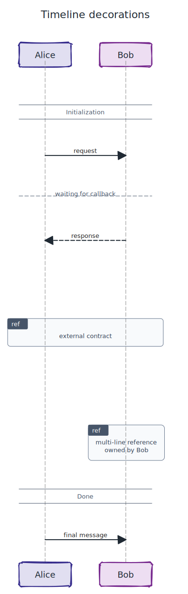

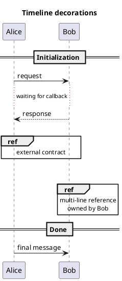
```plantuml
@startuml
title Timeline decorations
participant Alice
participant Bob
== Initialization ==
Alice -> Bob: request
... waiting for callback ...
Bob --> Alice: response
|||
ref over Alice, Bob: external contract
||45||
ref over Bob
multi-line reference
owned by Bob
end ref
== Done ==
Alice -> Bob: final message
@enduml
```

### Lifecycle, activation, create, destroy, return

Covers activate/deactivate/destroy, activation colors, create, shortcut ++/\*\*/!! syntax, and return messages.

[PlantUML source](./ressources/module-coverage/sequence/puml/lifecycle.puml) · [SVG artifact](./ressources/module-coverage/sequence/svg/lifecycle.svg)

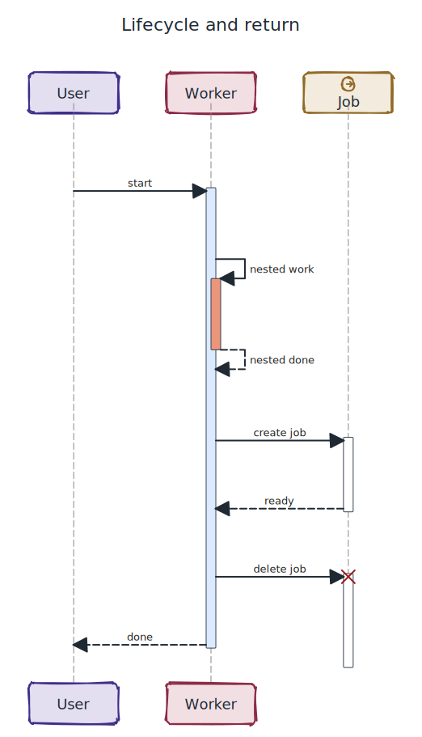

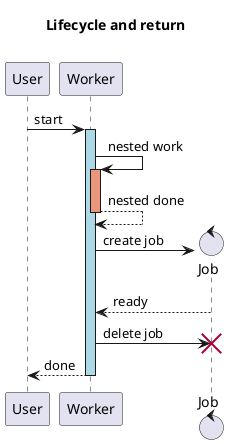
```plantuml
@startuml
title Lifecycle and return
participant User
User -> Worker: start
activate Worker #LightBlue
Worker -> Worker ++ #DarkSalmon: nested work
return nested done
create control Job
Worker -> Job **: create job
Job --> Worker: ready
Worker -> Job !!: delete job
Worker --> User: done
deactivate Worker
@enduml
```

### Autonumber, title, footbox, skinparam

Covers formatted autonumber start/increment, stop/resume, title rendering, hide footbox, and supported sequence presentation skinparams.

[PlantUML source](./ressources/module-coverage/sequence/puml/autonumber-title-footbox-skinparam.puml) · [SVG artifact](./ressources/module-coverage/sequence/svg/autonumber-title-footbox-skinparam.svg)

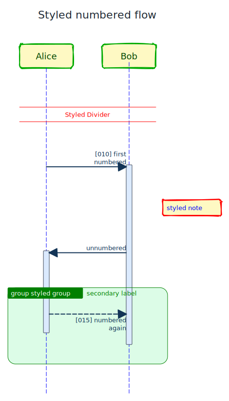

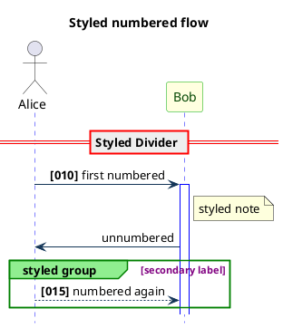
```plantuml
@startuml
skinparam sequence {
  ArrowColor #123456
  MessageFontColor #123456
  MessageAlign right
  ResponseMessageBelowArrow true
  ParticipantBackgroundColor #LightYellow
  ParticipantBorderColor #00aa00
  ParticipantFontColor #004400
  LifeLineBorderColor #0000ff
  NoteBackgroundColor #LightYellow
  NoteBorderColor #red
  NoteFontColor #blue
  GroupBackgroundColor #LightGreen
  GroupBorderColor #green
  GroupFontColor #purple
  DividerBorderColor #red
  ActivationBackgroundColor #LightBlue
  ActorStyle box
}
hide footbox
title Styled numbered flow
autonumber 10 5 "<b>[000]"
actor Alice
participant Bob
== Styled Divider ==
Alice -> Bob ++: first numbered
note right of Bob: styled note
autonumber stop
Bob -> Alice: unnumbered
autonumber resume
group styled group [secondary label]
Alice --> Bob --: numbered again
end
@enduml
```

### Header, footer, mainframe, newpage, hide unlinked

Covers global sequence decorations, single-canvas newpage rendering, hide unlinked pruning, and solid lifeline style.

[PlantUML source](./ressources/module-coverage/sequence/puml/global-presentation.puml) · [SVG artifact](./ressources/module-coverage/sequence/svg/global-presentation.svg)

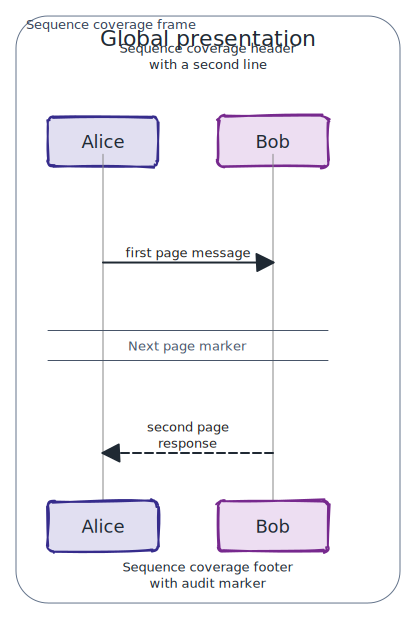

```plantuml
@startuml
  !pragma teoz true
header
Sequence coverage header
with a second line
endheader
footer
Sequence coverage footer
with audit marker
endfooter
mainframe Sequence coverage frame
skinparam sequence LifeLineStrategy solid
hide unlinked
title Global presentation
participant Alice
participant Bob
participant Unused
partition "single-canvas teoz partition" {
Alice -> Bob: first page message
newpage Next page marker
& Bob --> Alice: second page response
}
@enduml
```

### Participant boxes

Covers PlantUML box/end box participant grouping with labels and background colors.

[PlantUML source](./ressources/module-coverage/sequence/puml/participant-boxes.puml) · [SVG artifact](./ressources/module-coverage/sequence/svg/participant-boxes.svg)

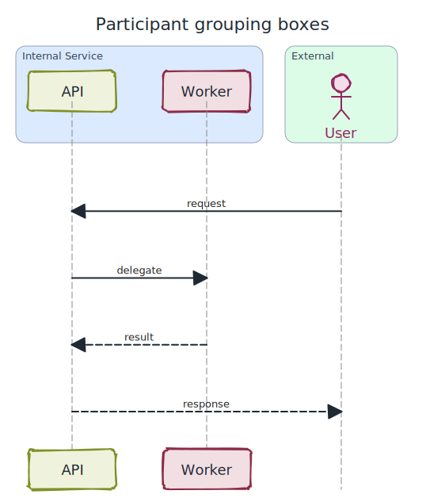

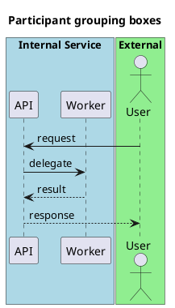
```plantuml
@startuml
title Participant grouping boxes
box "Internal Service" #LightBlue
participant API
participant Worker
end box
box "External" #LightGreen
actor User
end box
User -> API: request
API -> Worker: delegate
Worker --> API: result
API --> User: response
@enduml
```

### Feedback loops with participant assets

Covers feedback-loop traffic while rendering actor/boundary/control/entity/database/collections/queue symbols in the same sequence.

[PlantUML source](./ressources/module-coverage/sequence/puml/feedback-loops-assets.puml) · [SVG artifact](./ressources/module-coverage/sequence/svg/feedback-loops-assets.svg)

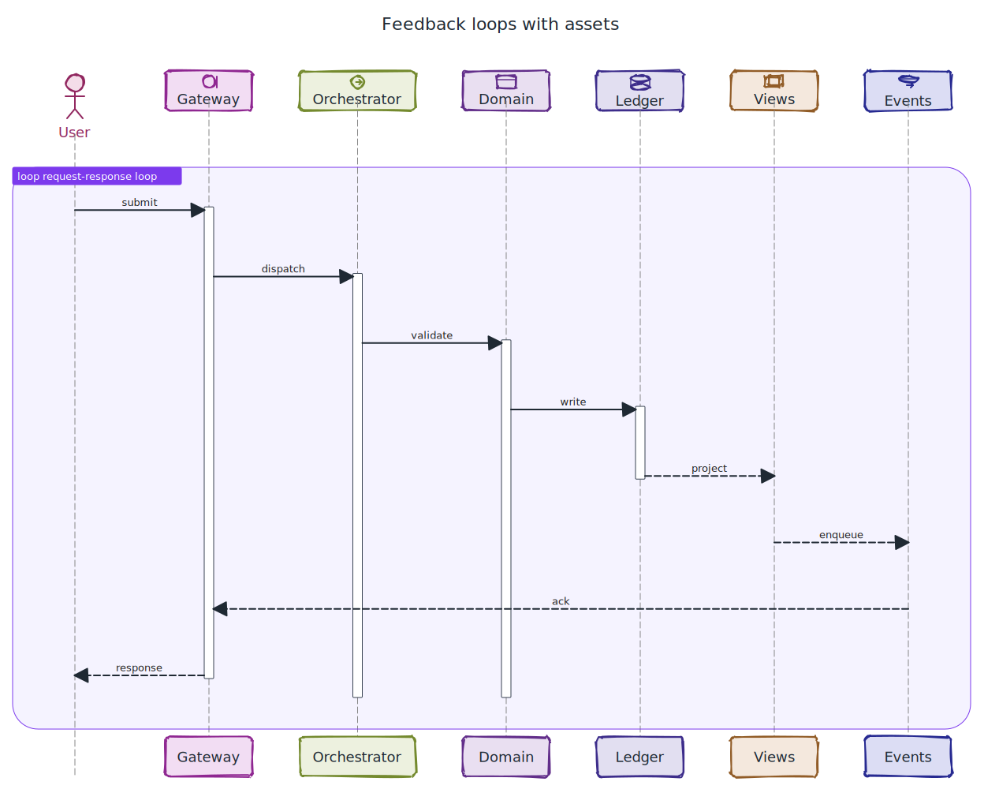

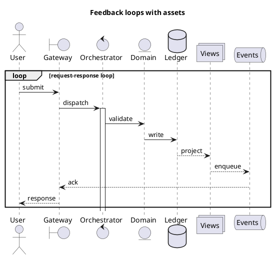
```plantuml
@startuml
title Feedback loops with assets
actor User
boundary Gateway
control Orchestrator
entity Domain
database Ledger
collections Views
queue Events

loop request-response loop
  User -> Gateway: submit
  Gateway -> Orchestrator ++: dispatch
  Orchestrator -> Domain: validate
  Domain -> Ledger: write
  Ledger --> Views: project
  Views --> Events: enqueue
  Events --> Gateway: ack
  Gateway --> User --: response
end
@enduml
```

### Combination: service flow

End-to-end combination of participant boxes, arrows, activations, fragments, notes, refs, dividers, delays, and autonumber.

[PlantUML source](./ressources/module-coverage/sequence/puml/combination-flow.puml) · [SVG artifact](./ressources/module-coverage/sequence/svg/combination-flow.svg)

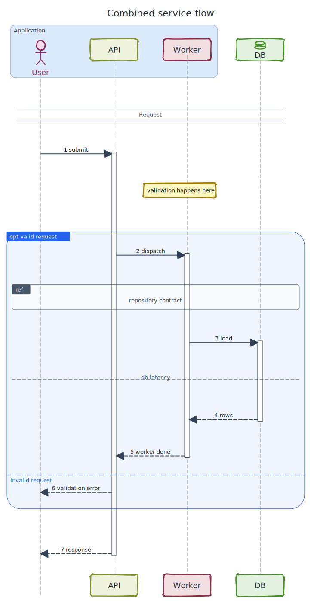

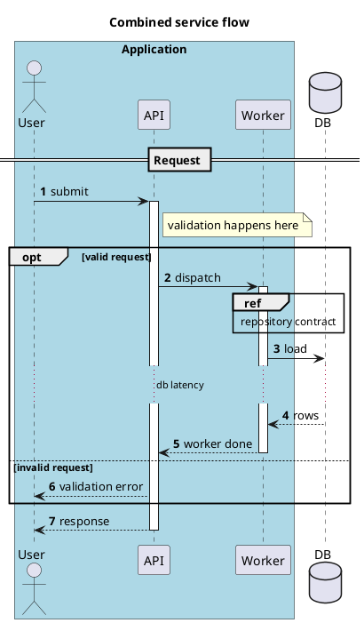
```plantuml
@startuml
skinparam sequence ArrowColor #334155
title Combined service flow
autonumber
box "Application" #LightBlue
actor User
participant API
participant Worker
end box
database DB
== Request ==
User -> API ++: submit
note right of API #LightYellow: validation happens here
opt valid request
  API -> Worker ++: dispatch
  ref over Worker, DB: repository contract
  Worker -> DB: load
  ... db latency ...
  DB --> Worker: rows
  return worker done
else invalid request
  API --> User: validation error
end
API --> User --: response
@enduml
```

### Combination: branching and cleanup

Stress-style combination with nested fragments, lifecycle shortcuts, create/destroy, notes across, and external arrows.

[PlantUML source](./ressources/module-coverage/sequence/puml/combination-errors.puml) · [SVG artifact](./ressources/module-coverage/sequence/svg/combination-errors.svg)

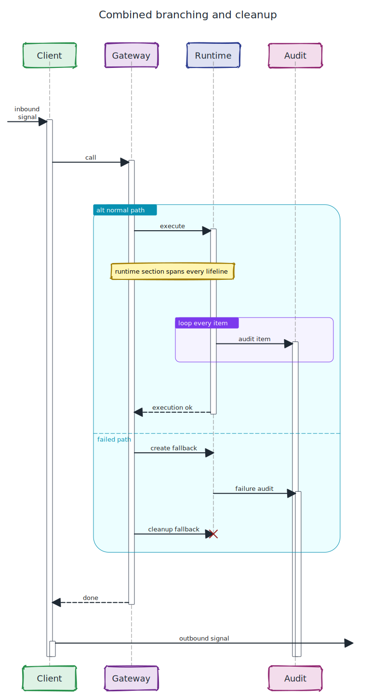

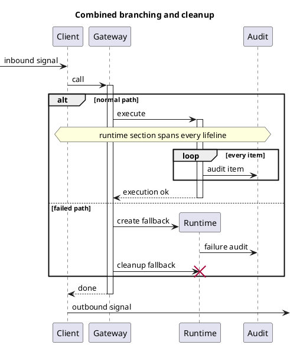
```plantuml
@startuml
title Combined branching and cleanup
participant Client
participant Gateway
participant Runtime
participant Audit
[-> Client: inbound signal
Client -> Gateway ++: call
alt normal path
  Gateway -> Runtime ++: execute
  hnote across: runtime section spans every lifeline
  loop every item
    Runtime -> Audit: audit item
  end
  return execution ok
else failed path
  Gateway -> Runtime **: create fallback
  Runtime -> Audit: failure audit
  Gateway -> Runtime !!: cleanup fallback
end
Gateway --> Client --: done
Client ->]: outbound signal
@enduml
```

## Class

### Basic classes and compartments

Classes, attributes, operations and compartment separators.

[PlantUML source](./ressources/module-coverage/class/puml/basics.puml) · [SVG artifact](./ressources/module-coverage/class/svg/basics.svg)

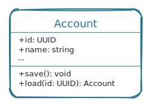

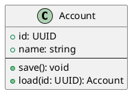
```plantuml
@startuml
class Account {
  +id: UUID
  +name: string
  --
  +save(): void
  +load(id: UUID): Account
}
@enduml
```

### Namespace, generics and class-family keywords

Namespace containers, abstract shorthand, generics, record, annotation and data-oriented class keywords.

[PlantUML source](./ressources/module-coverage/class/puml/namespace-generics.puml) · [SVG artifact](./ressources/module-coverage/class/svg/namespace-generics.svg)

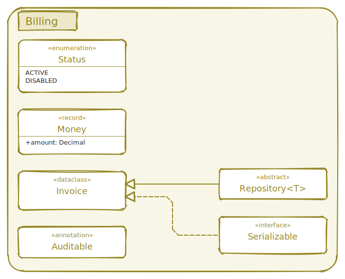

```plantuml
@startuml
namespace "Billing" as billing {
  abstract Repository<T>
  interface Serializable
  enum Status {
    ACTIVE
    DISABLED
  }
  record Money {
    +amount: Decimal
  }
  annotation Auditable
  dataclass Invoice
}
Repository <|-- Invoice
Serializable <|.. Invoice
@enduml
```

### Relationships and styled arrows

Inheritance, realization, composition, multiplicities, labels, direction hints and styled arrows.

[PlantUML source](./ressources/module-coverage/class/puml/relationships.puml) · [SVG artifact](./ressources/module-coverage/class/svg/relationships.svg)

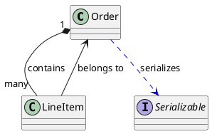
```plantuml
@startuml
class Order
class LineItem
interface Serializable
Order "1" *-- "many" LineItem : contains
Order -[#blue,dashed]-> Serializable : serializes
LineItem -up-> Order : belongs to
@enduml
```

### Notes on elements and links

Member-target notes and note-on-link blocks are parsed as safe note boxes.

[PlantUML source](./ressources/module-coverage/class/puml/notes-on-link.puml) · [SVG artifact](./ressources/module-coverage/class/svg/notes-on-link.svg)

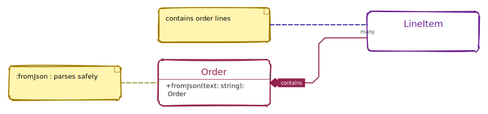

```plantuml
@startuml
class Order {
  +fromJson(text: string): Order
}
class LineItem
Order "1" *-- "many" LineItem : contains
note on link
  contains order lines
end note
note right of Order::fromJson : parses safely
hide empty members
@enduml
```

### Association classes and filters

Association-class shorthand and remove/hide/show commands stay strict-parseable.

[PlantUML source](./ressources/module-coverage/class/puml/association-filters.puml) · [SVG artifact](./ressources/module-coverage/class/svg/association-filters.svg)

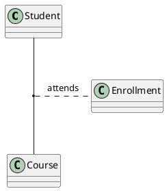
```plantuml
@startuml
class Student
class Course
class Obsolete
(Student, Course) .. Enrollment : attends
remove Obsolete
hide empty members
show empty members
@enduml
```

### Official declarative element family

Class-family declarations from the PlantUML reference, including reverse aliases and visibility prefixes.

[PlantUML source](./ressources/module-coverage/class/puml/official-declarative-elements.puml) · [SVG artifact](./ressources/module-coverage/class/svg/official-declarative-elements.svg)

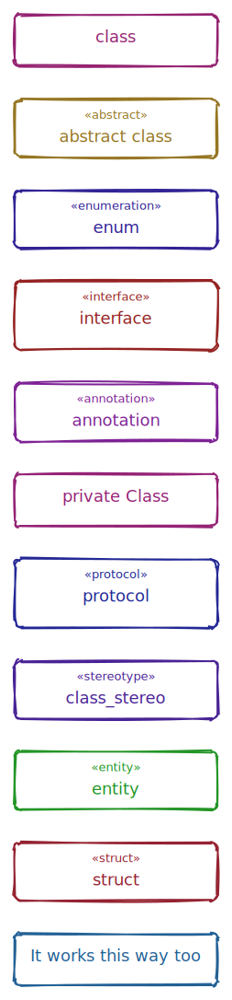

```plantuml
@startuml
hide empty members
abstract class "abstract class"
annotation annotation
class class
class class_stereo <<stereotype>>
entity entity
enum enum
interface interface
protocol protocol
struct struct
-class "private Class" as PrivateClass
class class2 as "It works this way too"
@enduml
```

### Official class relations

Undeclared class endpoints, composition, aggregation, dependencies, role labels and qualified associations.

[PlantUML source](./ressources/module-coverage/class/puml/official-class-relations.puml) · [SVG artifact](./ressources/module-coverage/class/svg/official-class-relations.svg)

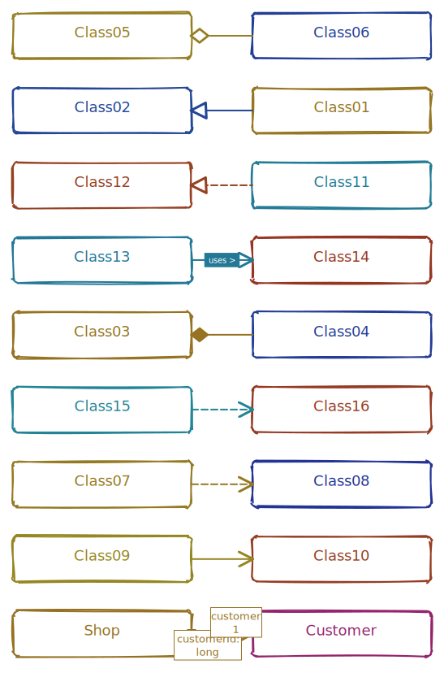

```plantuml
@startuml
Class01 <|-- Class02
Class03 *-- Class04
Class05 o-- Class06
Class07 .. Class08
Class09 -- Class10
Class11 <|.. Class12
Class13 --> Class14 : uses >
Class15 ..> Class16
Shop [customerId: long] ---> "customer\n1" Customer
@enduml
```

### Official members and JSON display

Colon member declarations, class body modifiers, member ports and JSON data in class diagrams.

[PlantUML source](./ressources/module-coverage/class/puml/official-members-json.puml) · [SVG artifact](./ressources/module-coverage/class/svg/official-members-json.svg)

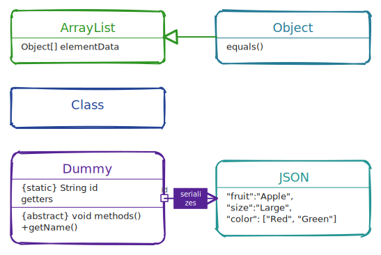

```plantuml
@startuml
Object <|-- ArrayList
Object : equals()
ArrayList : Object[] elementData
class Dummy {
  {static} String id
  {abstract} void methods()
  .. getters ..
  +getName()
}
class Class
object Object
json JSON {
  "fruit":"Apple",
  "size":"Large",
  "color": ["Red", "Green"]
}
Dummy::id --> JSON : serializes
@enduml
```

## Component

### Basic components and interfaces

Bracket components, keyword components, lollipop shorthand, queue and artifact declarations.

[PlantUML source](./ressources/module-coverage/component/puml/basics.puml) · [SVG artifact](./ressources/module-coverage/component/svg/basics.svg)

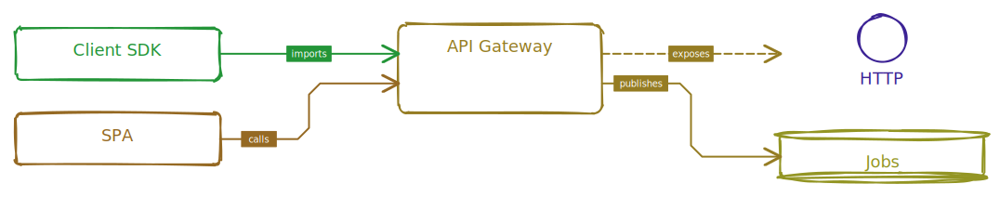

```plantuml
@startuml
[SPA] as spa
component "API Gateway" as api
() "HTTP" as HTTP
queue "Jobs" as jobs
artifact "Client SDK" as sdk
spa --> api : calls
api ..> HTTP : exposes
api --> jobs : publishes
sdk --> api : imports
@enduml
```

### Containers and direction

Package, node, frame, folder and global graph direction hints.

[PlantUML source](./ressources/module-coverage/component/puml/containers.puml) · [SVG artifact](./ressources/module-coverage/component/svg/containers.svg)

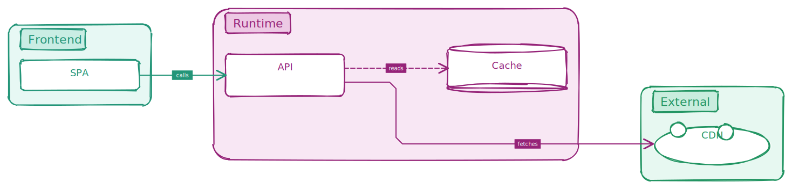

```plantuml
@startuml
left to right direction
package "Frontend" as frontend {
  [SPA] as spa
}
node "Runtime" as runtime {
  component "API" as api
  database Cache
}
frame "External" as external {
  cloud CDN
}
spa --> api : calls
api -[#blue,dashed]-> Cache : reads
api -right-> CDN : fetches
@enduml
```

### Ports and component endpoint references

portin/portout declarations plus Component::port endpoint references.

[PlantUML source](./ressources/module-coverage/component/puml/ports.puml) · [SVG artifact](./ressources/module-coverage/component/svg/ports.svg)

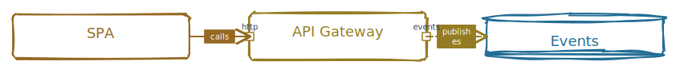

```plantuml
@startuml
component "API Gateway" as api
[SPA] as spa
queue "Events" as bus
portin api::http
portout api::events
spa --> api::http : calls
api::events -[#blue,dashed]-> bus : publishes
@enduml
```

### Notes on component links

Component note-on-link blocks are rendered as safe note boxes.

[PlantUML source](./ressources/module-coverage/component/puml/notes-on-link.puml) · [SVG artifact](./ressources/module-coverage/component/svg/notes-on-link.svg)

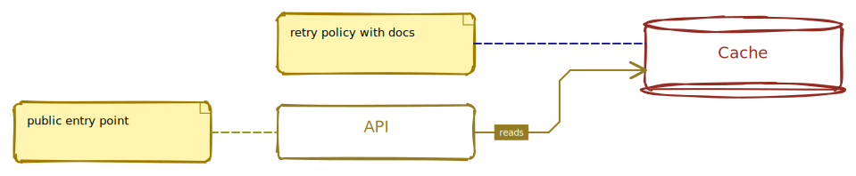

```plantuml
@startuml
component "API" as api
database Cache
api --> Cache : reads
note on link
  retry policy with [[https://example.invalid docs]]
end note
note right of api : public entry point
@enduml
```

### Presentation metadata and hidden edges

Caption/header/footer/legend/mainframe/allowmixing commands parse, and hidden arrows do not render visible edges.

[PlantUML source](./ressources/module-coverage/component/puml/presentation-hidden.puml) · [SVG artifact](./ressources/module-coverage/component/svg/presentation-hidden.svg)

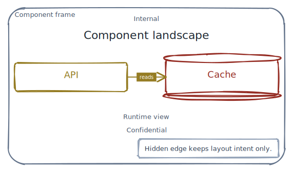

```plantuml
@startuml
title Component landscape
caption Runtime view
header Internal
footer Confidential
mainframe Component frame
allowmixing
legend
  Hidden edge keeps layout intent only.
end legend
component "API" as api
database Cache
api -[hidden]-> Cache
api --> Cache : reads
@enduml
```

### Official components and basic relations

Official bracket declarations, keyword declarations, multiline labels and optional interface endpoints.

[PlantUML source](./ressources/module-coverage/component/puml/official-components-relations.puml) · [SVG artifact](./ressources/module-coverage/component/svg/official-components-relations.svg)

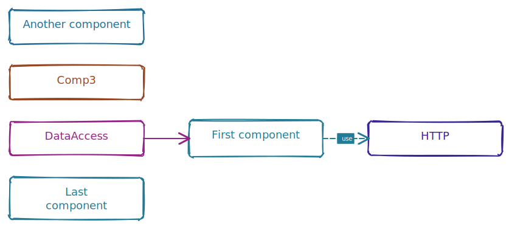

```plantuml
@startuml
[First component]
[Another component] as Comp2
component Comp3
component [Last\ncomponent] as Comp4

DataAccess - [First component]
[First component] ..> HTTP : use
@enduml
```

### Official JSON display and ports

JSON data display plus port, portin and portout declarations.

[PlantUML source](./ressources/module-coverage/component/puml/official-json-ports.puml) · [SVG artifact](./ressources/module-coverage/component/svg/official-json-ports.svg)

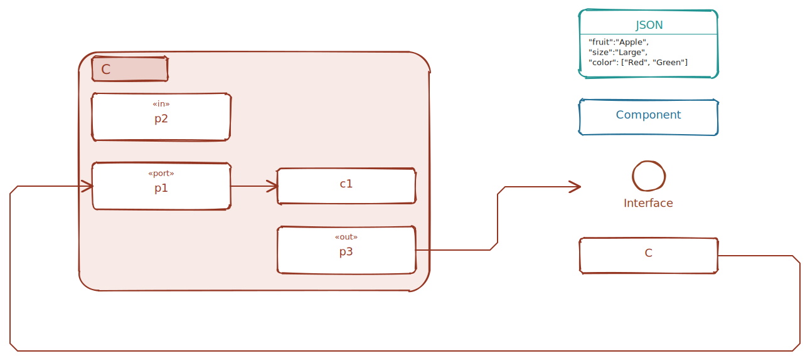

```plantuml
@startuml
allowmixing
component Component
() Interface
json JSON {
  "fruit":"Apple",
  "size":"Large",
  "color": ["Red", "Green"]
}
component C {
  port p1
  portin p2
  portout p3
  component c1
}
C --> p1
p1 --> c1
p3 --> Interface
@enduml
```

## Deployment

### Basic node declaration

Covers simple node declaration with alias.

[PlantUML source](./ressources/module-coverage/deployment/puml/basic-node.puml) · [SVG artifact](./ressources/module-coverage/deployment/svg/basic-node.svg)

```plantuml
@startuml
node "Server" as srv
@enduml
```

### Nested containers

Covers nested deployment containers like node, cloud, frame.

[PlantUML source](./ressources/module-coverage/deployment/puml/nested-containers.puml) · [SVG artifact](./ressources/module-coverage/deployment/svg/nested-containers.svg)

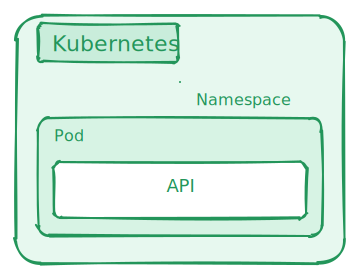

```plantuml
@startuml
node "Kubernetes" {
  cloud "Namespace" {
    frame "Pod" {
      [API]
    }
  }
}
@enduml
```

### All deployment shapes

Covers all 23 deployment-specific shapes.

[PlantUML source](./ressources/module-coverage/deployment/puml/all-shapes.puml) · [SVG artifact](./ressources/module-coverage/deployment/svg/all-shapes.svg)

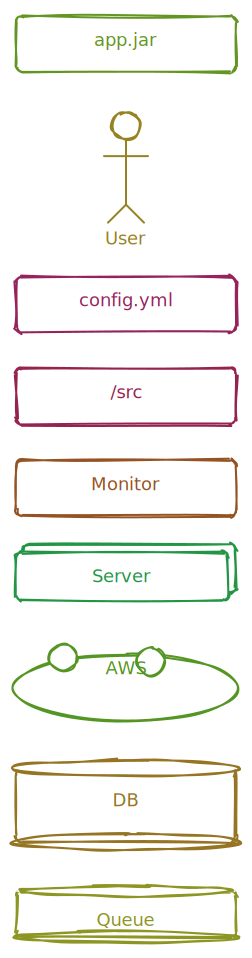

```plantuml
@startuml
actor User
agent Monitor
artifact "app.jar"
cloud AWS
database DB
file "config.yml"
folder "/src"
node Server
queue Queue
@enduml
```

### Port declarations

Covers port declarations and references with Node::port syntax.

[PlantUML source](./ressources/module-coverage/deployment/puml/ports.puml) · [SVG artifact](./ressources/module-coverage/deployment/svg/ports.svg)

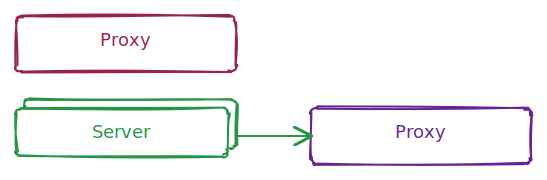

```plantuml
@startuml
node Server
[Proxy]
Server --> Proxy
@enduml
```

### Arrow styles

Covers various arrow styles including styled arrows.

[PlantUML source](./ressources/module-coverage/deployment/puml/arrow-styles.puml) · [SVG artifact](./ressources/module-coverage/deployment/svg/arrow-styles.svg)

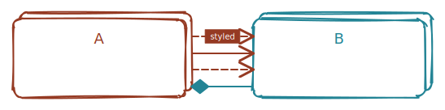

```plantuml
@startuml
node A
node B
A --> B
A ..> B
A --* B
A -[#red,dashed]-> B : styled
@enduml
```

### JSON mixing

Covers mixing deployment elements with JSON data structures (allowmixing).

[PlantUML source](./ressources/module-coverage/deployment/puml/json-mixing.puml) · [SVG artifact](./ressources/module-coverage/deployment/svg/json-mixing.svg)

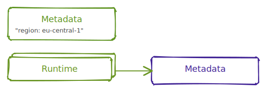

```plantuml
@startuml
allowmixing
node Runtime
[Metadata] : "region: eu-central-1"
Runtime --> Metadata
@enduml
```

### Official deployment elements

Official deployment element declarations across actor, agent, artifact, cloud, database, folder, frame, node, package, queue, rectangle, stack and storage.

[PlantUML source](./ressources/module-coverage/deployment/puml/official-elements.puml) · [SVG artifact](./ressources/module-coverage/deployment/svg/official-elements.svg)

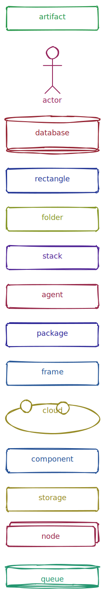

```plantuml
@startuml
actor actor
agent agent
artifact artifact
cloud cloud
component component
database database
folder folder
frame frame
node node
package package
queue queue
rectangle rectangle
stack stack
storage storage
@enduml
```

### Official long descriptions

Bracketed long descriptions for deployment elements.

[PlantUML source](./ressources/module-coverage/deployment/puml/official-long-descriptions.puml) · [SVG artifact](./ressources/module-coverage/deployment/svg/official-long-descriptions.svg)

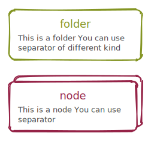

```plantuml
@startuml
folder folder [
This is a <b>folder
----
You can use separator
====
of different kind
]

node node [
This is a <b>node
----
You can use separator
]
@enduml
```

### Official JSON display

JSON data display mixed with deployment elements.

[PlantUML source](./ressources/module-coverage/deployment/puml/official-json.puml) · [SVG artifact](./ressources/module-coverage/deployment/svg/official-json.svg)

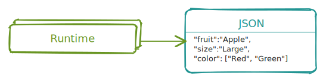

```plantuml
@startuml
allowmixing
node Runtime
json JSON {
  "fruit":"Apple",
  "size":"Large",
  "color": ["Red", "Green"]
}
Runtime --> JSON
@enduml
```

## Object

### Objects and fields

Object declarations, aliases, body fields and colon field syntax.

[PlantUML source](./ressources/module-coverage/object/puml/objects-fields.puml) · [SVG artifact](./ressources/module-coverage/object/svg/objects-fields.svg)

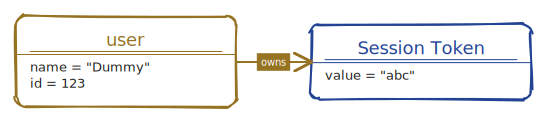

```plantuml
@startobject
object user {
  name = "Dummy"
  id = 123
}
object "Session Token" as session
session : value = "abc"
user --> session : owns
@endobject
```

### Maps and row anchors

Map rows, row anchors and class-like relationships between objects.

[PlantUML source](./ressources/module-coverage/object/puml/maps-anchors.puml) · [SVG artifact](./ressources/module-coverage/object/svg/maps-anchors.svg)

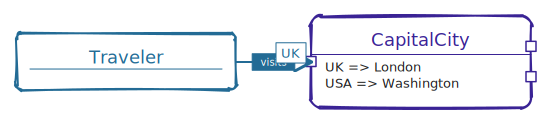

```plantuml
@startobject
map CapitalCity {
  UK => London
  USA => Washington
}
object Traveler
Traveler --> CapitalCity::UK : visits
@endobject
```

### Diamonds and relationships

Object diagrams share class-style relationship operators and diamonds.

[PlantUML source](./ressources/module-coverage/object/puml/diamond-relationships.puml) · [SVG artifact](./ressources/module-coverage/object/svg/diamond-relationships.svg)

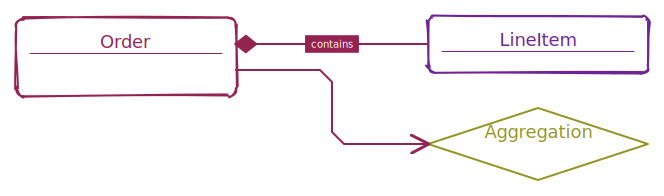

```plantuml
@startobject
object Order
object LineItem
diamond Aggregation
Order *-- LineItem : contains
Order --> Aggregation
@endobject
```

### Official object definitions and relations

Object declarations, aliases, undeclared relationship endpoints, multiplicities and labels.

[PlantUML source](./ressources/module-coverage/object/puml/official-definition-relations.puml) · [SVG artifact](./ressources/module-coverage/object/svg/official-definition-relations.svg)

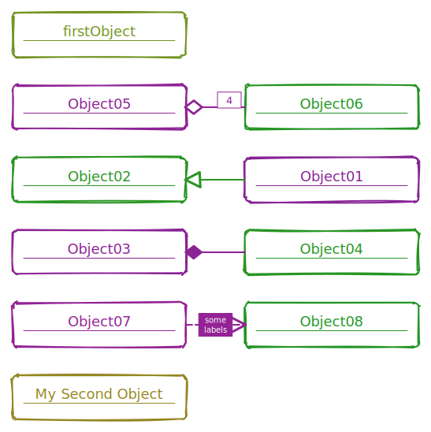

```plantuml
@startuml
object firstObject
object "My Second Object" as o2
object Object01
object Object02
object Object03
object Object04

Object01 <|-- Object02
Object03 *-- Object04
Object05 o-- "4" Object06
Object07 .. Object08 : some labels
@enduml
```

### Associated objects

Diamond association object pattern from the PlantUML object reference.

[PlantUML source](./ressources/module-coverage/object/puml/official-associated-objects.puml) · [SVG artifact](./ressources/module-coverage/object/svg/official-associated-objects.svg)

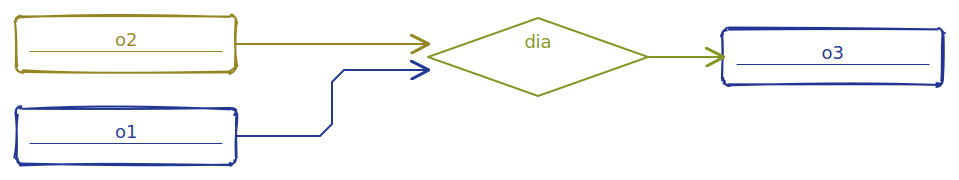

```plantuml
@startuml
object o1
object o2
diamond dia
object o3
o1 --> dia
o2 --> dia
dia --> o3
@enduml
```

### Map table and associative arrays

Map aliases, associative rows, row-to-object links and Map::row references.

[PlantUML source](./ressources/module-coverage/object/puml/official-map-table.puml) · [SVG artifact](./ressources/module-coverage/object/svg/official-map-table.svg)

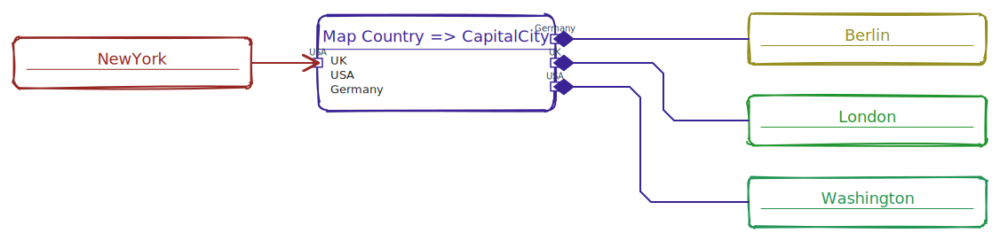

```plantuml
@startuml
object London
object Washington
object Berlin
object NewYork
map "Map **Country => CapitalCity**" as CapitalCity {
  UK *-> London
  USA *--> Washington
  Germany *---> Berlin
}
NewYork --> CapitalCity::USA
@enduml
```

### PERT maps and JSON display

PERT-style empty maps, directional object links and JSON display blocks.

[PlantUML source](./ressources/module-coverage/object/puml/official-pert-json.puml) · [SVG artifact](./ressources/module-coverage/object/svg/official-pert-json.svg)

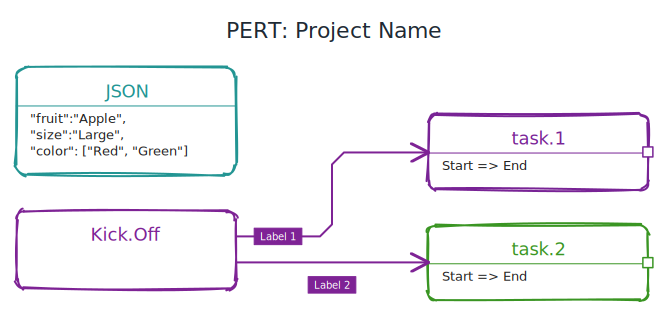

```plantuml
@startuml
left to right direction
title PERT: Project Name
map Kick.Off {
}
map task.1 {
  Start => End
}
map task.2 {
  Start => End
}
Kick.Off --> task.1 : Label 1
Kick.Off --> task.2 : Label 2
json JSON {
  "fruit":"Apple",
  "size":"Large",
  "color": ["Red", "Green"]
}
@enduml
```

## State

### Simple states and descriptions

Start/end pseudostates, state descriptions and basic transitions from the PlantUML state reference.

[PlantUML source](./ressources/module-coverage/state/puml/official-simple-transitions.puml) · [SVG artifact](./ressources/module-coverage/state/svg/official-simple-transitions.svg)

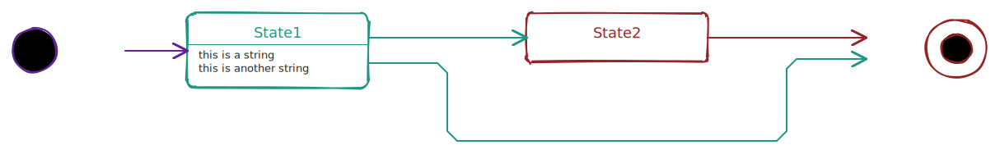

```plantuml
@startuml
[*] --> State1
State1 --> [*]
State1 : this is a string
State1 : this is another string
State1 -> State2
State2 --> [*]
@enduml
```

### Composite states

Nested state blocks, scale directives and inner transitions inside a composite state.

[PlantUML source](./ressources/module-coverage/state/puml/official-composite-state.puml) · [SVG artifact](./ressources/module-coverage/state/svg/official-composite-state.svg)

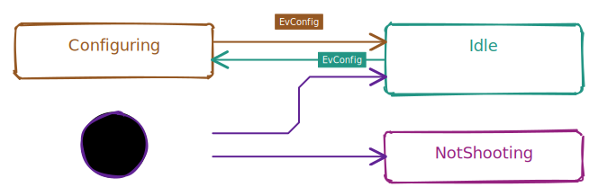

```plantuml
@startuml
scale 350 width
[*] --> NotShooting
state NotShooting {
  [*] --> Idle
  Idle --> Configuring : EvConfig
  Configuring --> Idle : EvConfig
}
@enduml
```

### Pseudostates

Choice, fork, join and shallow/deep history pseudostates declared through PlantUML stereotypes.

[PlantUML source](./ressources/module-coverage/state/puml/pseudostates.puml) · [SVG artifact](./ressources/module-coverage/state/svg/pseudostates.svg)

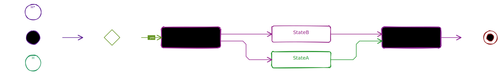

```plantuml
@startuml
state choice1 <<choice>>
state fork1 <<fork>>
state join1 <<join>>
state h <<history>>
state hd <<history*>>
[*] --> choice1
choice1 --> fork1 : yes
fork1 --> StateA
fork1 --> StateB
StateA --> join1
StateB --> join1
join1 --> [*]
@enduml
```

### Concurrent regions

Orthogonal region separators inside composite states remain strict-parseable.

[PlantUML source](./ressources/module-coverage/state/puml/concurrent-regions.puml) · [SVG artifact](./ressources/module-coverage/state/svg/concurrent-regions.svg)

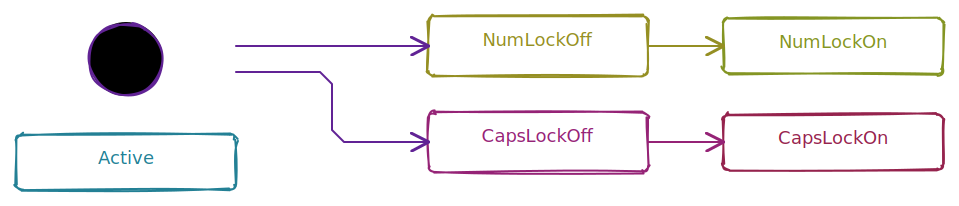

```plantuml
@startuml
state Active {
  [*] -> NumLockOff
  NumLockOff --> NumLockOn
  --
  [*] -> CapsLockOff
  CapsLockOff --> CapsLockOn
}
@enduml
```

### Notes, JSON and colours

State colours, nested declarations, safe notes and JSON display blocks mixed with transitions.

[PlantUML source](./ressources/module-coverage/state/puml/notes-json-style.puml) · [SVG artifact](./ressources/module-coverage/state/svg/notes-json-style.svg)

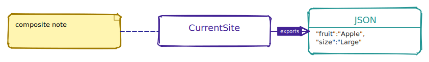

```plantuml
@startuml
state CurrentSite #pink {
  state HardwareSetup #lightblue
}
note right of CurrentSite : composite <b>note</b>
json JSON {
  "fruit":"Apple",
  "size":"Large"
}
CurrentSite --> JSON : exports
@enduml
```

## Timing

### Concise and robust participants

Official concise/robust example with absolute time markers and state changes.

[PlantUML source](./ressources/module-coverage/timing/puml/official-web-browser.puml) · [SVG artifact](./ressources/module-coverage/timing/svg/official-web-browser.svg)

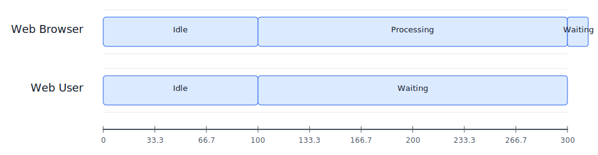

```plantuml
@startuml
robust "Web Browser" as WB
concise "Web User" as WU
@0
WU is Idle
WB is Idle
@100
WU is Waiting
WB is Processing
@300
WB is Waiting
@enduml
```

### Clock and binary signals

Clock declaration, binary participant and high/low state changes.

[PlantUML source](./ressources/module-coverage/timing/puml/official-clock-binary.puml) · [SVG artifact](./ressources/module-coverage/timing/svg/official-clock-binary.svg)

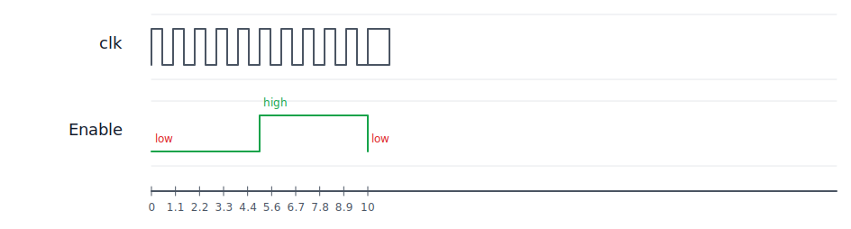

```plantuml
@startuml
clock clk with period 1
binary "Enable" as EN
@0
EN is low
@5
EN is high
@10
EN is low
@enduml
```

### Messages, constraints and notes

Participant-oriented events, cross-row messages, duration constraints and row notes.

[PlantUML source](./ressources/module-coverage/timing/puml/messages-constraints-notes.puml) · [SVG artifact](./ressources/module-coverage/timing/svg/messages-constraints-notes.svg)

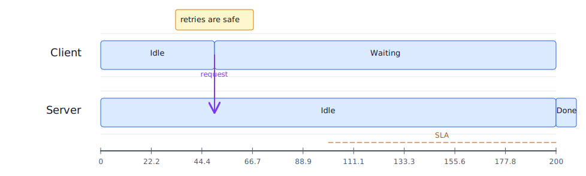

```plantuml
@startuml
robust "Client" as C
robust "Server" as S
@0
C is Idle
S is Idle
@50
C is Waiting
C -> S : request
@100 <-> @200 : SLA
note top of C : retries are safe
@200
S is Done
@enduml
```

### Analog and highlight

Analog-style numeric values with a highlighted timing interval.

[PlantUML source](./ressources/module-coverage/timing/puml/analog-highlight.puml) · [SVG artifact](./ressources/module-coverage/timing/svg/analog-highlight.svg)

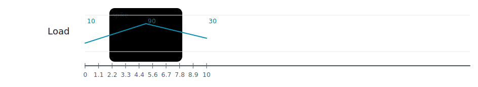

```plantuml
@startuml
analog "Load" between 0 and 100 as L
@0
L is 10
@5
L is 90
@10
L is 30
highlight 2 to 8 #Gold : spike
@enduml
```

## Archimate

### Elements

Coverage example rendered through the docs pipeline.

[PlantUML source](./ressources/module-coverage/archimate/puml/elements.puml) · [SVG artifact](./ressources/module-coverage/archimate/svg/elements.svg)

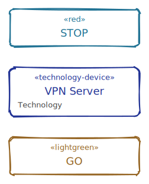

```plantuml
@startuml
archimate #Technology "VPN Server" as vpnServerA <<technology-device>>
rectangle GO #lightgreen
rectangle STOP #red
@enduml
```

### Junctions

Coverage example rendered through the docs pipeline.

[PlantUML source](./ressources/module-coverage/archimate/puml/junctions.puml) · [SVG artifact](./ressources/module-coverage/archimate/svg/junctions.svg)

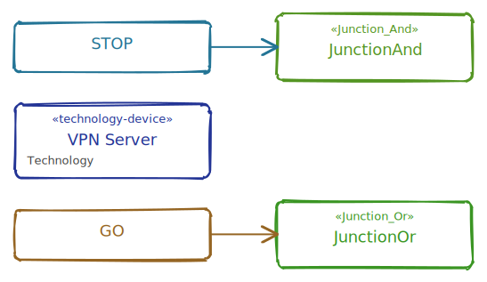

```plantuml
@startuml
Junction_And JunctionAnd
Junction_Or JunctionOr
archimate #Technology "VPN Server" as vpnServerA <<technology-device>>
GO -up-> JunctionOr
STOP -down-> JunctionAnd
@enduml
```

### Feature combination

Combines ArchiMate elements, technology stereotypes, junctions, rectangles and labelled flows.

[PlantUML source](./ressources/module-coverage/archimate/puml/feature-combination.puml) · [SVG artifact](./ressources/module-coverage/archimate/svg/feature-combination.svg)

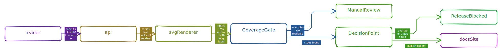

```plantuml
@startuml
archimate #Business "Documentation Reader" as reader <<business-actor>>
archimate #Application "excaliplant API" as api <<application-component>>
archimate #Technology "SVG Renderer" as svgRenderer <<technology-service>>
archimate #Technology "Generated Docs Site" as docsSite <<technology-artifact>>
rectangle ManualReview #lightgreen
rectangle ReleaseBlocked #red
Junction_And CoverageGate
Junction_Or DecisionPoint
reader --> api : submits PlantUML example
api --> svgRenderer : parses, lays out and renders
svgRenderer --> CoverageGate : emits SVG artifact with long label
CoverageGate --> ManualReview : examples are readable
CoverageGate --> DecisionPoint : issues found
DecisionPoint --> ReleaseBlocked : overlap or clipped text
DecisionPoint --> docsSite : publish gallery
@enduml
```

## Chart

### Single Bar

Coverage example rendered through the docs pipeline.

[PlantUML source](./ressources/module-coverage/chart/puml/single-bar.puml) · [SVG artifact](./ressources/module-coverage/chart/svg/single-bar.svg)

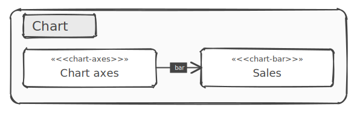

```plantuml
@startchart
h-axis [Q1, Q2]
v-axis 0 --> 100
bar "Sales" [45, 62] #3498db
@endchart
```

### Grouped

Coverage example rendered through the docs pipeline.

[PlantUML source](./ressources/module-coverage/chart/puml/grouped.puml) · [SVG artifact](./ressources/module-coverage/chart/svg/grouped.svg)

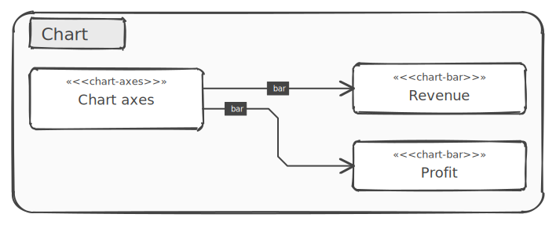

```plantuml
@startchart
h-axis [Q1, Q2]
stackMode grouped
bar "Revenue" [45, 62]
bar "Profit" [35, 48]
@endchart
```

### Feature combination

Combines axes, options, bars, lines, areas, scatter series, colours and uneven value ranges.

[PlantUML source](./ressources/module-coverage/chart/puml/feature-combination.puml) · [SVG artifact](./ressources/module-coverage/chart/svg/feature-combination.svg)

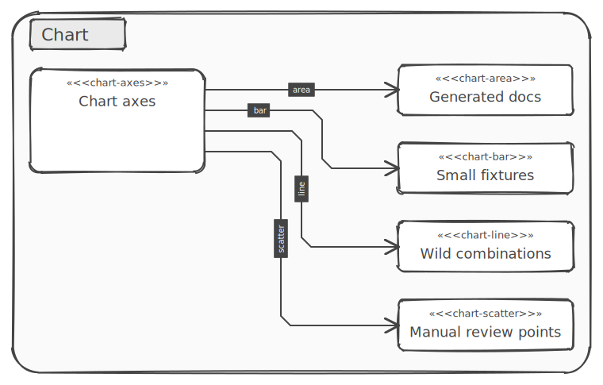

```plantuml
@startchart
title "Coverage health across modules"
h-axis [parser, model, layout, svg, docs]
v-axis 0 --> 100
legend right
grid true
annotation "Complex examples include overlap and label-fit decisions"
stackMode grouped
bar "Small fixtures" [90, 80, 75, 70, 85] #2c7fb8
line "Wild combinations" [40, 55, 65, 78, 92] #f03b20
area "Generated docs" [20, 35, 55, 80, 95] #31a354
scatter "Manual review points" [15, 60, 45, 88, 73] #756bb1
@endchart
```

## Chen ER

### Basic Relationship

Coverage example rendered through the docs pipeline.

[PlantUML source](./ressources/module-coverage/chen/puml/basic-relationship.puml) · [SVG artifact](./ressources/module-coverage/chen/svg/basic-relationship.svg)

```plantuml
@startchen
entity Person {
}
entity Location {
}
relationship Birthplace {
}
Person -N- Birthplace
Birthplace -1- Location
@endchen
```

### Direction

Coverage example rendered through the docs pipeline.

[PlantUML source](./ressources/module-coverage/chen/puml/direction.puml) · [SVG artifact](./ressources/module-coverage/chen/svg/direction.svg)

```plantuml
@startchen
left to right direction
entity Person {
}
entity Location {
}
relationship Birthplace {
}
Person -N- Birthplace
Birthplace -1- Location
@endchen
```

### Feature combination

Combines Chen entities, relationships, keys, attributes and cardinality labels.

[PlantUML source](./ressources/module-coverage/chen/puml/feature-combination.puml) · [SVG artifact](./ressources/module-coverage/chen/svg/feature-combination.svg)

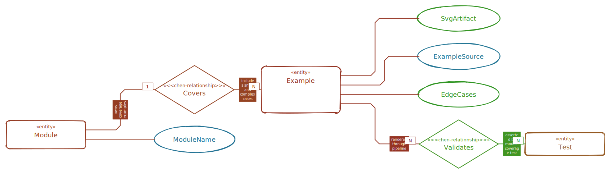

```plantuml
@startchen
left to right direction
entity Module {
  documented
}
entity Example {
  rendered
}
entity Test {
  automated
}
relationship Covers {
}
relationship Validates {
}
key ModuleName {
}
attribute ExampleSource {
}
derived_attribute SvgArtifact {
}
multi_valued_attribute EdgeCases {
}
Module -1- Covers : owns coverage examples
Covers -N- Example : includes small and complex cases
Example -N- Validates : rendered through pipeline
Validates -N- Test : asserted by module coverage test
Module - ModuleName
Example - ExampleSource
Example - SvgArtifact
Example - EdgeCases
@endchen
```

## Chronology

### Milestones

Coverage example rendered through the docs pipeline.

[PlantUML source](./ressources/module-coverage/chronology/puml/milestones.puml) · [SVG artifact](./ressources/module-coverage/chronology/svg/milestones.svg)

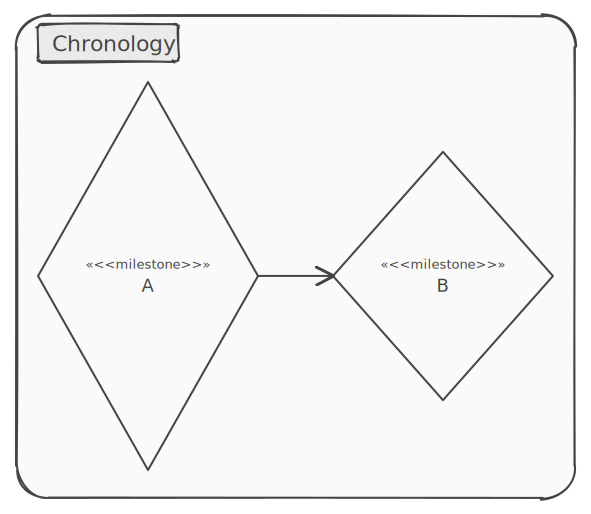

```plantuml
@startchronology
[A: Release candidate] happens on 2024-01-15 01:08:12
[B] happens on 2024-02-01
[A] -> [B]
@endchronology
```

### Ranges

Coverage example rendered through the docs pipeline.

[PlantUML source](./ressources/module-coverage/chronology/puml/ranges.puml) · [SVG artifact](./ressources/module-coverage/chronology/svg/ranges.svg)

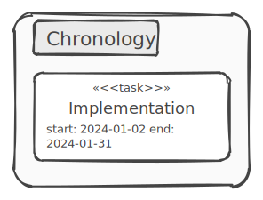

```plantuml
@startchronology
starts 2024-01-01
[Implementation] lasts from 2024-01-02 to 2024-01-31
@endchronology
```

### Feature combination

Combines global bounds, milestone labels, ranges and labelled dependencies.

[PlantUML source](./ressources/module-coverage/chronology/puml/feature-combination.puml) · [SVG artifact](./ressources/module-coverage/chronology/svg/feature-combination.svg)

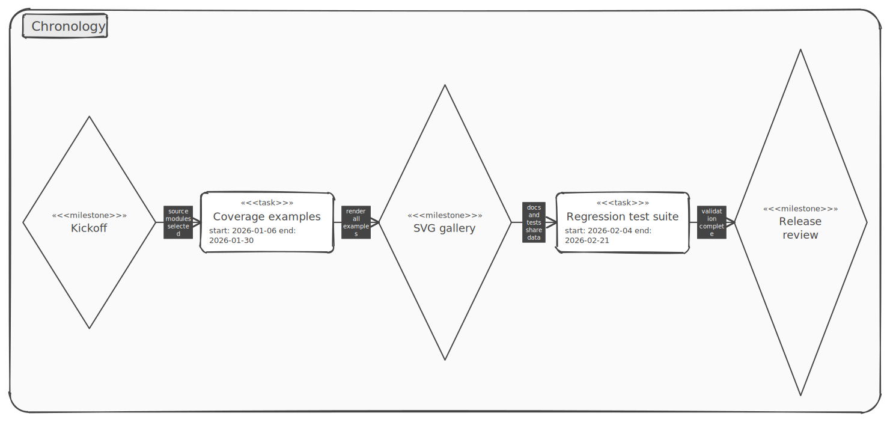

```plantuml
@startchronology
starts 2026-01-01
ends 2026-03-31
[Kickoff: module inventory] happens on 2026-01-05
[Coverage examples] lasts from 2026-01-06 to 2026-01-30
[SVG gallery: generated documentation] happens on 2026-02-03
[Regression test suite] lasts from 2026-02-04 to 2026-02-21
[Release review: examples, overlap checks and manifest] happens on 2026-03-02
[Kickoff] -> [Coverage examples] : source modules selected
[Coverage examples] -> [SVG gallery] : render all examples
[SVG gallery] -> [Regression test suite] : docs and tests share data
[Regression test suite] -> [Release review] : validation complete
@endchronology
```

## Ditaa

### Ascii Canvas

Coverage example rendered through the docs pipeline.

[PlantUML source](./ressources/module-coverage/ditaa/puml/ascii-canvas.puml) · [SVG artifact](./ressources/module-coverage/ditaa/svg/ascii-canvas.svg)

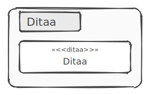

```plantuml
@startditaa
+---+
| A |
+---+
@endditaa
```

### Inline Options

Coverage example rendered through the docs pipeline.

[PlantUML source](./ressources/module-coverage/ditaa/puml/inline-options.puml) · [SVG artifact](./ressources/module-coverage/ditaa/svg/inline-options.svg)

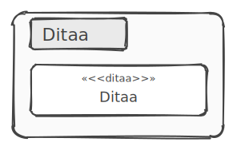

```plantuml
@startuml
ditaa(--no-shadows, scale=0.7)
+---+
| A |
+---+
@enduml
```

### Feature combination

Combines inline options, dense ASCII layout, labels and arrow-like connectors in one rendered box.

[PlantUML source](./ressources/module-coverage/ditaa/puml/feature-combination.puml) · [SVG artifact](./ressources/module-coverage/ditaa/svg/feature-combination.svg)

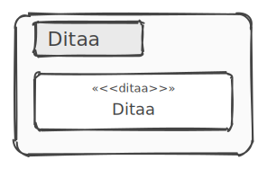

```plantuml
@startuml
ditaa(--no-shadows, scale=0.8)
+-------------------+       +-----------------------+
| Parser examples   | ----> | Shared coverage data  |
| small fixtures    |       | small + wild cases    |
+-------------------+       +-----------+-----------+
                                        |
                                        v
+-------------------+       +-----------------------+
| SVG gallery       | <---- | module_coverage.test  |
| generated docs    |       | render every example  |
+-------------------+       +-----------------------+
@enduml
```

## EBNF

### Binary Digit

Coverage example rendered through the docs pipeline.

[PlantUML source](./ressources/module-coverage/ebnf/puml/binary-digit.puml) · [SVG artifact](./ressources/module-coverage/ebnf/svg/binary-digit.svg)

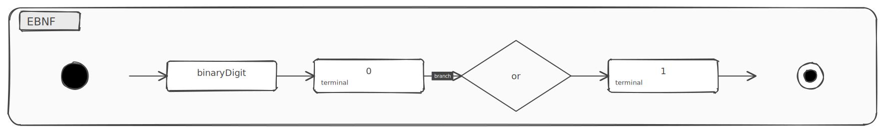

```plantuml
@startebnf
binaryDigit = "0" | "1";
@endebnf
```

### All Elements

Coverage example rendered through the docs pipeline.

[PlantUML source](./ressources/module-coverage/ebnf/puml/all-elements.puml) · [SVG artifact](./ressources/module-coverage/ebnf/svg/all-elements.svg)

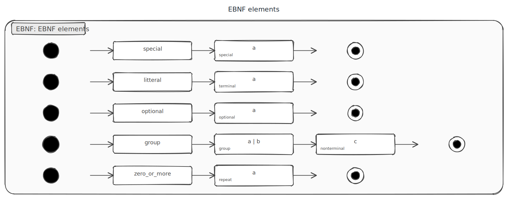

```plantuml
@startebnf
title EBNF elements
litteral = "a";
special = ? a ?;
optional = [a];
zero_or_more = {a};
group = (a | b), c;
@endebnf
```

### Feature combination

Combines terminals, non-terminals, alternatives, optional groups and repetitions in one grammar.

[PlantUML source](./ressources/module-coverage/ebnf/puml/feature-combination.puml) · [SVG artifact](./ressources/module-coverage/ebnf/svg/feature-combination.svg)

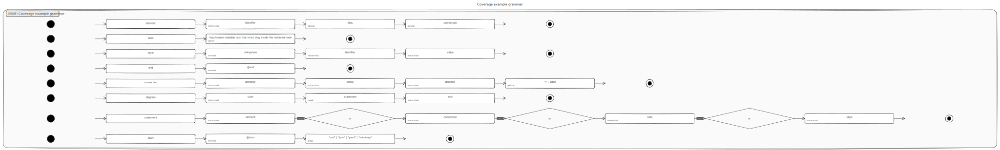

```plantuml
@startebnf
title Coverage example grammar
diagram = start, { statement }, end;
start = "@start", ("uml" | "json" | "yaml" | "mindmap");
statement = element | connection | note | style;
element = identifier, [alias], [stereotype];
connection = identifier, arrow, identifier, [ ":" , label ];
label = ? long human readable text that must stay inside the rendered node ?;
style = "skinparam", identifier, value;
end = "@end";
@endebnf
```

## Files

### Project Tree

Coverage example rendered through the docs pipeline.

[PlantUML source](./ressources/module-coverage/files/puml/project-tree.puml) · [SVG artifact](./ressources/module-coverage/files/svg/project-tree.svg)

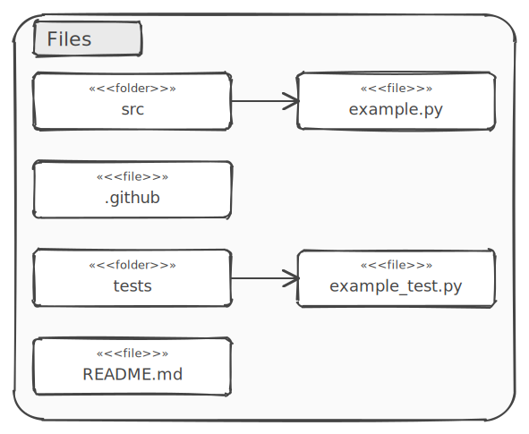

```plantuml
@startfiles
/.github
/src/example.py
/tests/example_test.py
/README.md
@endfiles
```

### Merged Paths

Coverage example rendered through the docs pipeline.

[PlantUML source](./ressources/module-coverage/files/puml/merged-paths.puml) · [SVG artifact](./ressources/module-coverage/files/svg/merged-paths.svg)

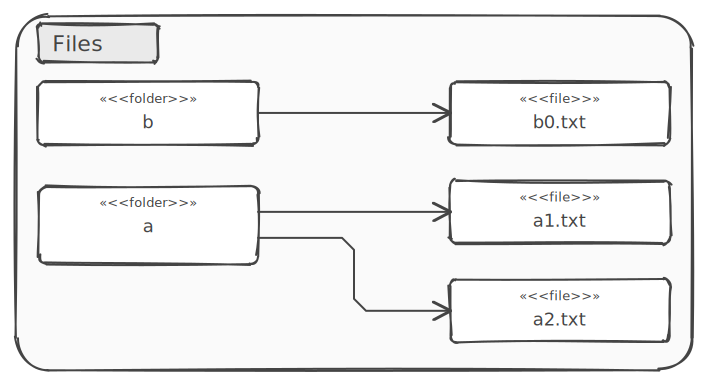

```plantuml
@startfiles
/a/a1.txt
/b/b0.txt
/a/a2.txt
@endfiles
```

### Feature combination

Combines repeated folders, deep paths, generated documentation outputs and test fixtures.

[PlantUML source](./ressources/module-coverage/files/puml/feature-combination.puml) · [SVG artifact](./ressources/module-coverage/files/svg/feature-combination.svg)

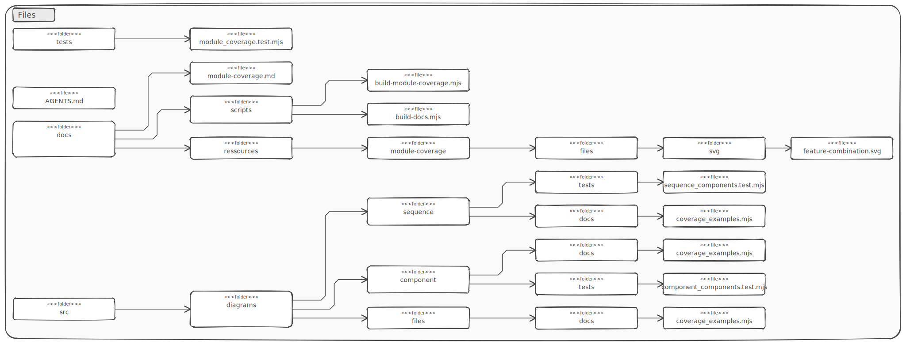

```plantuml
@startfiles
/src/diagrams/sequence/docs/coverage_examples.mjs
/src/diagrams/sequence/tests/sequence_components.test.mjs
/src/diagrams/component/docs/coverage_examples.mjs
/src/diagrams/component/tests/component_components.test.mjs
/src/diagrams/files/docs/coverage_examples.mjs
/docs/scripts/build-docs.mjs
/docs/scripts/build-module-coverage.mjs
/docs/module-coverage.md
/docs/ressources/module-coverage/files/svg/feature-combination.svg
/tests/module_coverage.test.mjs
/AGENTS.md
@endfiles
```

### Repo-derived coverage tree (dynamic)

Generated from this checkout to keep the documentation example tied to real module, docs and test files.

[PlantUML source](./ressources/module-coverage/files/puml/repo-derived-coverage-tree.puml) · [SVG artifact](./ressources/module-coverage/files/svg/repo-derived-coverage-tree.svg)

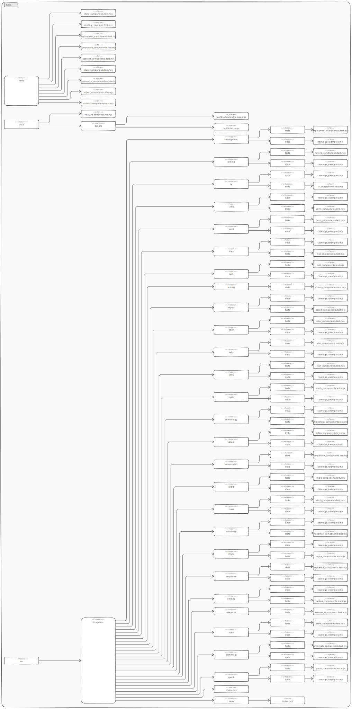

```plantuml
@startfiles
/docs/README.template.md.njk
/docs/scripts/build-docs.mjs
/docs/scripts/build-docs.mjs
/docs/scripts/build-module-coverage.mjs
/docs/scripts/build-module-coverage.mjs
/src/diagrams/activity/tests/activity_components.test.mjs
/src/diagrams/archimate/docs/coverage_examples.mjs
/src/diagrams/archimate/tests/archimate_components.test.mjs
/src/diagrams/base/index.mjs
/src/diagrams/chart/docs/coverage_examples.mjs
/src/diagrams/chart/tests/chart_components.test.mjs
/src/diagrams/chen/docs/coverage_examples.mjs
/src/diagrams/chen/tests/chen_components.test.mjs
/src/diagrams/chronology/docs/coverage_examples.mjs
/src/diagrams/chronology/tests/chronology_components.test.mjs
/src/diagrams/class/docs/coverage_examples.mjs
/src/diagrams/class/tests/class_components.test.mjs
/src/diagrams/component/docs/coverage_examples.mjs
/src/diagrams/component/tests/component_components.test.mjs
/src/diagrams/deployment/docs/coverage_examples.mjs
/src/diagrams/deployment/tests/deployment_components.test.mjs
/src/diagrams/ditaa/docs/coverage_examples.mjs
/src/diagrams/ditaa/tests/ditaa_components.test.mjs
/src/diagrams/ebnf/docs/coverage_examples.mjs
/src/diagrams/ebnf/tests/ebnf_components.test.mjs
/src/diagrams/files/docs/coverage_examples.mjs
/src/diagrams/files/tests/files_components.test.mjs
/src/diagrams/gantt/docs/coverage_examples.mjs
/src/diagrams/gantt/tests/gantt_components.test.mjs
/src/diagrams/ie/docs/coverage_examples.mjs
/src/diagrams/ie/tests/ie_components.test.mjs
/src/diagrams/index.mjs
/src/diagrams/json/docs/coverage_examples.mjs
/src/diagrams/json/tests/json_components.test.mjs
/src/diagrams/math/docs/coverage_examples.mjs
/src/diagrams/math/tests/math_components.test.mjs
/src/diagrams/mindmap/docs/coverage_examples.mjs
/src/diagrams/mindmap/tests/mindmap_components.test.mjs
/src/diagrams/nwdiag/docs/coverage_examples.mjs
/src/diagrams/nwdiag/tests/nwdiag_components.test.mjs
/src/diagrams/object/docs/coverage_examples.mjs
/src/diagrams/object/tests/object_components.test.mjs
/src/diagrams/regex/docs/coverage_examples.mjs
/src/diagrams/regex/tests/regex_components.test.mjs
/src/diagrams/salt/docs/coverage_examples.mjs
/src/diagrams/salt/tests/salt_components.test.mjs
/src/diagrams/sequence/docs/coverage_examples.mjs
/src/diagrams/sequence/tests/sequence_components.test.mjs
/src/diagrams/state/docs/coverage_examples.mjs
/src/diagrams/state/tests/state_components.test.mjs
/src/diagrams/timing/docs/coverage_examples.mjs
/src/diagrams/timing/tests/timing_components.test.mjs
/src/diagrams/use-case/tests/usecase_components.test.mjs
/src/diagrams/wbs/docs/coverage_examples.mjs
/src/diagrams/wbs/tests/wbs_components.test.mjs
/src/diagrams/yaml/docs/coverage_examples.mjs
/src/diagrams/yaml/tests/yaml_components.test.mjs
/tests/activity_components.test.mjs
/tests/class_components.test.mjs
/tests/component_components.test.mjs
/tests/deployment_components.test.mjs
/tests/module_coverage.test.mjs
/tests/object_components.test.mjs
/tests/sequence_components.test.mjs
/tests/state_components.test.mjs
/tests/usecase_components.test.mjs
@endfiles
```

## Gantt

### Durations

Coverage example rendered through the docs pipeline.

[PlantUML source](./ressources/module-coverage/gantt/puml/durations.puml) · [SVG artifact](./ressources/module-coverage/gantt/svg/durations.svg)

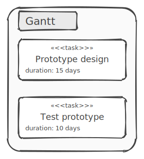

```plantuml
@startgantt
[Prototype design] requires 15 days
[Test prototype] requires 10 days
@endgantt
```

### Dated Starts

Coverage example rendered through the docs pipeline.

[PlantUML source](./ressources/module-coverage/gantt/puml/dated-starts.puml) · [SVG artifact](./ressources/module-coverage/gantt/svg/dated-starts.svg)

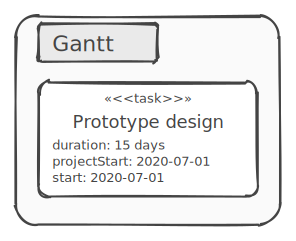

```plantuml
@startgantt
Project starts 2020-07-01
[Prototype design] requires 15 days
[Prototype design] starts 2020-07-01
@endgantt
```

### Feature combination

Combines project starts, explicit dates, milestones, dependencies and long dependency labels.

[PlantUML source](./ressources/module-coverage/gantt/puml/feature-combination.puml) · [SVG artifact](./ressources/module-coverage/gantt/svg/feature-combination.svg)

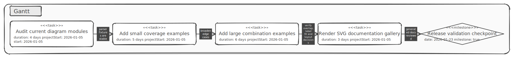

```plantuml
@startgantt
Project starts 2026-01-05
-- Repository release train --
[Audit current diagram modules] requires 4 days
[Audit current diagram modules] starts 2026-01-05
[Add small coverage examples] requires 5 days
[Add large combination examples] requires 6 days
[Render SVG documentation gallery] requires 3 days
[Release validation checkpoint] happens 2026-01-23
[Audit current diagram modules] then [Add small coverage examples] : parser fixtures are stable
[Add small coverage examples] then [Add large combination examples] : broaden edge cases
[Add large combination examples] then [Render SVG documentation gallery] : verify overlap, label fit and layout decisions
[Render SVG documentation gallery] then [Release validation checkpoint] : generated docs reviewed
@endgantt
```

## Information Engineering ER

### Crow Foot Relationships

Coverage example rendered through the docs pipeline.

[PlantUML source](./ressources/module-coverage/ie/puml/crow-foot-relationships.puml) · [SVG artifact](./ressources/module-coverage/ie/svg/crow-foot-relationships.svg)

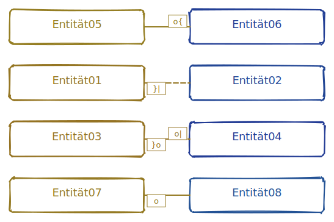

```plantuml
@startuml
Entität01 }|..|| Entität02
Entität03 }o..o| Entität04
Entität05 ||--o{ Entität06
Entität07 |o--|| Entität08
@enduml
```

### Entity Attributes

Coverage example rendered through the docs pipeline.

[PlantUML source](./ressources/module-coverage/ie/puml/entity-attributes.puml) · [SVG artifact](./ressources/module-coverage/ie/svg/entity-attributes.svg)

```plantuml
@startuml
entity Entität01 {
  * identifizierendes_attribut
  --
  * vorgeschriebenes_attribut
  optionales_attribut
}
@enduml
```

### Feature combination

Combines IE entities, attributes, dashed and solid crow-foot relationships and long labels.

[PlantUML source](./ressources/module-coverage/ie/puml/feature-combination.puml) · [SVG artifact](./ressources/module-coverage/ie/svg/feature-combination.svg)

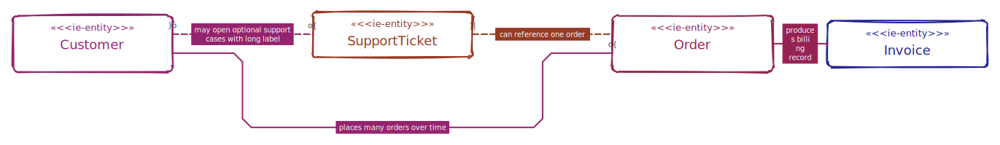

```plantuml
@startuml
entity Customer {
  * customer_id
  --
  * email
  support_tier
}
entity Order {
  * order_id
  --
  * placed_at
  status
}
entity Invoice {
  * invoice_id
  --
  total_amount
}
entity SupportTicket {
  * ticket_id
  --
  severity
}
Customer ||--o{ Order : places many orders over time
Order ||--|| Invoice : produces billing record
Customer }o..o{ SupportTicket : may open optional support cases with long label
SupportTicket }|..|| Order : can reference one order
@enduml
```

## JSON

### Object Array

Coverage example rendered through the docs pipeline.

[PlantUML source](./ressources/module-coverage/json/puml/object-array.puml) · [SVG artifact](./ressources/module-coverage/json/svg/object-array.svg)

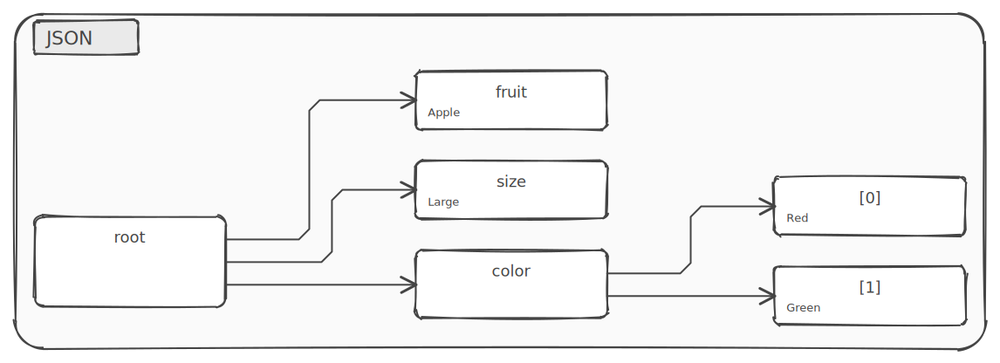

```plantuml
@startjson
{
  "fruit": "Apple",
  "size": "Large",
  "color": ["Red", "Green"]
}
@endjson
```

### Highlight

Coverage example rendered through the docs pipeline.

[PlantUML source](./ressources/module-coverage/json/puml/highlight.puml) · [SVG artifact](./ressources/module-coverage/json/svg/highlight.svg)

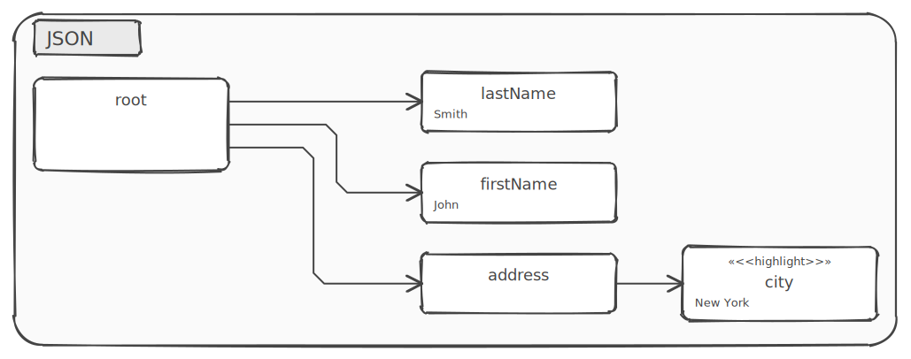

```plantuml
@startjson
#highlight "address" / "city"
{
  "firstName": "John",
  "lastName": "Smith",
  "address": { "city": "New York" }
}
@endjson
```

### Feature combination

Combines nested objects, arrays, booleans, nulls, long strings and highlight directives.

[PlantUML source](./ressources/module-coverage/json/puml/feature-combination.puml) · [SVG artifact](./ressources/module-coverage/json/svg/feature-combination.svg)

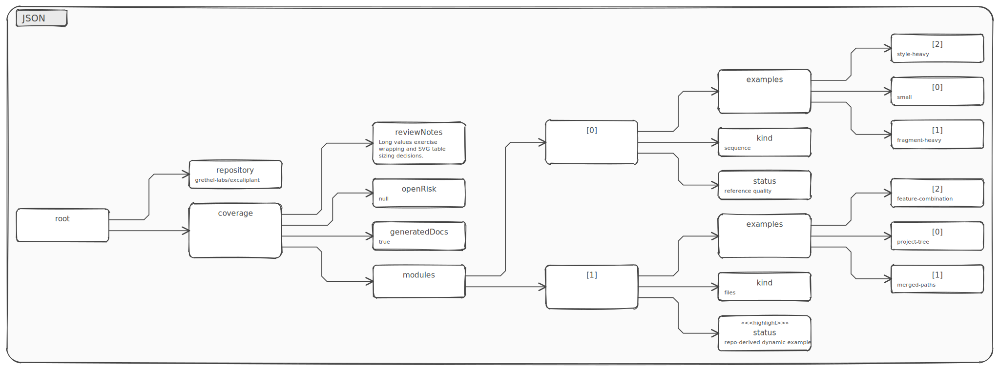

```plantuml
@startjson
#highlight "coverage" / "modules" / 1 / "status"
{
  "repository": "grethel-labs/excaliplant",
  "coverage": {
    "generatedDocs": true,
    "modules": [
      {
        "kind": "sequence",
        "status": "reference quality",
        "examples": ["small", "fragment-heavy", "style-heavy"]
      },
      {
        "kind": "files",
        "status": "repo-derived dynamic example",
        "examples": ["project-tree", "merged-paths", "feature-combination"]
      }
    ],
    "reviewNotes": "Long values exercise wrapping and SVG table sizing decisions.",
    "openRisk": null
  }
}
@endjson
```

## Math

### Standalone Asciimath

Coverage example rendered through the docs pipeline.

[PlantUML source](./ressources/module-coverage/math/puml/standalone-asciimath.puml) · [SVG artifact](./ressources/module-coverage/math/svg/standalone-asciimath.svg)

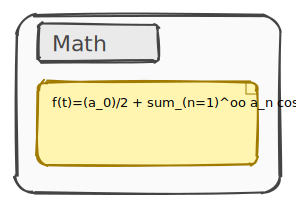

```plantuml
@startmath
f(t)=(a_0)/2 + sum_(n=1)^oo a_n cos((n pi t)/L)
@endmath
```

### Standalone Latex

Coverage example rendered through the docs pipeline.

[PlantUML source](./ressources/module-coverage/math/puml/standalone-latex.puml) · [SVG artifact](./ressources/module-coverage/math/svg/standalone-latex.svg)

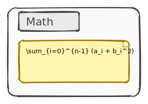

```plantuml
@startlatex
\sum_{i=0}^{n-1} (a_i + b_i^2)
@endlatex
```

### Feature combination

Combines a title with a multiline formula and descriptive variables that force text wrapping.

[PlantUML source](./ressources/module-coverage/math/puml/feature-combination.puml) · [SVG artifact](./ressources/module-coverage/math/svg/feature-combination.svg)

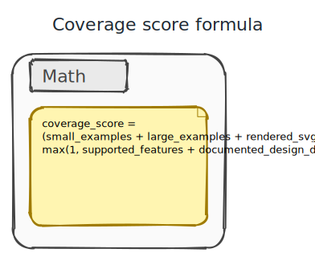

```plantuml
@startmath
title Coverage score formula
coverage_score =
  (small_examples + large_examples + rendered_svg_checks) /
  max(1, supported_features + documented_design_decisions)
@endmath
```

## Mindmap

### Orgmode

Coverage example rendered through the docs pipeline.

[PlantUML source](./ressources/module-coverage/mindmap/puml/orgmode.puml) · [SVG artifact](./ressources/module-coverage/mindmap/svg/orgmode.svg)

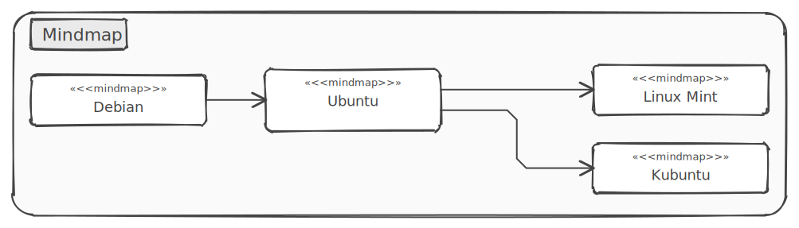

```plantuml
@startmindmap
* Debian
** Ubuntu
*** Linux Mint
*** Kubuntu
@endmindmap
```

### Markdown

Coverage example rendered through the docs pipeline.

[PlantUML source](./ressources/module-coverage/mindmap/puml/markdown.puml) · [SVG artifact](./ressources/module-coverage/mindmap/svg/markdown.svg)

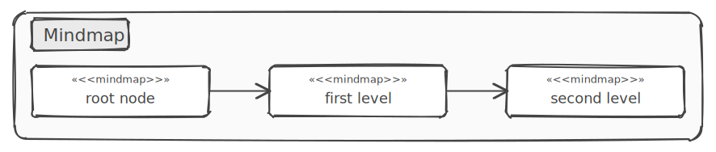

```plantuml
@startmindmap
# root node
## first level
### second level
@endmindmap
```

### Feature combination

Combines markdown hierarchy, long node labels, branch balancing directives and mixed depth.

[PlantUML source](./ressources/module-coverage/mindmap/puml/feature-combination.puml) · [SVG artifact](./ressources/module-coverage/mindmap/svg/feature-combination.svg)

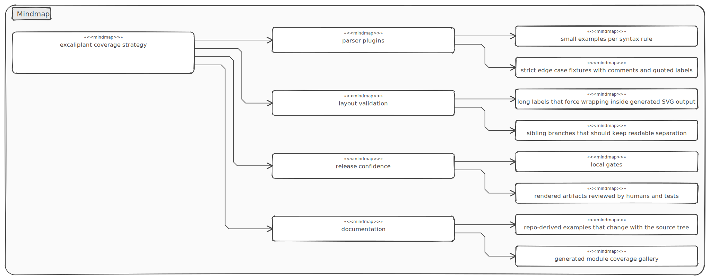

```plantuml
@startmindmap
right side
# excaliplant coverage strategy
## parser plugins
### small examples per syntax rule
### strict edge case fixtures with comments and quoted labels
## layout validation
### long labels that force wrapping inside generated SVG output
### sibling branches that should keep readable separation
## documentation
### generated module coverage gallery
### repo-derived examples that change with the source tree
left side
## release confidence
### local gates
### rendered artifacts reviewed by humans and tests
@endmindmap
```

## Nwdiag

### Single Network

Coverage example rendered through the docs pipeline.

[PlantUML source](./ressources/module-coverage/nwdiag/puml/single-network.puml) · [SVG artifact](./ressources/module-coverage/nwdiag/svg/single-network.svg)

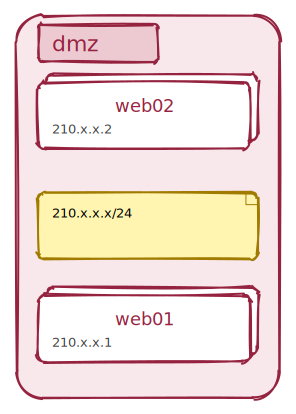

```plantuml
@startnwdiag
nwdiag {
  network dmz {
    address = "210.x.x.x/24"
    web01 [address = "210.x.x.1"];
    web02 [address = "210.x.x.2"];
  }
}
@endnwdiag
```

### Multi Network

Coverage example rendered through the docs pipeline.

[PlantUML source](./ressources/module-coverage/nwdiag/puml/multi-network.puml) · [SVG artifact](./ressources/module-coverage/nwdiag/svg/multi-network.svg)

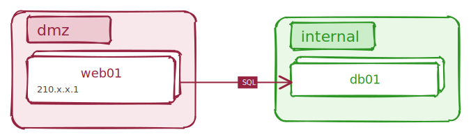

```plantuml
@startnwdiag
nwdiag {
  network dmz {
    web01 [address = "210.x.x.1"];
  }
  network internal {
    web01 [address = "172.x.x.1"];
    db01;
  }
  web01 -- db01 : SQL
}
@endnwdiag
```

### Feature combination

Combines multiple networks, groups, node attributes and labelled cross-network links.

[PlantUML source](./ressources/module-coverage/nwdiag/puml/feature-combination.puml) · [SVG artifact](./ressources/module-coverage/nwdiag/svg/feature-combination.svg)

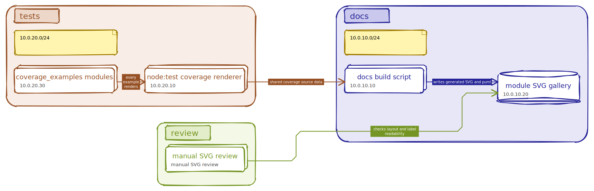

```plantuml
@startnwdiag
nwdiag {
  network docs {
    address = "10.0.10.0/24"
    builder [address = "10.0.10.10", description = "docs build script"];
    gallery [address = "10.0.10.20", shape = "storage", description = "module SVG gallery"];
  }
  network tests {
    address = "10.0.20.0/24"
    runner [address = "10.0.20.10", description = "node:test coverage renderer"];
    fixtures [address = "10.0.20.30", description = "coverage_examples modules"];
  }
  group review {
    maintainer [description = "manual SVG review"];
  }
  fixtures -- runner : every example renders
  runner -- builder : shared coverage source data
  builder -- gallery : writes generated SVG and puml
  maintainer -- gallery : checks layout and label readability
}
@endnwdiag
```

## Regex

### Literals And Classes

Coverage example rendered through the docs pipeline.

[PlantUML source](./ressources/module-coverage/regex/puml/literals-and-classes.puml) · [SVG artifact](./ressources/module-coverage/regex/svg/literals-and-classes.svg)

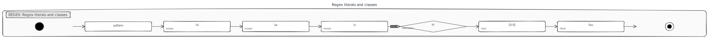

```plantuml
@startregex
title Regex literals and classes
\d\w\s|[0-9]\Qfoo\E
@endregex
```

### Groups And Repetition

Coverage example rendered through the docs pipeline.

[PlantUML source](./ressources/module-coverage/regex/puml/groups-and-repetition.puml) · [SVG artifact](./ressources/module-coverage/regex/svg/groups-and-repetition.svg)

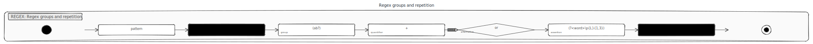

```plantuml
@startregex
title Regex groups and repetition
^(ab?)+|(?<word>\p{L}{1,3})$
@endregex
```

### Feature combination

Combines anchors, named groups, alternatives, classes, repetitions and escaped literals.

[PlantUML source](./ressources/module-coverage/regex/puml/feature-combination.puml) · [SVG artifact](./ressources/module-coverage/regex/svg/feature-combination.svg)

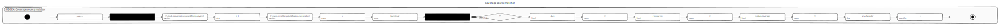

```plantuml
@startregex
title Coverage source matcher
^(?<kind>sequence|component|files|json|yaml)[-_](?<case>small|large|wild|feature-combination)\.(puml|svg)$|docs\/ressources\/module-coverage\/.+
@endregex
```

## Salt

### Basic Controls

Coverage example rendered through the docs pipeline.

[PlantUML source](./ressources/module-coverage/salt/puml/basic-controls.puml) · [SVG artifact](./ressources/module-coverage/salt/svg/basic-controls.svg)

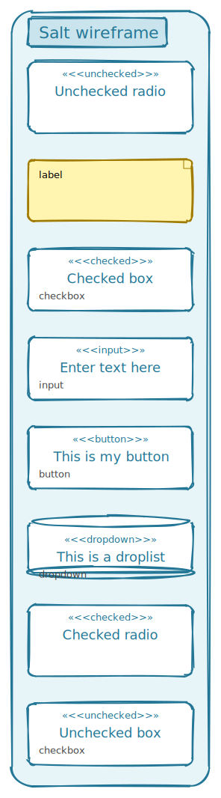

```plantuml
@startsalt
{
  Just plain text
  [This is my button]
  () Unchecked radio
  (X) Checked radio
  [] Unchecked box
  [X] Checked box
  "Enter text here"
  ^This is a droplist^
}
@endsalt
```

### Textarea

Coverage example rendered through the docs pipeline.

[PlantUML source](./ressources/module-coverage/salt/puml/textarea.puml) · [SVG artifact](./ressources/module-coverage/salt/svg/textarea.svg)

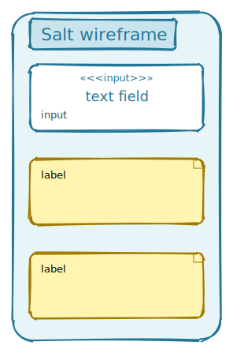

```plantuml
@startsalt
{+
   This is a long
   text in a textarea
   .
   "                         "
}
@endsalt
```

### Feature combination

Combines labels, buttons, radios, checkboxes, inputs, dropdowns, tabs and grid-like rows.

[PlantUML source](./ressources/module-coverage/salt/puml/feature-combination.puml) · [SVG artifact](./ressources/module-coverage/salt/svg/feature-combination.svg)

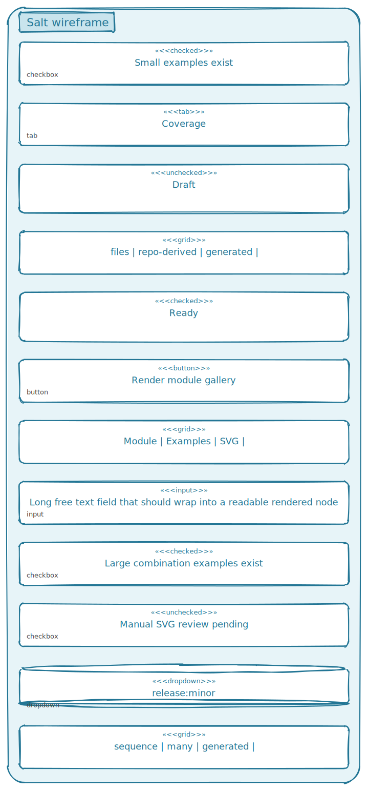

```plantuml
@startsalt
{
  /Coverage/
  [Render module gallery]
  [X] Small examples exist
  [X] Large combination examples exist
  [] Manual SVG review pending
  () Draft
  (X) Ready
  "Long free text field that should wrap into a readable rendered node"
  ^release:minor^
  | Module | Examples | SVG |
  | sequence | many | generated |
  | files | repo-derived | generated |
}
@endsalt
```

## WBS

### Orgmode

Coverage example rendered through the docs pipeline.

[PlantUML source](./ressources/module-coverage/wbs/puml/orgmode.puml) · [SVG artifact](./ressources/module-coverage/wbs/svg/orgmode.svg)

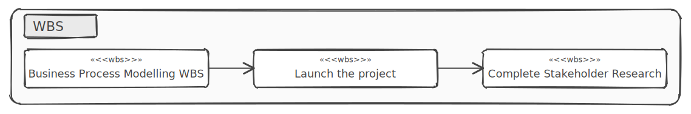

```plantuml
@startwbs
* Business Process Modelling WBS
** Launch the project
*** Complete Stakeholder Research
@endwbs
```

### Arithmetic

Coverage example rendered through the docs pipeline.

[PlantUML source](./ressources/module-coverage/wbs/puml/arithmetic.puml) · [SVG artifact](./ressources/module-coverage/wbs/svg/arithmetic.svg)

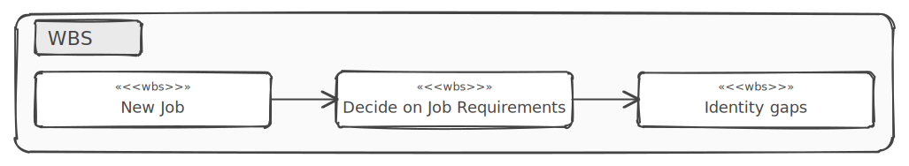

```plantuml
@startwbs
+ New Job
++ Decide on Job Requirements
+++ Identity gaps
@endwbs
```

### Feature combination

Combines plus and star hierarchy styles with long work-package labels and uneven depth.

[PlantUML source](./ressources/module-coverage/wbs/puml/feature-combination.puml) · [SVG artifact](./ressources/module-coverage/wbs/svg/feature-combination.svg)

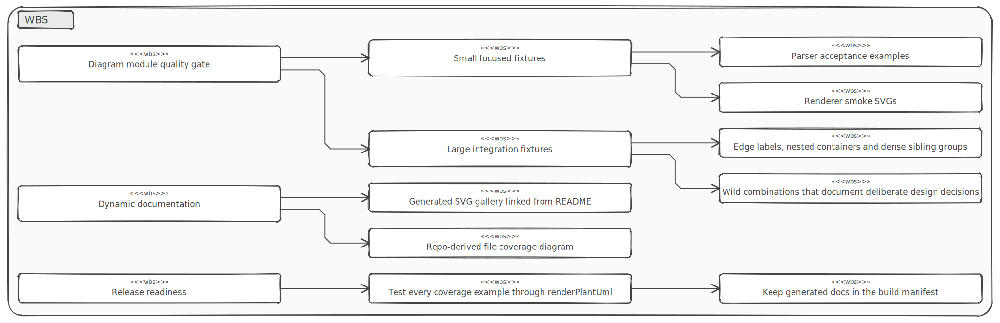

```plantuml
@startwbs
left direction
* Diagram module quality gate
** Small focused fixtures
*** Parser acceptance examples
*** Renderer smoke SVGs
** Large integration fixtures
*** Edge labels, nested containers and dense sibling groups
*** Wild combinations that document deliberate design decisions
+ Dynamic documentation
++ Repo-derived file coverage diagram
++ Generated SVG gallery linked from README
+ Release readiness
++ Test every coverage example through renderPlantUml
+++ Keep generated docs in the build manifest
@endwbs
```

## YAML

### Mapping Sequence

Coverage example rendered through the docs pipeline.

[PlantUML source](./ressources/module-coverage/yaml/puml/mapping-sequence.puml) · [SVG artifact](./ressources/module-coverage/yaml/svg/mapping-sequence.svg)

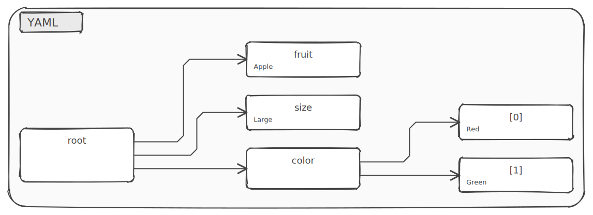

```plantuml
@startyaml
fruit: Apple
size: Large
color:
  - Red
  - Green
@endyaml
```

### Unicode Keys

Coverage example rendered through the docs pipeline.

[PlantUML source](./ressources/module-coverage/yaml/puml/unicode-keys.puml) · [SVG artifact](./ressources/module-coverage/yaml/svg/unicode-keys.svg)

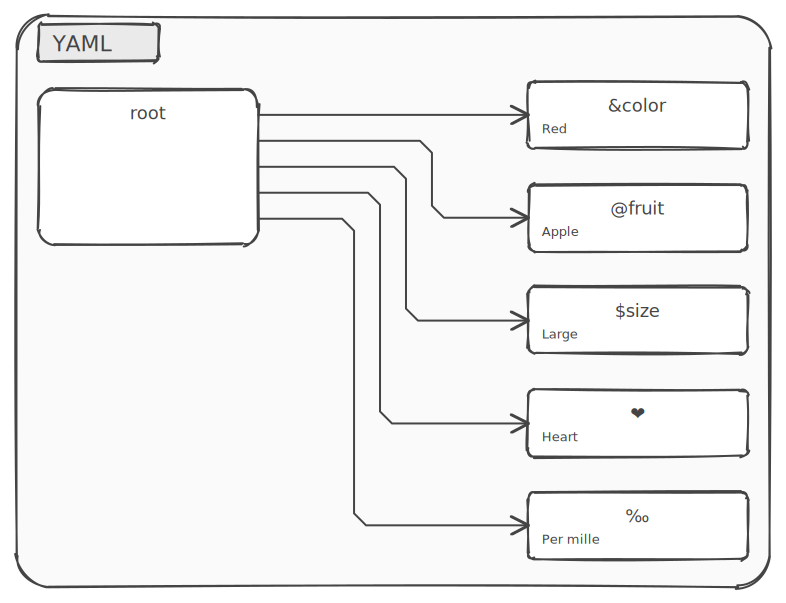

```plantuml
@startyaml
@fruit: Apple
$size: Large
&color: Red
❤: Heart
‰: Per mille
@endyaml
```

### Feature combination

Combines nested mappings, sequences, booleans, nulls and long strings for data rendering.

[PlantUML source](./ressources/module-coverage/yaml/puml/feature-combination.puml) · [SVG artifact](./ressources/module-coverage/yaml/svg/feature-combination.svg)

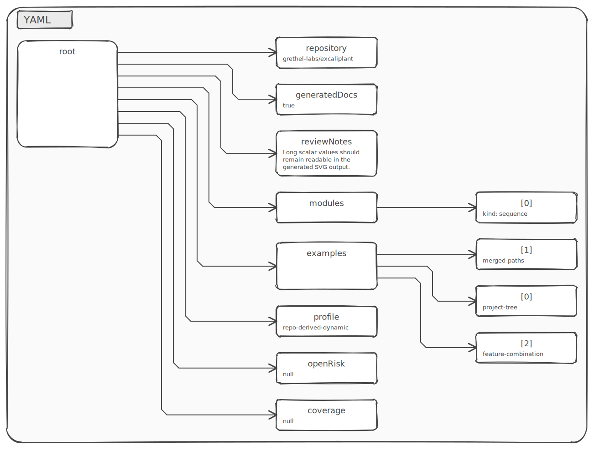

```plantuml
@startyaml
repository: grethel-labs/excaliplant
coverage:
  generatedDocs: true
  modules:
    - kind: sequence
      profile: reference-quality
      examples:
        - small
        - complex-fragments
        - styled-lifecycle
    - kind: files
      profile: repo-derived-dynamic
      examples:
        - project-tree
        - merged-paths
        - feature-combination
  reviewNotes: Long scalar values should remain readable in the generated SVG output.
  openRisk: null
@endyaml
```
