# Sequence Diagram Component Coverage

This page is generated by `docs/scripts/build-sequence-coverage.mjs` from the same examples used by `tests/sequence_components.test.mjs`.

The goal is to keep PlantUML sequence syntax, the object-oriented sequence model, layout spacing, and rendered SVG output reviewable together.

## Support Matrix

| PlantUML component                          | Status    | Notes                                                                                                      |
| ------------------------------------------- | --------- | ---------------------------------------------------------------------------------------------------------- |
| Basic messages (->, -->, <-, <--)           | supported | Compact and spaced forms are parsed.                                                                       |
| Participant declarations and kinds          | supported | participant, actor, boundary, control, entity, database, collections, queue.                               |
| Aliases, colors, stereotypes, order         | supported | Participant order is applied during layout.                                                                |
| Multiline participant block ([ ... ])       | supported | Bracket-block titles are preserved as multiline participant labels.                                        |
| Self messages                               | supported | Rendered as loop arrows with wrapped labels.                                                               |
| Message text alignment/response below arrow | supported | MessageAlign and ResponseMessageBelowArrow affect wrapped label layout and rendering.                      |
| Actor style skinparam                       | supported | ActorStyle supports stick, hollow, and box rendering modes.                                                |
| Arrow variants and colors                   | supported | Filled/open/dashed/bidirectional/circle/cross/partial/color variants are modeled and rendered.             |
| Autonumber                                  | supported | Start/increment/stop/resume plus safe plain-text {0} and zero-padding formats.                             |
| Title                                       | supported | Single-line title supported and rendered topmost.                                                          |
| Header/footer/newpage                       | supported | Header/footer render visibly; newpage renders as a single-canvas page-break divider.                       |
| Combined fragments                          | supported | opt, loop, alt/else, par/and, break, critical/option, group/option.                                        |
| Group secondary label and colored groups    | supported | Group secondary labels and explicit fragment colors render separately.                                     |
| Partition/teoz                              | supported | Teoz pragmas, partition wrappers, and & messages parse with deterministic single-row geometry.             |
| Notes                                       | supported | left/right/over/across, block notes, colors, hnote/rnote metadata.                                         |
| Creole/HTML markup                          | supported | Markup is accepted and rendered safely as plain text.                                                      |
| Separators, refs, delays, spaces            | supported | Uniform timeline margins are applied.                                                                      |
| Activation/deactivation/destroy             | supported | Explicit and shortcut lifecycle markers render activation bars/destroy markers.                            |
| Return                                      | supported | Return messages target the caller of the most recent activation.                                           |
| Create                                      | supported | create and \*\* lifecycle creation are modeled.                                                            |
| Incoming/outgoing/short arrows              | supported | [/] and ? anchors are modeled as boundary endpoints.                                                       |
| Anchors/duration/slanted/parallel teoz      | supported | External/short anchors, delays, slants, and parallel markers have deterministic visual output.             |
| Participant boxes                           | supported | box/end box groups render behind participant heads.                                                        |
| Hide footbox                                | supported | hide footbox suppresses tail participant boxes.                                                            |
| Sequence skinparams                         | supported | Arrow, message, participant, lifeline, actor, note, group, divider, and activation skinparams are applied. |
| Hide unlinked                               | supported | Unreferenced participants are pruned during finalization.                                                  |
| Mainframe                                   | supported | Rendered as an outer single-canvas frame.                                                                  |
| Solid lifeline style                        | supported | LifeLineStrategy/LifeLineStyle solid switches lifelines from dashed to solid.                              |

## Rendered Examples

## Basic messages

Covers normal sync arrows, dashed replies, reverse-readable arrows, compact arrows without spaces, multiline message labels, and safe plain-text markup.

PlantUML source: [ressources/sequence/puml/basics.puml](ressources/sequence/puml/basics.puml)

```java
@startuml
title Basic sequence messages
participant Client
participant API
Client->API: **request** <b>as plain text</b>\nwith wrapped label
API --> Client: response
Client <- API: reverse-readable reply
@enduml
```

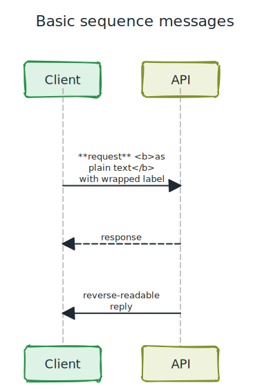

## Participant declarations

Covers explicit participant kinds, aliases, colors, stereotypes, PlantUML order values, and multiline participant blocks.

PlantUML source: [ressources/sequence/puml/participants.puml](ressources/sequence/puml/participants.puml)

```java
@startuml
title Participant declarations
participant Last order 30
participant Middle order 20
actor "External User" as User #LightBlue
boundary Boundary
control Control
entity Entity
database Database
collections Collection
queue Queue
participant First <<service>> #LightGreen order 10
participant "Catalog Service" as Catalog #LightYellow order 15 [
=Catalog
Service
]
User -> First: enters system
First -> Catalog: route by catalog
Catalog -> Boundary: validate
Boundary -> Control: dispatch
Control -> Entity: load
Entity -> Database: query
Database --> Collection: rows
Collection --> Queue: enqueue
Queue --> Last: notify
@enduml
```

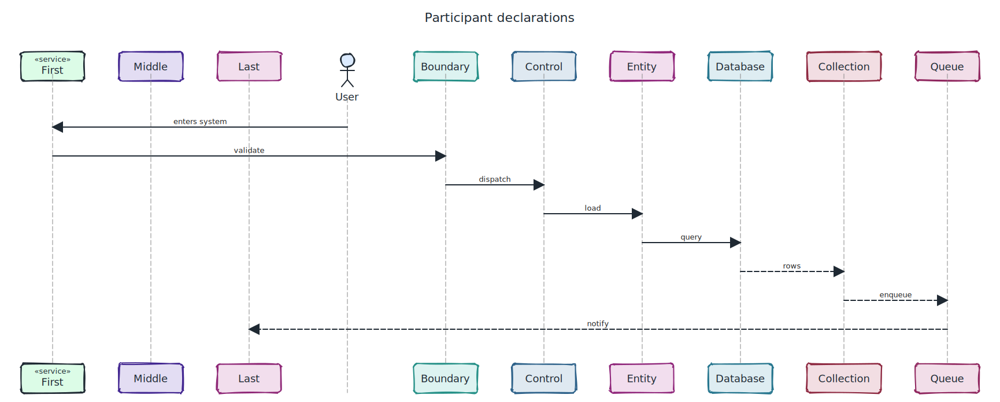

## Arrow variants and endpoints

Covers open, dashed, bidirectional, circle, cross/lost, partial, colored, incoming/outgoing, and short boundary arrows.

PlantUML source: [ressources/sequence/puml/arrow-variants.puml](ressources/sequence/puml/arrow-variants.puml)

```java
@startuml
title Arrow variants and endpoints
participant Alice as A
participant Bob as B
A -> B: filled head
A ->> B: open head
A -->> B: dashed open
A <-> B: bidirectional
A o->o B: circle endpoints
A x-> B: cross at start
A ->x B: lost at end
A -\ B: partial lower head
A -/ B: partial upper head
A -[#red]> B: red arrow
A -(12)> B: slanted arrow
A "source endpoint label with useful wrapping" -> "target endpoint label with useful wrapping" B: central label uses arrowhead-safe width budgeting
[-> A: incoming from diagram edge
A ->]: outgoing to diagram edge
?-> B: short incoming
B ->?: short outgoing
& A -> B: parallel teoz-style message is accepted with simplified geometry
@enduml
```


## Arrow label wrapping

Covers dynamic wrapping for long message labels and endpoint labels using arrow length minus arrowhead size as the available width.

PlantUML source: [ressources/sequence/puml/label-wrapping.puml](ressources/sequence/puml/label-wrapping.puml)

```java
@startuml
title Arrow label wrapping
participant A
participant B
A -> B: a very long request label / with punctuation, useful-breakpoints, and enough words to wrap before it reaches the arrow tips
B "reply source endpoint label with punctuation / fallback" --> "reply target endpoint label with punctuation / fallback" A: a similarly long response label that must push all following items down
== After wrapped labels ==
A -> B: compact follow-up
@enduml
```

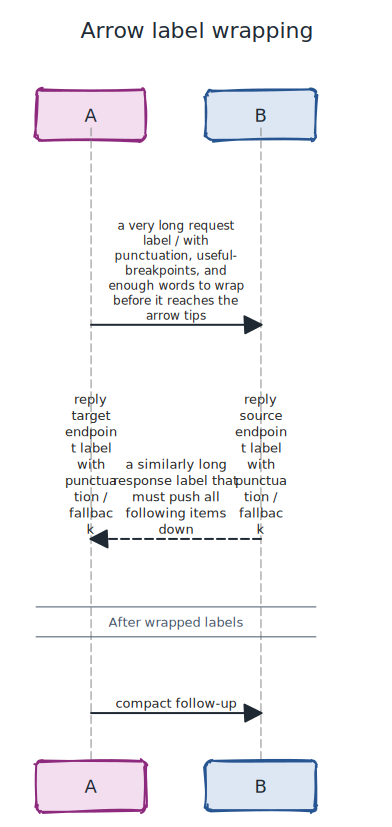

## Notes

Covers side notes, over notes, colored notes, hnote/rnote variants, note across, and block notes.

PlantUML source: [ressources/sequence/puml/notes.puml](ressources/sequence/puml/notes.puml)

```java
@startuml
title Notes and note variants
participant Alice
participant Bob
participant Carol
Alice -> Bob: hello
note left of Alice #aqua: side note
note over Alice, Bob #LightYellow: over two participants
hnote across: hnote across all participants
rnote over Carol
rectangle-style note
with multiple lines
endrnote
/ note over Bob: aligned-note syntax is accepted
Bob -> Carol: continue
@enduml
```

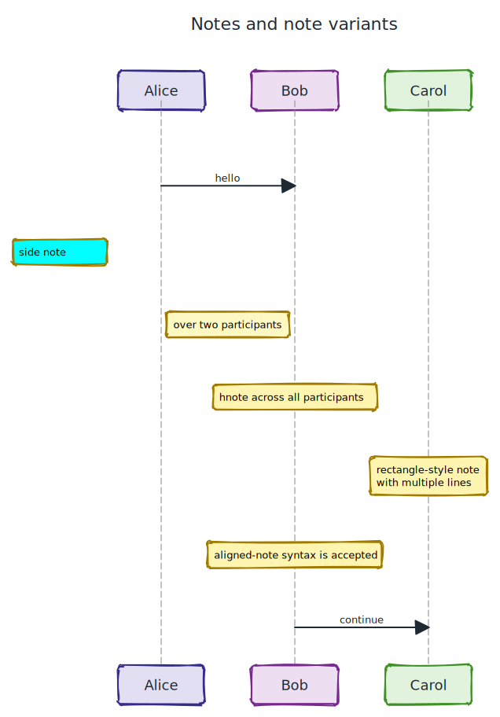

## Combined fragments

Covers opt, loop, alt/else, par/and, break, critical/option, group/option, nesting, operand labels, and uniform fragment margins.

PlantUML source: [ressources/sequence/puml/fragments.puml](ressources/sequence/puml/fragments.puml)

```java
@startuml
title Combined fragments
participant Client
participant Service
participant Audit
Client -> Service: start
opt cache hit
  Service --> Client: cached result
end
loop retry up to 3 times
  Client -> Service: retry
end
alt success
  Service -> Audit: record success
else failure
  Service -> Audit: record failure
end
par primary
  Client -> Service: primary path
and secondary
  Service -> Audit: secondary path
end
break aborted
  Service --> Client: stop
end
critical commit
  Service -> Audit: commit
option rollback
  Audit --> Service: rollback
end
group custom label [secondary label] #LightBlue
  Service -> Audit: grouped
option alternative label
  Audit --> Service: alternative
end
@enduml
```

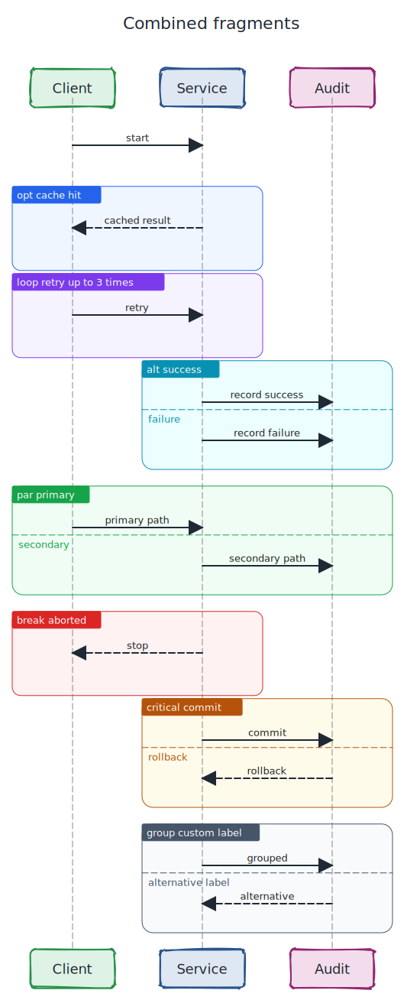

## Timeline decorations

Covers dividers, delays, explicit vertical spaces, and ref frames with the same top/bottom spacing rhythm as fragments.

PlantUML source: [ressources/sequence/puml/timeline-decorations.puml](ressources/sequence/puml/timeline-decorations.puml)

```java
@startuml
title Timeline decorations
participant Alice
participant Bob
== Initialization ==
Alice -> Bob: request
... waiting for callback ...
Bob --> Alice: response
|||
ref over Alice, Bob: external contract
||45||
ref over Bob
multi-line reference
owned by Bob
end ref
== Done ==
Alice -> Bob: final message
@enduml
```

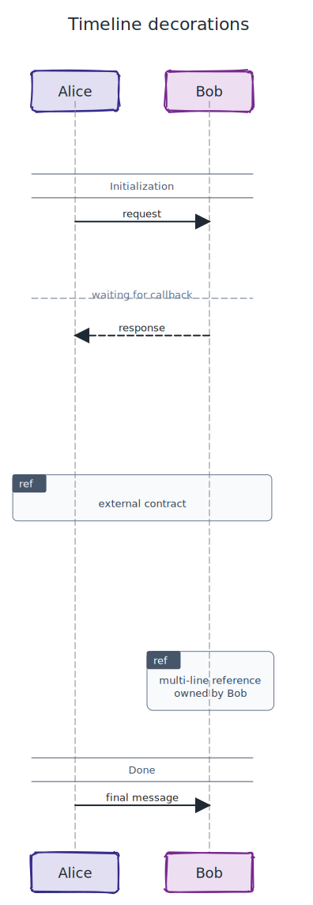

## Lifecycle, activation, create, destroy, return

Covers activate/deactivate/destroy, activation colors, create, shortcut ++/\*\*/!! syntax, and return messages.

PlantUML source: [ressources/sequence/puml/lifecycle.puml](ressources/sequence/puml/lifecycle.puml)

```java
@startuml
title Lifecycle and return
participant User
User -> Worker: start
activate Worker #LightBlue
Worker -> Worker ++ #DarkSalmon: nested work
return nested done
create control Job
Worker -> Job **: create job
Job --> Worker: ready
Worker -> Job !!: delete job
Worker --> User: done
deactivate Worker
@enduml
```

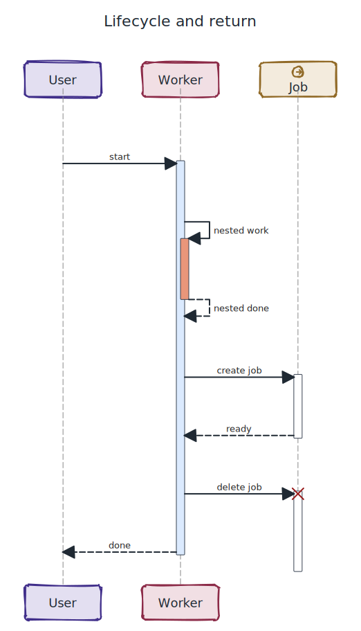

## Autonumber, title, footbox, skinparam

Covers formatted autonumber start/increment, stop/resume, title rendering, hide footbox, and supported sequence presentation skinparams.

PlantUML source: [ressources/sequence/puml/autonumber-title-footbox-skinparam.puml](ressources/sequence/puml/autonumber-title-footbox-skinparam.puml)

```java
@startuml
skinparam sequence {
  ArrowColor #123456
  MessageFontColor #123456
  MessageAlign right
  ResponseMessageBelowArrow true
  ParticipantBackgroundColor #LightYellow
  ParticipantBorderColor #00aa00
  ParticipantFontColor #004400
  LifeLineBorderColor #0000ff
  NoteBackgroundColor #LightYellow
  NoteBorderColor #red
  NoteFontColor #blue
  GroupBackgroundColor #LightGreen
  GroupBorderColor #green
  GroupFontColor #purple
  DividerBorderColor #red
  ActivationBackgroundColor #LightBlue
  ActorStyle box
}
hide footbox
title Styled numbered flow
autonumber 10 5 "<b>[000]"
actor Alice
participant Bob
== Styled Divider ==
Alice -> Bob ++: first numbered
note right of Bob: styled note
autonumber stop
Bob -> Alice: unnumbered
autonumber resume
group styled group [secondary label]
Alice --> Bob --: numbered again
end
@enduml
```

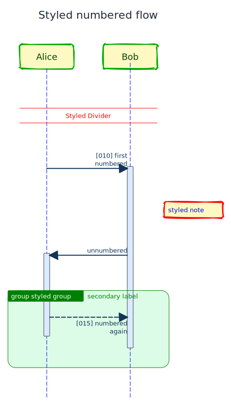

## Header, footer, mainframe, newpage, hide unlinked

Covers global sequence decorations, single-canvas newpage rendering, hide unlinked pruning, and solid lifeline style.

PlantUML source: [ressources/sequence/puml/global-presentation.puml](ressources/sequence/puml/global-presentation.puml)

```java
@startuml
  !pragma teoz true
header Sequence coverage header
footer Sequence coverage footer
mainframe Sequence coverage frame
skinparam sequence LifeLineStrategy solid
hide unlinked
title Global presentation
participant Alice
participant Bob
participant Unused
partition "single-canvas teoz partition" {
Alice -> Bob: first page message
newpage Next page marker
& Bob --> Alice: second page response
}
@enduml
```

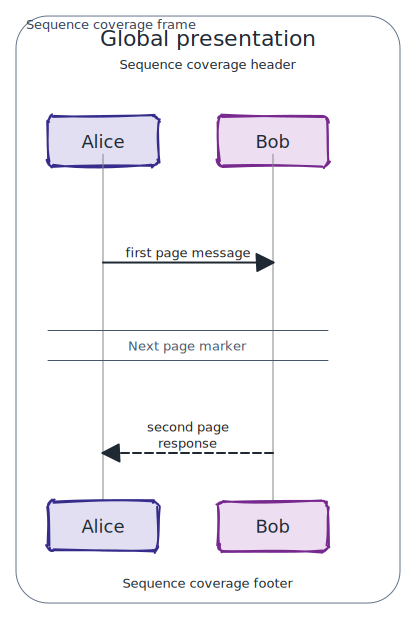

## Participant boxes

Covers PlantUML box/end box participant grouping with labels and background colors.

PlantUML source: [ressources/sequence/puml/participant-boxes.puml](ressources/sequence/puml/participant-boxes.puml)

```java
@startuml
title Participant grouping boxes
box "Internal Service" #LightBlue
participant API
participant Worker
end box
box "External" #LightGreen
actor User
end box
User -> API: request
API -> Worker: delegate
Worker --> API: result
API --> User: response
@enduml
```

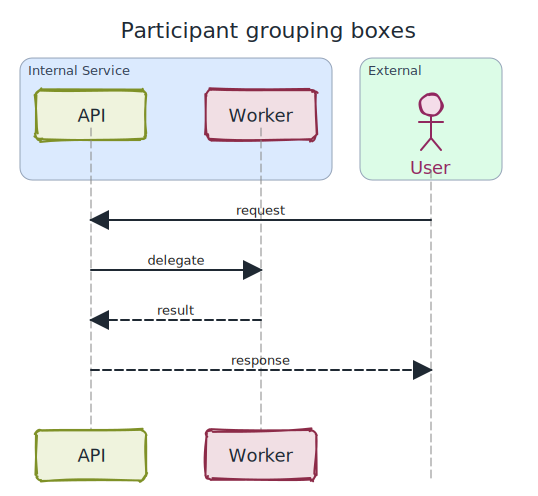

## Feedback loops with participant assets

Covers feedback-loop traffic while rendering actor/boundary/control/entity/database/collections/queue symbols in the same sequence.

PlantUML source: [ressources/sequence/puml/feedback-loops-assets.puml](ressources/sequence/puml/feedback-loops-assets.puml)

```java
@startuml
title Feedback loops with assets
actor User
boundary Gateway
control Orchestrator
entity Domain
database Ledger
collections Views
queue Events

loop request-response loop
  User -> Gateway: submit
  Gateway -> Orchestrator ++: dispatch
  Orchestrator -> Domain: validate
  Domain -> Ledger: write
  Ledger --> Views: project
  Views --> Events: enqueue
  Events --> Gateway: ack
  Gateway --> User --: response
end
@enduml
```

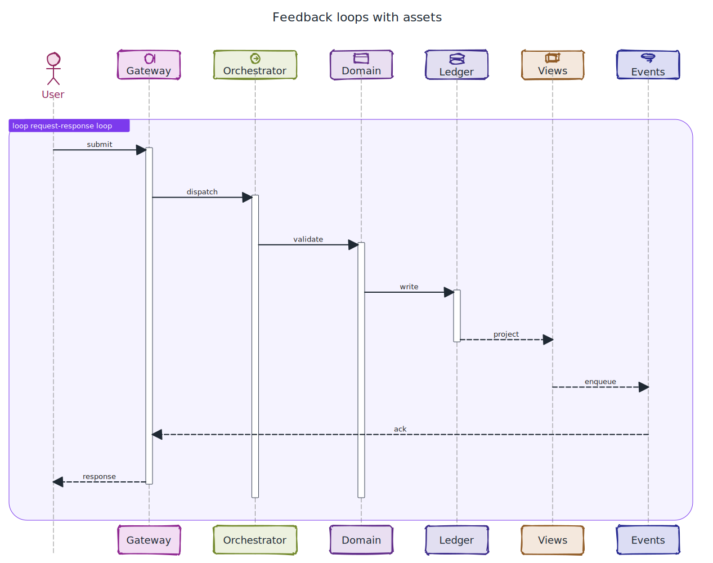

## Combination: service flow

End-to-end combination of participant boxes, arrows, activations, fragments, notes, refs, dividers, delays, and autonumber.

PlantUML source: [ressources/sequence/puml/combination-flow.puml](ressources/sequence/puml/combination-flow.puml)

```java
@startuml
skinparam sequence ArrowColor #334155
title Combined service flow
autonumber
box "Application" #LightBlue
actor User
participant API
participant Worker
end box
database DB
== Request ==
User -> API ++: submit
note right of API #LightYellow: validation happens here
opt valid request
  API -> Worker ++: dispatch
  ref over Worker, DB: repository contract
  Worker -> DB: load
  ... db latency ...
  DB --> Worker: rows
  return worker done
else invalid request
  API --> User: validation error
end
API --> User --: response
@enduml
```

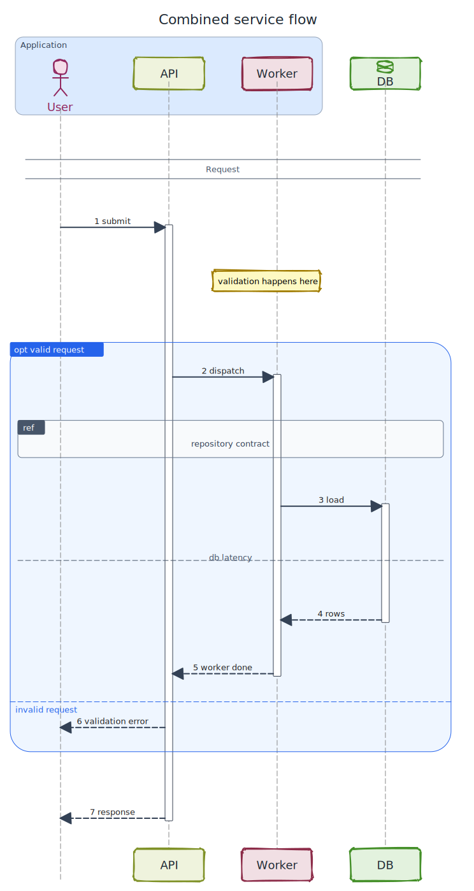

## Combination: branching and cleanup

Stress-style combination with nested fragments, lifecycle shortcuts, create/destroy, notes across, and external arrows.

PlantUML source: [ressources/sequence/puml/combination-errors.puml](ressources/sequence/puml/combination-errors.puml)

```java
@startuml
title Combined branching and cleanup
participant Client
participant Gateway
participant Runtime
participant Audit
[-> Client: inbound signal
Client -> Gateway ++: call
alt normal path
  Gateway -> Runtime ++: execute
  hnote across: runtime section spans every lifeline
  loop every item
    Runtime -> Audit: audit item
  end
  return execution ok
else failed path
  Gateway -> Runtime **: create fallback
  Runtime -> Audit: failure audit
  Gateway -> Runtime !!: cleanup fallback
end
Gateway --> Client --: done
Client ->]: outbound signal
@enduml
```

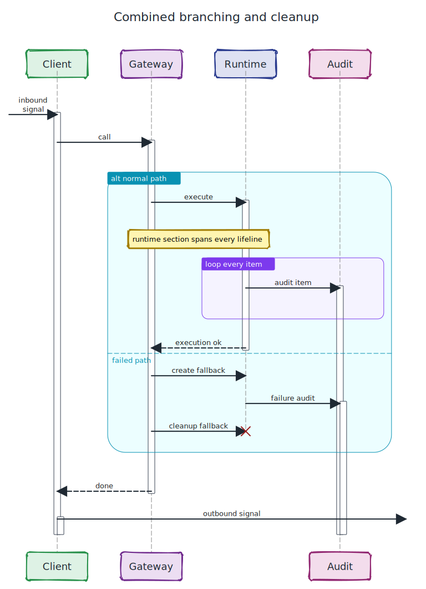
