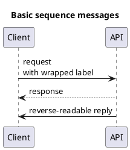
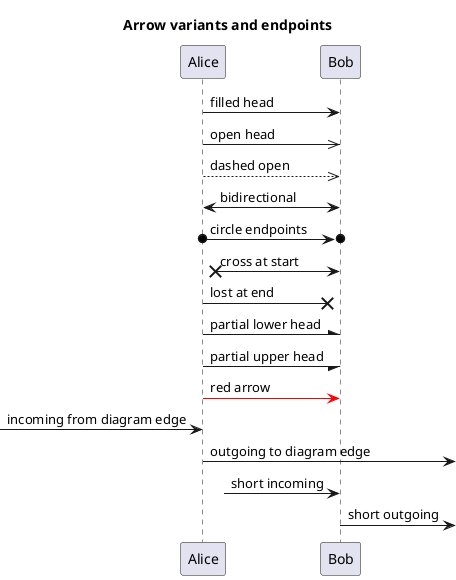
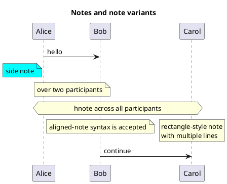
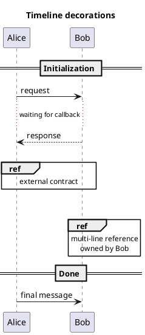
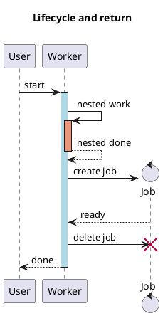
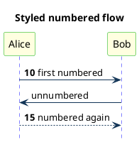
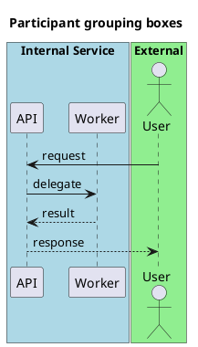
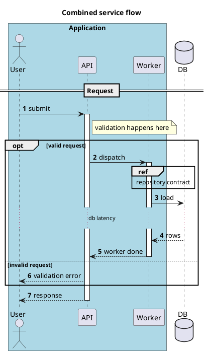
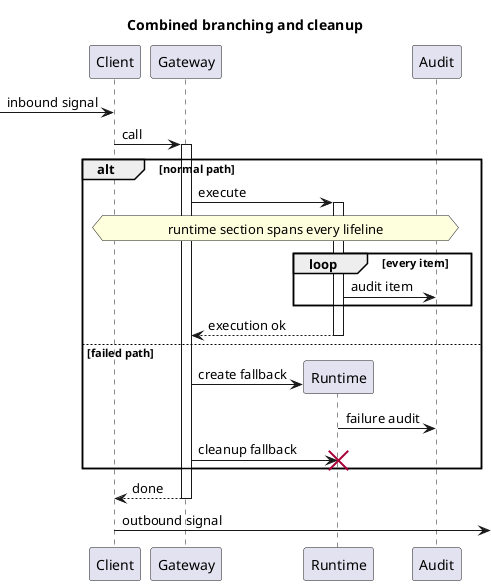

# Sequence Diagram Component Coverage

This page is generated by `docs/scripts/build-sequence-coverage.mjs` from the same examples used by `tests/sequence_components.test.mjs`.

The goal is to keep PlantUML sequence syntax, the object-oriented sequence model, layout spacing, and rendered SVG output reviewable together.

## Support Matrix

| PlantUML component                          | Status    | Notes                                                                                             |
| ------------------------------------------- | --------- | ------------------------------------------------------------------------------------------------- |
| Basic messages (->, -->, <-, <--)           | supported | Compact and spaced forms are parsed.                                                              |
| Participant declarations and kinds          | supported | participant, actor, boundary, control, entity, database, collections, queue.                      |
| Aliases, colors, stereotypes, order         | supported | Participant order is applied during layout.                                                       |
| Multiline participant block ([ ... ])       | not yet   | Not implemented as a dedicated participant-title block.                                           |
| Self messages                               | supported | Rendered as loop arrows with wrapped labels.                                                      |
| Message text alignment/response below arrow | tolerated | Related skinparams are currently ignored.                                                         |
| Actor style skinparam                       | tolerated | Actor is rendered as a deterministic stick figure.                                                |
| Arrow variants and colors                   | partial   | Endpoint semantics are modeled; unsupported heads are approximated with closest Excalidraw heads. |
| Autonumber                                  | partial   | Start/increment/stop/resume supported; DecimalFormat/HTML number formatting is simplified.        |
| Title                                       | supported | Single-line title supported and rendered topmost.                                                 |
| Header/footer/newpage                       | not yet   | Multi-page/header/footer rendering is outside the current single-canvas model.                    |
| Combined fragments                          | supported | opt, loop, alt/else, par/and, break, critical/option, group/option.                               |
| Group secondary label and colored groups    | partial   | Labels render as text; separate secondary label/color semantics are simplified.                   |
| Partition/teoz                              | not yet   | Teoz parallel layout is not implemented.                                                          |
| Notes                                       | supported | left/right/over/across, block notes, colors, hnote/rnote metadata.                                |
| Creole/HTML markup                          | partial   | Text is rendered safely as plain text, not rich markup.                                           |
| Separators, refs, delays, spaces            | supported | Uniform timeline margins are applied.                                                             |
| Activation/deactivation/destroy             | supported | Explicit and shortcut lifecycle markers render activation bars/destroy markers.                   |
| Return                                      | supported | Return messages target the caller of the most recent activation.                                  |
| Create                                      | supported | create and \*\* lifecycle creation are modeled.                                                   |
| Incoming/outgoing/short arrows              | supported | [/] and ? anchors are modeled as boundary endpoints.                                              |
| Anchors/duration/slanted/parallel teoz      | partial   | Slant token is stored/rendered as endpoint y-offset; anchors/duration/parallel are not full teoz. |
| Participant boxes                           | supported | box/end box groups render behind participant heads.                                               |
| Hide footbox                                | supported | hide footbox suppresses tail participant boxes.                                                   |
| Sequence skinparams                         | partial   | Supported: arrow, participant background/border, lifeline color.                                  |
| Hide unlinked                               | not yet   | All declared participants are kept.                                                               |
| Mainframe                                   | not yet   | No first-class mainframe element yet.                                                             |
| Solid lifeline style                        | not yet   | Current lifelines are dashed except through existing style color support.                         |

## Rendered Examples

## Basic messages

Covers normal sync arrows, dashed replies, reverse-readable arrows, compact arrows without spaces, and multiline message labels.

PlantUML source: [docs/ressources/sequence/puml/basics.puml](docs/ressources/sequence/puml/basics.puml)




## Participant declarations

Covers explicit participant kinds, aliases, colors, stereotypes, and PlantUML order values.

PlantUML source: [docs/ressources/sequence/puml/participants.puml](docs/ressources/sequence/puml/participants.puml)

```puml
@startuml
title Participant declarations
participant Last order 30
participant Middle order 20
actor "External User" as User #LightBlue
boundary Boundary
control Control
entity Entity
database Database
collections Collection
queue Queue
participant First <<service>> #LightGreen order 10
User -> First: enters system
First -> Boundary: validate
Boundary -> Control: dispatch
Control -> Entity: load
Entity -> Database: query
Database --> Collection: rows
Collection --> Queue: enqueue
Queue --> Last: notify
@enduml
```


## Arrow variants and endpoints

Covers open, dashed, bidirectional, circle, cross/lost, partial, colored, incoming/outgoing, and short boundary arrows.

PlantUML source: [docs/ressources/sequence/puml/arrow-variants.puml](docs/ressources/sequence/puml/arrow-variants.puml)




## Notes

Covers side notes, over notes, colored notes, hnote/rnote variants, note across, and block notes.

PlantUML source: [docs/ressources/sequence/puml/notes.puml](docs/ressources/sequence/puml/notes.puml)




## Combined fragments

Covers opt, loop, alt/else, par/and, break, critical/option, group/option, nesting, operand labels, and uniform fragment margins.

PlantUML source: [docs/ressources/sequence/puml/fragments.puml](docs/ressources/sequence/puml/fragments.puml)

```puml
@startuml
title Combined fragments
participant Client
participant Service
participant Audit
Client -> Service: start
opt cache hit
  Service --> Client: cached result
end
loop retry up to 3 times
  Client -> Service: retry
end
alt success
  Service -> Audit: record success
else failure
  Service -> Audit: record failure
end
par primary
  Client -> Service: primary path
and secondary
  Service -> Audit: secondary path
end
break aborted
  Service --> Client: stop
end
critical commit
  Service -> Audit: commit
option rollback
  Audit --> Service: rollback
end
group custom label
  Service -> Audit: grouped
option alternative label
  Audit --> Service: alternative
end
@enduml
```


## Timeline decorations

Covers dividers, delays, explicit vertical spaces, and ref frames with the same top/bottom spacing rhythm as fragments.

PlantUML source: [docs/ressources/sequence/puml/timeline-decorations.puml](docs/ressources/sequence/puml/timeline-decorations.puml)




## Lifecycle, activation, create, destroy, return

Covers activate/deactivate/destroy, activation colors, create, shortcut ++/\*\*/!! syntax, and return messages.

PlantUML source: [docs/ressources/sequence/puml/lifecycle.puml](docs/ressources/sequence/puml/lifecycle.puml)




## Autonumber, title, footbox, skinparam

Covers autonumber start/increment, stop/resume, title rendering, hide footbox, and supported sequence color skinparams.

PlantUML source: [docs/ressources/sequence/puml/autonumber-title-footbox-skinparam.puml](docs/ressources/sequence/puml/autonumber-title-footbox-skinparam.puml)




## Participant boxes

Covers PlantUML box/end box participant grouping with labels and background colors.

PlantUML source: [docs/ressources/sequence/puml/participant-boxes.puml](docs/ressources/sequence/puml/participant-boxes.puml)




## Combination: service flow

End-to-end combination of participant boxes, arrows, activations, fragments, notes, refs, dividers, delays, and autonumber.

PlantUML source: [docs/ressources/sequence/puml/combination-flow.puml](docs/ressources/sequence/puml/combination-flow.puml)




## Combination: branching and cleanup

Stress-style combination with nested fragments, lifecycle shortcuts, create/destroy, notes across, and external arrows.

PlantUML source: [docs/ressources/sequence/puml/combination-errors.puml](docs/ressources/sequence/puml/combination-errors.puml)




