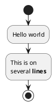
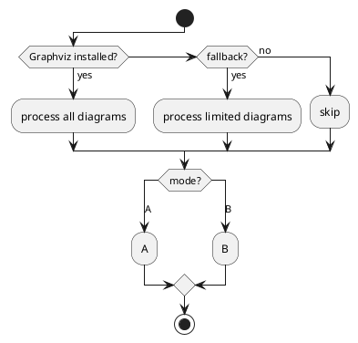
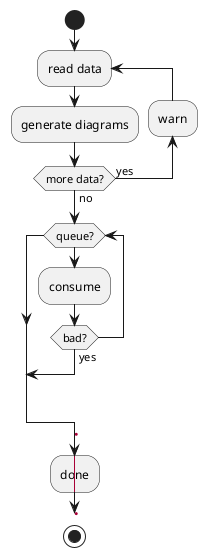
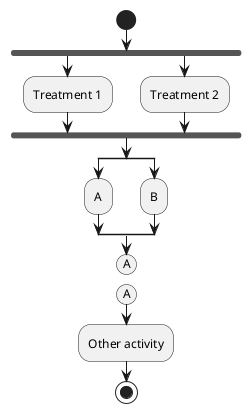
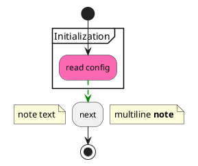
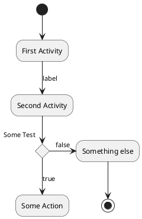

# Ticket: Activity-Diagramme mit vollständiger PlantUML-Unterstützung

## Ziel und Scope

Activity-Diagramme sollen die moderne Beta-Syntax vollständig unterstützen und die Legacy-Syntax als Kompatibilitätspfad einplanen. Der Diagrammtyp braucht ein eigenes Flow-Modell statt einer reinen Box/Connection-Sammlung, weil Reihenfolge, Blöcke, Mergepunkte und parallele Pfade semantisch sind.

## Offizielle Quellen

- https://plantuml.com/de/activity-diagram-beta
- https://plantuml.com/de/activity-diagram-legacy
- https://plantuml.com/de/commons
- https://plantuml.com/de/style
- https://plantuml.com/de/creole

## Feature-Inventar mit PUML-Beispielen

### Aktionen, Start, Stop und End

Akzeptieren: `:action;`, multiline action, Creole, `start`, `stop`, `end`, simple list forms `- Action` and `* Action` including nested `**` levels.

### Conditions, Elseif und Switch

Akzeptieren: `if/then/else/elseif/endif`, `is`, `equals`, vertical if pragma, `switch/case/endswitch`, branch labels and condition end styles.

### Loops, Break, Kill, Detach, Goto

Akzeptieren: `repeat`, `repeat while`, `backward`, `while/endwhile`, `break`, `kill`, `detach`, experimental `label/goto` with explicit risk note.

### Fork, Split, Connector und Swimlanes

Akzeptieren: `fork/fork again/end fork`, `split/split again/end split`, hidden input splits, output splits with kill/detach, connectors `(A)`, colored connectors and swimlanes with colors.

### Notes, Arrows, Colors, Partitions und Shapes

Akzeptieren: partitions, floating/anchored notes, arrow labels/styles, `link #blue`, multiple colored arrows, SDL separators `| < > / ] }`, UML shape stereotypes like `<<object>>`, `<<sendSignal>>`, `<<timeEvent>>`.

### Legacy-Syntax

Akzeptieren: `(*)`, `(*top)`, legacy arrows/labels, legacy `if`, synchronization bars `===B1===`, legacy partitions, notes and `activityShape octagon`.

## Parser-Plan

- Eigenes activity plugin set mit block stack für control-flow constructs.
- Moderne Syntax und Legacy-Syntax in separaten plugins normalisieren.
- Parser erzeugt ein Activity-flow model; renderer darf Kontrollfluss nicht aus Textreihenfolge erraten.

## Modell-Plan

- Neue Modelle für ActivityNode, ActivityEdge, ActivityBlock, Decision, Loop, Fork, Split, Swimlane, Partition, Connector.
- Gemeinsame ArrowLine/ArrowLabel für sichtbare Kanten wiederverwenden.
- Notes als attachable annotations an Nodes oder Edges.

## Layout-Plan

- Eigener deterministischer flow layout pass; ELK kann für Teilgraphen geprüft werden, darf aber keine Semantik verlieren.
- Swimlanes und partitions geben Layout-Regionen vor.
- Fork/split branches brauchen stabile column/row allocation.

## Renderer-Plan

- Activity shapes: rounded action, diamond, bar, connector circle, SDL variants, stop/end symbols.
- Arrow styles, multiple color segments and note rendering in Excalidraw/SVG.
- Creole and links through shared text renderer.

## Dokumentation und Tests

- Examples: `basic`, `conditions`, `loops`, `parallel`, `swimlanes`, `legacy`, `styling`, `security`.
- Tests should assert flow graph semantics before rendering.

## Modul-eigene Artefaktstruktur

Dieses Ticket plant ein eigenes `activity`-Diagrammtyp-Modul unter `src/diagrams/activity/`. Parser, Layout, Renderer, Security-Profil, Tests, Doku, Szenarien und modulnahe Assets gehoeren physisch in diesen Modulbereich.

`ModuleDocsManifest` und `ModuleTestManifest` verweisen auf diese Modulpfade, statt zentrale Docs-/Testlisten als Quelle der Wahrheit zu verwenden. Generated Review-Artefakte werden modulgespiegelt unter `docs/ressources/generated/modules/activity/{puml,excalidraw,svg,png}/<feature>/` erzeugt. Root-Tests bleiben fuer Public API, Cross-Module-Verhalten, Security-wide Gates und Migration reserviert.

## Architekturkompatibilitätsprüfung

- Requires new diagram model class rather than forcing Activity into `Diagram` boxes only.
- Still compatible with parse/layout/render layering and shared arrow/style/text infrastructure.

## Validierungsloop pro Ticket

1. Modern and legacy examples parse to normalized flow model.
2. Layout snapshots for branches, loops and swimlanes are deterministic.
3. SVG escaping tests for action text, notes and arrow labels.
4. Run `npm test`, `npm run typecheck`, `npm run format:check`.

## Akzeptanzkriterien

- Modern Activity syntax is feature-complete.
- Legacy Activity syntax is either supported or each unsupported construct is explicitly documented.
- Flow semantics are tested at model level.
