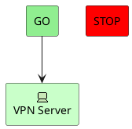
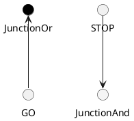
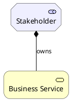

# Ticket: ArchiMate-Diagramme mit vollständiger PlantUML-Unterstützung

## Ziel und Scope

ArchiMate-Diagramme sollen native `archimate`-Elemente, ArchiMate-Stdlib-Makros, Sprites, Layer-Farben und Relationship-Makros als PlantUML-kompatible Architekturdiagramme abbilden. Das Ticket trennt native Syntax von Stdlib-Makroexpansion, damit keine externe Dateisystem-/Netzwerkabhängigkeit im Parser entsteht.

## Offizielle Quellen

- https://plantuml.com/de/archimate-diagram
- https://plantuml.com/de/sprite
- https://plantuml.com/de/preprocessing
- https://plantuml.com/de/color

## Feature-Inventar mit PUML-Beispielen

### Native ArchiMate-Elemente

Akzeptieren: `archimate`, color categories `Business`, `Application`, `Motivation`, `Strategy`, `Technology`, `Physical`, `Implementation`, aliases and stereotypes carrying icon names.

### Junctions über Circle/Macros

Akzeptieren: macro-expanded circle junctions as ordinary shapes after preprocessing support.

### Stdlib-Makros für Elemente und Beziehungen

Akzeptieren: Archimate Stdlib as future macro-preprocessing target; relation types Access, Aggregation, Assignment, Association, Composition, Flow, Influence, Realization, Serving, Specialization, Triggering and directions Up/Down/Left/Right.

### Sprites und Layer Icons

```plantuml
@startuml
sprite $bProcess jar:archimate/business-process
rectangle "Handle claim" as HC <<$bProcess>> #Business
@enduml
```

Akzeptieren: built-in sprite references as resolved icon metadata or safe fallback text; no implicit jar/file loading in renderer.

## Parser-Plan

- Native `archimate` as diagram-shape plugin reusing component/deployment declarations.
- Stdlib macros depend on the preprocessing ticket; until then, classify as unsupported macro expansion with explicit diagnostics.
- Stereotype icon names preserved in model metadata.

## Modell-Plan

- Reuse `Diagram`/`Box`/`Connection`; add `archimateLayer`, `archimateType`, optional `iconRef`.
- Macro-expanded ArchiMate elements should normalize to ordinary boxes and connections.

## Layout-Plan

- ELK layout with ArchiMate-specific default colors and shape/icon sizing.
- Junction circles have fixed dimensions.

## Renderer-Plan

- Render layer colors consistently and show safe icon fallbacks.
- SVG escaping mandatory for descriptions and macro labels.

## Modul-eigene Artefaktstruktur

Dieses Ticket plant ein eigenes `archimate`-Diagrammtyp-Modul unter `src/diagrams/archimate/`. Parser, Layout, Renderer, Security-Profil, Tests, Doku, Szenarien und modulnahe Assets gehoeren physisch in diesen Modulbereich.

`ModuleDocsManifest` und `ModuleTestManifest` verweisen auf diese Modulpfade, statt zentrale Docs-/Testlisten als Quelle der Wahrheit zu verwenden. Generated Review-Artefakte werden modulgespiegelt unter `docs/ressources/generated/modules/archimate/{puml,excalidraw,svg,png}/<feature>/` erzeugt. Root-Tests bleiben fuer Public API, Cross-Module-Verhalten, Security-wide Gates und Migration reserviert.

## Architekturkompatibilitätsprüfung

- Native syntax is compatible with existing box/connection architecture.
- Full Stdlib support requires preprocessing and sprite infrastructure first.

## Validierungsloop pro Ticket

1. Native archimate examples parse and render.
2. Stdlib macro examples either expand through preprocessor or emit clear unsupported diagnostics.
3. Layer colors and relation arrows match shared style behavior.
4. Run `npm test`, `npm run typecheck`, `npm run format:check`.

## Akzeptanzkriterien

- Native ArchiMate element syntax works.
- Stdlib macro path is planned and tested as supported or explicitly gated.
- Sprite/icon references do not trigger unsafe file/network access.
