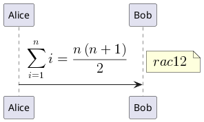
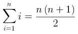
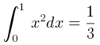

# Ticket: AsciiMath- und LaTeX-Unterstützung

## Ziel und Scope

PlantUML supports mathematical expressions through `<math>`, `<latex>`, `@startmath` and `@startlatex`. This ticket plans safe parsing, model representation and rendering/fallback strategy.

## Offizielle Quellen

- https://plantuml.com/de/ascii-math

## Feature-Inventar mit PUML-Beispielen

### Inline Math und LaTeX

Akzeptieren: inline `<math>...</math>` and `<latex>...</latex>` inside labels/notes.

### Standalone Math Diagrams

Akzeptieren: standalone blocks and multiline formula content.

## Parser-Plan

- Inline parser recognizes math/latex tags as text runs.
- Standalone parser stores formula source without executing external renderers by default.

## Modell-Plan

- Inline text run type `math`/`latex`; standalone `MathDiagram` model with language and source.

## Layout-Plan

- Initial fallback can measure formula as text; full formula rendering needs chosen math renderer.

## Renderer-Plan

- Safe fallback: render formula source in monospace text with explicit styling.
- Full rendering requires dependency/security review and deterministic output.

## Modul-eigene Artefaktstruktur

Dieses Ticket plant ein eigenes `math`-Diagrammtyp-Modul unter `src/diagrams/math/`. Parser, Layout, Renderer, Security-Profil, Tests, Doku, Szenarien und modulnahe Assets gehoeren physisch in diesen Modulbereich.

`ModuleDocsManifest` und `ModuleTestManifest` verweisen auf diese Modulpfade, statt zentrale Docs-/Testlisten als Quelle der Wahrheit zu verwenden. Generated Review-Artefakte werden modulgespiegelt unter `docs/ressources/generated/modules/math/{puml,excalidraw,svg,png}/<feature>/` erzeugt. Root-Tests bleiben fuer Public API, Cross-Module-Verhalten, Security-wide Gates und Migration reserviert.

## Architekturkompatibilitätsprüfung

- Inline text model is compatible with shared Creole renderer.
- External math rendering is a separate risk and should not be hidden inside SVG output.

## Validierungsloop pro Ticket

1. Parse inline and standalone examples.
2. Verify safe fallback SVG escaping.
3. If renderer dependency is added, audit and deterministic snapshot tests.
4. Run standard gate.

## Akzeptanzkriterien

- Math/LaTeX syntax is preserved and safely rendered or clearly marked as fallback.
