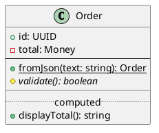
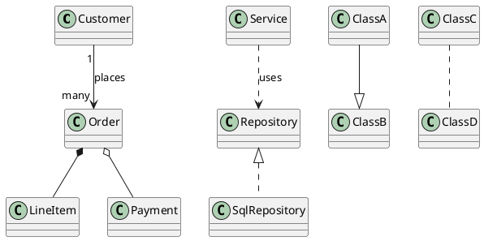
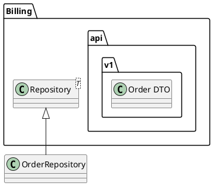
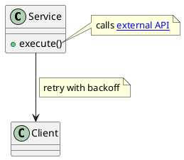
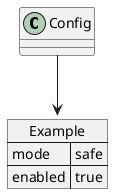

# Ticket: Class-Diagramme mit vollständiger PlantUML-Unterstützung

## Ziel und Scope

Class-Diagramme sollen die offizielle PlantUML-Syntax für Klassen, Interfaces, Enums, Records, Member, Beziehungen, Pakete, Notizen und Styling vollständig unterstützen. Die bestehende Klassendiagramm-Arbeit aus dem oberen Chat wird als Ausgangspunkt genutzt und zu einem systematischen Parser-/Modell-/Layout-/Renderer-Konzept verdichtet.

## Offizielle Quellen

- https://plantuml.com/de/class-diagram
- https://plantuml.com/de/commons
- https://plantuml.com/de/style
- https://plantuml.com/de/skinparam
- https://plantuml.com/de/creole
- https://plantuml.com/de/color
- https://plantuml.com/de/link
- https://plantuml.com/de/json

## Feature-Inventar mit PUML-Beispielen

### Klassenartige Deklarationen

```plantuml
@startuml
class Customer
abstract class AbstractRepository
interface Serializable
enum Status { ACTIVE; DISABLED }
annotation Audited
record Money
@enduml
```

Akzeptieren: `class`, `abstract class`, `interface`, `enum`, `annotation`, `record`, quoted names, Aliase, Stereotypes und implizite Deklaration durch Beziehungen.

### Member, Compartments und Separatoren



Akzeptieren: Attribute, Methoden, Sichtbarkeit `+ - # ~`, static/abstract classifier, Separatoren `--`, `..`, `==`, `__`, lange Signaturen, Wrapping und leere Compartments.

### Beziehungstypen und Kardinalitäten



Akzeptieren: Association, dependency, inheritance, realization, composition, aggregation, direction keywords, labels, cardinalities left/right, hidden arrows, line colors/styles und head/tail variants.

### Generics, Namespaces und Packages



Akzeptieren: generische Namen, quoted aliases, package/namespace nesting, fully qualified references, package styles und Cross-Package-Verbindungen.

### Notes, Links und Member-Ziele



Akzeptieren: Note an Klasse, Note an Member, floating note, `note on link`, multiline note, Creole, Links und sichere SVG-Ausgabe.

### Hide, Show, Remove und Filter

```plantuml
@startuml
class User { +id; -password }
class AuditLog
hide empty members
hide User methods
show User fields
remove AuditLog
@enduml
```

Akzeptieren: `hide/show/remove`, `empty members`, `fields`, `methods`, `stereotype`, konkrete Klassenfilter, Packagefilter und Interaktion mit Rendering/Sizing.

### Stereotypes, Visibility Icons und Style

```plantuml
@startuml
<style>
classDiagram {
  class { RoundCorner 8; BackgroundColor #F8FBFF }
  .entity { LineColor #225588; FontStyle bold }
}
visibilityIcon {
  protected { BackgroundColor DarkGoldenRod }
}
</style>
class User <<entity>> {
  #token: string
}
@enduml
```



Akzeptieren: Stereotype-Styles, `visibilityIcon`, CSS-like Style, deprecated `skinparam`, inline style und automatische Text-/Member-Farbkontraste.

### Association Class und Lollipop

```plantuml
@startuml
class Student
class Course
Student "*" -- "*" Course : enrollment
(Student, Course) .. Enrollment
class Enrollment { +date }
class Service
Service ()- Interface
@enduml
```

Akzeptieren: Association-Class-Bezüge, lollipop Interfaces, Interface-Notation und stabile Verbindung der zusätzlichen Klasse an die Association.

### JSON/YAML- und Mixed Blocks



Akzeptieren: `allowmixing` mit Datenblöcken als Boxen; JSON/YAML-Syntax wird über gemeinsame Datenparser behandelt.

## Parser-Plan

- `class_block` in Deklarationen, Member-Kompartimente, Stereotypes und inline styles gliedern.
- Connection-Parsing an das gemeinsame Arrow-Modell anbinden und Cardinality/Label-Positionen explizit speichern.
- Hide/show/remove als eigene Modell- oder Renderfilterphase planen, damit Parser keine Layoutentscheidungen trifft.
- Member-Zielreferenzen wie `Class::member` quote-aware scannen.
- Generics und quoted names ohne ReDoS-fällige Regexe parsen.

## Modell-Plan

- `Box` für class-like shapes um `classKind`, `members`, `compartments`, `stereotypes`, `visibilityIconPolicy` und `filters` erweitern oder bestehende Felder normalisieren.
- Member als strukturierte Werte speichern: visibility, classifier, name, signature, rawLabel, style.
- Beziehungen weiter als `Connection` plus `DiagramArrow`; Cardinalities und role labels als eigene Labelpositionen.
- Association classes benötigen eine stabile Referenz auf die betroffene Connection.

## Layout-Plan

- Sizing für Member-Compartments in `src/general/layout/sizing.mjs` konsolidieren.
- ELK bleibt für Graphlayout zuständig; association classes und notes werden als abhängige Knoten angebunden.
- Hide/show/remove beeinflusst Sizing vor Layout, damit unsichtbare Members keinen Platz reservieren.
- Lange Member-Signaturen nutzen `wrapMemberSignature` und die vorhandenen Textmesshelfer.

## Renderer-Plan

- Excalidraw: compartments, visibility icons, member text, stereotypes, abstract/static emphasis und association-class connectors deterministisch erzeugen.
- SVG: Text, Links, Notes und stereotype labels vollständig escapen.
- PNG: aus SVG erzeugen; keine neue Rendersemantik.
- Icons/Sprites in Labels über gemeinsame Inline-Asset-Schicht abbilden.

## Modul-eigene Artefaktstruktur

Class ist ein eigenes Diagrammtyp-Modul unter `src/diagrams/class/` und besitzt seine fachlichen Artefakte selbst:

```text
src/diagrams/class/
  plugins/
  tests/
    unit.test.mjs
    integration.test.mjs
    security.test.mjs
    scenarios/
      declarations/
      members/
      relationships/
      packages/
      notes/
      filters/
      styling/
      association-class/
      security/
    fixtures/
    expected/
  docs/
    index.template.md.njk
    partials/
    features/
      declarations/scenarios/*.puml
      members/scenarios/*.puml
      relationships/scenarios/*.puml
      packages/scenarios/*.puml
      filters/scenarios/*.puml
      styling/scenarios/*.puml
    assets/
```

Generated Review-Artefakte werden modulgespiegelt erzeugt:

```text
docs/ressources/generated/modules/class/
  puml/<feature>/*.puml
  excalidraw/<feature>/*.excalidraw
  svg/<feature>/*.svg
  png/<feature>/*.png
```

`ModuleDocsManifest` und `ModuleTestManifest` verweisen auf diese physischen Pfade. Root-Tests pruefen nur noch cross-module Contracts, Public API, Security-wide Verhalten und Migration.

## Dokumentations- und Beispielplan

- Class-Coverage-Beispiele analog zur Sequence-Coverage anlegen, aber als modul-eigene PUML-Szenarien unter `src/diagrams/class/docs/features/<feature>/scenarios/` und `src/diagrams/class/tests/scenarios/<feature>/`.
- Das große Fluffle-Klassendiagramm als modul-eigene Stress-Regression erhalten und in `src/diagrams/class/tests/fixtures/` sowie die Coverage einordnen.
- Ein Class-Haupttemplate `src/diagrams/class/docs/index.template.md.njk` erstellt Featuretabellen, bekannte Luecken, Security-Hinweise und Links auf generierte Review-Artefakte.
- Generated resources liegen unter `docs/ressources/generated/modules/class/`.
- README-Änderungen nur über Template, falls öffentlich beworben.

## Test- und Sicherheitsplan

- Parser-Tests für jeden class kind, member classifier, relationship type und hide/show/remove liegen im Class-Modul.
- Renderer-Tests für compartments, visibility icons, long members, stereotypes, association classes und hidden root/floating behavior liegen im Class-Modul.
- Security-Tests für HTML/SVG-Injection in class names, member names, notes, links und cardinalities liegen im Class-Modul; Root-Security-Tests behalten nur cross-module Gates.
- Performance-Test für viele Mitglieder und sehr lange generische Typnamen liegt als Class-Stress-Fixture im Modul.

## Architekturkompatibilitätsprüfung

- Kompatibel mit der bestehenden Component-/Class-Struktur, solange class-specific fields in `Box` diagrammneutral genug bleiben oder klar typisiert sind.
- Der vorhandene Excalidraw/SVG-Renderer kann erweitert werden, ohne PlantUML-Syntax zu lesen.
- Gemeinsame Style-, Color-, Link- und Creole-Infrastruktur ist Pflicht, sonst würde Class-Diagramm-Verhalten von Component/Deployment abweichen.
- Kompatibel mit der neuen Modul-Ownership, weil Class-spezifische Tests, Doku, Stress-Fixtures und Generated Outputs dem Class-Modul gehoeren und von Root-Pipelines nur eingesammelt werden.

## Validierungsloop pro Ticket

1. Offizielle Featuregruppen gegen PlantUML-Class-Seite und globale Seiten abhaken.
2. Für jedes PUML-Beispiel Modell- und Render-Erwartungen definieren.
3. Fluffle-Stressfall, kleine Golden-Beispiele und Security-Beispiele aus dem Class-Modul ausführen.
4. Coverage-Artefakte aus dem Class-DocsManifest generieren und visuell unter `docs/ressources/generated/modules/class/` prüfen.
5. `npm test`, `npm run typecheck`, `npm run format:check` ausführen.

## Akzeptanzkriterien

- Class-Diagramme unterstützen alle genannten class kinds, relationships, members, filters, notes und style mechanisms.
- Member-Wrapping und Sizing bleiben stabil und deterministisch.
- Keine Filter-/Hide-Logik wird erst im Renderer erraten.
- SVG-/PNG-Ausgabe ist gegen untrusted PlantUML-Texte abgesichert.
- Class besitzt modul-eigene `tests/`, `docs/`, Szenarien und Generated-Output-Pfade; zentrale Pipelines konsumieren nur die Manifeste.
