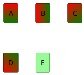
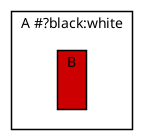
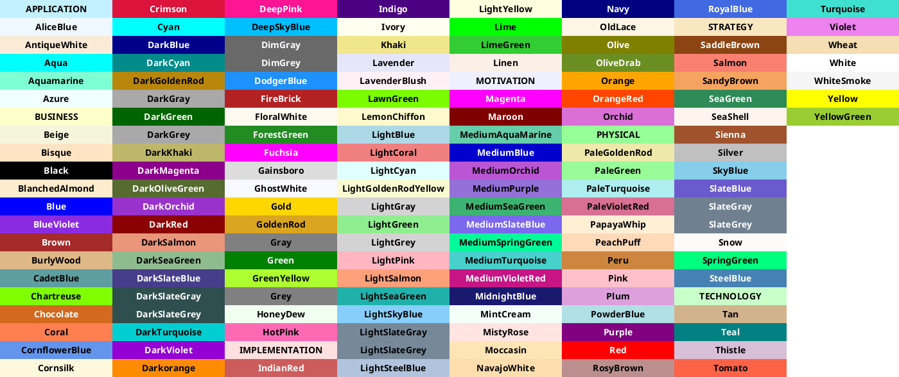

# Ticket: Farbsyntax und Farbfunktionen

## Ziel und Scope

PlantUML color syntax must be parsed once and reused by style, skinparam, inline element styles, arrows, highlights, charts and data diagrams.

## Offizielle Quellen

- https://plantuml.com/en/color

## Feature-Inventar mit PUML-Beispielen

### Named, Hex, Alpha, Short und Transparent

```plantuml
@startuml
rectangle A #LightBlue
rectangle B #ff0000
rectangle C #f008
rectangle D #abc
skinparam backgroundColor transparent
@enduml
```

Akzeptieren: standard names, `#RRGGBB`, alpha hex, short hex, one-digit gray and `transparent` where valid.

### Gradients und Inline Styles



Akzeptieren: gradient separators `-`, `|`, `/`, `\`, inline `back`, `line`, `text`, line style modifiers.

### Contrast und Preprocessor Color Functions



Akzeptieren: automatic font color and preprocessing color functions after preprocessor support.

### Colors Diagram



Akzeptieren: special `colors` diagram as generated swatch table or documented fallback.

## Parser-Plan

- Shared color parser with normalized RGBA/gradient/style token output.
- Do not evaluate preprocessor color functions before preprocessing layer exists.

## Modell-Plan

- Style tokens store normalized colors plus original string for diagnostics.

## Layout-Plan

- Color does not affect layout except contrast/readability and styled line thickness.

## Renderer-Plan

- SVG gradients require stable IDs.
- Excalidraw gradient support may need fallback strategy.

## Architekturkompatibilitätsprüfung

- Central color parser is required to keep diagrams consistent.

## Validierungsloop pro Ticket

1. Unit tests for every color notation.
2. Render tests for gradients/alpha/transparent.
3. Security tests for malicious CSS-like values.
4. Run standard gate.

## Akzeptanzkriterien

- All documented color formats normalize consistently.
- Invalid color input is rejected or falls back safely.
