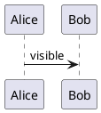
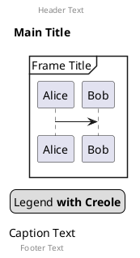
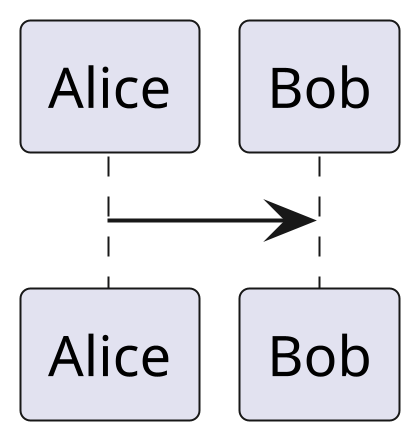

# Ticket: Globale Common Commands

## Ziel und Scope

Common commands sollen diagrammübergreifend einmal implementiert und von allen Diagrammtypen genutzt werden: Kommentare, `title`, `caption`, `header`, `footer`, `legend`, `mainframe`, `scale`, page/common metadata and shared diagram options.

## Offizielle Quellen

- https://plantuml.com/de/commons

## Feature-Inventar mit PUML-Beispielen

### Kommentare und Blockkommentare

Akzeptieren: single-line comments, block comments and comment stripping without breaking quoted strings.

### Title, Caption, Header, Footer, Legend, Mainframe

Akzeptieren: inline and block forms, Creole content, multiline blocks, placement metadata.

### Scale und Diagrammweite

Akzeptieren: numeric scale, width/height forms and clamped render dimensions.

## Parser-Plan

- Build shared common-command plugin used by each diagram parser before diagram-specific lines.
- Common blocks must be block plugins, not ad-hoc line filters.

## Modell-Plan

- Add/normalize common metadata on every diagram model: title, caption, header, footer, legend, mainframe, scale.

## Layout-Plan

- Every layout pass reserves consistent bands for title/caption/header/footer/legend.

## Renderer-Plan

- Excalidraw/SVG render common metadata consistently.
- Scale is applied through bounded canvas/export options, not unbounded geometry multiplication.

## Architekturkompatibilitätsprüfung

- Cross-cutting by design; implementing this per diagram would be incompatible with consistency goals.

## Validierungsloop pro Ticket

1. Add common-command tests for at least component, class, sequence and one data diagram.
2. SVG security tests for common text.
3. Scale clamp tests.
4. Run standard gate.

## Akzeptanzkriterien

- Common commands work uniformly across diagram types.
- Common text uses shared escaping and Creole handling.
