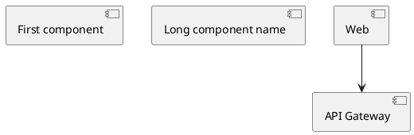
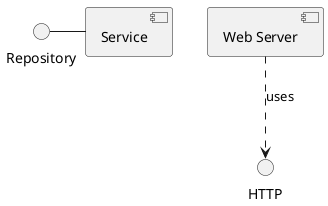
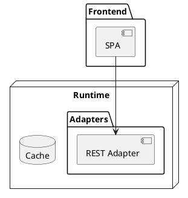
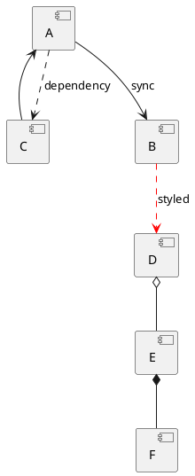
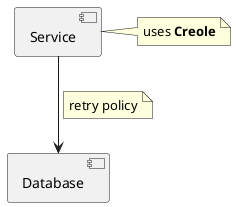
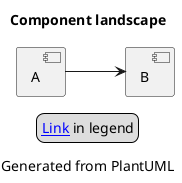
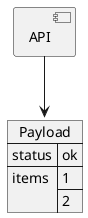

# Ticket: Component-Diagramme mit vollständiger PlantUML-Unterstützung

## Ziel und Scope

Component-Diagramme sollen die offizielle PlantUML-Syntax vollständig und deterministisch in Excalidraw, SVG und PNG abbilden. Das Ticket erneuert die Component-Unterstützung auf Basis der bestehenden Component-Pipeline und nutzt sie als Blaupause für andere box-/connection-basierte Diagrammtypen.

## Offizielle Quellen

- https://plantuml.com/de/component-diagram
- https://plantuml.com/de/deployment-diagram
- https://plantuml.com/de/commons
- https://plantuml.com/de/style
- https://plantuml.com/de/skinparam
- https://plantuml.com/de/creole
- https://plantuml.com/de/color
- https://plantuml.com/de/link

## Feature-Inventar mit PUML-Beispielen

### Komponenten, Aliase und Kurzformen



Akzeptieren: `component Name`, `[Name]`, quoted names, `as`-Alias, implizite Deklaration durch Verbindungen, stabile IDs und Deklarationsreihenfolge.

### Interfaces und Lollipop-Notation



Akzeptieren: `()`, `interface`, Interface-Aliase, Verbindungen Component-zu-Interface, Interface-zu-Component und Interface-zu-Interface.

### Gruppen und Container



Akzeptieren: `package`, `node`, `folder`, `frame`, `cloud`, `database`, `rectangle`, verschachtelte Blöcke, leere Container und gemischte Elementtypen.

### Beziehungen, Pfeilformen und Labels



Akzeptieren: gerade und gepunktete Linien, Richtungswörter, Labels, mehrzeilige Labels, Farben, `bold`, `dashed`, `dotted`, `hidden`, Komposition/Aggregation und arrowhead/tail-Varianten aus der gemeinsamen Arrow-Schicht.

### Ports und explizite Anschlussstellen

```plantuml
@startuml
component Service {
  portin http
  portout events
}
Service::http --> [Router]
Service::events --> [Broker]
@enduml
```

Akzeptieren: `port`, `portin`, `portout`, Port-Aliase, Portreferenzen und Port-zu-Element-Verbindungen. Falls PlantUML-Portdetails nicht vollständig abbildbar sind, muss das Ticket die erste implementierbare Teilmenge klar markieren.

### Notizen und Link-Notizen



Akzeptieren: `note left/right/top/bottom of`, floating notes, multiline notes, `note on link`, Creole und Links in Notizen.

### Styling, Skinparam und inline Style

```plantuml
@startuml
skinparam componentStyle rectangle
skinparam component {
  BackgroundColor<<Apache>> LightCoral
  BorderColor Black
}
<style>
componentDiagram {
  component { RoundCorner 6; LineColor #335577 }
  arrow { LineStyle 4-2; LineColor #006400 }
}
</style>
[Web] <<Apache>> #palegreen;line:green;line.dashed
[Web] --> [API] #line:blue;text:blue : calls
@enduml
```



Akzeptieren: alte `skinparam`-Kompatibilität, neue CSS-like Styles, Stereotype-Styles, inline Element-/Arrow-Styles, Farben, Gradients, Transparenz und automatische Kontrastfarben.

### Commons, Links, Titel und Richtung



Akzeptieren: Kommentare, `title`, `caption`, `header`, `footer`, `legend`, `scale`, `left to right direction`, `top to bottom direction`, Hyperlinks und Tooltips.

### JSON- und Daten-Einbettung



Akzeptieren: `allowmixing` mit JSON/YAML-ähnlichen Datenblöcken als eigener Box-Typ, ohne JSON-Parserlogik in Component-Plugins zu duplizieren.

## Parser-Plan

- Bestehende Component-Plugins unter `src/diagrams/shared/graph_plugins/` in klarere Untergruppen aufteilen: declarations, containers, interfaces, ports, notes, connections, style.
- Greedy connection parsing weiterhin zuletzt ausführen.
- Port- und Interface-Syntax vor generischen Shape-Regeln erkennen.
- Gemeinsame Parser für inline style, link syntax, Creole-Text und common commands verwenden.
- `allowmixing` als Parsermodus speichern, der Datenblöcke an gemeinsame JSON/YAML-Plugins delegiert.

## Modell-Plan

- `Box` um diagrammneutrale `kind`-Werte für component, interface, port und data erweitern, falls noch nicht vorhanden.
- Ports als eigene child boxes oder als strukturierte Anschlussliste modellieren; die Wahl muss Layout und Renderer nicht zur PlantUML-Syntax zwingen.
- Connections nutzen das gemeinsame `DiagramArrow`-Modell für head/tail, line style, labels und stereotypes.
- Notes bleiben eigenständige Boxen mit optionaler Ankerreferenz auf Box oder Connection.

## Layout-Plan

- ELK bleibt Standard für Component-Topologien.
- Interface-Lollipops und Ports benötigen feste Größen und Port-Constraints, damit Layout stabil bleibt.
- Container-Nesting muss vorhandene `Plane`/`Subplane`-Struktur respektieren.
- Hidden arrows beeinflussen Layout nur, wenn PlantUML das ebenfalls erwartet; sichtbare Render-Elemente dürfen nicht entstehen.

## Renderer-Plan

- Excalidraw: Component-Rechteck, UML2-Icon/Rectangle-Style, Interface-Kreis, Port-Marker, Notes, Labels und Arrowheads deterministisch erzeugen.
- SVG: alle Labels/Attribute escapen; Markerfarben aus Arrow-Style übernehmen.
- PNG: keine zusätzliche Semantik, nur aus validem SVG erzeugen.
- Sprites/OpenIconic in Labels über gemeinsame Inline-Asset-Schicht rendern oder vorerst als textuelle Fallbacks mit klarer Testabdeckung markieren.

## Modul-eigene Artefaktstruktur

Component ist ein eigenes Diagrammtyp-Modul unter `src/diagrams/component/` und besitzt seine fachlichen Artefakte selbst:

```text
src/diagrams/component/
  plugins/
  tests/
    unit.test.mjs
    integration.test.mjs
    security.test.mjs
    scenarios/
      components/
      interfaces/
      containers/
      ports/
      notes/
      styling/
      security/
    fixtures/
    expected/
  docs/
    index.template.md.njk
    partials/
    features/
      components/scenarios/*.puml
      interfaces/scenarios/*.puml
      containers/scenarios/*.puml
      ports/scenarios/*.puml
      notes/scenarios/*.puml
      styling/scenarios/*.puml
    assets/
```

Generated Review-Artefakte werden modulgespiegelt erzeugt:

```text
docs/ressources/generated/modules/component/
  puml/<feature>/*.puml
  excalidraw/<feature>/*.excalidraw
  svg/<feature>/*.svg
  png/<feature>/*.png
```

`ModuleDocsManifest` und `ModuleTestManifest` verweisen auf diese physischen Pfade. Root-Tests pruefen nur noch cross-module Contracts, Public API, Security-wide Verhalten und Migration.

## Dokumentations- und Beispielplan

- Coverage-Beispiele als modul-eigene PUML-Szenarien unter `src/diagrams/component/docs/features/<feature>/scenarios/` und `src/diagrams/component/tests/scenarios/<feature>/` planen.
- Ein Component-Haupttemplate `src/diagrams/component/docs/index.template.md.njk` erstellt Featuretabellen, bekannte Luecken, Security-Hinweise und Links auf generierte Review-Artefakte.
- Generated resources analog zu Sequenzdiagrammen vorbereiten: PUML, Excalidraw, SVG und optional PNG, aber unter `docs/ressources/generated/modules/component/`.
- README nur über Template aktualisieren, wenn Component-Coverage öffentlich beworben wird.
- Zentrale `docs/scripts/component-coverage-examples.mjs`-Listen sind nicht Zielarchitektur; die Main-Doku-Pipeline sammelt das Component-Manifest ein.

## Test- und Sicherheitsplan

- Parser-Tests für jede Featuregruppe aus dem Inventar liegen im Component-Modul.
- Snapshot-ähnliche Tests für Modellstruktur: Container, Interface, Port, Note, Connection, liegen im Component-Modul.
- SVG-Security-Tests für Labels, Notes, Links und inline styles mit HTML-/SVG-Sonderzeichen liegen im Component-Modul; cross-module Escaping-Gates bleiben in Root-Security-Tests.
- ReDoS-Test für lange quoted names, viele dashes in arrows und große verschachtelte Container liegt im Component-Modul und wird vom Root-Gate eingesammelt.
- Determinismus-Test: zweimaliges Rendern desselben Diagramms erzeugt gleiche Excalidraw-Elemente.

## Architekturkompatibilitätsprüfung

- Kompatibel mit der bestehenden `Diagram -> Plane/Subplane -> Box -> Connection`-Struktur.
- Benötigt keine Parserlogik in Renderern.
- Passt zu ELK, solange Ports und Interface-Lollipops als explizite Knoten oder Ports modelliert werden.
- Style/Skinparam müssen an die gemeinsame Style-Schicht angeschlossen werden, damit Class, Deployment und Use Case dieselben Regeln nutzen.
- Kompatibel mit der neuen Modul-Ownership, weil Component-Szenarien, Tests und Docs physisch im Component-Modul liegen und nur Generated Outputs zentral eingesammelt werden.

## Validierungsloop pro Ticket

1. Featureliste gegen offizielle Component-, Commons-, Style- und Color-Seiten prüfen.
2. Für jedes Beispiel einen Parser-Test schreiben.
3. Für `interfaces`, `ports`, `notes`, `containers`, `styled arrows` je einen Render-Test ergänzen.
4. Coverage-Dokument aus dem Component-DocsManifest erzeugen und visuell mit SVG/Excalidraw-Artefakten aus `docs/ressources/generated/modules/component/` prüfen.
5. `npm test`, `npm run typecheck`, `npm run format:check` ausführen.

## Akzeptanzkriterien

- Alle Component-Featuregruppen aus diesem Ticket sind implementiert oder mit begründetem Nicht-Ziel dokumentiert.
- Kein sichtbares synthetisches Root-/Floating-Element wird gerendert.
- Interface-, Port- und Containerlayout bleibt stabil bei wiederholtem Rendern.
- Style, Skinparam, Creole, Links und Farben verhalten sich konsistent mit Class und Deployment.
- Component besitzt modul-eigene `tests/`, `docs/`, Szenarien und Generated-Output-Pfade; zentrale Pipelines konsumieren nur die Manifeste.
