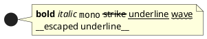
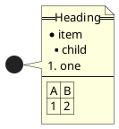
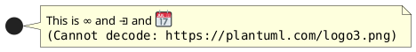

# Ticket: Creole- und HTML-Creole-Unterstützung

## Ziel und Scope

Creole is used across labels, notes, legends, data values, Salt widgets, Mindmap/WBS nodes and Activity text. This ticket plans a shared inline text parser and renderer.

## Offizielle Quellen

- https://plantuml.com/de/creole
- https://plantuml.com/de/openiconic

## Feature-Inventar mit PUML-Beispielen

### Textformatierungen und Escape

Akzeptieren: bold, italic, monospace, strike, underline, wave underline and `~` escape.

### Listen, Tabellen, Linien und Überschriften

Akzeptieren: headings, bullet/numbered lists, horizontal rules, tables and trees where supported.

### Links, Unicode, Emoji, OpenIconic, Images

Akzeptieren: links, unicode escapes, emoji, OpenIconic. Remote images require a safe fallback/non-goal unless explicit asset fetching is designed.

### HTML-Creole Tags

```plantuml
@startuml
note right
  <b>bold</b> <i>italic</i> <color:blue>blue</color>
  <back:orange>background</back> <size:20>large</size>
end note
@enduml
```

Akzeptieren: documented legacy HTML tags with strict whitelist.

## Parser-Plan

- Shared inline parser returns structured text runs.
- HTML-like syntax must be whitelist-based and never emitted raw to SVG.

## Modell-Plan

- Text fields keep both raw label and parsed runs where useful.
- Links and inline icons represented as safe run types.

## Layout-Plan

- Text measurement/wrapping extended to runs with style changes.

## Renderer-Plan

- SVG text uses escaped content; no raw HTML insertion.
- Excalidraw maps supported inline styles to text elements or grouped runs.

## Architekturkompatibilitätsprüfung

- Must live under shared style/text layer, not per diagram plugin.

## Validierungsloop pro Ticket

1. Parser tests for every inline token.
2. Render tests in notes, labels, JSON/YAML, Salt and WBS/Mindmap.
3. Security tests for malicious tags and URLs.
4. Run standard gate.

## Akzeptanzkriterien

- Creole behavior is uniform and safe across diagrams.
- Unsupported tags degrade visibly and safely.
