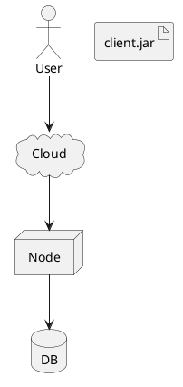
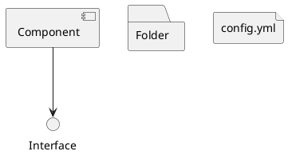
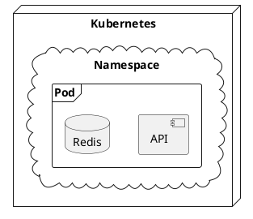
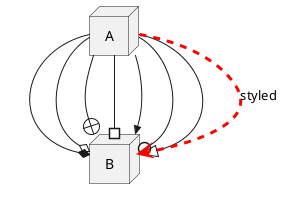
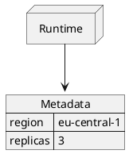

# Ticket: Deployment-Diagramme mit vollständiger PlantUML-Unterstützung

## Ziel und Scope

Deployment-Diagramme sollen als box-/connection-basierte Diagramme vollständig über die bestehende Diagramm-Pipeline laufen. Viele Deployment-Features überschneiden sich mit Component-Diagrammen; dieses Ticket plant die spezifischen Shapes, Ports, Inline-Styles und gemischten Datenblöcke.

## Offizielle Quellen

- https://plantuml.com/de/deployment-diagram
- https://plantuml.com/de/commons
- https://plantuml.com/de/style
- https://plantuml.com/de/color
- https://plantuml.com/de/json

## Feature-Inventar mit PUML-Beispielen

### Deployment-Shapes und Aliase



Akzeptieren: `actor`, `agent`, `artifact`, `boundary`, `card`, `circle`, `cloud`, `collections`, `component`, `control`, `database`, `entity`, `file`, `folder`, `frame`, `hexagon`, `interface`, `label`, `node`, `package`, `person`, `queue`, `rectangle`, `stack`, `storage`, `usecase`.

### Short forms und implizite Formen



Akzeptieren: Component-Shortform, Interface-Kreis, quoted labels, implizite Deklaration aus Verbindungen und stabile Aliasauflösung.

### Nesting und Container



Akzeptieren: beliebig verschachtelte Container, leere Container, Cross-Container-Links, Container-Style und Parent-Backlinks.

### Pfeilvarianten und Styling



Akzeptieren: Deployment-spezifische arrowheads/tails, bracketed colors, line styles, thickness, direction keywords, labels und hidden links.

### Ports

```plantuml
@startuml
node Server {
  portin http
  portout events
}
Server::http --> [Reverse Proxy]
Server::events --> queue Broker
@enduml
```

Akzeptieren: `port`, `portin`, `portout`, Portreferenzen und Verbindung an konkrete Portpositionen.

### JSON und Mixing



Akzeptieren: JSON-Blöcke in Deployment-Diagrammen über gemeinsame Datenmodellierung.

## Parser-Plan

- Deployment als eigenes Plugin-Set oder als spezialisierter Modus des Component-Parsers planen.
- Shape-Deklarationen in einer zentralen Tabelle erfassen, damit Renderer und Tests dieselbe Shape-Liste sehen.
- Ports vor generischen shape declarations parsen.
- Arrow-Parsing an `DiagramArrow` anbinden und alle head/tail Varianten als strukturierte Endpoints speichern.

## Modell-Plan

- `Box.kind` muss alle Deployment-Shapes ausdrücken können.
- Container bleiben `Subplane`/child boxes; Ports sind child boxes oder explizite port metadata.
- JSON/YAML-Blöcke werden als data boxes gespeichert, nicht als Deployment-spezifisches Sondermodell.

## Layout-Plan

- ELK bleibt Hauptlayout.
- Ports erhalten feste Randpositionen; bei unbekannter Portseite wird deterministisch verteilt.
- Shape-spezifische Mindestgrößen in `sizing.mjs` zentralisieren.

## Renderer-Plan

- Excalidraw/SVG müssen alle Shapes mit konsistenter Symbolsprache darstellen.
- Unsupported fancy shapes dürfen nicht als falsche Rechtecke verschwinden; mindestens ein erkennbarer Fallback mit Shape-Label ist nötig.
- SVG-Text, Links und JSON-Werte escapen.

## Dokumentation und Tests

- Coverage-Beispiele für `basic`, `shapes`, `nested`, `ports`, `styled-arrows`, `mixed-json`, `security`.
- Security-Tests für Shape-Namen, Ports, JSON-Werte und SVG-Injection.

## Modul-eigene Artefaktstruktur

Dieses Ticket plant ein eigenes `deployment`-Diagrammtyp-Modul unter `src/diagrams/deployment/`. Parser, Layout, Renderer, Security-Profil, Tests, Doku, Szenarien und modulnahe Assets gehoeren physisch in diesen Modulbereich.

`ModuleDocsManifest` und `ModuleTestManifest` verweisen auf diese Modulpfade, statt zentrale Docs-/Testlisten als Quelle der Wahrheit zu verwenden. Generated Review-Artefakte werden modulgespiegelt unter `docs/ressources/generated/modules/deployment/{puml,excalidraw,svg,png}/<feature>/` erzeugt. Root-Tests bleiben fuer Public API, Cross-Module-Verhalten, Security-wide Gates und Migration reserviert.

## Architekturkompatibilitätsprüfung

- Sehr kompatibel mit der bestehenden Component-Architektur.
- Kritische Erweiterung ist die Shape-Matrix: sie muss rendererneutral im Modell landen.
- Portlayout darf ELK nicht umgehen, sondern muss in die vorhandene Layoutphase integriert werden.

## Validierungsloop pro Ticket

1. Shape-Liste gegen offizielle Deployment-Seite abhaken.
2. Für jede Shape-Familie mindestens ein Parser-/Render-Beispiel ergänzen.
3. Port- und Arrowhead-Artefakte visuell prüfen.
4. `npm test`, `npm run typecheck`, `npm run format:check` ausführen.

## Akzeptanzkriterien

- Alle Deployment-Shapes werden erkannt und deterministisch gerendert.
- Ports und nested containers bleiben stabil.
- JSON-Mixing und globale Style-/Color-Regeln funktionieren wie bei Component/Class.
