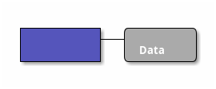
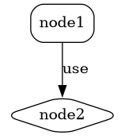

# Ticket: Ditaa- und DOT-Brückenunterstützung

## Ziel und Scope

PlantUML kann Ditaa- und Graphviz/DOT-Blöcke über `@startditaa` und `@startdot` einbetten. Dieses Ticket plant bewusst eine Bridge-Strategie, weil beide Formate eigene externe Sprachen/Renderer sind und nicht einfach PlantUML-UML-Syntax darstellen.

## Offizielle Quellen

- https://plantuml.com/de/ditaa
- https://plantuml.com/de/dot

## Feature-Inventar mit PUML-Beispielen

### Ditaa ASCII Art



Akzeptieren/Planen: `@startditaa`, options `-E/--no-separation`, `-S/--no-shadows`, `scale=`, tags `{c}`, `{d}`, `{io}`, `{mo}`, `{o}`, `{s}`, `{tr}`. PlantUML itself notes PNG-only support, so Excalidraw/SVG support needs either custom ASCII parser or documented fallback.

### Inline Ditaa in `@startuml`

```plantuml
@startuml
ditaa(--no-shadows, scale=0.7)
+------+  +------+
| A    +--+ B    |
+------+  +------+
@enduml
```

Akzeptieren: wrapper syntax and options if bridge parser is enabled.

### DOT Language



Akzeptieren/Planen: `@startdot`, `digraph` blocks, Graphviz attributes and edges through either DOT parser dependency or explicit unsupported diagnostic.

## Parser-Plan

- Treat Ditaa/DOT as bridge diagram modes, not as normal PlantUML plugins.
- No shelling out to Graphviz/Ditaa from parser or renderer.
- If DOT parser dependency is used, audit it and keep parse limits.

## Modell-Plan

- `ExternalDiagram` model with `language`, `source`, `options`, and optional parsed graph/artifact metadata.

## Layout-Plan

- Fallback: source-block rendering.
- Full DOT: either parse graph and pass through internal graph layout, or document as unsupported.
- Full Ditaa: custom ASCII-art layout is substantial and should be a separate implementation phase.

## Renderer-Plan

- Safe fallback renders source as preformatted block with title.
- Full support must not require external binaries at render time.

## Modul-eigene Artefaktstruktur

Dieses Ticket plant ein eigenes `ditaa-dot`-Diagrammtyp-Modul unter `src/diagrams/ditaa-dot/`. Parser, Layout, Renderer, Security-Profil, Tests, Doku, Szenarien und modulnahe Assets gehoeren physisch in diesen Modulbereich.

`ModuleDocsManifest` und `ModuleTestManifest` verweisen auf diese Modulpfade, statt zentrale Docs-/Testlisten als Quelle der Wahrheit zu verwenden. Generated Review-Artefakte werden modulgespiegelt unter `docs/ressources/generated/modules/ditaa-dot/{puml,excalidraw,svg,png}/<feature>/` erzeugt. Root-Tests bleiben fuer Public API, Cross-Module-Verhalten, Security-wide Gates und Migration reserviert.

## Architekturkompatibilitätsprüfung

- Compatible only as an explicit bridge layer.
- Must not blur parser/render boundaries by invoking external processes.

## Validierungsloop pro Ticket

1. Parse wrapper tags and options.
2. Confirm fallback render is deterministic and escaped.
3. If full parser added, add dependency audit and security tests.
4. Run standard gate.

## Akzeptanzkriterien

- Ditaa/DOT inputs are recognized and either safely rendered as fallback or fully parsed through audited infrastructure.
- No external binary/network/file access is performed implicitly.
