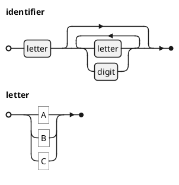
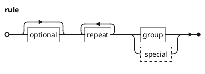
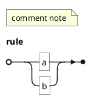

# Ticket: EBNF-Diagramme mit vollständiger PlantUML-Unterstützung

## Ziel und Scope

EBNF-Diagramme (`@startebnf`) sollen grammar rules, literals, alternatives, grouping, repetition, options, notes and styles as railroad diagrams support.

## Offizielle Quellen

- https://plantuml.com/de/ebnf
- https://plantuml.com/de/style

## Feature-Inventar mit PUML-Beispielen

### Rules, Literals und Concatenation

Akzeptieren: rules, string literals, identifiers, concatenation `,`, alternatives `|`, rule terminators.

### Optional, Repetition, Grouping und Special Sequences

Akzeptieren: optional `[a]`, repetition `{a}`, one-or-more `{a}-`, grouping `()`, special sequences `? ?`, repetition-symbol `*`, restriction `-`.

### Notes, Compact/Expanded und Style

Akzeptieren: comments as notes, compact/expanded mode, style and unicode identifiers.

## Parser-Plan

- Implement or integrate a bounded EBNF grammar parser.
- Avoid ReDoS-prone regexes; scanner/parser preferred.

## Modell-Plan

- `EbnfDiagram` with rules and AST nodes for sequence, choice, optional, repeat, terminal, nonterminal, special.

## Layout-Plan

- Dedicated railroad layout algorithm.

## Renderer-Plan

- Render railroad tracks, terminals/nonterminals and notes.

## Modul-eigene Artefaktstruktur

Dieses Ticket plant ein eigenes `ebnf`-Diagrammtyp-Modul unter `src/diagrams/ebnf/`. Parser, Layout, Renderer, Security-Profil, Tests, Doku, Szenarien und modulnahe Assets gehoeren physisch in diesen Modulbereich.

`ModuleDocsManifest` und `ModuleTestManifest` verweisen auf diese Modulpfade, statt zentrale Docs-/Testlisten als Quelle der Wahrheit zu verwenden. Generated Review-Artefakte werden modulgespiegelt unter `docs/ressources/generated/modules/ebnf/{puml,excalidraw,svg,png}/<feature>/` erzeugt. Root-Tests bleiben fuer Public API, Cross-Module-Verhalten, Security-wide Gates und Migration reserviert.

## Architekturkompatibilitätsprüfung

- Requires new grammar AST model; renderer remains syntax-independent after parse.

## Validierungsloop pro Ticket

1. Grammar parser tests for every EBNF operator.
2. Layout tests for nested alternatives/repetition.
3. Security tests for pathological nesting and long tokens.
4. Run standard gate.

## Akzeptanzkriterien

- EBNF syntax is parsed as AST and rendered as railroad diagram.
- Invalid grammar fails gracefully with diagnostics.
