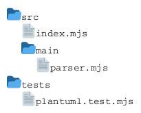
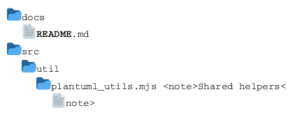

# Ticket: Files-Diagramme mit vollständiger PlantUML-Unterstützung

## Ziel und Scope

Files-Diagramme (`@startfiles`) sollen file tree paths, source order, directory merge, Creole names and notes support.

## Offizielle Quellen

- https://plantuml.com/de/files-diagram
- https://plantuml.com/de/creole

## Feature-Inventar mit PUML-Beispielen

### File Trees und Directory Merge



Akzeptieren: slash paths, directory merging, source order preservation and empty directories if documented.

### Creole Names und Notes



Akzeptieren: Creole in file names and inline/block note syntax.

## Parser-Plan

- Dedicated line parser for paths and note tags.
- Do not touch real filesystem; paths are diagram data only.

## Modell-Plan

- Tree model with directories/files, original path labels and notes.

## Layout-Plan

- Tree/list layout with stable indentation and order.

## Renderer-Plan

- Render folder/file icons using safe built-in shapes or text fallback.
- Escape file names and notes in SVG.

## Modul-eigene Artefaktstruktur

Files ist ein eigenes Tree-Family-Diagrammtyp-Modul unter `src/diagrams/files/` und besitzt seine fachlichen Artefakte selbst:

```text
src/diagrams/files/
	module.mjs
	parser.mjs
	layout.mjs
	render.mjs
	tests/
		unit.test.mjs
		integration.test.mjs
		security.test.mjs
		scenarios/
			trees/
			notes/
			security/
		fixtures/
		expected/
	docs/
		index.template.md.njk
		features/
			trees/scenarios/*.puml
			notes/scenarios/*.puml
			security/scenarios/*.puml
	assets/
```

Generated Review-Artefakte werden modulgespiegelt erzeugt:

```text
docs/ressources/generated/modules/files/
	puml/<feature>/*.puml
	excalidraw/<feature>/*.excalidraw
	svg/<feature>/*.svg
	png/<feature>/*.png
```

Da Files-Diagramme Projektstrukturen darstellen, ist dieses Modul auch ein sinnvoller Kandidat fuer ein Self-Diagramm: ein `self/collectors/file-tree`-Collector kann spaeter die repo-eigene Modul-/Docs-/Tests-Struktur als `@startfiles`-Diagramm erzeugen, ohne echte Dateien aus PlantUML-Input zu lesen.

## Dokumentations- und Beispielplan

- Files-Coverage-Beispiele als modul-eigene PUML-Szenarien unter `src/diagrams/files/docs/features/<feature>/scenarios/` und `src/diagrams/files/tests/scenarios/<feature>/` pflegen.
- Das Modul-Dokutemplate beschreibt Directory-Merge-Regeln, Sortierung, Notizsyntax, Security-Grenzen und Self-Diagramm-Nutzung.
- Generated SVG-/Excalidraw-/PNG-Outputs liegen unter `docs/ressources/generated/modules/files/`.
- README-Änderungen nur über Main-Template, wenn Files-Diagramme öffentlich beworben werden.

## Test- und Sicherheitsplan

- Parser-Tests fuer Slash-Pfade, wiederholte Directories, leere Directories, Creole-Namen und Notizen liegen im Files-Modul.
- Layout-/Renderer-Tests pruefen stabile Source Order, Merge-Verhalten, Icons/Fallbacks und lange Pfade.
- Security-Tests pruefen HTML-/SVG-artige Pfadnamen, Control Characters, sehr tiefe Pfade und Path-Traversal-aehnliche Labels als reine Diagrammdaten.
- Self-Collector-Tests pruefen spaeter, dass ein repo-eigener Files-Self-Collector nur aus kontrollierter Source-Introspection liest und nicht aus PlantUML-Input auf das Dateisystem zugreift.

## Architekturkompatibilitätsprüfung

- Shares tree primitives with Mindmap/WBS but file paths require merge semantics.
- Kompatibel mit der Modularchitektur als `TreeModuleBase`-Kandidat; Parser, Tests, Doku und Self-Collector bleiben getrennt von realem Dateisystemzugriff.
- Kompatibel mit der Docs-/Self-Architektur, weil Files ein fachliches Modul fuer Nutzereingaben bleibt und ein separater `self/`-Collector die Projektstruktur fuer Repo-Doku erzeugt.

## Validierungsloop pro Ticket

1. Path parsing tests with repeated directories.
2. Render order tests.
3. Security tests for path labels that look like HTML/SVG.
4. Module docs/test manifests validate physical Files scenarios and generated outputs.
5. Run standard gate.

## Akzeptanzkriterien

- File trees render in source order with merged directories.
- No file system access is performed.
- Files besitzt modul-eigene `tests/`, `docs/`, Szenarien und Generated-Output-Pfade.
- Ein spaeteres Files-Self-Diagramm wird aus `self/`-Collectors erzeugt, nicht aus Files-Parser-Sonderlogik.
