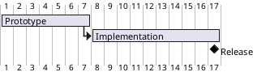

# Ticket: Gantt-Diagramme mit vollständiger PlantUML-Unterstützung

## Ziel und Scope

Gantt-Diagramme sollen Projektaufgaben, Kalender, Ressourcen, Skalen, Meilensteine, Links, Notizen und Styling unterstützen. Sie benötigen ein eigenes zeitachsenbasiertes Modell und Layout.

## Offizielle Quellen

- https://plantuml.com/de/gantt-diagram
- https://plantuml.com/de/style
- https://plantuml.com/de/color

## Feature-Inventar mit PUML-Beispielen

### Tasks, Durations und Dates



Akzeptieren: tasks, `lasts`, `requires`, absolute/relative dates, `starts/ends at`, one-line `and`, milestones with `happens`.

### Constraints, Aliases und Completion

```plantuml
@startgantt
[Design] as [D] lasts 5 days
[Build] as [B] starts at [D]'s end
[Build] is 60% complete
[D] -> [B]
@endgantt
```



Akzeptieren: aliases, same-name tasks, dependency arrows, completion percentages and deleted tasks.

### Calendar, Closed Days und Scales

```plantuml
@startgantt
Project starts 2026-01-01
saturday are closed
sunday are closed
2026-01-15 is colored in salmon
printscale weekly
zoom 2
[Task] lasts 20 days
@endgantt
```

Akzeptieren: project start/end, closed/open days, named/colored days, daily/weekly/monthly/quarterly/yearly scales, zoom, week numbering and language.

### Resources, Separators, Notes und Today

```plantuml
@startgantt
[Task] on {Alice} lasts 5 days
-- Phase 1 --
note bottom
  critical delivery
end note
today is colored in #AAF
@endgantt
```



Akzeptieren: resources/off days/hide resources, horizontal/vertical separators, notes, pauses, same-row display, today marker, labels first/last column.

### Styling

```plantuml
@startgantt
<style>
ganttDiagram {
  task { BackGroundColor GreenYellow; LineColor Green }
  undone { BackGroundColor red }
}
</style>
[Testing] lasts 4 days
[Testing] is 0% complete
@endgantt
```



Akzeptieren: task status styles, line styles, link colors and common headers/footers/legends.

## Parser-Plan

- New Gantt parser with task declarations, scheduling constraints, calendar config, resources, separators and notes.
- Date expressions and `%now/%date` must be deterministic or mockable in tests.

## Modell-Plan

- `GanttDiagram` with tasks, milestones, dependencies, calendar, resources, scale and annotations.
- Store original date labels separately from normalized dates.

## Layout-Plan

- Dedicated time grid layout; x-axis = date/tick, y-axis = task/resource rows.
- Closed days and scales affect tick generation and background bands.

## Renderer-Plan

- Render bars, milestones, dependencies, completion overlays, resources, separators and calendar highlights.
- SVG escaping for task labels and notes.

## Modul-eigene Artefaktstruktur

Dieses Ticket plant ein eigenes `gantt`-Diagrammtyp-Modul unter `src/diagrams/gantt/`. Parser, Layout, Renderer, Security-Profil, Tests, Doku, Szenarien und modulnahe Assets gehoeren physisch in diesen Modulbereich.

`ModuleDocsManifest` und `ModuleTestManifest` verweisen auf diese Modulpfade, statt zentrale Docs-/Testlisten als Quelle der Wahrheit zu verwenden. Generated Review-Artefakte werden modulgespiegelt unter `docs/ressources/generated/modules/gantt/{puml,excalidraw,svg,png}/<feature>/` erzeugt. Root-Tests bleiben fuer Public API, Cross-Module-Verhalten, Security-wide Gates und Migration reserviert.

## Architekturkompatibilitätsprüfung

- Requires new model/layout but can reuse style/text/arrow rendering.
- Date handling is a security and determinism hotspot.

## Validierungsloop pro Ticket

1. Normalize official scheduling examples in tests.
2. Test calendar/scale rendering with fixed date provider.
3. Render resources and notes without overlap.
4. Run standard gate.

## Akzeptanzkriterien

- Gantt scheduling semantics are tested independently of rendering.
- Calendar/scale/resource output is deterministic.
