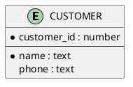
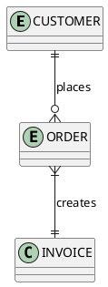

# Ticket: Information-Engineering-Diagramme mit vollständiger PlantUML-Unterstützung

## Ziel und Scope

Information Engineering diagrams are an extension of class diagrams using Crow's Foot relationship notation. This ticket plans support as a focused extension of Class parsing and rendering.

## Offizielle Quellen

- https://plantuml.com/de/ie-diagram
- https://plantuml.com/de/class-diagram

## Feature-Inventar mit PUML-Beispielen

### Entities und Attribute

Akzeptieren: `entity`, mandatory attributes via `*`, class-like compartments, types and separators.

### Crow's Foot Relationships

Akzeptieren: `|o`, `||`, `}o`, `}|`, mirrored variants, labels and direction.

### Shared Class Features

```plantuml
@startuml
hide circle
skinparam linetype ortho
entity USER <<table>> #palegreen
entity ROLE
USER }o--|| ROLE
@enduml
```

Akzeptieren: `hide circle`, `linetype ortho`, styles, colors, stereotypes and class diagram notes where applicable.

## Parser-Plan

- Extend class diagram declaration parser for `entity` and IE member markers.
- Extend arrow parser with Crow's Foot endpoint classification.

## Modell-Plan

- Reuse class-like `Box` with `classKind = entity`.
- Store endpoint cardinality/optionality as arrow endpoint metadata.

## Layout-Plan

- ELK graph layout; `linetype ortho` maps to route hints where supported.

## Renderer-Plan

- Render Crow's Foot endpoints in Excalidraw/SVG from shared arrow endpoint model.
- Entity compartments reuse class rendering with IE-specific mandatory marker styling.

## Modul-eigene Artefaktstruktur

Dieses Ticket plant ein eigenes `ie`-Diagrammtyp-Modul unter `src/diagrams/ie/`. Parser, Layout, Renderer, Security-Profil, Tests, Doku, Szenarien und modulnahe Assets gehoeren physisch in diesen Modulbereich.

`ModuleDocsManifest` und `ModuleTestManifest` verweisen auf diese Modulpfade, statt zentrale Docs-/Testlisten als Quelle der Wahrheit zu verwenden. Generated Review-Artefakte werden modulgespiegelt unter `docs/ressources/generated/modules/ie/{puml,excalidraw,svg,png}/<feature>/` erzeugt. Root-Tests bleiben fuer Public API, Cross-Module-Verhalten, Security-wide Gates und Migration reserviert.

## Architekturkompatibilitätsprüfung

- Strongly compatible with Class ticket; should be implemented after shared ArrowEndpoint supports Crow's Foot.

## Validierungsloop pro Ticket

1. Relationship endpoint matrix tests.
2. Entity attribute parser tests.
3. SVG marker escaping/definition tests.
4. Run standard gate.

## Akzeptanzkriterien

- All Crow's Foot endpoint combinations render correctly.
- Entity compartments and mandatory markers are deterministic.
