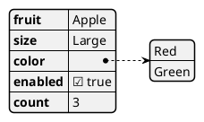
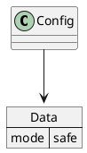

# Ticket: JSON-Diagramme mit vollständiger PlantUML-Unterstützung

## Ziel und Scope

JSON-Diagramme (`@startjson`) sollen JSON objects, arrays, scalars, highlights, styles, Creole and embedding in other diagrams support. Parsing must use structured JSON parsing, not ad-hoc string splitting.

## Offizielle Quellen

- https://plantuml.com/de/json
- https://plantuml.com/de/style
- https://plantuml.com/de/creole

## Feature-Inventar mit PUML-Beispielen

### JSON Structures und Scalars

Akzeptieren: objects, arrays, strings, numbers, booleans, null, empty arrays/objects, unicode and escapes.

### Highlights und Styled Highlights

```plantuml
@startjson
<style>
.hot { BackGroundColor red; FontColor white }
</style>
#highlight "color" <<hot>>
{
  "color": ["Red", "Green"]
}
@endjson
```

Akzeptieren: `#highlight`, path segments with `/`, custom style classes and multiple highlight styles.

### Global Style und Creole

```plantuml
@startjson
<style>
jsonDiagram {
  node { FontName Helvetica; BackGroundColor Khaki }
  arrow { LineColor green }
}
</style>
{
  "note": "**bold** <&account-login>"
}
@endjson
```

Akzeptieren: `jsonDiagram node/arrow/highlight` styles and Creole in values where PlantUML allows it.

### Embedding in Other Diagrams

Akzeptieren: JSON blocks inside class/object/deployment/state/usecase diagrams via shared data-box model.

## Parser-Plan

- Use `JSON.parse` for strict JSON bodies after extracting `#highlight` and style blocks.
- Body extraction must preserve strings and escapes.

## Modell-Plan

- `DataDiagram` with tree nodes for object properties and array entries.
- Highlight paths stored as structured path arrays.

## Layout-Plan

- Deterministic tree/table layout for nested JSON.
- Large JSON bounded by parse limits and layout caps.

## Renderer-Plan

- Render object/array hierarchy, arrows/connectors, highlights and styles.
- Escape keys/values in SVG.

## Modul-eigene Artefaktstruktur

Dieses Ticket plant ein eigenes `json`-Diagrammtyp-Modul unter `src/diagrams/json/`. Parser, Layout, Renderer, Security-Profil, Tests, Doku, Szenarien und modulnahe Assets gehoeren physisch in diesen Modulbereich.

`ModuleDocsManifest` und `ModuleTestManifest` verweisen auf diese Modulpfade, statt zentrale Docs-/Testlisten als Quelle der Wahrheit zu verwenden. Generated Review-Artefakte werden modulgespiegelt unter `docs/ressources/generated/modules/json/{puml,excalidraw,svg,png}/<feature>/` erzeugt. Root-Tests bleiben fuer Public API, Cross-Module-Verhalten, Security-wide Gates und Migration reserviert.

## Architekturkompatibilitätsprüfung

- Shared data model should also serve YAML.
- Embedding must expose JSON as a box without duplicating renderer code.

## Validierungsloop pro Ticket

1. Strict JSON parser tests including escapes/unicode.
2. Highlight path tests.
3. Embedded JSON render tests.
4. Run standard gate.

## Akzeptanzkriterien

- JSON syntax is parsed structurally and safely.
- Highlights and styles render deterministically.
