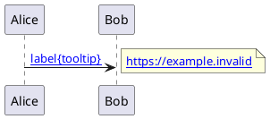
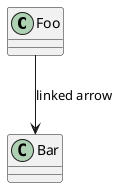

# Ticket: Hyperlinks und Link-Metadaten

## Ziel und Scope

PlantUML links appear in labels, notes, arrows, JSON/YAML values and explicit `url of/for` commands. This ticket plans shared URL parsing, storage and safe rendering.

## Offizielle Quellen

- https://plantuml.com/de/link

## Feature-Inventar mit PUML-Beispielen

### Inline Links, Labels und Tooltips

Akzeptieren: empty links, labels, tooltips, braces in URLs and links in text fields.

### Explicit URL Commands

Akzeptieren: `url of`, `url for`, links on arrows/elements and topurl behavior where relevant.

### Styling

```plantuml
@startuml
skinparam hyperlinkColor blue
skinparam hyperlinkUnderline true
<style>
document { HyperLinkColor red; HyperlinkUnderlineThickness 2 }
</style>
Alice -> Bob : [[https://example.invalid link]]
@enduml
```

Akzeptieren: hyperlinkColor, underline, style properties and SVG/Excalidraw link metadata.

## Parser-Plan

- Shared link parser integrated into Creole parser and command parser.
- URL validation should allow documented syntax but block unsafe renderer injection.

## Modell-Plan

- Link metadata attached to text runs, boxes and connections.

## Layout-Plan

- Link does not affect size except underline styling.

## Renderer-Plan

- SVG anchors must escape href/attributes and avoid dangerous schemes if policy requires.
- Excalidraw links use element link metadata where supported.

## Architekturkompatibilitätsprüfung

- Link parsing belongs in shared text/common layer.

## Validierungsloop pro Ticket

1. Unit tests for inline and explicit links.
2. Render tests for SVG anchors and Excalidraw metadata.
3. Security tests for quotes, javascript-like schemes and malformed braces.
4. Run standard gate.

## Akzeptanzkriterien

- Links are safe and consistent across diagram types.
