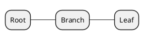
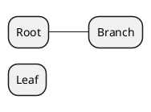
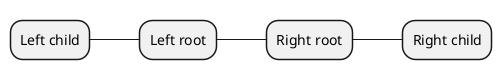
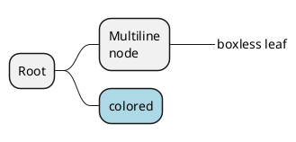
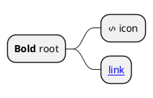

# Ticket: Mindmap-Diagramme mit vollständiger PlantUML-Unterstützung

## Ziel und Scope

Mindmaps sollen OrgMode-, Markdown- und arithmetic Syntax, side selection, colors, styles, boxless nodes, multiline text and Creole support abbilden.

## Offizielle Quellen

- https://plantuml.com/de/mindmap-diagram
- https://plantuml.com/de/style
- https://plantuml.com/de/creole

## Feature-Inventar mit PUML-Beispielen

### OrgMode und Markdown Syntax

Akzeptieren: `*` depth, Markdown headers/lists and source order.

### Arithmetic Sides, Multiroot und Orientation

Akzeptieren: `+`/`-` sides, multiroot, left/right/top/bottom orientation where supported.

### Multiline, Boxless, Colors und Styles

Akzeptieren: `:...;`, `_` boxless nodes, inline colors, style classes, depth styles and word wrap.

### Creole, Icons und Common Text

Akzeptieren: Creole, HTML-Creole subset, Unicode, OpenIconic, images as safe fallback or explicit non-goal.

## Parser-Plan

- Mindmap parser converts line-prefix depth into tree model.
- Separate tokenization for OrgMode, Markdown and arithmetic notation.
- Inline color/style parsed through common style parser.

## Modell-Plan

- `TreeDiagram` or `MindmapDiagram` with nodes, depth, side, boxless flag, style classes and text runs.

## Layout-Plan

- Dedicated radial/tree layout; side selection controls left/right branches.
- Stable node order and width wrapping.

## Renderer-Plan

- Render root/branch/leaf nodes, connectors, boxless text and styles.
- SVG escape for node text and links.

## Modul-eigene Artefaktstruktur

Dieses Ticket plant ein eigenes `mindmap`-Diagrammtyp-Modul unter `src/diagrams/mindmap/`. Parser, Layout, Renderer, Security-Profil, Tests, Doku, Szenarien und modulnahe Assets gehoeren physisch in diesen Modulbereich.

`ModuleDocsManifest` und `ModuleTestManifest` verweisen auf diese Modulpfade, statt zentrale Docs-/Testlisten als Quelle der Wahrheit zu verwenden. Generated Review-Artefakte werden modulgespiegelt unter `docs/ressources/generated/modules/mindmap/{puml,excalidraw,svg,png}/<feature>/` erzeugt. Root-Tests bleiben fuer Public API, Cross-Module-Verhalten, Security-wide Gates und Migration reserviert.

## Architekturkompatibilitätsprüfung

- Requires tree-specific model/layout, but can share style/text/inline asset code with WBS.

## Validierungsloop pro Ticket

1. Parse notation variants into identical tree semantics where appropriate.
2. Test side/orientation layout.
3. Render Creole and boxless examples safely.
4. Run standard gate.

## Akzeptanzkriterien

- OrgMode, Markdown and arithmetic notation are covered.
- Styles and word wrap behave consistently with WBS.
