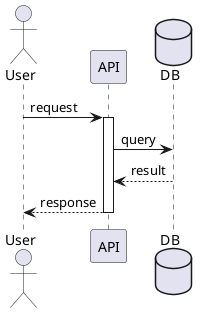
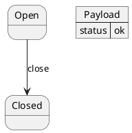
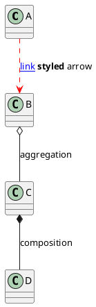
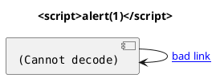
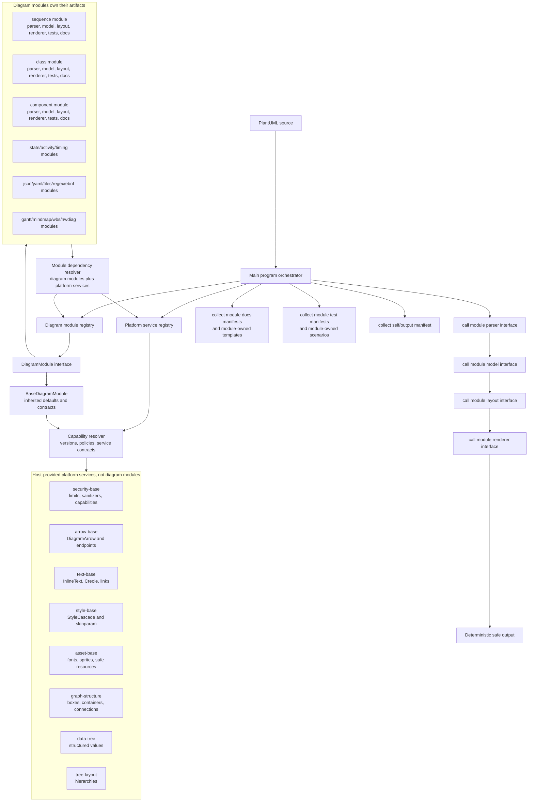
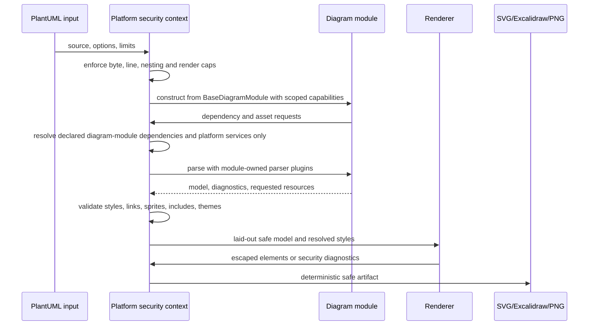

# Ticket: Modulare Diagramm-Architektur, Sicherheitsplattform und Dokumentation

## Ziel und Scope

Dieses Ticket ist das vorgelagerte Architektur-Ticket fuer alle kommenden PlantUML-Coverage-Tickets. Es soll eine robuste Programmarchitektur und Dokumentation schaffen, die Sequenzdiagramme, die teilweise vorhandenen Klassen- und Komponentendiagramme sowie alle neuen Diagrammtypen nach demselben modularen System traegt.

Ziel ist ein modulbasiertes, objektorientiertes System: Jeder PlantUML-Diagrammtyp wird als eigenes Diagrammtyp-Modul angebunden, zum Beispiel `sequence`, `class`, `component`, `state`, `activity`, `json`, `yaml`, `mindmap` oder `gantt`. Gemeinsame Basiskonzepte wie Pfeile, Text, Style, Security, Diagnostics, Limits und Render-Kontrakte sind keine Diagrammtyp-Module, sondern Platform Services und Capabilities. Die Module duerfen eigene Parser-, Modell-, Layout- und Renderer-Bausteine besitzen, muessen aber denselben Plattformvertrag, denselben Sicherheitsrahmen und dieselbe Dokumentationsstruktur erfuellen.

Jedes Modul soll seine eigene Ordnerstruktur mit Parser-Plugins, Modellklassen oder Modelladaptern, Layoutadaptern, Rendereradaptern, Tests, Coverage-Beispielen, Dokumentation und Assets mitbringen. Das Hauptprogramm darf diese Bausteine nicht direkt kennen, sondern sammelt die repo-internen Modulmanifeste zur Laufzeit ueber einen zentralen Modulindex ein und dockt danach ausschliesslich an einheitliche Schnittstellen an. Allgemeine Parser-, Renderer-, Doku- und Test-Infrastruktur orchestriert nur diese Schnittstellen; die fachliche PlantUML-Logik bleibt im jeweiligen Modulordner.

Diagrammtyp-Module sollen ausserdem andere Diagrammtyp-Module oder vom Hauptprogramm bereitgestellte Platform Services kontrolliert einbinden koennen. Diese Abhaengigkeiten laufen ueber eine explizite Dependency- und Service-Registry mit Capabilities, Versionen und Security-Profilen, nicht ueber versteckte direkte Imports in Parser- oder Rendererpfaden.

Nicht-Ziel ist ein Big-Bang-Rewrite. Das bestehende Sequenzdiagramm gilt als funktional weitgehend umgesetzt und soll zuerst als Referenzmodul eingekapselt werden. Klassen- und Komponentendiagramme sind bereits teilweise vorhanden und sollen als erste migrationsnahe Strukturmodule dienen. Die bestehenden Tickets muessen nach der Architekturentscheidung angepasst werden, damit sie nicht konkurrierende Einzelarchitekturen planen.

## Feedbackloop-Entscheidung: Diagrammtyp-Module besitzen Ordner

Der Begriff Modul ist verbindlich fuer PlantUML-Diagrammtypen reserviert. Ein Modul beantwortet immer die Frage: "Welcher Diagrammtyp verarbeitet diesen PlantUML-Input?" Host-Funktionen wie `security-base`, `style-base`, `text-base`, `arrow-base`, `asset-base`, `graph-structure`, `data-tree` und `tree-layout` sind Platform Services oder Capabilities und werden nicht in der `DiagramModuleRegistry` registriert.

Jeder Diagrammtyp bekommt eine eigene Ordnerstruktur unter einem gemeinsamen Diagramm-Modulverzeichnis, zum Beispiel:

```text
src/diagrams/
  sequence/
    module.mjs
    parser.mjs
    layout.mjs
    render.mjs
    tests/
    docs/
    assets/
  class/
    module.mjs
    parser.mjs
    layout.mjs
    render.mjs
    tests/
    docs/
    assets/
  component/
    module.mjs
    parser.mjs
    layout.mjs
    render.mjs
    tests/
    docs/
    assets/
  shared/
    graph_parser.mjs
    graph_runtime.mjs
```

Pro Modulordner gelten diese Regeln:

- `module.mjs` ist das oeffentliche Modulmanifest und exportiert genau ein Diagrammtyp-Modul.
- `parser.mjs`, `layout.mjs` und `render.mjs` gehoeren dem Diagrammtyp, auch wenn sie intern gemeinsame Platform Services oder Shared-Familienbausteine verwenden.
- Docs, Tests, Fixtures und Assets werden ueber Manifestfelder (`artifactRoot`, `ownedArtifacts`, `docs`, `tests`, `assets`) deklariert und muessen physisch im jeweiligen Modulbereich oder in einem eindeutig modulgespiegelten Generated-Output liegen. Das Manifest ist der Index, nicht der Ersatz fuer echte Modul-Ownership.
- `src/diagrams/index.mjs` ist die repo-interne Sammelstelle. Das Hauptprogramm laedt zur Laufzeit diese statisch bekannten Manifeste und baut daraus die `DiagramModuleRegistry`.
- Dieses Einsammeln ist closed-world: keine user-supplied Dateipfade, keine dynamischen Imports aus PlantUML-Input und kein Laden beliebiger npm- oder Dateisystemmodule.
- Class und Component bleiben getrennte Diagrammtyp-Module, auch wenn sie in der ersten Phase gemeinsame Graph-Parser-Plugins, Modellfamilien oder Rendererprimitive teilen.

Zielstruktur innerhalb eines konkreten Diagrammtyp-Moduls:

```text
src/diagrams/<kind>/
  module.mjs
  parser.mjs
  layout.mjs
  render.mjs
  security.mjs
  assets.mjs
  docs.mjs
  tests.mjs
  plugins/
  tests/
    unit.test.mjs
    integration.test.mjs
    security.test.mjs
    scenarios/<feature>/*.puml
    fixtures/
    expected/
  docs/
    index.template.md.njk
    partials/
    features/<feature>/
      scenarios/*.puml
      notes.md
    assets/
  assets/
```

Abgeleitete Doku- und Review-Artefakte liegen parallel in einem modulgespiegelten Output-Bereich:

```text
docs/ressources/generated/modules/<kind>/
  puml/<feature>/*.puml
  excalidraw/<feature>/*.excalidraw
  svg/<feature>/*.svg
  png/<feature>/*.png
```

Root-nahe `tests/` bleiben fuer Public-API-, Security-wide-, Migration- und Cross-Module-Gates erlaubt. Fachliche Featuretests gehoeren jedoch zum Modul und werden ueber `ModuleTestManifest` eingesammelt.

## Offizielle Quellen

- `AGENTS.md` als verbindliche Layer-Architektur: Parser, Modell, Layout, Renderer, CLI und Docs bleiben getrennt.
- `src/main/parser.mjs`, `src/util/parser_engine.mjs` und `src/diagrams/<kind>/plugins/` als heutige Parser-Plugin-Basis.
- `src/general/model/diagram.mjs` als heutige Modellbasis fuer Diagramme, Boxen, Connections, Sequenzobjekte und Pfeile.
- `src/general/layout/elk_layout.mjs`, `src/diagrams/sequence/layout_engine.mjs` und `src/general/layout/sizing.mjs` als heutige Layout-Basis.
- `src/general/render/excalidraw.mjs`, `src/diagrams/sequence/render_excalidraw.mjs`, `src/general/render/svg.mjs`, `src/general/render/png.mjs` und `src/general/render/canvas_svg.mjs` als heutige Renderer-Basis.
- `src/general/style/` als heutige Text-, Font-, Color- und Style-Basis.
- Bestehende Sequenz-Coverage-Dateien und `tests/sequence_components.test.mjs` als Muster fuer modulare Beispiele, Tests und generierte Dokumentation.
- Alle Einzeltickets in `docs/tickets/` als zukuenftige Konsumenten dieser Architektur.

## Feature-Inventar mit PUML-Beispielen

Dieses Architektur-Ticket definiert keine neue PlantUML-Syntax. Die Beispiele zeigen, welche vorhandenen und kommenden Diagrammtypen ueber denselben Modulvertrag laufen muessen.

### Sequenzdiagramm als Referenzmodul



Erwartung: Das bereits weitgehend vollstaendige Sequenzsystem wird nicht neu erfunden. Es wird ueber einen `sequence`-Diagrammtyp-Adapter in den neuen Modulvertrag eingebunden und bleibt Referenz fuer Coverage, deterministisches Layout, Sicherheitschecks und generierte Beispiele.

### Klassen- und Komponentendiagramme als erste Strukturmodule

```plantuml
@startuml
class User {
  +id: string
  +login(): Session
}
interface Repository
User --> Repository : uses

component API
component Worker
API --> Worker : dispatch
@enduml
```

Erwartung: Klassen- und Komponentendiagramme nutzen gemeinsame Strukturbausteine fuer deklarierte Elemente, Container, Notes, Styles und Pfeile. Bestehender Teilcode wird migriert, nicht geloescht.

### Modulvertrag fuer neue Diagrammtypen



Erwartung: Neue Diagrammtypen wie State, Activity, JSON, YAML, Gantt, Mindmap, WBS, Timing, Salt oder ArchiMate erhalten eigene Module. Jedes Modul meldet Parser-Starttokens, Modelltyp, Layoutstrategie, Rendererfaehigkeiten, Security-Profil und Coverage-Dokumentation an.

### Gemeinsame Pfeil- und Textbasis



Erwartung: Pfeilformen, Arrowheads, Labels, Creole, Links, Farben, Linienarten und Security-Escaping gehoeren in eine gemeinsame Arrow-/Inline-Text-Schicht. Diagrammmodule duerfen diese Semantik konfigurieren, aber nicht pro Renderer neu nachparsen.

### Gemeinsame Sicherheitsgrenzen



Erwartung: Module erhalten keine Sonderrechte beim Parsen oder Rendern untrusted input. SVG-/HTML-aehnliche Ausgabe, Links, Stylewerte, Sprites, Includes, Themes und grosse Inputs laufen durch denselben Sicherheitskontext.

## Architekturplan

### Modulvertrag

Ein Diagrammtyp wird als Modul registriert. Der Vertrag soll in JSDoc und ESM ausdrueckbar sein und ohne TypeScript-Source funktionieren.

Geplanter Kernvertrag:

```js
/**
 * @typedef {object} DiagramModule
 * @property {string} kind Stable diagram kind, for example "sequence" or "component".
 * @property {string[]} startDirectives Supported @start... directives.
 * @property {ParserPlugin[]} parserPlugins Ordered parser plugins for this module.
 * @property {(context: ModuleParseContext) => object} createModel Model factory.
 * @property {(model: object, context: ModuleLayoutContext) => object} layout Layout adapter.
 * @property {ModuleRendererSet} renderers Excalidraw, SVG and PNG adapters.
 * @property {ModuleSecurityProfile} security Security limits and capabilities.
 * @property {ModuleDocsManifest} docs Coverage and documentation metadata.
 * @property {ModuleTestManifest} tests Module-owned unit, integration and security tests.
 * @property {ModuleAssetManifest} assets Fonts, sprites, icons, fixtures and other declared assets.
 * @property {ModuleDependencySpec[]} dependencies Host or module dependencies requested by this module.
 */
```

Der Vertrag muss klein bleiben: Er beschreibt Registrierung, Capabilities, eigene Artefakte, Abhaengigkeiten und Grenzen. Er ersetzt nicht die vorhandenen Layer, sondern verbindet sie kontrolliert.

### Basismodul und Vererbung

Alle Diagrammmodule sollen von einem gemeinsamen Basismodul erben oder einen gleichwertigen Base-Adapter verwenden. Dieses Basismodul definiert die Schnittstellen, liefert sichere Defaults und bindet das zentrale Sicherheitskonzept ein.

Geplanter Basismodul-Vertrag:

```js
/**
 * @abstract
 */
export class BaseDiagramModule {
  /** @param {BaseDiagramModuleOptions} options */
  constructor(options) {
    this.kind = options.kind;
    this.securityBase = options.securityBase;
    this.assets = options.assets;
    this.dependencies = options.dependencies;
  }

  /** @returns {ParserPlugin[]} */
  parserPlugins() {
    return [];
  }

  /** @param {ModuleParseContext} context @returns {object} */
  createModel(context) {
    throw new Error("Diagram modules must implement createModel.");
  }

  /** @param {object} model @param {ModuleLayoutContext} context @returns {object} */
  layout(model, context) {
    return model;
  }

  /** @returns {ModuleSecurityProfile} */
  securityProfile() {
    return this.securityBase.defaultProfileFor(this.kind);
  }

  /** @returns {ModuleDocsManifest} */
  docsManifest() {
    return { examples: [], generatedPages: [] };
  }

  /** @returns {ModuleTestManifest} */
  testManifest() {
    return { unit: [], integration: [], security: [] };
  }
}
```

Das Basismodul vererbt einheitliche Dinge wie Diagnostics, Asset-Aufloesung, SecurityContext-Erzeugung, Style-/Text-Helfer, stabile ID-Hooks und Standard-Fallbacks. Spezifische Diagrammtypen ueberschreiben nur die fachlichen Teile. Falls eine reine Klassenhierarchie zu starr wird, darf intern Komposition verwendet werden; nach aussen muss der gleiche Base-Vertrag gelten.

### Modul-eigene Artefakte und Hauptprogramm-Schnittstellen

Jedes Modul bringt seine fachlichen Artefakte selbst mit:

- Parser: eigene geordnete Parser-Plugins, Startdirective-Erkennung und diagrammtypische Parser-Kontexte.
- Modell: eigene Modellklassen oder Adapter auf gemeinsame Modellfamilien.
- Layout: eigene Layoutstrategie plus Zugriff auf gemeinsame Sizing- und Textmessung.
- Renderer: eigene Excalidraw-/SVG-Adapter oder bewusst deklarierte Fallbacks.
- Tests: eigene Unit-, Integration-, Snapshot-/Contract- und Security-Testgruppen unter `src/diagrams/<kind>/tests/`; Root-Tests importieren oder orchestrieren diese nur.
- Doku: eigene `docs/`-Unterstruktur mit Haupttemplate, Feature-Szenarien, Partials, Notes und modulgespiegelten Generated-Outputs; `DocsManifest` beschreibt diese Quellen, Coverage-Status, generierte Seiten und bekannte Luecken.
- Assets: eigenes AssetManifest fuer Sprites, Icons, Fonts, Fixture-Dateien und sichere Fallbacks.

Das Hauptprogramm darf nur ueber diese Interfaces arbeiten:

1. Modul aus Registry laden.
2. SecurityContext aus Basismodul und ModuleSecurityProfile erzeugen.
3. ParserPlugins aus Modul holen und ausfuehren.
4. Modell an Layoutadapter des Moduls uebergeben.
5. Layoutiertes Modell an Rendereradapter des Moduls uebergeben.
6. DocsManifest und TestManifest fuer Doku- und Testautomation konsumieren, ohne modulfachliche Szenarien in zentralen Scripts zu duplizieren.

Allgemeine Doku-, Parser-, Renderer- und Test-Infrastruktur darf keine PlantUML-Fachlogik pro Diagrammtyp enthalten. Sie prueft nur, ob Module ihre Schnittstellen erfuellen, Beispiele bereitstellen und Security-Gates passieren.

### Modulabhängigkeiten, Platform Services und Capabilities

Diagrammtyp-Module koennen Funktionen vom Hauptprogramm, von Platform Services oder von anderen Diagrammtyp-Modulen verwenden, aber nur ueber eine explizite Dependency-Schnittstelle:

```js
/**
 * @typedef {object} ModuleDependencySpec
 * @property {string} kind Diagram module or platform service kind.
 * @property {string} versionRange Supported semantic version range.
 * @property {string[]} capabilities Requested capability names.
 * @property {boolean} optional Whether the module can degrade without it.
 */
```

Beispiele:

- Component und Class bleiben getrennte Diagrammtyp-Module und koennen beide den Platform Service `graph-structure` fuer Boxen, Container, Notes und Connections anfordern.
- JSON und YAML bleiben getrennte Diagrammtyp-Module und koennen beide den Platform Service `data-tree` fuer strukturierte Werte, Folding und Value-Rendering nutzen.
- Mindmap, WBS und Files bleiben getrennte Diagrammtyp-Module und koennen alle den Platform Service `tree-layout` verwenden.
- Alle Diagrammtyp-Module koennen `security-base`, `style-base`, `text-base`, `arrow-base` und `asset-base` als Platform Services anfordern.
- Ein Diagrammtyp-Modul darf ein anderes Diagrammtyp-Modul nur ueber dessen oeffentlichen Modulvertrag nutzen, zum Beispiel fuer kontrollierte Kompatibilitaets- oder Bridge-Szenarien.

Die Dependency-Registry validiert, ob Version, Capabilities und Security-Profil zusammenpassen. Ein Modul darf nicht heimlich interne Dateien eines anderen Moduls oder eines Platform Services importieren, wenn dafuer keine deklarierte Schnittstelle existiert.

Festgelegte Methodik fuer die erste Architekturphase: closed-world registry. Alle Module sind repo-intern, statisch registriert und als explizite ESM-Imports bekannt. Beliebiges Runtime-Nachladen fremder Module, user-provided plugin paths oder dynamische npm-Erweiterungen werden in dieser Phase nicht zugelassen. Das ist die skalierbarste und sicherste Basis, weil Contracts, SecurityProfile, Self-Diagramme, Tests und Dokumentation dadurch vollstaendig und deterministisch aus der Registry ableitbar bleiben.

### Objektorientierte Basisbausteine

- `BaseDiagram` oder ein gemeinsamer Diagramm-Contract fuer Titel, Caption, Legend, Style, Diagnostics, Source-Metadaten und stabile IDs.
- `BaseNode`/`BoxLike` fuer diagrammuebergreifende sichtbare Elemente wie Component, Class, State, Object, JSON-Node oder Salt-Control.
- `BaseContainer` fuer Packages, Frames, Nodes, Groups, Partitions, Mindmap/WBS-Branches und andere verschachtelte Bereiche.
- `DiagramArrow` als zentrale Pfeilsemantik fuer head/tail, line style, direction hints, labels, endpoint labels, stereotypes, colors und hidden/layout-only edges.
- `InlineText` oder `RichTextSpan` als gemeinsame Zwischenform fuer Plaintext, Creole, Links, OpenIconic, Sprite-Fallbacks und escaping-relevante Fragmente.
- `StyleCascade` als gemeinsamer Zieltyp fuer `<style>`, `skinparam`, inline Farben und diagrammspezifische Defaults.
- `Diagnostic` als gemeinsames Format fuer unknown lines, unsupported features, security denials und degraded rendering.

### Mermaid-Architekturdiagramm



### Mermaid-Sicherheitsdiagramm



## Parser-Plan

- `parsePlantUml` soll Diagrammtyp-Erkennung und Modulregistrierung trennen: Erkennung entscheidet `kind`, das Modul liefert die Parser-Plugins.
- Default-Pluginlisten fuer Component und Sequence werden schrittweise in Modul-Manifeste ueberfuehrt.
- Parser-Plugins bleiben fokussiert und geordnet; Block-Plugins laufen vor generischen Regex-Plugins, greedy connection parsing bleibt zuletzt.
- Gemeinsame Parser fuer Commons, Preprocessing, Style, Skinparam, Creole, Links, Farben, Sprites und Subdiagramme werden nicht in Diagrammmodulen dupliziert.
- Module duerfen Syntax nur ueber `ModuleParseContext` mutieren, damit Limits, Diagnostics und Security-Entscheidungen zentral bleiben.
- Unsupported Features erzeugen strukturierte Diagnostics mit Modulname, Feature-Key, Severity und optionalem Fallback-Hinweis.
- Der generische Parser kennt keine diagrammtypischen Regeln mehr ausser der Startdirective-Erkennung und Registry-Auswahl; Diagrammfachlogik lebt in Modul-Parsern.
- Parser-Plugins koennen Host-Basisparser wie `style-base`, `text-base`, `arrow-base` oder `preprocessing-base` ueber deklarierte Dependencies verwenden.

## Modell-Plan

- Bestehende Modellklassen bleiben zunaechst stabil; neue Basisklassen oder JSDoc-Contracts werden additiv eingefuehrt.
- Sequenzmodelle werden nicht in `Diagram -> Box -> Connection` gepresst. Sie behalten ihre zeit-/teilnehmerbasierte Struktur und implementieren denselben Modulvertrag ueber Adapter.
- Klassen- und Komponentendiagramme verwenden die vorhandene Strukturmodellfamilie und werden um fehlende gemeinsame Pfeil-, Style-, Text- und Security-Metadaten erweitert.
- Neue Diagrammtypen waehlen passende Modellfamilien: Graph/Box, Tree, Timeline, Grid/Table, Document/Data oder External-Bridge.
- Angreifer-kontrollierte Namen bleiben in `Map` oder kontrollierten Klasseninstanzen; keine Prototype-Pollution-Anfaelligkeit durch plain object dictionaries.

## Layout-Plan

- Jedes Modul deklariert eine Layoutstrategie: `elkGraph`, `sequenceTimeline`, `tree`, `timeline`, `grid`, `document`, `externalBridge` oder eine spaeter erweiterbare Variante.
- Layoutmodule lesen nur das Modell und geloeste Styles, keine PlantUML-Rohsyntax.
- Gemeinsame Sizing-, Textwrapping- und Pfeilbudget-Helfer werden ausgebaut, damit Labels und Arrowheads diagrammuebergreifend gleich reagieren.
- Layout-only edges, hidden arrows und Richtungshinweise werden im Modell explizit markiert und im Renderer kontrolliert ignoriert.
- Teure Layoutpfade erhalten modulare Limits fuer Knotenzahl, Kantenanzahl, Nesting, Textlaenge und Bildgroessen.

## Renderer-Plan

- Renderer erhalten ein bereits layoutiertes Modell, geloeste Styles, einen SecurityContext und deterministische ID-/RNG-Helfer.
- Excalidraw-, SVG- und PNG-Ausgabe werden pro Modul als Adapter angebunden, aber gemeinsame Primitive wie rect, text, arrow, ellipse, line, marker und rich text bleiben zentral.
- SVG bleibt die wichtigste Injection-Grenze: jeder Text, jedes Attribut, jede URL und jeder Stylewert muss vor Ausgabe validiert oder escaped sein.
- PNG rendert nur aus validem, bereits gesichertem SVG und darf keine eigene Semantik einfuehren.
- External-Bridge-Module wie Ditaa oder DOT muessen klar deklarieren, ob sie nativ unterstuetzt, als textueller Fallback gerendert oder bewusst als Nicht-Ziel markiert werden.
- Fuer die erste Architekturphase werden Ditaa- und DOT-Module als sichere Kompatibilitaetsmodule geplant: Parser, Modell, Diagnostics, Dokumentation und optional textuelle oder graphische Fallback-Ausgabe sind erlaubt; das Starten externer Prozesse oder Toolchains gehoert nicht zur Grundarchitektur. Native Bridge-Ausfuehrung ist erst dann zulaessig, wenn eine hermetische, deterministische und sicher begrenzte Ausfuehrungsstrategie definiert und separat freigegeben ist.
- Der allgemeine Renderer ruft nur Modul-Rendereradapter auf und stellt gemeinsame Renderprimitive bereit; er enthaelt keine diagrammtypischen `if kind === ...`-Sonderpfade.
- Modul-Renderer koennen gemeinsame Renderer von Basismodulen nutzen, etwa graphbasierte Box-/Arrow-Renderer oder data-tree Renderer, solange diese als Dependencies deklariert sind.

## Modulares Sicherheitskonzept

Die Sicherheitsbasis wird als importierbarer Platform Service geplant: `security-base`. Sie ist kein Diagrammtyp-Modul und kein loser Helper-Sack, sondern ein versionierter Service mit oeffentlichem Vertrag, Defaults und austauschbaren Policies. Dadurch koennen neue Sicherheitsprobleme zentral beantwortet und bei Bedarf pro Diagrammtyp-Modul verschaerft werden.

### SecurityContext

Ein zentraler `SecurityContext` begleitet Parse, Layout und Rendering. Er enthaelt Input-Limits, Render-Limits, erlaubte Capabilities, Diagnostics, Sanitizer, Resource-Policy, Failure-Policy und Kostenbudget.

Pflichtentscheidungen:

- Default ist deny-by-default fuer externe Ressourcen, Netzwerkzugriff, Dateisystemzugriff, Remote-Themes, Includes und Bilder.
- Module duerfen Capabilities anfragen, aber die Plattform entscheidet, ob sie erlaubt sind.
- Jede Denial erzeugt eine Diagnostic und einen sicheren Fallback oder einen kontrollierten Fehler.
- Jede unerwartete Exception an Modulgrenzen wird in eine strukturierte Diagnostic und einen fail-closed Zustand uebersetzt; rohe Exceptions duerfen nicht bis in Renderer- oder CLI-Ausgabe durchsickern.
- Parser- und Renderer-Pfade fuer untrusted input duerfen keine direkten Dateisystem- oder Netzwerkzugriffe erhalten.
- Stylewerte werden typisiert validiert: Farben, Laengen, Linienmuster, Fonts, URLs und Opacity sind keine freien Strings in SVG.
- Link-Protokolle werden allowlist-basiert behandelt; gefaehrliche Protokolle werden neutralisiert.
- Regex- und Scanner-Pfade erhalten Laengenlimits und ReDoS-Tests.
- Asset-Zugriff laeuft ausschliesslich ueber `asset-base` und den SecurityContext; direkte Pfadauflosung in Diagrammmodulen ist nicht erlaubt.
- Security-Funktionen werden importiert, nicht kopiert: Sanitizer, URL-Validator, Style-Validator, resource policy, limit accounting, diagnostic helpers und escaping helpers bleiben Teil von `security-base`.
- Remote-Themes, Remote-Includes, Remote-Assets und Dateisystem-Includes sind in der ersten Architekturphase deaktiviert. Erlaubt sind nur paketierte Repo- oder Modul-Assets sowie explizit deklarierte eingebettete Defaults.

### Failure-Safety und Fail-Closed-Policy

Security muss auch Betriebsfehler abdecken. Ein kaputtes Modul, ein Layout-Abbruch oder eine unerwartete Renderer-Exception darf nicht zu halbfertiger, unsicherer oder nicht deterministischer Ausgabe fuehren.

Pflichtregeln:

- Parse, Layout und Render laufen jeweils in einer Plattform-Failure-Boundary mit Modulname, Phase, Cost-Budget und SecurityContext.
- Fatal markierte Diagnostics stoppen die Ausgabe der betroffenen Renderform. Stattdessen entsteht ein kontrollierter Fehler oder ein explizit als sicher markierter Fallback.
- Unsupported Features duerfen degradieren, Security-Denials und verletzte Invarianten muessen fail-closed behandelt werden.
- Ein Modul darf keine globalen Mutable-Singletons fuer Parser-, Style-, Security- oder Rendererzustand verwenden; Modulmanifeste und Registry-Eintraege werden nach Registrierung eingefroren.
- Modelle, Layouts und Renderer-Ausgaben muessen validierbare Invarianten besitzen: keine negativen oder nicht endlichen Geometriewerte, keine unaufgeloesten Asset-Handles, keine unsanitized URLs, keine rohen SVG-/HTML-Fragmente.
- Teure Operationen nutzen `accountCost`, Tiefen-/Laengenlimits und bei Bedarf `AbortSignal`-faehige Grenzen, damit Algorithmic-Complexity-Angriffe kontrolliert abbrechen.
- Fehlerpfade muessen deterministisch sein: gleicher fehlerhafter Input erzeugt dieselben Diagnostics und keine zufaelligen Teilartefakte.
- CLI und Public API geben strukturierte Fehler zurueck; interne Stacktraces werden nicht in generierte SVG-/Excalidraw-/PNG-Artefakte geschrieben.

### Hacking-Safety und Threat Model

Die Plattform betrachtet PlantUML-Eingaben, Styles, Links, Labels, Sprites, Diagrammnamen, Aliasnamen und externe Optionen als untrusted. Das Threat Model muss mindestens diese Angriffsklassen abdecken:

- SVG-/HTML-/XML-Injection ueber Text, Attribute, URLs, Styles, Marker, Fonts und Rich-Text-Segmente.
- JavaScript-, data-, file- und protocol-smuggling in Links oder Asset-Referenzen.
- ReDoS, Parser-Backtracking, tiefe Verschachtelung, extrem lange Labels und algorithmische Layout-Explosion.
- Prototype Pollution und Key-Collision-Angriffe ueber Aliasnamen, JSON/YAML-Strukturen, Style-Selektoren und Map-Schluessel.
- Path Traversal und Include-/Theme-/Asset-Missbrauch ueber relative Pfade, symlinks, absolute Pfade oder URL-Normalisierung.
- Supply-Chain- und Native-Renderer-Risiken durch neue Dependencies, optionale Bridges, Canvas/PNG-Renderer und transitive Pakete.
- Information Disclosure ueber Fehlermeldungen, absolute lokale Pfade, Stacktraces oder eingebettete Build-Umgebungsdaten.

Schutzmethodik:

- Trust Boundaries werden dokumentiert: input boundary, module boundary, dependency boundary, renderer boundary, file/output boundary.
- Capabilities sind explizite Tokens aus der Registry, keine booleschen Ad-hoc-Flags in Modulen.
- Untrusted Schluessel werden in `Map` oder kontrollierten Klassen gespeichert; plain object dictionaries brauchen `Object.create(null)` und Contract-Tests.
- URL-, Pfad- und Style-Normalisierung erfolgt vor Speicherung im Modell oder spaetestens vor Uebergabe an Rendererprimitive.
- Rendererprimitive akzeptieren bevorzugt bereits typisierte Safe-Werte statt freie Strings fuer SVG-Attribute, URLs und CSS-aehnliche Werte.
- Neue Dependencies mit Parser-, SVG-, Canvas-, PNG-, Font-, XML-, YAML- oder Native-Anteil brauchen explizite Sicherheitspruefung, Audit-Gate und Regressionstests.
- `eval`, `new Function`, dynamische Imports aus Userdaten, direkte `child_process`-Nutzung und Netzwerkzugriff sind in Modulpfaden verboten, ausser ein spaeteres Bridge-Sandbox-Ticket erlaubt sie ausdruecklich.

### ModuleSecurityProfile

Jedes Modul definiert ein Security-Profil:

```js
/**
 * @typedef {object} ModuleSecurityProfile
 * @property {number} maxNodes
 * @property {number} maxEdges
 * @property {number} maxNestingDepth
 * @property {number} maxTextLength
 * @property {number} maxCostUnits
 * @property {number} maxParseMillis
 * @property {number} maxLayoutMillis
 * @property {number} maxRenderMillis
 * @property {boolean} allowsExternalResources
 * @property {string[]} allowedLinkProtocols
 * @property {string[]} supportedInlineAssets
 * @property {string[]} securityTestCases
 * @property {ModuleFailurePolicy} failurePolicy
 */
```

```js
/**
 * @typedef {object} ModuleFailurePolicy
 * @property {"fallback"|"fatal"} unsupportedFeature How unsupported syntax degrades.
 * @property {"fatal"} securityDenial Security denials must fail closed.
 * @property {"fatal"} invariantViolation Broken model, layout or renderer invariants fail closed.
 * @property {boolean} suppressInternalStacks Whether generated artifacts may include internal stacks; must be true by default.
 */
```

Dieses Profil ist Teil des Moduls und Teil der Dokumentation. Neue Sicherheitsprobleme koennen dadurch modular beantwortet werden: Ein Fix kann im gemeinsamen Sanitizer, im Profil eines Diagrammtyps oder in einem spezifischen Parser-/Renderer-Adapter erfolgen, ohne andere Module heimlich zu beeinflussen.

### SecurityBase API

`BaseDiagramModule` bindet `security-base` ueber die PlatformServiceRegistry ein und stellt Diagrammtyp-Modulen nur einen begrenzten Kontext bereit:

```js
/**
 * @typedef {object} SecurityBase
 * @property {(profile: ModuleSecurityProfile, input: object) => SecurityContext} createContext
 * @property {(value: string, context: SecurityContext) => string} escapeText
 * @property {(value: string, context: SecurityContext) => string} escapeAttribute
 * @property {(url: string, context: SecurityContext) => SanitizedUrl} sanitizeUrl
 * @property {(style: object, context: SecurityContext) => object} sanitizeStyle
 * @property {(asset: ModuleAssetRequest, context: SecurityContext) => ModuleAssetResult} resolveAsset
 * @property {(amount: number, context: SecurityContext) => void} accountCost
 * @property {(capability: string, context: SecurityContext) => void} assertCapability
 * @property {(phase: string, context: SecurityContext) => FailureBoundary} createFailureBoundary
 * @property {(artifact: object, context: SecurityContext) => void} assertSafeArtifact
 * @property {(diagnostic: Diagnostic, context: SecurityContext) => void} reportDiagnostic
 */
```

Module koennen diese Funktionen nutzen und ihre Profile verschaerfen, aber sie duerfen keine eigenen alternativen Sanitizer mit abweichendem Verhalten einfuehren. Wenn ein Modul eine neue Sicherheitsfunktion braucht, wird sie in `security-base` ergaenzt und danach versioniert verfuegbar gemacht. `assertSafeArtifact` ist die letzte Schranke vor Excalidraw-, SVG- oder PNG-Ausgabe und prueft, ob keine unsicheren Rohwerte, nicht endlichen Geometrien oder unaufgeloesten Ressourcen enthalten sind.

### AssetManifest

Assets werden ebenfalls ueber einheitliche Schnittstellen definiert:

```js
/**
 * @typedef {object} ModuleAssetManifest
 * @property {string[]} fonts Declared font families or packaged font assets.
 * @property {string[]} sprites Declared sprite namespaces.
 * @property {string[]} icons Declared icon sets.
 * @property {string[]} fixtures Test and documentation fixtures owned by the module.
 * @property {boolean} allowsRemoteAssets Whether remote assets are requested; default false.
 */
```

`asset-base` prueft zusammen mit `security-base`, ob ein Asset erlaubt, paketiert, testbar und reproduzierbar ist. Renderer erhalten nur bereits validierte Asset-Handles oder sichere textuelle Fallbacks.

## Festgelegte Architekturentscheidungen

### 1. Geschlossene Modulwelt in Phase 1

Die Architektur startet bewusst als geschlossene Modulwelt. Das bedeutet:

- nur repo-interne, statisch registrierte Module,
- keine beliebigen Runtime-Plugins,
- keine user-supplied Importpfade,
- keine dynamische Fremdcode-Ausfuehrung im Parser- oder Rendererpfad.

Diese Entscheidung ist am sichersten und am besten skalierbar, weil Registry, Dependency-Graph, Security-Profile, Self-Diagramme, Tests und Doku immer vollstaendig bekannt und reproduzierbar bleiben.

### 2. Familienbasierte Modularchitektur statt Universalmodell

Es wird kein universelles Einheitsmodell fuer alle PlantUML-Diagramme erzwungen. Stattdessen werden Modul-Familien festgelegt:

- `GraphModuleBase` fuer Box-/Connection-Diagramme,
- `TimelineModuleBase` fuer Sequence, Timing, Activity-Teile und Gantt-artige Zeitachsen,
- `TreeModuleBase` fuer Mindmap, WBS und Files,
- `DataModuleBase` fuer JSON, YAML, EBNF und Regex-artige strukturierte Inhalte,
- `ExternalBridgeModuleBase` fuer kontrollierte Kompatibilitaets- oder Fallback-Module wie Ditaa und DOT.

Alle Familien erben vom gemeinsamen `BaseDiagramModule`, aber jede Familie darf eine eigene Modell- und Layoutlogik definieren. Das verhindert unnatuerliche Box-/Connection-Zwange und bleibt trotzdem konsistent.

### 3. Parse-time-Normalisierung von Style und Skinparam

`<style>`, `skinparam`, inline styles, Farben und Stil-Fallbacks werden parse-seitig in eine gemeinsame `StyleCascade` normalisiert. Renderer erhalten nur bereits aufgeloeste Styles.

Festlegung:

- keine renderer-spezifischen `skinparam`-Sonderhacks,
- keine spaete Stilinterpretation im SVG- oder Excalidraw-Renderer,
- nicht abbildbare `skinparam`-Parameter erzeugen Diagnostics statt stiller Sonderpfade.

Das ist die sauberste und skalierbarste Methodik, weil neue Diagrammtypen dieselbe Stilbasis wiederverwenden koennen.

### 4. Sicherheitsentscheidung fuer Bridges, Includes und Assets

Externe Ressourcen bleiben standardmaessig aus. Includes, Themes und Assets werden nur unter diesen Regeln zugelassen:

- remote und dateisystembasierte Includes sind in Phase 1 deaktiviert,
- Assets muessen paketiert und im `ModuleAssetManifest` deklariert sein,
- Ditaa und DOT starten ohne externe Prozessausfuehrung,
- sichere Fallbacks und klare Diagnostics sind Pflicht,
- jede spaetere Freigabe externer Bridge-Ausfuehrung benoetigt eine eigene hermetische Sandbox-Entscheidung.

### 5. Root-eigenes Self-System als Pflichtbestandteil

Self-Diagramme, Self-Tests und repo-eigene Architekturdiagramme werden nicht als Nice-to-have behandelt, sondern als Pflichtbestandteil der Plattform.

Festlegung:

- Self-Diagramme werden ausschliesslich aus DiagramModuleRegistry, PlatformServiceRegistry, Dependencies, DocsManifests, TestManifests, AssetManifests und Security-Profilen erzeugt,
- neue Module muessen automatisch in Self-Diagrammen erscheinen,
- fehlende Sichtbarkeit eines Moduls in Self-Introspection ist ein Contract-Fehler.
- Die Self-Generierung wird als eigenes Root-Subsystem geplant, zum Beispiel `self/`, mit eigenen Collectors, Diagrammdefinitionen, Templates, Tests und `output/`.
- `docs` sammelt Self-Ergebnisse nur aus `self/output/manifest.json` ein; `docs/scripts` enthaelt langfristig keine Self-Sonderlogik mehr.

### 6. Ticket-Harmonisierung ist verbindlich, nicht optional

Dieses Architektur-Ticket wird zur verbindlichen Quelle fuer Modulvertrag, Sicherheitsmethodik und Migrationsstrategie. Die Einzeltickets muessen daran angepasst werden, bevor ihre Implementierung als architekturkonform gilt.

### 7. Failure-Safety ist Teil der Security

Programmfehler werden nicht als getrenntes Qualitaetsthema behandelt, sondern als Sicherheitsgrenze. Jede Modulphase bekommt Failure-Boundaries, Kostenbudgets und Artifact-Validierung.

Festlegung:

- Security-Denials, Invariantenbrueche und unerwartete Exceptions enden fail-closed,
- degradierende Fallbacks sind nur fuer bewusst unsupported Features erlaubt,
- keine Renderform darf halb erzeugte oder unsichere Teilartefakte ausgeben,
- interne Stacktraces, absolute Pfade und Build-Umgebungsdetails duerfen nicht in generierte Artefakte gelangen.

### 8. Threat Model und Supply-Chain-Gates sind Pflicht

Jedes neue Modul und jede neue Dependency muss gegen das Plattform-Threat-Model bewertet werden. Besonders kritisch sind Parser-, SVG-, XML-, YAML-, Canvas-, PNG-, Font-, Bridge- und Native-Dependencies.

Festlegung:

- keine neuen dynamischen Codepfade ohne explizite Architekturentscheidung,
- keine direkte `child_process`-, Netzwerk- oder Dateisystemnutzung in Modulpfaden,
- neue Dependencies brauchen Audit, Security-Begruendung und Tests fuer die relevante Angriffsklasse,
- Fuzz-, Corpus- und Crash-Regressionen werden Teil der Security-Gates.

## Restrisiken nach Entscheidungen

- Der groesste verbleibende Risikohebel ist nicht Architekturunklarheit, sondern die Migrationsreihenfolge. Deshalb bleibt Sequence das Referenzmodul und Class/Component die ersten Migrationskandidaten.
- Die geschlossene Modulwelt reduziert Risiko stark, verschiebt aber die Frage nach spaeteren Fremdmodulen bewusst in eine eigene spaetere Architekturentscheidung.
- Bridge-Module wie Ditaa und DOT werden sicher, aber zunaechst konservativ starten. Feature-Paritaet kann dort spaeter langsamer wachsen als bei rein internen Diagrammfamilien.
- `skinparam`-Kompatibilitaet bleibt ein grosser Umfangstreiber. Das Risiko wird aber in eine zentrale Normalisierung plus Diagnostics verschoben statt in unkontrollierte Rendererlogik.
- Ticket-Harmonisierung bleibt operative Arbeit, auch wenn die methodischen Entscheidungen nun feststehen.

## Feedbackloop: Spezifischer Code ausserhalb der Modulordner

Die Architektur wird nach jedem Umbau gegen eine konkrete Liste geprueft: Was ist diagrammtypisch und gehoert in einen Modulordner, was ist echte Plattform, und was ist so allgemein, dass es nach `src/general/` oder `src/util/` gehoert?

Aktueller Untersuchungsstand:

- `src/general/platform/` ist generisch: Security, Diagnostics, Assets und PlatformServiceRegistry enthalten keine fachliche PlantUML-Diagrammlogik.
- `src/diagrams/sequence/` besitzt jetzt Sequence-Parser-Kontext, Sequence-Parser-Plugins, Layout-Engine, Spacing-Kontrakt und Excalidraw-Rendererimplementierung.
- `src/diagrams/class/` besitzt jetzt Class-Modulmanifest, Class-Parser-Adapter, Class-Layout-/Render-Adapter und Class-Style-Defaults.
- `src/diagrams/component/` besitzt jetzt Component-Modulmanifest, Component-Parser-Adapter und Component-Layout-/Render-Adapter.
- `src/diagrams/shared/` besitzt graph-familiennahe Parser-, Kontext- und Runtime-Bausteine, die Class und Component teilen duerfen.
- `src/diagrams/shared/common_plugins/title.mjs` kapselt das diagrammuebergreifende `title`-Plugin, waehrend stabile Plugin-Namen in den Modulen erhalten bleiben.
- `src/util/plantuml_utils.mjs` enthaelt gemeinsame Parser-Helfer wie `collectBlockLines`, damit Block-Parser ihre Akkumulationslogik teilen koennen, ohne Context-Semantik zu vermischen.
- Die frueheren Legacy-Top-Level-Ordner `src/parser/`, `src/layout/`, `src/render/`, `src/model/`, `src/modules/`, `src/platform/` und `src/style/` sind entfernt. Oeffentliche Package-Subpaths duerfen weiter existieren, muessen aber direkt auf die neuen Primaerdateien zeigen.

Verbleibende, bewusst markierte Cleanup-Kandidaten:

- `src/general/model/diagram.mjs` enthaelt weiterhin Graph- und Sequence-Modellklassen. Naechster Cleanup-Schritt: Sequence-Modellklassen nach `src/diagrams/sequence/model.mjs` und Graph-Modellklassen nach `src/diagrams/shared/graph_model.mjs` pruefen, ohne die Root-API zu brechen.
- `src/general/render/excalidraw.mjs` enthaelt weiterhin Graph-Rendering und einen Kompatibilitaetsdispatch fuer `SequenceDiagram`. Naechster Cleanup-Schritt: Excalidraw-Primitive als Platform/Render-Service herausziehen und Graph-Rendering als shared Graph-Renderer in die Modulstruktur verschieben.
- `src/general/layout/elk_layout.mjs` enthaelt weiterhin graphbasiertes Layout und einen Kompatibilitaetsdispatch fuer Sequence. Naechster Cleanup-Schritt: Graph-Layout nach `src/diagrams/shared/graph_layout.mjs` pruefen.
- `src/general/layout/sizing.mjs` und `src/general/style/text.mjs` enthalten noch Class-Member-Wrapping und Class-Compartment-Logik. Naechster Cleanup-Schritt: Class-spezifische Text-/Sizing-Adapter in den Class-Modulordner verschieben und nur generische Textmessung im Style-Service belassen.

Feedbackloop-Regel: Jeder Strukturumbau bekommt einen Contract-Test, der sicherstellt, dass die alten Top-Level-Source-Ordner nicht wieder entstehen. Neue Diagrammtypen duerfen nicht unter `src/general/layout/<diagram>_*` oder zentralen Parserordnern wachsen, sondern muessen ihren Modulordner unter `src/diagrams/<kind>/` besitzen.

## Dokumentations- und Beispielplan

- Ein neues Architektur-Dokument soll die Modulvertraege, Schichten, Sicherheitsprofile, Migrationsregeln und Mermaid-Diagramme erklaeren.
- Jedes Diagrammmodul erhaelt eine physische `docs/`-Unterstruktur mit Haupttemplate, Partials, Feature-Szenarien, optionalen weiteren Markdown-Dateien, modulnahen Assets und einem Docs-Manifest mit Quellen, Featuregruppen, Beispielnamen, Coverage-Status, bekannten Fallbacks und Security-Testfaellen.
- Coverage-Seiten sollen aus denselben modul-eigenen Beispielen entstehen, die auch Tests nutzen, analog zum Sequenz-Coverage-Muster, aber nicht mehr als zentral hartcodierte `docs/scripts/<kind>-coverage-examples.mjs`-Listen.
- SVG-/Excalidraw-/PNG-Review-Artefakte werden in `docs/ressources/generated/modules/<kind>/...` mit derselben Featurestruktur geschrieben und ueber Build-Manifest validiert.
- Bestehende Tickets werden nach Einfuehrung des Architektur-Tickets angepasst: jedes Ticket soll seine Modulart, Layoutstrategie, Security-Profilanforderungen und Dokumentationsmanifest nennen.
- README- und API-Dokumentation werden nur ueber die bestehenden Template-/Build-Pfade aktualisiert.
- Die allgemeine Dokumentationspipeline konsumiert nur `ModuleDocsManifest`; die Inhalte, Beispiele, Featuretabellen und Templates gehoeren dem jeweiligen Modul.
- Die allgemeine Testpipeline konsumiert nur `ModuleTestManifest`; modulfachliche Assertions liegen im Modul oder in modulnahen Testdateien.
- Die gesamte Self-Diagramm-Generierung muss in ein root-eigenes Self-System wandern und voll dynamisch werden: statt handgepflegter oder teil-hartcodierter Architekturdiagramme sollen DiagramModuleRegistry, PlatformServiceRegistry, Dependency-Registry, DocsManifests, TestManifests, AssetManifests und Platform Services die Quelle fuer repo-eigene Architekturdiagramme sein.
- `docs/scripts/self-diagrams.mjs` soll durch `self/collectors`, `self/diagrams`, `self/templates`, `self/tests` und `self/output` ersetzt oder zu einem duennen Adapter darauf reduziert werden.
- `tests/self_introspection.test.mjs` soll dieselbe dynamische Self-Introspection gegen die Registry pruefen und damit absichern, dass neue Module automatisch in den Self-Diagrammen und Self-Dokumentationsartefakten auftauchen.

### Docs-Architektur-Cleanup

Die Docs-Struktur soll selbst nach denselben Ownership-Regeln aufgeraeumt werden:

```text
docs/
  main/
    README.template.md.njk
    API.template.md.njk
  guides/
  reference/
  generated/ or ressources/generated/
  build/
    collectors/
    templates/
    manifest.mjs
  tickets/
```

Der bestehende temporaere Ticket-Ordner `docs/tickets/` bleibt waehrend der Planung erhalten. Ein Docs-Cleanup darf ihn nicht loeschen, verschieben oder in Generated Docs einmischen. Erst wenn Tickets in echte Issues oder Roadmap-Dokumente ueberfuehrt sind, darf ein separates Cleanup-Ticket seine Migration planen.

### Dynamische Self-Diagramme und Self-Introspection

Die Architektur soll ausdruecklich auch die eigene Repo-Dokumentation und Self-Introspection vereinheitlichen. Die heutigen Self-Diagramme fuer Modulstruktur, Render-Callflow, Plugins und Modellklassen muessen auf eine dynamische Generierung umgestellt werden, die auf denselben Modul-Schnittstellen beruht wie das Hauptprogramm.

Zielbild fuer `self/`:

- Das Registry-System kennt alle Diagrammtyp-Module, Platform Services, Dependencies, Capabilities, DocsManifests, TestManifests und AssetManifests.
- Daraus werden die repo-eigenen Architekturdiagramme dynamisch generiert.
- Neue Module erscheinen automatisch in Self-Diagrammen, Doku-Artefakten und Self-Tests, ohne dass pro Modul manuell ein Spezialgenerator geschrieben werden muss.
- Bestehende `@diagram`-Dokuintegration und die Self-Introspection-Tests werden auf diese Metadatenquelle umgestellt.
- Collectors, Diagrammdefinitionen, Templates, Contract-Tests und Ausgabe-Manifest leben zusammen im Root-Subsystem `self/`; `docs` liest nur das fertige Output-Manifest.

Die dynamisch zu erzeugenden Self-Diagramme sollen mindestens abdecken:

- Modul- und Dependency-Graph des Projekts.
- BaseDiagramModule-, Familienbasis- und Platform-Service-Struktur.
- Parser-/Layout-/Renderer-/Docs-/Tests-/Assets-Verantwortungen pro Modul.
- Security-Basis, erlaubte Capabilities und Security-Profile.
- Optional weiterhin fachliche Sonderdiagramme wie Model-Class-Diagramm oder Callflow, aber moeglichst ebenfalls aus Metadaten und Contracts abgeleitet statt aus separaten handgepflegten Diagrammskripten.

Die Generierung muss voll dynamisch bedeuten:

- keine statische Liste der Module im Generator,
- keine manuell gepflegte Pluginbox-Liste,
- keine fest verdrahteten Modulnamen fuer neue Diagrammtypen,
- stattdessen Discovery ueber Registry und Module-Manifeste.
- keine direkte Ausgabe in README/API aus Collector-Code; zuerst `self/output`, dann Einsammeln durch die Main-Doku-Pipeline.

## Anpassungsplan fuer bestehende Tickets und bestehenden Code

### Phase 1: Architekturvertrag einfuehren

- Modulvertrag, SecurityContext, ModuleSecurityProfile, Diagnostics und DocsManifest additiv einfuehren.
- `BaseDiagramModule`, PlatformServiceRegistry, `security-base`, `asset-base`, Dependency-Registry und Contract-Validator additiv einfuehren.
- Modul-eigene `tests/`, `docs/`, `assets/`, Szenarien und Generated-Output-Konventionen im Vertrag festlegen.
- Self-Introspection und Self-Diagramm-Generatoren als root-eigenes `self/`-Subsystem auf Registry- und Manifest-Basis planen.
- Bestehende Sequenz-, Component- und Class-Pfade als getrennte Diagrammtyp-Modulordner vorbereiten und adapterbasiert anbinden.
- Tests fuer den Modulregistry-Basispfad schreiben: Diagrammtyp erkennen, Modul laden, Capabilities pruefen, Diagnostics ausgeben.

### Phase 2: Sequenzdiagramm als Referenzmodul kapseln

- Bestehende Sequenz-Parser, Sequenzmodell, `sequence_layout` und `sequence_render` in ein `sequence`-Modulmanifest einhaengen.
- Keine funktionalen Regressionen akzeptieren; vorhandene Sequenz-Coverage bleibt Referenzgate.
- Dokumentieren, welche Sequenz-Entscheidungen als Plattformmuster gelten und welche sequenzspezifisch bleiben.

### Phase 3: Klassen- und Komponentendiagramme migrieren

- Bestehende Klassen-/Component-Parser und Renderer in getrennte `class`- und `component`-Modulordner ueberfuehren.
- Gemeinsame Arrow-, Text-, Style- und Security-Schichten anschliessen.
- Die Tickets fuer Class und Component nachziehen, damit sie explizit gegen den Modulvertrag implementieren und nicht mehr dieselbe Modulidentitaet teilen.

### Phase 4: Weitere Diagrammtypen nach Modulgruppen einfuehren

- Box-/Graph-Module: Deployment, Use Case, Object, State, ArchiMate, ER/IE.
- Timeline-/Ablauf-Module: Activity, Timing, Gantt.
- Tree-/Hierarchy-Module: Mindmap, WBS, Files.
- Data-/Grammar-Module: JSON, YAML, EBNF, Regex.
- UI-/External-Bridge-Module: Salt, nwdiag, Ditaa, DOT.

### Phase 5: Tickets harmonisieren

- Alle vorhandenen Tickets erhalten einen Abschnitt oder Unterpunkt fuer `DiagramModule kind`, `Layoutstrategie`, `SecurityProfile`, `DocsManifest`, `TestManifest`, modul-eigene Doku-/Testszenarien, Generated-Output-Pfade und `Migration impact`.
- Widerspruechliche Einzelplaene werden zugunsten der gemeinsamen Architektur bereinigt.
- Die Ticket-Konventionen werden aktualisiert, sobald der Architekturvertrag final ist.

### Phase 6: Self-System und Docs-Cleanup entkoppeln

- Root-Ordner `self/` mit Collectors, Diagrammdefinitionen, Templates, Tests und `output/manifest.json` einfuehren.
- `docs/scripts/self-diagrams.mjs` von file-/sonderfallspezifischer Generierung auf einen duennen Adapter ueber `self/` reduzieren oder entfernen.
- `tests/self_introspection.test.mjs` in Self-System-Contract-Tests verschieben oder daraus importieren, sodass neue Module, Basismodule und Dependencies automatisch in den Self-Artefakten erwartet werden.
- README- und Doku-Builds sollen Self-Diagramme nur aus `self/output/manifest.json` einsammeln.
- Bestehende manuelle Generatoren bleiben nur dort bestehen, wo wirklich fachliche Sonderableitungen noetig sind; auch diese sollen soweit moeglich auf Contracts statt auf hartcodierte Modulnamen zugreifen.

### Phase 7: Docs-Architektur aufraeumen

- `docs/scripts/` in Build-/Collector-Verantwortungen schneiden und diagrammtypische Coverage-Listen in Modul-Doku/Testordner verschieben.
- Root-Templates, API-Referenz, Guides, generated resources und Build-Manifeste klar trennen.
- `docs/ressources/generated/` entweder bewusst als bestehender Output-Pfad stabilisieren oder mit Migrationsalias nach `docs/resources/generated/` korrigieren.
- `docs/tickets/` als temporaeren Planungsordner unveraendert erhalten, bis ein separates Ticket seine Migration freigibt.

## Test- und Sicherheitsplan

- Unit-Tests fuer Modulregistry, Startdirective-Erkennung, Capability-Gates und Diagnostics.
- Contract-Tests fuer jedes Modul: ParserPlugins vorhanden, SecurityProfile gesetzt, Renderadapter deklarieren Ausgabeformate, DocsManifest referenziert modul-eigene Templates/Szenarien, TestManifest referenziert modul-eigene Tests und Generated-Outputs liegen im modulgespiegelten Output.
- Contract-Tests fuer `BaseDiagramModule`: Pflichtmethoden, sichere Defaults, Dependency-Aufloesung, AssetManifest und TestManifest.
- Cross-Module-Tests fuer Pfeile, Text, Links, Farben, Style, Skinparam, Notes und Escaping.
- Self-System-Tests fuer dynamische Self-Diagramme: Collector-Vollstaendigkeit, Output-Manifest, Registry-Vollstaendigkeit, Dependency-Graph, Docs-/Tests-/Assets-Manifeste und automatische Sichtbarkeit neuer Module.
- Security-Regressionen fuer SVG/HTML-Injection, URL-Protokolle, Style-Injection, ReDoS, Prototype Pollution, Ressourcenlimits und externe Ressourcen.
- Failure-Safety-Tests fuer Modul-Exceptions, Layout-Abbrueche, nicht endliche Geometriewerte, unaufgeloeste Assets, fatal Diagnostics, sichere Fallbacks und unterdrueckte interne Stacktraces.
- Fuzz- und Corpus-Tests fuer malformed PlantUML, tiefe Verschachtelung, lange Labels, Unicode-/Control-Characters, kaputte Stylebloecke, Link-Smuggling und parsernahe Crashfaelle.
- Supply-Chain-Gates fuer neue Runtime-Dependencies: `npm audit --omit=dev --audit-level=high`, Lockfile-Review, Dependency-Begruendung und Security-Regressionen fuer Parser-/Renderer-nahe Pakete.
- Runtime-Haertungstests stellen sicher, dass `eval`, `new Function`, userdatenbasierte dynamische Imports, direkte Bridge-Prozessstarts, Netzwerkzugriff und direkte Dateipfade in Modulpfaden nicht eingefuehrt werden.
- Determinismus-Tests: derselbe Input erzeugt stabile Modelle, Layouts und Render-Elemente.
- Migrationstests: Sequenzdiagramme bleiben unveraendert; Klassen-/Komponentendiagramme behalten bestehende dokumentierte Features.
- Standardgate fuer die Implementierung: `npm test`, `npm run typecheck`, `npm run format:check`, bei Docs `npm run build:docs`, bei Public API `npm run build:api`.

## Architekturkompatibilitätsprüfung

Dieses Ticket ist mit der bestehenden Gesamtarchitektur kompatibel, weil es die vorhandene Pipeline nicht ersetzt, sondern als expliziten Vertrag formalisiert: Parser erkennen PlantUML-Syntax, Modellklassen speichern diagrammneutrale oder diagrammtypische Struktur, Layout berechnet Geometrie, Renderer erzeugen Excalidraw/SVG/PNG. Die neue Modulregistry wird zwischen Diagrammtyp-Erkennung und den bestehenden Layern eingefuegt.

Sequenzdiagramme passen ueber einen Adapter in dieses System, ohne ihre eigene zeitbasierte Modell- und Layoutlogik zu verlieren. Klassen- und Komponentendiagramme passen als erste strukturierte Graph-/Box-Module, weil ihre bestehenden Modelle bereits nahe an `Diagram -> Plane/Subplane -> Box -> Connection` liegen. Neue Diagrammtypen erhalten eigene Modellfamilien, muessen aber die gemeinsamen Basiskonzepte fuer Pfeile, Text, Style, Security, Diagnostics und Dokumentation nutzen.

Die Forderung nach modul-eigenen Parsern, Renderern, Tests, Dokumentation und Assets passt zur vorhandenen Pluginrichtung des Projekts. Der Unterschied ist, dass diese Bausteine nicht mehr nur lose Dateien oder Root-Testreferenzen sind, sondern physisch beim Modul liegen und ueber `BaseDiagramModule`, Modulmanifeste, Collectors und Contract-Tests auffindbar und pruefbar werden. Allgemeine Infrastruktur bleibt dadurch schlank und bedient nur Schnittstellen.

Auch die bestehende Self-Introspection des Repos ist kompatibel mit diesem Zielbild, weil bereits heute generierte Self-Diagramme und Self-Tests existieren. Sie muessen aber aus `docs/scripts` in ein eigenes root-nahes Self-System wandern und von dateispezifischen Generatoren auf dieselbe modulare Registry- und Manifestbasis migriert werden, damit die Architektur sich selbst konsistent dokumentiert.

Die groesste Kompatibilitaetsgefahr ist ein zu grosser, abstrakter Umbau. Deshalb muss die Umsetzung additiv, testgetrieben und adapterbasiert beginnen. Kein bestehender Renderer darf PlantUML-Rohsyntax interpretieren, und kein Modul darf Sicherheitsregeln umgehen.

## Validierungsloop pro Ticket

1. Vor Umsetzung pruefen, welche bestehenden Dateien nur adaptiert und welche wirklich refaktoriert werden muessen.
2. Modulvertrag mit Sequenzdiagrammen validieren, weil diese bereits weitgehend vollstaendig umgesetzt sind.
3. Danach Klassen- und Komponentendiagramme als Migrationsproben nutzen und bestehende Regressionen beibehalten.
4. Fuer jedes weitere Diagrammticket Modulart, Layoutstrategie, SecurityProfile, DocsManifest, TestManifest, AssetManifest, Dependencies, modul-eigene Artefaktstruktur und offene Fallbacks nachtragen.
5. Nach jedem Modul ein kleines PUML-Beispiel durch Parser, Modell, Layout, Excalidraw, SVG und Security-Diagnostics laufen lassen.
6. Cross-Module-Sicherheitsfaelle regelmaessig ausfuehren, nicht erst am Ende der Featureimplementierung.
7. Self-Diagramm-Generierung nach jedem neuen Modul gegen Registry und Manifeste pruefen.
8. Nach Ticket-Anpassungen die Pflichtabschnitte und Beispielanzahl in `docs/tickets/` erneut maschinell pruefen.

## Akzeptanzkriterien

- Es gibt einen dokumentierten DiagramModule-Vertrag fuer Parser, Modell, Layout, Renderer, Security und Docs.
- Es gibt ein `BaseDiagramModule` oder einen gleichwertigen Base-Adapter, der Schnittstellen, sichere Defaults, SecurityContext, Asset-Aufloesung und Diagnostics einheitlich bereitstellt.
- Sequenzdiagramme sind als Referenzmodul eingebunden, ohne bestehende Coverage oder Verhalten zu verschlechtern.
- Klassen- und Komponentendiagramme sind getrennte Diagrammtyp-Module mit eigener Registry-Identitaet, eigenen Modulordnern, eigenen Manifests und eigenen Detection-Regeln, auch wenn sie gemeinsame Graph-Implementierungsbausteine nutzen.
- Jedes Diagrammtyp-Modul deklariert `artifactRoot` und `ownedArtifacts` fuer Parser, Modell/Adapter, Layout, Renderer, Docs, Tests und Assets; die Registry-Introspection kann diese Artefakte pruefen und ihre physischen Modulpfade validieren.
- `@startclass` wird directive-first vom `class`-Modul verarbeitet; `@startcomponent` wird directive-first vom `component`-Modul verarbeitet; generisches `@startuml` nutzt erst Heuristiken und danach ein explizit deklariertes Fallback-Modul.
- Die `DiagramModuleRegistry` registriert nur Diagrammtyp-Module; Platform Services wie `security-base`, `style-base`, `text-base`, `arrow-base`, `asset-base` und `graph-structure` erscheinen nicht als Diagrammmodule.
- Es gibt eine separate PlatformServiceRegistry oder einen gleichwertigen Service-Resolver fuer Host-Funktionen, Capabilities und wiederverwendbare Familienbausteine.
- Neue Diagrammtypen koennen als Module ergaenzt werden, ohne Parser-Engine, Renderer oder Security-Konzept pro Ticket neu zu erfinden.
- Pfeile, Text, Links, Farben, Style, Skinparam, Diagnostics und Sicherheitslimits sind gemeinsame Plattformbausteine.
- Jedes Modul deklariert ein SecurityProfile und kann keine externen Ressourcen oder unsicheren Rendererpfade ohne zentrale Erlaubnis nutzen.
- Jedes Modul deklariert eigene Parser, Renderer, Tests, Dokumentation, Assets und Dependencies ueber einheitliche Manifeste und besitzt fachliche Tests/Doku/Scenarios in eigenen Unterordnern.
- Das Hauptprogramm und die allgemeinen Parser-/Renderer-/Doku-/Test-Pipelines konsumieren nur die Modul-Schnittstellen und enthalten keine diagrammtypische Fachlogik.
- Module koennen Host-Basismodule oder andere Module nur ueber eine versionierte Dependency-Registry mit Capabilities einbinden.
- Layout und Rendering laufen ueber die vom Diagrammtyp-Modul deklarierten Adapter; Legacy-Layout und Legacy-Excalidraw-Renderer sind nur Adapterimplementierungen oder Fallbacks, keine direkten Sonderpfade der Plattform.
- Die erste Architekturphase nutzt eine geschlossene, statisch registrierte Modulwelt ohne beliebiges Runtime-Nachladen fremder Module.
- Diagrammtypen werden ueber Familienbasen statt ueber ein universelles Einheitsmodell organisiert.
- Style und `skinparam` werden parse-seitig in `StyleCascade` normalisiert; Renderer arbeiten nur mit aufgeloesten Styles und Diagnostics.
- Remote-Includes, Remote-Themes, Remote-Assets und externe Bridge-Prozessausfuehrung sind in der Grundarchitektur deaktiviert; Ditaa und DOT starten als sichere Kompatibilitaetsmodule mit Diagnostics und Fallbacks.
- Parse, Layout und Render laufen durch Failure-Boundaries; unerwartete Exceptions, Security-Denials und Invariantenbrueche erzeugen fail-closed Diagnostics statt halbfertiger Ausgabe.
- Renderartefakte werden vor Ausgabe validiert: keine unsanitized URLs, keine rohen SVG-/HTML-Fragmente, keine nicht endlichen Geometriewerte, keine unaufgeloesten Assets und keine internen Stacktraces.
- Das Threat Model deckt Injection, Protocol-Smuggling, ReDoS, Algorithmic Complexity, Prototype Pollution, Path Traversal, Supply Chain, Native Renderer und Information Disclosure ab.
- Neue Runtime-Dependencies und Bridge-nahe Features brauchen explizite Security-Begruendung, Audit-Gate und passende Regressionstests.
- Die Self-Diagramm-Generierung und Self-Introspection des Repos ist als eigenes Root-Subsystem mit Collectors, Tests und `output/manifest.json` auf dieselbe Registry- und Manifestbasis umgestellt und voll dynamisch.
- Neue Module erscheinen ohne manuelle Generatoranpassung in Self-Diagrammen, Self-Tests und Doku-Artefakten.
- Die Docs-Architektur sammelt Modul-Doku, Modul-Generated-Outputs und Self-Outputs ein, ohne `docs/tickets/` zu loeschen, zu verschieben oder als generierte Dokumentation zu behandeln.
- Die Architektur ist mit Mermaid im Ticket visualisiert und fuer spaetere Dokumentation wiederverwendbar.
- Bestehende Tickets werden nach Annahme dieses Architektur-Tickets an den Modulvertrag angepasst.
- Bestehender Code wird adapterbasiert migriert; ein Big-Bang-Rewrite ist nicht erforderlich.
