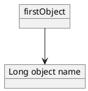
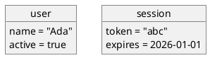
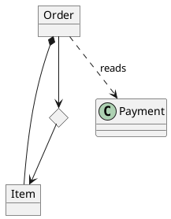
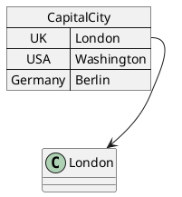
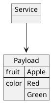

# Ticket: Object-Diagramme mit vollständiger PlantUML-Unterstützung

## Ziel und Scope

Object-Diagramme sollen Objektdeklarationen, Felder, Beziehungen, Maps, JSON-Mixing und gemeinsame Class-Diagramm-Features unterstützen. Der Fokus liegt auf Wiederverwendung der Class-/Component-Basis ohne Class-spezifische Memberlogik zu duplizieren.

## Offizielle Quellen

- https://plantuml.com/de/object-diagram
- https://plantuml.com/de/class-diagram
- https://plantuml.com/de/json
- https://plantuml.com/de/style
- https://plantuml.com/de/creole

## Feature-Inventar mit PUML-Beispielen

### Objekte und Aliase

Akzeptieren: `object`, quoted names, aliases, implicit objects and shared class relationships.

### Felder und Object Bodies

Akzeptieren: body fields, colon fields, primitive-looking values, quoted strings, ordering and wrapping.

### Beziehungen, Diamonds und shared class syntax

Akzeptieren: class-style arrows, `diamond`, labels, line styles, cardinalities where accepted, hidden arrows.

### Maps und PERT-artige Tabellen

Akzeptieren: `map`, key/value rows, `=>`, `A::key` references, links from map entries and PERT-like map usage.

### JSON-Mixing

Akzeptieren: embedded JSON in object diagrams, rendered through shared data diagram support.

## Parser-Plan

- Object declarations and fields as plugin set separate from Class member parser but using shared compartment primitives.
- Map parser as data-table-like plugin with row order preserved.
- Relationship parser reused from class/component arrow model.

## Modell-Plan

- `Box.kind = object | map | diamond | data`.
- Object fields stored as ordered rows.
- Map entries stored as addressable child rows so `Map::key` links can attach.

## Layout-Plan

- ELK graph layout with object/map sizing from text measurement.
- Map entry anchors require stable internal coordinates.

## Renderer-Plan

- Object boxes with underlined object-name convention where feasible.
- Map boxes as key/value tables.
- JSON data boxes delegated to shared JSON renderer.

## Dokumentation und Tests

- Examples: `basic`, `fields`, `maps`, `relationships`, `json`, `styling`, `security`.
- Tests must verify field order and map entry anchors.

## Modul-eigene Artefaktstruktur

Dieses Ticket plant ein eigenes `object`-Diagrammtyp-Modul unter `src/diagrams/object/`. Parser, Layout, Renderer, Security-Profil, Tests, Doku, Szenarien und modulnahe Assets gehoeren physisch in diesen Modulbereich.

`ModuleDocsManifest` und `ModuleTestManifest` verweisen auf diese Modulpfade, statt zentrale Docs-/Testlisten als Quelle der Wahrheit zu verwenden. Generated Review-Artefakte werden modulgespiegelt unter `docs/ressources/generated/modules/object/{puml,excalidraw,svg,png}/<feature>/` erzeugt. Root-Tests bleiben fuer Public API, Cross-Module-Verhalten, Security-wide Gates und Migration reserviert.

## Architekturkompatibilitätsprüfung

- Compatible with Class diagram infrastructure.
- Map entry anchors are the only notable model addition.
- JSON support must not be reimplemented inside object parser.

## Validierungsloop pro Ticket

1. Feature examples parse to stable object/map models.
2. SVG/Excalidraw render object fields and map rows deterministically.
3. Security tests cover keys/values and `Map::key` references.
4. Run `npm test`, `npm run typecheck`, `npm run format:check`.

## Akzeptanzkriterien

- Objects, fields, maps, diamonds, class-like relationships and JSON embedding are supported.
- Map entry references route to visible stable anchors.
- Text and values are escaped in SVG.
