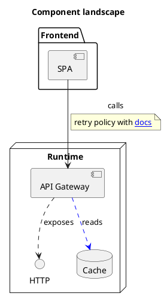
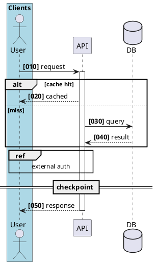
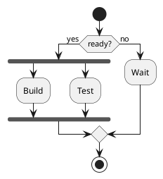
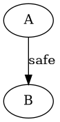

# Ticket: Giga-Masterplan fuer vollständige PlantUML-Unterstützung

## Ziel und Scope

Dieses Giga-Ticket ist das zentrale Umsetzungs- und Ordnungsdokument fuer alle
Tickets in `docs/tickets/`. Es fasst die bestehenden Einzel- und
Querschnittstickets zusammen, formuliert sie entlang der PlantUML-Spezifikation
nochmals aus und legt eine konkrete Reihenfolge fuer die Abarbeitung fest.

Der Masterplan ist kein Ersatz fuer die Einzeltickets. Er definiert, in welcher
Reihenfolge die Subtickets umgesetzt werden, welche gemeinsamen Basisklassen und
Platform Services zuerst entstehen muessen und welche Featuregruppen nicht
mehrfach in einzelnen Diagrammtypen dupliziert werden duerfen.

Die fachliche Umsetzung beginnt bewusst mit den bereits begonnenen
Class- und Component-Diagrammen. Diese beiden Module liefern die erste reale
Extraktionsbasis fuer die graphbasierte Layer-2-Basis. Danach folgen
Querschnittsfeatures und weitere Diagrammtypen in Familien, sodass neue Module
nicht auf ad-hoc Parser-, Layout- oder Renderer-Sonderloesungen aufbauen.

## Eingeschlossene Tickets

Dieses Masterticket umfasst den Inhalt dieser Ticketgruppen:

- Architektur und Governance: `00-ticket-conventions.md`,
  `modular-diagram-architecture-foundation.md`,
  `modular-diagram-architecture-implementation-audit.md`,
  `self-generation-root-subsystem.md`, `docs-architecture-cleanup.md`.
- Angefangene Kernmodule: `class-diagram-full-plantuml-support.md`,
  `component-diagram-full-plantuml-support.md`,
  `sequence-diagram-coverage-audit.md`.
- Gemeinsame PlantUML-Sprache: `commons-global-commands-support.md`,
  `preprocessing-language-support.md`, `style-and-skinparam-support.md`,
  `color-language-support.md`, `creole-markup-support.md`,
  `link-hyperlink-support.md`, `sprite-openiconic-support.md`,
  `theme-support.md`, `sub-diagram-support.md`.
- UML-/Graph-Familie: `deployment-diagram-full-plantuml-support.md`,
  `use-case-diagram-full-plantuml-support.md`,
  `object-diagram-full-plantuml-support.md`,
  `state-diagram-full-plantuml-support.md`,
  `activity-diagram-full-plantuml-support.md`,
  `timing-diagram-full-plantuml-support.md`,
  `archimate-diagram-full-plantuml-support.md`,
  `er-diagram-chen-full-plantuml-support.md`,
  `ie-diagram-full-plantuml-support.md`.
- Daten-, Baum-, Text- und Spezialdiagramme:
  `json-diagram-full-plantuml-support.md`,
  `yaml-diagram-full-plantuml-support.md`,
  `mindmap-diagram-full-plantuml-support.md`,
  `wbs-diagram-full-plantuml-support.md`,
  `files-diagram-full-plantuml-support.md`,
  `nwdiag-full-plantuml-support.md`,
  `gantt-diagram-full-plantuml-support.md`,
  `chart-diagram-full-plantuml-support.md`,
  `salt-wireframe-full-plantuml-support.md`,
  `ebnf-diagram-full-plantuml-support.md`,
  `regex-diagram-full-plantuml-support.md`,
  `ascii-math-latex-full-plantuml-support.md`,
  `ditaa-dot-bridge-support.md`.

## Offizielle Quellen

- `AGENTS.md` und `00-ticket-conventions.md` fuer die lokale
  Architektur- und Ticketstruktur.
- Offizielle PlantUML-Seiten aus den Einzeltickets: Class, Component,
  Sequence, Deployment, Use Case, Object, State, Activity, Timing,
  Gantt, Mindmap, WBS, Nwdiag, JSON, YAML, Salt, Regex, EBNF,
  AsciiMath/LaTeX, ER/Chen, IE, ArchiMate, Ditaa, DOT, Commons, Style,
  Skinparam, Creole, Color, Link, Sprite, OpenIconic, Theme und
  Preprocessing.
- Bestehende lokale Implementierung unter `src/diagrams/`, `src/main/`,
  `src/general/` und `src/util/` als aktuelle Architekturrealitaet.
- Bestehende Tests und generierte Self-/Coverage-Artefakte als
  Regression-Basis.

## Feature-Inventar mit PUML-Beispielen

Das Feature-Inventar dieses Mastertickets ist die Summe aller
Einzeltickets. Die detaillierte Ausformulierung steht in den
Phasenabschnitten und in der Spec-Ausformulierung je Ticketgruppe. Dieses
Meta-Inventar definiert die grobe Abdeckung:

- Strukturdiagramme: Class, Component, Deployment, Use Case, Object,
  State, ArchiMate, ER/Chen, IE.
- Ablauf- und Zeitdiagramme: Sequence, Activity, Timing, Gantt, Chart.
- Daten-, Baum- und Dokumentdiagramme: JSON, YAML, Mindmap, WBS, Files,
  Nwdiag, Salt, EBNF, Regex, AsciiMath/LaTeX.
- Bridges und globale Sprache: Ditaa, DOT, Commons, Style, Skinparam,
  Color, Creole, Links, Sprites, OpenIconic, Themes, Preprocessing und
  Subdiagramme.

Repräsentatives Gesamtbeispiel:

```plantuml
@startuml
!$service = "API"
title **$service** platform
skinparam backgroundColor transparent
<style>
element { FontColor #1f2933; LineColor #475569 }
arrow { LineStyle 4-2; LineColor #0f766e }
</style>
package "Runtime" {
  component "$service" as api
  interface "HTTP" as HTTP
  database Cache
}
class User {
  +id: UUID
  +login(): Session
}
User --> api : [[https://example.invalid calls]]
api ..> HTTP : exposes
api --> Cache : reads
note right of api
  **Creole**, colors, links and safe text
end note
@enduml
```

## Parser-Plan

- Parser-Dispatch bleibt in `src/main/parser.mjs`; fachliche Syntax lebt in
  Modul-Plugins oder gemeinsamen Parser-Services.
- Class und Component liefern zuerst reale Parser-Slices fuer
  GraphStructure, CompartmentNode und UmlRelationship.
- Danach werden Commons, Color, Style, Creole, Links, Sprites, Themes,
  Preprocessing und Subdiagramme als gemeinsame Parser-/Expansion-Schichten
  stabilisiert.
- Neue Diagrammtypen registrieren geordnete Pluginlisten ueber ihr
  Modulmanifest und duerfen keine globalen Engine-Sonderfaelle einfuehren.
- Alle Scanner fuer Quotes, Braces, comments, URLs, style blocks,
  preprocessing expansion und data blocks muessen bounded und ReDoS-arm sein.

## Modell-Plan

- Bestehende Modelle bleiben additiv kompatibel; neue Felder brauchen JSDoc,
  Defaults und Tests.
- Gemeinsame Zwischenformen werden priorisiert: `DiagramArrow`, endpoint
  labels, `InlineText`, `StyleCascade`, `Diagnostic`, DataTree nodes,
  Flow nodes, Timeline rows und Compartment rows.
- Diagrammtypen waehlen passende Modellfamilien statt alles in eine einzige
  Box/Connection-Struktur zu pressen.
- Angreifer-kontrollierte Keys werden ueber `Map` oder kontrollierte Klassen
  verwaltet, nicht ueber ungeschuetzte plain object dictionaries.

## Layout-Plan

- Graphbasierte Diagramme nutzen ELK ueber eine gemeinsame
  GraphStructure-Basis.
- Sequence, Timing und Gantt nutzen deterministische Timeline-Layouts.
- Activity nutzt ein eigenes Flow-Layout mit Branch-, Loop-, Fork- und
  Swimlane-Semantik.
- JSON/YAML/Mindmap/WBS/Files nutzen DataTree-/TreeLayout-Bausteine.
- Layout liest Modelle und geloeste Styles, aber keine PlantUML-Rohsyntax.

## Renderer-Plan

- Excalidraw-Renderer erzeugen deterministische Primitive mit stabilen IDs,
  Seeds, Elementreihenfolgen und Rollen-Metadaten.
- SVG bleibt die wichtigste Injection-Grenze: Text, Attribute, URLs, Stylewerte,
  Marker, Gradients, Fonts und Inline-Assets muessen escaped oder validiert
  werden.
- PNG entsteht nur aus bereits gesichertem SVG.
- Diagramm-Renderer duerfen gemeinsame Primitive und Layer-2-Renderer nutzen,
  aber keine PlantUML-Syntax nachparsen.

## Modul-eigene Artefaktstruktur

Jedes Subticket muss auf diese Zielstruktur hinarbeiten:

```text
src/diagrams/<kind>/
  module.mjs
  parser.mjs
  layout.mjs
  render.mjs
  security.mjs
  assets.mjs
  docs.mjs
  tests.mjs
  plugins/
  tests/
    unit.test.mjs
    integration.test.mjs
    security.test.mjs
    scenarios/<feature>/*.puml
    fixtures/
    expected/
  docs/
    index.template.md.njk
    partials/features/<feature>/
    assets/
  assets/
```

Generated Outputs liegen modulgespiegelt unter:

```text
docs/ressources/generated/modules/<kind>/
  puml/<feature>/*.puml
  excalidraw/<feature>/*.excalidraw
  svg/<feature>/*.svg
  png/<feature>/*.png
```

## Dokumentations- und Beispielplan

- Jedes Modul besitzt eigene Docs-Partials, Feature-Szenarien und Notes.
- `docs` sammelt Modulmanifeste ein und bleibt Assembler, nicht fachliche
  Quelle fuer Featurelisten.
- README/API/Self-Diagramme werden aus Templates und Manifesten generiert.
- Jedes Feature braucht mindestens `basic`, `styling` oder `links`, `nested`
  oder `mixed`, `security` und bei Bedarf `stress`-Szenarien.

## Test- und Sicherheitsplan

- Parser-, Modell-, Layout-, Renderer- und Security-Tests liegen fachlich im
  Modul und werden ueber `ModuleTestManifest` eingesammelt.
- Root-Tests bleiben fuer Public API, Cross-Module-Verhalten,
  Security-wide Gates, Registry/Dependency-Vertraege und Migration.
- Security-Faelle pro Feature: SVG/HTML-Injection, URL scheme abuse,
  unsafe style values, malicious sprites/inline SVG, ReDoS, prototype
  pollution, include/theme/resource denial und grosse Inputs.
- Validierungs-Gates skalieren nach Risiko: mindestens `npm test`,
  `npm run typecheck`, `npm run format:check`; bei Docs/API zusaetzlich
  passende Build-/Manifest-Checks.

## Architekturkompatibilitätsprüfung

Dieses Masterticket ist kompatibel mit der aktuellen Architektur, weil es die
bereits eingefuehrte Modulstruktur respektiert: `src/diagrams/<kind>/` besitzt
Diagrammtyp-Fachlogik, `src/main/` orchestriert Registry/Pipeline,
`src/general/` enthaelt gemeinsame Runtime, Modell-, Layout-, Style-, Platform-
und Render-Services, und `src/util/` enthaelt Low-Level-Helfer. Die geplanten
Layer-2-Basisklassen sind additive Familien ueber dem bestehenden
BaseDiagramModule-Vertrag. Sie verhindern Duplikation, ohne Diagrammtypen als
Module aufzuweichen.

## Leitentscheidungen

- Diagrammtypen sind die Module. `class`, `component`, `sequence`, `state`,
  `activity`, `json`, `yaml`, `gantt`, `mindmap` und weitere leben unter
  `src/diagrams/<kind>/`.
- Gemeinsame Funktionen sind Platform Services oder Layer-2-Basisfamilien, aber
  keine Diagrammtyp-Module: Security, Style, Text, Arrow, Asset,
  Preprocessing, Data Tree, Graph Structure, Tree Layout und External Bridges.
- Parser erkennen PlantUML-Syntax nur in Modul-Plugins oder gemeinsamen
  Parser-Services. Renderer duerfen keine PlantUML-Rohsyntax interpretieren.
- Jede neue Syntax braucht modul-eigene Szenarien, Tests, Doku und
  generierte Review-Artefakte. Das Modulmanifest ist der Index, nicht die
  Quelle der fachlichen Wahrheit.
- Security und Failure-Safety sind Pflichtbestandteil jeder Phase. Externe
  Includes, Remote-Themes, Remote-Bilder, native Bridges und Inline-SVG sind
  deny-by-default.
- Die Reihenfolge priorisiert tragende Basen vor Breite: Class und Component
  zuerst, daraus Graph-Basis extrahieren, dann Common Language stabilisieren,
  dann weitere Familien ausrollen.

## Layer-2-Basisklassen und gemeinsame Familien

Layer 1 ist der bestehende `BaseDiagramModule`-Vertrag mit Facets fuer Parser,
Layout, Renderer, Docs, Tests, Security, Assets und Dependencies. Layer 2
bildet fachliche Basisfamilien, die von mehreren Diagrammtypen genutzt werden.

### Layer 2.1 GraphStructureModuleBase

Ziel: gemeinsame Basis fuer box-/connection-basierte Diagramme.

Nutzer: Class, Component, Deployment, Use Case, Object, State, ArchiMate,
ER/Chen, IE und Teile von Nwdiag.

Gemeinsame Inhalte:

- Box-, Container-, Subcontainer- und Note-Modellierung.
- Connection-Parsing mit `DiagramArrow`, Endpoint-Labels, Kardinalitaeten,
  direction hints, hidden/layout-only edges, Aggregation, Composition,
  Realization, Dependency und Association.
- Container-Parser fuer `package`, `namespace`, `node`, `folder`, `frame`,
  `cloud`, `database`, `rectangle`, Systemgrenzen und Composite States.
- ELK-Adapter, Port-Constraints, deterministische ID-/Reihenfolge und
  graphweite Sizing-Helfer.

Erste Extraktionsbasis: Class und Component.

### Layer 2.2 CompartmentNodeBase

Ziel: gemeinsame Basis fuer Elemente mit strukturierten Textbereichen.

Nutzer: Class, Object, ER/Chen, IE, JSON/YAML-Embedded-Boxes, Salt-Tabellen,
State-Descriptions und teilweise Files.

Gemeinsame Inhalte:

- Compartments mit Titel, Stereotype, Beschreibung, Attributen, Operationen,
  Feldern, Rows, Key/Value-Zeilen und Separatoren.
- Sichtbarkeit, classifier markers, static/abstract, unterstrichene
  Object-Namen und Member-Wrapping.
- Tabellen- und Key/Value-Sizing, stabile interne Anker fuer `Map::key`,
  Object-Felder, ER-Attribute und JSON/YAML-Highlights.

Erste Extraktionsbasis: Class-Member und Object-Fields.

### Layer 2.3 UmlRelationshipBase

Ziel: gemeinsame UML-Beziehungssemantik.

Nutzer: Class, Component, Deployment, Use Case, Object, State, Activity,
ER/Chen, IE und ArchiMate.

Gemeinsame Inhalte:

- Pfeilformen, Linienarten, head/tail glyphs, labels, role labels,
  multiplicities, cardinalities und stereotypes.
- Spezialformen wie lollipop interfaces, association classes, crow's foot,
  diamonds, pseudostate transitions und note-on-link.
- Einheitliche Render- und SVG-Markerlogik mit sicherer Farb- und URL-Behandlung.

### Layer 2.4 FlowControlModuleBase

Ziel: gemeinsame Basis fuer semantische Kontrollflussdiagramme.

Nutzer: Activity, State, Timing-Message-Constraints und teilweise Gantt.

Gemeinsame Inhalte:

- Start/End/Stop, Decision, Merge, Fork, Join, Split, Connector,
  Swimlane/Partition, Loop, Switch, Break/Kill/Detach und Legacy-Normalisierung.
- Flow-Modell mit Blocks, Branches, Edges und Annotations statt reiner
  Box/Connection-Liste.
- Deterministisches Flow-Layout mit Spalten-/Zeilenallokation.

### Layer 2.5 TimelineModuleBase

Ziel: gemeinsame Basis fuer zeitachsenbasierte Diagramme.

Nutzer: Sequence, Timing, Gantt und Chart-Zeitachsen.

Gemeinsame Inhalte:

- Teilnehmer/Rows, Events, Messages, Intervals, Lifelines, Scales, Anchors,
  Constraints, Highlights, Notes und Decorations.
- Zeit-/Reihenfolge-Normalisierung, feste Date Provider fuer Tests und
  deterministische Grid-/Axis-Layouts.

### Layer 2.6 DataTreeModuleBase

Ziel: gemeinsame Basis fuer strukturierte Daten und Baumdarstellungen.

Nutzer: JSON, YAML, Mindmap, WBS, Files, EBNF, Regex und teilweise Salt.

Gemeinsame Inhalte:

- Tree nodes, scalar values, arrays/lists, maps, folded nodes, highlights,
  paths, keys, node styles, word wrap und tree layout.
- Sichere Parser fuer JSON/YAML/grammar-like Quellen ohne Prototype Pollution.

### Layer 2.7 GridDocumentModuleBase

Ziel: gemeinsame Basis fuer Tabellen, Dokumente, Wireframes und Charts.

Nutzer: Salt, Chart, JSON/YAML Tabellenansichten, ER/IE Tabellen, Files und
Gantt-Ressourcen.

Gemeinsame Inhalte:

- Grid sizing, cell spanning, headers, separators, scrollbars, tabs,
  legends, axes, chart series, table notes und rich cell text.

### Layer 2.8 ExternalBridgeModuleBase

Ziel: sichere Einbindung von Formaten, die PlantUML traditionell ueber externe
Renderer oder andere Engines abbildet.

Nutzer: Ditaa, DOT und spaeter moegliche bridge-artige Diagramme.

Gemeinsame Inhalte:

- Bridge-Diagnostics, textuelle Fallbacks, sichere native Non-Goals,
  hermetische Ausfuehrungsanforderungen und deterministic artifact contracts.

## Verbindliche Abarbeitungsreihenfolge

### Phase 0: Master-Governance und offene Planungsdateien

Ziel: Dieses Masterticket als Roadmap etablieren und offene Ticketlogik gegen
die Einzeltickets pruefen.

Subtickets:

1. Dieses Giga-Masterticket erstellen.
2. `modular-diagram-architecture-implementation-audit.md` gegen den aktuellen
   Codezustand nachziehen, falls weitere Refactors umgesetzt werden.
3. `00-ticket-conventions.md` nur dann aktualisieren, wenn dieses Masterticket
   neue Pflichtabschnitte einfuehrt.

Akzeptanz: Das Masterticket referenziert jede Ticketgruppe und enthaelt eine
priorisierte Liste fuer Subtickets.

### Phase 1: Class-Diagramm als erster fachlicher Ausbau

Ziel: Die bereits begonnene Class-Unterstuetzung in ein vollstaendiges,
modul-eigenes Feature-Set ueberfuehren.

Umfang nach PlantUML-Spec:

- `class`, `abstract class`, `interface`, `enum`, `annotation`, `record`,
  quoted names, aliases, stereotypes und generics.
- Member mit Sichtbarkeit `+ - # ~`, `{static}`, `{abstract}`, Compartments,
  Separatoren `--`, `..`, `==`, `__`, lange Signaturen und Wrapping.
- Beziehungen: association, inheritance, realization, dependency,
  composition, aggregation, direction keywords, labels, role labels,
  multiplicities, hidden arrows und styled arrows.
- Packages, namespaces, fully-qualified names, lollipop interfaces,
  association classes, notes, notes on link, links, Creole, hide/show/remove,
  visibility icons, `<style>`, `skinparam` und `allowmixing`.

Minimaler Spec-Regressionstest:

```plantuml
@startuml
package "Billing" {
  abstract class Repository<T>
  interface Serializable
  enum Status { ACTIVE; DISABLED }
  class Order {
    +id: UUID
    --
    {static} +fromJson(text: string): Order
  }
}
Order "1" *-- "many" LineItem : contains
Repository <|.. SqlRepository
note right of Order::fromJson
  parses [[https://example.invalid input]] **safely**
end note
hide empty members
@enduml
```

Layer-2-Output: `CompartmentNodeBase`, `UmlRelationshipBase` und
Graph-Sizing-Helfer werden aus Class extrahierbar dokumentiert.

### Phase 2: Component-Diagramm als zweiter fachlicher Ausbau

Ziel: Component-Unterstuetzung parallel zu Class vervollstaendigen und als
zweite Extraktionsquelle fuer `GraphStructureModuleBase` nutzen.

Umfang nach PlantUML-Spec:

- Komponenten mit `[Name]`, `component`, quoted names, aliases,
  implicit declarations und stable IDs.
- Interfaces mit `()`, `interface`, lollipop notation und
  Component-Interface-Verbindungen.
- Container: `package`, `node`, `folder`, `frame`, `cloud`, `database`,
  `rectangle`, nesting, empty containers und mixed elements.
- Beziehungen: solid/dotted/dashed, direction hints, labels, colors,
  line styles, aggregation/composition, hidden arrows und arrowhead variants.
- Ports: `port`, `portin`, `portout`, `Component::port` references und
  Port-Constraints.
- Notes, note-on-link, title/caption/header/footer/legend/mainframe, links,
  Creole, `left to right direction`, `top to bottom direction`, style,
  skinparam und JSON/YAML `allowmixing`.

Minimaler Spec-Regressionstest:



Layer-2-Output: `GraphStructureModuleBase`, Port-Modell und gemeinsame
Container-/Note-Parser werden aus Class und Component stabilisiert.

### Phase 3: Graph-Layer-2 extrahieren und stabilisieren

Ziel: Nach Class und Component keine weitere graphbasierte Diagrammklasse
beginnen, bevor die gemeinsamen Graph-Basen existieren.

Subtickets:

1. Gemeinsame declaration/container/note/connection Plugins aus Class und
   Component in Layer-2-Graph-Bausteine sortieren.
2. `DiagramArrow`, `ArrowEndpoint`, `ArrowLabel`, `BoxLike`, `ContainerLike`,
   `NoteLike`, `PortLike` und `CompartmentLike` als klare JSDoc-Contracts
   festziehen.
3. ELK-Adapter, Sizing, hidden/layout-only edges und note-on-link als
   gemeinsame Graph-Funktionen testen.
4. Rendererprimitive fuer UML symbols, compartments, notes, ports,
   lollipop interfaces und endpoint labels aus den Diagrammplugins herausziehen.

Akzeptanz: Deployment, Use Case, Object, State, ArchiMate, ER/IE duerfen danach
auf einer gemeinsamen Graphbasis geplant werden, ohne Class-/Component-Code zu
kopieren.

### Phase 4: Gemeinsame PlantUML-Sprache stabilisieren

Ziel: Cross-cutting PlantUML-Syntax einmal implementieren, bevor sie in vielen
Diagrammtypen uneinheitlich auftaucht.

Subtickets in empfohlener Reihenfolge:

1. `commons-global-commands-support.md`: Kommentare, Blockkommentare, title,
   caption, header, footer, legend, mainframe, scale und direction metadata.
2. `color-language-support.md`: named colors, hex, alpha, short hex,
   transparent, gradients, inline `back/line/text`, contrast und `colors`.
3. `style-and-skinparam-support.md`: `<style>` cascade, selectors,
   style properties, nested style blocks und skinparam compatibility.
4. `creole-markup-support.md`: bold, italic, mono, strike, underline,
   headings, lists, tables, links, unicode, emoji, HTML-Creole whitelist.
5. `link-hyperlink-support.md`: inline links, labels, tooltips, `url of`,
   `url for`, topurl, SVG anchors und Excalidraw link metadata.
6. `sprite-openiconic-support.md`: monochrome sprites, encoded sprites,
   OpenIconic, listsprites/listopeniconic und safe inline-asset fallbacks.
7. `theme-support.md`: local packaged themes, stdlib themes, no network by
   default, style merge order und diagnostics.
8. `preprocessing-language-support.md`: variables, conditionals, loops,
   procedures, functions, includes, subparts, imports, builtins,
   assertions, deterministic `%date/%now` und bounded expansion.
9. `sub-diagram-support.md`: `allowmixing`, embedded JSON/YAML/Salt/Math,
   multi-diagram sources und module dispatch boundaries.

Minimaler gemeinsamer Spec-Regressionstest:

```plantuml
@startuml
/' block comment '/
!$name = "Service"
title **$name** overview
caption [[https://example.invalid docs]]
skinparam backgroundColor transparent
<style>
element { FontColor #112233; LineColor #445566 }
arrow { LineStyle 4-2; LineColor #008800 }
</style>
rectangle "$name" #back:palegreen;line:green;text:black
note right
  **bold** //italic// <&account-login> [[https://example.invalid link]]
end note
@enduml
```



Akzeptanz: Neue Diagrammtypen duerfen Style, Creole, Links, Farben,
Preprocessing oder Commons nicht mehr eigenstaendig parsen.

### Phase 5: Sequence als Referenzmodul auditieren und migrieren

Ziel: Die vorhandene Sequence-Coverage bleibt stabil, wird aber in die neue
modul-eigene Artefaktstruktur ueberfuehrt.

Umfang nach PlantUML-Spec:

- Participants, actors, boundaries, controls, databases, queues, aliases,
  groups/boxes, order und hide unlinked.
- Messages: sync, async, reply, lost/found, short arrows, bidirectional,
  endpoint labels, slanted arrows, colors, lifecycle markers und autonumber.
- Fragments: alt, opt, loop, par, break, critical, group, else, and, option,
  nested fragments und terminal breathing room.
- Notes, refs, dividers, delays, spacing, page breaks, header/footer,
  mainframe, footbox, activations, create/destroy und return.
- Style, skinparam, links, Creole, SVG escaping und deterministic layout.

Minimaler Spec-Regressionstest:



Akzeptanz: Sequence bleibt Referenz fuer deterministisches Timeline-Layout,
modul-eigene Coverage und sichere Textausgabe.

### Phase 6: Graph-UML-Familie ausrollen

Ziel: Nach Class, Component und Graph-Basis folgen die eng verwandten
box-/connection-basierten UML-Diagramme.

Reihenfolge und Inhalte:

1. Deployment: nodes, artifacts, databases, clouds, queues, agents,
   devices, components, nested runtime containers, deployment arrows,
   ports, JSON mixing und component-compatible styling.
2. Use Case: actors, usecases, business actors/usecases, actorStyle,
   packages/system boundaries, include/extend/generalization, direction,
   notes, links, style und skinparam.
3. Object: objects, fields, object bodies, diamonds, class-like arrows,
   maps, `Map::key` anchors und JSON mixing.
4. State: simple states, composite states, substates, concurrent regions,
   start/end/history/choice/fork/join, entry/exit points, pins,
   transitions, notes, hide empty description und JSON mixing.
5. ArchiMate: native elements, relationships, junctions, stdlib macros,
   sprites, layer icons und safe include/theme strategy.
6. ER/Chen: entities, weak entities, attributes, multivalued/derived/key
   attributes, relationships, cardinalities, specialization und notes.
7. IE: entities, attributes, crow's-foot cardinalities, identifying/non-
   identifying relationships, optionality, shared class features.

Minimaler gemeinsamer Graph-Familien-Test:

```plantuml
@startuml
node "Runtime" {
  component API
  database DB
}
actor User
usecase "Login" as UC
class Session
object currentSession
state Active {
  [*] --> Idle
}
User --> UC
UC --> API
API --> DB
Session <|-- currentSession
Active --> Session : creates
@enduml
```

Akzeptanz: Jedes Diagramm bleibt eigenes Modul, nutzt aber dieselbe
Graph-/Arrow-/Text-/Style-Basis.

### Phase 7: Flow-, Aktivitaets- und Zeitfamilie

Ziel: Semantische Reihenfolge, Kontrollfluss und Zeitachsen nicht in
generische Graphboxen pressen.

Reihenfolge und Inhalte:

1. Activity: moderne Beta-Syntax, Legacy-Syntax, actions, start/stop/end,
   if/elseif/switch, repeat/while, break/kill/detach/goto, fork/split,
   connectors, swimlanes, partitions, SDL shapes, notes, colors und arrows.
2. Timing: participants, binary/concise/robust/clock signals, time anchors,
   scale, hidden/intricated, messages, constraints, highlights, notes,
   compact mode und ordering.
3. Gantt: tasks, durations, dates, aliases, dependencies, completion,
   resources, calendars, closed days, printscale, zoom, separators, notes,
   today marker und status styles.
4. Chart: series, bar/pie/line-like chart types where supported, grouped,
   stacked, horizontal bars, axes, ticks, grid, legend, annotations und style.

Minimaler Flow-/Timeline-Test:



Akzeptanz: Activity bekommt ein Flow-Modell; Timing/Gantt bekommen
Timeline-Modelle mit deterministischen Achsen und fixed date provider.

### Phase 8: Data-, Tree- und Dokumentfamilie

Ziel: Strukturierte Daten, Baumdiagramme und textuelle Spezifikationen ueber
gemeinsame DataTree- und Document-Basen ausrollen.

Reihenfolge und Inhalte:

1. JSON: strict `JSON.parse`, objects, arrays, scalars, highlights,
   styled highlights, style, Creole values und embedding.
2. YAML: YAML maps/sequences/scalars, specific keys, unicode, highlights,
   style, Creole values und embedding, mit sicherer parser dependency.
3. Mindmap: OrgMode/Markdown syntax, plus/minus sides, multiroot,
   orientation, multiline nodes, boxless nodes, colors, icons und Creole.
4. WBS: OrgMode, direction, arithmetic notation, multiline, boxless,
   colors, word wrap, aliases und cross-arrows.
5. Files: folder/file tree syntax, paths, stereotypes, icons, links,
   nested trees, generated file-system examples ohne realen FS-Zugriff.
6. Nwdiag: networks, nodes, addresses, groups, extended syntax,
   shapes, sprites, icons, layout, common text und style.
7. EBNF: grammar productions, terminals/nonterminals, alternation,
   repetition, optionals, comments, railroad-like layout und links.
8. Regex: regex tokens, groups, alternation, quantifiers, character classes,
   anchors, flags, examples, railroad-like layout und ReDoS diagnostics.
9. AsciiMath/LaTeX: math blocks, formulas, escaping, safe text/vector
   fallback, no remote renderer by default.
10. Salt/Wireframe: controls, text fields, grid, group boxes, separators,
    scrollbars, trees, tabs, menus, advanced tables, colors, Creole und
    Activity embedding.

Minimaler DataTree-Test:

```plantuml
@startjson
<style>
.hot { BackGroundColor red; FontColor white }
</style>
#highlight "items/0" <<hot>>
{
  "items": ["A", "B"],
  "enabled": true
}
@endjson
```



Akzeptanz: JSON/YAML liefern die DataTree-Basis, Mindmap/WBS/Files teilen
TreeLayout, und EBNF/Regex nutzen sichere grammar/document Parser.

### Phase 9: Bridges, Themes, Stdlib und externe Assets

Ziel: PlantUML-Kompatibilitaet fuer Features mit externen Quellen schaffen,
ohne Sicherheitsgrenzen zu verletzen.

Subtickets:

1. `theme-support.md`: packaged themes, stdlib theme names, theme list,
   merge order, diagnostics, no network.
2. `sprite-openiconic-support.md`: packaged OpenIconic and sanitized sprite
   fallbacks.
3. `ditaa-dot-bridge-support.md`: Ditaa and DOT as safe bridge modules with
   text fallback first; native execution only after separate sandbox design.
4. `sub-diagram-support.md`: embedded diagrams and mixing through explicit
   module dispatch, not recursive unsafe parsing.

Minimaler Bridge-Test:



Akzeptanz: Kein externer Prozess, kein Netzwerk und kein Dateisystemzugriff
werden ohne explizit freigegebene Capability genutzt.

### Phase 10: Self-Generation und Docs-Architektur finalisieren

Ziel: Root-nahe Self-Diagramme und Doku-Pipeline aus Modulen sammeln, nicht
hartcodieren.

Subtickets:

1. `self-generation-root-subsystem.md`: Root-Ordner `self/` mit collectors,
   diagrams, templates, tests und output manifest.
2. `docs-architecture-cleanup.md`: Docs als Assembler, Modul-Dokuquellen in
   `src/diagrams/<kind>/docs/`, Tickets-Ordner bleibt erhalten.
3. Build-Manifest-Collector fuer ModuleDocsManifest, ModuleTestManifest,
   ModuleAssetManifest, SecurityProfile und Dependency Graph.

Akzeptanz: README/API/Self-Diagrams konsumieren generierte Manifeste, keine
zentralen Featurelisten pro Diagrammtyp.

## Vollstaendige Spec-Ausformulierung je Ticketgruppe

### Architektur, Security und Modulvertraege

Die Architektur-Tickets verlangen eine closed-world Registry, statische
repo-interne Module, frozen manifests, dependency validation, platform service
capabilities, security profiles, failure boundaries, diagnostics, artifact
validation und modul-eigene Docs/Tests/Assets. Jede Implementierung muss diese
Basis verwenden, bevor neue Syntax breit ausgerollt wird.

Spec-Relevanz: PlantUML-Eingaben sind untrusted. Die Architektur muss daher
alle PlantUML-Features behandeln, die externe Ressourcen oder komplexe
Expansion beruehren: `!include`, `!theme`, sprites, links, HTML-Creole,
remote images, DOT/Ditaa, generated diagrams, massive inputs und nested blocks.

### Class

Class ist der erste Produktiv-Slice. Es deckt die offizielle Class-Spec ab:
class-like declarations, fields, methods, visibility, abstract/static,
relationships, package/namespace, notes, association class, lollipop,
hide/show/remove, style, skinparam und mixed JSON/YAML blocks. Ergebnis ist
nicht nur Class-Coverage, sondern die erste Version von Compartment- und
Relationship-Basis.

### Component

Component ist der zweite Produktiv-Slice. Es deckt Komponenten, interfaces,
lollipop notation, ports, groups/containers, arrows, labels, notes, common
metadata, style/skinparam und data embedding ab. Ergebnis ist die erste echte
GraphStructure-Basis mit Ports und Container-Nesting.

### Sequence

Sequence bleibt Referenz fuer Timeline-Layout. Das Ticket ist ein Audit, kein
Neustart: vorhandene Features werden gegen die offizielle Spec geprueft,
Restluecken in messages, fragments, notes, refs, lifecycle, autonumber,
skinparam/style und common text werden geschlossen, und Coverage-Artefakte
wandern in das Sequence-Modul.

### Commons

Commons umfasst Kommentare, Blockkommentare, title, caption, header, footer,
legend, mainframe, scale, page metadata und diagram direction. Diese Features
mussen vor allem Text-, Layout- und Render-Bands vereinheitlichen.

### Style und Skinparam

Style ist die moderne Zielsyntax; skinparam bleibt Kompatibilitaet. Die Spec
verlangt CSS-like blocks, selectors, nested diagram selectors, style classes,
typography, colors, borders, spacing, shadowing, hyperlink properties und
diagram-specific legacy params. Ergebnis ist eine gemeinsame StyleCascade.

### Farben

Farben umfassen named colors, hex, alpha, short hex, transparent, gradients,
inline style keys, contrast und color functions nach Preprocessing. Ergebnis ist
ein zentraler ColorParser mit SVG-sicheren Tokens und deterministischen Gradient
IDs.

### Creole und HTML-Creole

Creole umfasst Textformatierungen, escaping, headings, lists, tables,
horizontal rules, unicode escapes, emoji, OpenIconic, links, images und
HTML-like tags. Ergebnis ist eine shared InlineText-Zwischenform mit
whitelist-basierten Tags und sicheren Fallbacks.

### Links

Links umfassen inline links, labels, tooltips, explicit `url of/for`, arrow
links, topurl, hyperlink style und renderer metadata. Ergebnis ist eine
allowlist-basierte URL-Policy und sichere SVG-/Excalidraw-Linkausgabe.

### Sprites und OpenIconic

Sprites umfassen monochrome sprite blocks, encoded sprites, inline SVG sprites,
OpenIconic tokens, `listsprites`, `listopeniconic` und stdlib sprite listing.
Ergebnis ist ein Asset-/Inline-Icon-Service mit deny-by-default fuer Remote und
unsanitized SVG.

### Preprocessing

Preprocessing umfasst variables, default assignment, expressions,
conditionals, loops, procedures, functions, keyword/default args, includes,
subparts, imports, themes, builtins, logs, dumps und assertions. Ergebnis ist
eine bounded expansion phase vor Diagramm-Dispatch mit Source Maps,
Loop-/Recursion-/Output-Limits und Sandbox fuer Includes.

### Themes und Subdiagramme

Themes muessen packaged/stdlib, no network, merge order und diagnostics
unterstuetzen. Subdiagramme muessen embedded JSON/YAML/Salt/Math und
multi-diagram sources ueber explizite Modulgrenzen abbilden.

### Deployment, Use Case, Object, State, Activity, Timing

Diese Tickets bilden den Kern der UML-Erweiterung nach Class/Component.
Deployment und Use Case verwenden GraphStructure. Object verwendet
CompartmentNode und DataTree fuer Maps. State verwendet GraphStructure plus
Pseudostates und Composite Regions. Activity bekommt FlowControl. Timing nutzt
Timeline.

### ArchiMate, ER/Chen und IE

Diese Tickets nutzen GraphStructure, brauchen aber eigene Symbolsets und
Relationship-Semantik. ArchiMate haengt stark an Stdlib/Macros/Sprites;
ER/Chen und IE haengen an Entity-/Relationship-/Attribute-/Crow's-Foot-Basen.

### JSON, YAML, Mindmap, WBS, Files und Nwdiag

Diese Tickets bilden die DataTree- und TreeLayout-Familie. JSON/YAML liefern
strukturierte Parser und Highlights. Mindmap/WBS liefern bidirektionale
Baumlayouts. Files/Nwdiag liefern spezialisierte Tree-/Network-Layouts mit
Icons, labels und style.

### Gantt, Chart und Salt

Gantt ist Timeline/Grid mit Kalendersemantik. Chart ist Data/Grid mit Achsen,
Legend und Serien. Salt ist GridDocument mit UI-controls, tables, trees,
tabs, menus und Activity embedding.

### EBNF, Regex, AsciiMath/LaTeX, Ditaa und DOT

EBNF und Regex sind grammar/document Parser mit railroad-aehnlicher Ausgabe.
AsciiMath/LaTeX brauchen sichere textuelle oder vectorisierte Fallbacks ohne
Remote Renderer. Ditaa und DOT sind ExternalBridge-Module: text fallback zuerst,
native execution nur mit separatem Sandbox-Ticket.

## Dependency-Matrix fuer Subtickets

| Subticket | Muss warten auf | Liefert Basis fuer |
| --- | --- | --- |
| Class | aktuelle Architektur | CompartmentNodeBase, UmlRelationshipBase |
| Component | aktuelle Architektur | GraphStructureModuleBase, PortLike |
| Graph-Layer-2 | Class, Component | Deployment, Use Case, Object, State, ArchiMate, ER/IE |
| Commons | Class/Component-Minimum | alle Diagramme |
| Color | Commons-Minimum | Style, arrows, charts, highlights |
| Style/Skinparam | Color | alle Renderer und Layout-Sizing |
| Creole | TextBase | notes, labels, legends, Salt, Mindmap, WBS |
| Links | Creole/TextBase | SVG anchors, Excalidraw metadata |
| Sprites/OpenIconic | AssetBase, TextBase | ArchiMate, Salt, labels |
| Preprocessing | SecurityBase | themes, includes, macros, stdlib |
| Sequence Audit | Commons/Text/Style adapters | TimelineModuleBase |
| Deployment/Use Case/Object | Graph-Layer-2 | Graph-family maturity |
| State | Graph-Layer-2, Flow primitives | Activity/Flow primitives |
| Activity | FlowControlModuleBase | Salt embedding, workflow examples |
| Timing/Gantt | TimelineModuleBase | time-axis features |
| JSON/YAML | DataTreeModuleBase | object/state/usecase embedding |
| Mindmap/WBS/Files | TreeLayout | docs/self tree diagrams |
| Ditaa/DOT | ExternalBridgeModuleBase | bridge policy |
| Self/Docs cleanup | module manifests | generated docs and architecture diagrams |

## Validierungsloop pro Ticket

Jedes Subticket wird in einem kleinen, wiederholbaren Loop umgesetzt:

1. Spec-Abschnitt aus offizieller PlantUML-Seite in modul-eigene
   Featureliste uebertragen.
2. Pro Feature mindestens ein kleines, ein mittleres und ein Security- oder
   Stress-PUML-Szenario im Modul anlegen.
3. Parser-Golden-Test fuer Modellstruktur schreiben.
4. Layout-Test fuer deterministische Geometrie oder Reihenfolge schreiben.
5. Excalidraw-/SVG-Test fuer semantische Render-Elemente schreiben.
6. Security-Test fuer escaping, URL/style/asset limits, ReDoS und
   prototype-pollution-relevante Keys ergaenzen.
7. Modul-Doku und Generated Review-Artefakte aktualisieren.
8. Mindestens `npm test`, `npm run typecheck`, `npm run format:check` ausfuehren;
   bei Doku/API-Aenderungen zusaetzlich docs/API/build checks.

## Nicht-Ziele fuer die erste Gesamtumsetzung

- Kein Laden user-supplied Parser-Plugins aus Dateipfaden.
- Kein Netzwerkzugriff fuer Includes, Themes, Images, Sprites oder Bridges.
- Kein Start externer Prozesse fuer DOT/Ditaa ohne separates Sandbox-Design.
- Kein Renderer, der PlantUML-Rohsyntax nachparst.
- Keine zentralen Docs-Scripts mit hartcodierten Featurelisten pro Diagrammtyp,
  sobald Modulmanifeste vorhanden sind.

## Akzeptanzkriterien

- Class und Component sind die ersten fachlichen Subtickets und liefern die
  erste Layer-2-Graph-/Compartment-Basis.
- Jede weitere Diagrammgruppe haengt sichtbar von einer Layer-2-Basis oder
  einem Platform Service ab.
- Alle existierenden Tickets sind in diesem Masterplan einer Phase und einer
  Basisfamilie zugeordnet.
- Die PlantUML-Spec-Features sind pro Gruppe nochmals explizit benannt und mit
  repräsentativen PUML-Beispielen verbunden.
- Die Reihenfolge verhindert doppelte Implementierung von Commons, Style,
  Creole, Links, Farben, Sprites, Preprocessing und Subdiagrammen.
- Security, deterministische Ausgabe, modul-eigene Tests/Doku und
  Generated-Outputs sind in jeder Phase Pflicht.