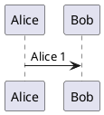

# Ticket: PlantUML-Preprocessing

## Ziel und Scope

Preprocessing is the largest cross-cutting language feature: variables, conditionals, loops, procedures, functions, includes, themes, assertions and builtins. This ticket defines a safe, incremental implementation strategy.

## Offizielle Quellen

- https://plantuml.com/de/preprocessing
- https://plantuml.com/de/theme
- https://plantuml.com/de/color

## Feature-Inventar mit PUML-Beispielen

### Variables, Types und Expressions



Akzeptieren: variables, default assignment `?=`, strings, ints, booleans, JSON values and global/local scope.

### Conditionals und Loops

```plantuml
@startuml
!if %variable_exists("$name")
Alice -> Bob : known
!else
Alice -> Bob : unknown
!endif
!while $count < 3
Alice -> Bob : loop
!$count = $count + 1
!endwhile
@enduml
```

Akzeptieren: `!if`, `!elseif`, `!else`, `!endif`, `!while`, boolean ops and bounded loop execution.

### Procedures, Functions und Invocation

```plantuml
@startuml
!procedure $msg($from, $to, $text="hi")
$from -> $to : $text
!endprocedure
!function $upper($x)
!return %upper($x)
!endfunction
$msg(Alice, Bob, $upper("hello"))
@enduml
```



Akzeptieren: `!procedure`, `!function`, `!return`, default args, keyword args, `!unquoted`, `##` concatenation and dynamic invocation.

### Includes, Subparts, Imports und Themes

```plantuml
@startuml
!include <archimate/Archimate>
!include_once local.puml
!includesub library.puml!PART
!theme spacelab
@enduml
```

Akzeptieren: local/stdlib include strategy, includeonce/includemany, subparts, import and theme directives with explicit sandboxing.

### Builtins, Assertions und Diagnostics

```plantuml
@startuml
!log starting
!assert %strlen("abc") == 3
!$themes = %get_all_theme()
rectangle A #%darken("red", 20)
@enduml
```



Akzeptieren: documented builtin functions such as `%boolval`, `%breakline`, `%chr`, `%darken`, `%lighten`, `%date`, `%feature`, `%get_all_theme`, `%load_json`, `%splitstr`, `%random`, logging/dump/assert. Unsafe filesystem builtins require explicit allowlist or unsupported diagnostic.

## Parser-Plan

- Implement preprocessing as a separate bounded expansion phase before diagram parser dispatch.
- Maintain source maps for diagnostics where possible.
- Includes/themes default to no network and limited local/stdlib resolution.

## Modell-Plan

- Preprocessor output is normalized PlantUML plus diagnostics; no diagram model changes except metadata.

## Layout-Plan

- No direct layout impact.

## Renderer-Plan

- No direct renderer impact; rendered output uses expanded source.

## Architekturkompatibilitätsprüfung

- Must be before parser dispatch and after input size checks.
- Security-critical; cannot be bolted into individual plugins.

## Validierungsloop pro Ticket

1. Unit tests for variables/conditionals/functions/includes.
2. Limits tests for loops, recursion, output size and include depth.
3. Security tests for file/network-related builtins.
4. Run full gate plus audit if dependencies are added.

## Akzeptanzkriterien

- Preprocessing is deterministic, bounded and sandboxed.
- Unsupported dangerous features fail with useful diagnostics.
