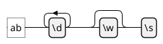
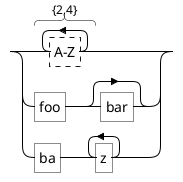

# Ticket: Regex-Diagramme mit vollständiger PlantUML-Unterstützung

## Ziel und Scope

Regex-Diagramme (`@startregex`) sollen regular expressions as visual railroad diagrams rendern. The parser must be robust against ReDoS-style inputs and should not execute regexes.

## Offizielle Quellen

- https://plantuml.com/de/regex
- https://plantuml.com/de/style

## Feature-Inventar mit PUML-Beispielen

### Literals, Classes und Escapes



Akzeptieren: literals, `.`, `\d`, `\w`, `\s`, escaped tab/newline/carriage return/alert/escape/form feed and literal sequence `\Q...\E`.

### Ranges, Repetition und Alternation



Akzeptieren: character ranges, `?`, `+`, `*`, `{n,m}`, `{n,}`, grouping and alternation.

### Unicode und Options

```plantuml
@startregex
!option useDescriptiveNames true
!option language de
\p{Greek}+\u0041\012
@endregex
```

Akzeptieren: descriptive names, language option, octal/unicode escapes, unicode categories/scripts/blocks.

## Parser-Plan

- Build a regex AST parser; never run user regexes.
- Bound nesting, repetition counts and input length.

## Modell-Plan

- Reuse railroad AST concepts from EBNF where possible.
- Store display localization/descriptive names as rendering option.

## Layout-Plan

- Dedicated railroad layout shared with EBNF if abstractions fit.

## Renderer-Plan

- Render character classes, alternatives, groups and repetition loops.

## Modul-eigene Artefaktstruktur

Dieses Ticket plant ein eigenes `regex`-Diagrammtyp-Modul unter `src/diagrams/regex/`. Parser, Layout, Renderer, Security-Profil, Tests, Doku, Szenarien und modulnahe Assets gehoeren physisch in diesen Modulbereich.

`ModuleDocsManifest` und `ModuleTestManifest` verweisen auf diese Modulpfade, statt zentrale Docs-/Testlisten als Quelle der Wahrheit zu verwenden. Generated Review-Artefakte werden modulgespiegelt unter `docs/ressources/generated/modules/regex/{puml,excalidraw,svg,png}/<feature>/` erzeugt. Root-Tests bleiben fuer Public API, Cross-Module-Verhalten, Security-wide Gates und Migration reserviert.

## Architekturkompatibilitätsprüfung

- Shares rendering architecture with EBNF; parser differs.
- Strong security emphasis due regex grammar complexity.

## Validierungsloop pro Ticket

1. AST tests for every regex operator.
2. Fuzz-like bounded parsing tests for long/nested regexes.
3. Render tests for localized descriptive labels.
4. Run standard gate.

## Akzeptanzkriterien

- Regex grammar renders without evaluating regexes.
- Malformed or huge regex inputs remain bounded.
