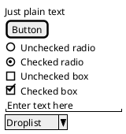
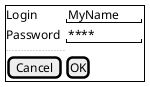
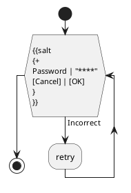

# Ticket: Salt/Wireframe mit vollständiger PlantUML-Unterstützung

## Ziel und Scope

Salt (`@startsalt`) soll UI-Wireframes mit Controls, Tabellen, Trees, Tabs, Menüs, Scrollbars, Creole, Icons und Einbettung in Activity-Diagramme abbilden. Salt braucht ein eigenes Grid-/Widget-Modell.

## Offizielle Quellen

- https://plantuml.com/de/salt
- https://plantuml.com/de/creole
- https://plantuml.com/de/openiconic
- https://plantuml.com/de/style

## Feature-Inventar mit PUML-Beispielen

### Controls und Textfelder

Akzeptieren: buttons, radio, checkbox, text input, droplist, plain text and checked states.

### Grid, Group Box, Separators und Scrollbars

Akzeptieren: grid separators `|`, grid flags `# ! - +`, group box `{^"title"`, separators `.. == ~~ --`, `{S`, `{SI`, `{S-`.

### Trees, Tree Tables, Nesting, Tabs und Menüs

```plantuml
@startsalt
{+
{* File | Edit | Source
  File | New | Open | - | Close }
{/ General | Behavior }
{T!
+Region | Population
+ World | 7.13 billion
++ Europe | 601 million
}
}
@endsalt
```

Akzeptieren: `{T`, tree levels with `+`, tree tables with line modes, nested groups, horizontal/vertical tabs `{/`, menus `{*` and open menus.

### Advanced Tables, Colors, Creole, Pseudo-Sprites

```plantuml
@startsalt
{#
. | Column 2 | Column 3
Row 1 | <color:Blue>value | *
<<folder
.XXXXX.
.X...X.
>> | <<folder>>
}
@endsalt
```

Akzeptieren: cell merge `*`, empty cell `.`, color tags, Creole/HTML-Creole, OpenIconic, images as safe fallback, pseudo-sprite `<< >>`.

### Einbettung in Activity

Akzeptieren: Salt subdiagram blocks inside activity labels once subdiagram support exists.

## Parser-Plan

- Dedicated Salt parser building a widget tree/grid model.
- Cell tokenizer must be quote/Creole aware.
- Subdiagram embedding depends on the subdiagram ticket.

## Modell-Plan

- `SaltDiagram` with widgets, grids, rows, cells, tree nodes, tabs, menus and scrollbars.

## Layout-Plan

- Deterministic grid/table layout with fixed control metrics.
- Tree indentation and merged cells affect column spans.

## Renderer-Plan

- Render familiar UI controls with compact, stable dimensions.
- Creole/OpenIconic through shared inline text renderer.

## Modul-eigene Artefaktstruktur

Dieses Ticket plant ein eigenes `salt`-Diagrammtyp-Modul unter `src/diagrams/salt/`. Parser, Layout, Renderer, Security-Profil, Tests, Doku, Szenarien und modulnahe Assets gehoeren physisch in diesen Modulbereich.

`ModuleDocsManifest` und `ModuleTestManifest` verweisen auf diese Modulpfade, statt zentrale Docs-/Testlisten als Quelle der Wahrheit zu verwenden. Generated Review-Artefakte werden modulgespiegelt unter `docs/ressources/generated/modules/salt/{puml,excalidraw,svg,png}/<feature>/` erzeugt. Root-Tests bleiben fuer Public API, Cross-Module-Verhalten, Security-wide Gates und Migration reserviert.

## Architekturkompatibilitätsprüfung

- Needs new widget model/layout; cannot be forced into generic Box graph without losing grid semantics.

## Validierungsloop pro Ticket

1. Parse control/grid/tree/menu examples.
2. Render stable widget dimensions across SVG/Excalidraw.
3. Security tests for Creole, image tags and pseudo-sprites.
4. Run standard gate.

## Akzeptanzkriterien

- Salt wireframes render controls, grids, trees, tabs and menus deterministically.
- Embedded Salt is gated through subdiagram support.
