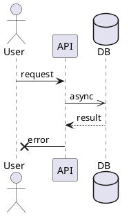
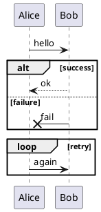
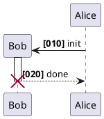

# Ticket: Sequence-Diagramm Coverage-Audit und Restlücken

## Ziel und Scope

Sequenzdiagramme wurden im oberen Chat bereits stark ausgebaut. Dieses Ticket ist kein kompletter Neustart, sondern ein Audit-Ticket: offizielle PlantUML-Features gegen die vorhandene Sequenz-Coverage prüfen, Restlücken dokumentieren und gemeinsame globale Features mit den neuen Tickets synchronisieren.

## Offizielle Quellen

- https://plantuml.com/de/sequence-diagram
- https://plantuml.com/de/commons
- https://plantuml.com/de/style
- https://plantuml.com/de/creole
- https://plantuml.com/de/link

## Feature-Inventar mit PUML-Beispielen

### Participants, Messages und Arrow-Syntax



Audit: participant kinds, aliases, multiline names, all arrow heads/tails, async/lost/found arrows, labels and return arrows.

### Fragments, Groups und Alternatives



Audit: `alt`, `else`, `opt`, `loop`, `par`, `break`, `critical`, `group`, `and`, `option`, nested fragments and layout boxes.

### Notes, Refs, Dividers, Delays und Space

```plantuml
@startuml
Alice -> Bob : start
note over Alice,Bob
  shared note
end note
ref over Alice, Bob : external flow
== divider ==
... delay ...
space 30
@enduml
```

Audit: hnote/rnote, aligned notes, note over multiple participants, refs, dividers, delays, `space`, title/caption/header/footer/legend.

### Lifecycle, Activations und Autonumber



Audit: create/destroy, activation/deactivation nesting, autonumber formats, start/stop/resume autonumber, lifecycle marker rendering.

### Styling, Skinparam, Creole und Links

```plantuml
@startuml
<style>
sequenceDiagram {
  participant { BackgroundColor #EEF }
  arrow { LineColor blue }
}
</style>
Alice -> Bob : [[https://example.invalid link]] **bold**
@enduml
```



Audit: current style support, deprecated skinparam compatibility, Creole inline parsing, links and SVG escaping.

## Parser-Plan

- Keep existing sequence plugin split; add missing features only as focused plugins.
- Align arrow parsing with `DiagramArrow`/`SequenceArrow` if any divergent legacy logic remains.
- Move global common commands into shared parser where other diagrams can reuse them.

## Modell-Plan

- Existing `SequenceDiagram` model should remain the primary structure.
- Add fields only for audited gaps, with JSDoc and defaults.
- Ensure global style/link/Creole metadata matches other diagram models.

## Layout-Plan

- Preserve deterministic table-like layout and centralized `sequence_spacing.mjs`.
- Restlücken in nested self-loops, notes over fragments or activation overlaps get explicit regression examples.

## Renderer-Plan

- Continue two-pass rendering for fragments/refs.
- Audit SVG escaping for all text slots.
- Ensure Excalidraw element order is stable after new common style integration.

## Modul-eigene Artefaktstruktur

Sequence bleibt Referenzmodul unter `src/diagrams/sequence/` und besitzt seine Coverage-Artefakte selbst:

```text
src/diagrams/sequence/
  tests/
    unit.test.mjs
    integration.test.mjs
    security.test.mjs
    scenarios/
      participants/
      messages/
      fragments/
      notes/
      lifecycle/
      styling/
      security/
    fixtures/
    expected/
  docs/
    index.template.md.njk
    partials/
    features/<feature>/
      scenarios/*.puml
      notes.md
```

Generated Review-Artefakte werden modulgespiegelt erzeugt:

```text
docs/ressources/generated/modules/sequence/
  puml/<feature>/*.puml
  excalidraw/<feature>/*.excalidraw
  svg/<feature>/*.svg
  png/<feature>/*.png
```

Root-nahe `tests/sequence_components.test.mjs` und `docs/scripts/sequence-coverage-examples.mjs` sind Migrationsquellen, aber nicht die Zielarchitektur. `ModuleDocsManifest` und `ModuleTestManifest` muessen spaeter auf die physischen Sequence-Pfade zeigen.

## Dokumentation und Tests

- Sequence-Coverage-Beispiele aus `docs/scripts/sequence-coverage-examples.mjs` in `src/diagrams/sequence/docs/features/<feature>/scenarios/` und `src/diagrams/sequence/tests/scenarios/<feature>/` ueberfuehren.
- `tests/sequence_components.test.mjs` bleibt nur als Migrations-/Contract-Gate oder delegiert auf modul-eigene Tests.
- Das Sequence-Dokutemplate erzeugt Coverage-Matrix, bekannte Luecken und Links auf modulgespiegelte SVG-/Excalidraw-/PNG-Outputs.

## Architekturkompatibilitätsprüfung

- Existing sequence architecture already follows the intended layer boundary.
- Main compatibility risk is duplicate global style/Creole/link handling; this should be consolidated, not forked.
- Kompatibel mit der neuen Modul-Ownership, weil Sequence bereits fachlich gekapselt ist und nur die begleitenden Coverage-/Test-/Docs-Artefakte aus Root-Dateien in das Modul wandern muessen.

## Validierungsloop pro Ticket

1. Compare sequence coverage matrix to official page sections.
2. Add missing examples to module-owned Sequence scenarios.
3. Regenerate sequence docs/resources under `docs/ressources/generated/modules/sequence/` if required.
4. Run `npm test`, `npm run typecheck`, `npm run format:check`.

## Akzeptanzkriterien

- Official sequence features are either covered by tests or listed as explicit non-goals.
- Global style/link/Creole behavior matches the new cross-diagram tickets.
- Existing sequence behavior does not regress.
- Sequence besitzt modul-eigene `tests/`, `docs`, Szenarien und Generated-Output-Pfade; Root-Dateien sind nur noch Orchestrierung oder Migration.
