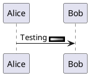

# Ticket: Sprites und OpenIconic

## Ziel und Scope

Sprites and OpenIconic appear in labels, notes, Salt, ArchiMate and Stdlib examples. This ticket plans safe parsing, storage and rendering/fallbacks.

## Offizielle Quellen

- https://plantuml.com/de/sprite
- https://plantuml.com/de/openiconic

## Feature-Inventar mit PUML-Beispielen

### Monochrome Sprites



Akzeptieren: sprite definitions, 4/8/16 gray levels, scale and color options.

### Encoded und Inline SVG Sprites

```plantuml
@startuml
sprite $printer [15x15/8z] NOtH3W0W208HxFz_kMAhj7lHWpa1XC716sz0
sprite react <svg viewBox="0 0 36 36">
<path fill="#77B255" d="M0 0h36v36H0z"/>
</svg>
rectangle <$react{scale=0.2}>
@enduml
```

Akzeptieren: encoded sprites, limited inline SVG subset, scale/color. Inline SVG is an injection surface and requires strict sanitizer or safe fallback.

### OpenIconic

```plantuml
@startuml
Alice -> Bob : <&account-login> login
listopeniconic
@enduml
```

Akzeptieren: `<&ICON_NAME>` and special `listopeniconic` diagram as generated icon table or fallback.

### Stdlib Sprite Listing

```plantuml
@startuml
!include <aws/common>
listsprites
@enduml
```

Akzeptieren: `listsprites` after safe include/stdlib support; otherwise diagnostic.

## Parser-Plan

- Sprite declarations parsed into a registry scoped to a diagram/preprocessed source.
- OpenIconic parser as inline text run.

## Modell-Plan

- Sprite registry stores safe raster/vector metadata or raw source plus sanitizer status.

## Layout-Plan

- Inline sprites affect text measurement; standalone sprite diagrams use grid layout.

## Renderer-Plan

- Render monochrome sprites directly where safe.
- Inline SVG sprites require whitelist sanitizer; otherwise render fallback icon label.

## Architekturkompatibilitätsprüfung

- Shared inline asset layer required; do not implement per diagram.

## Validierungsloop pro Ticket

1. Parser tests for sprite formats and OpenIconic tokens.
2. Security tests for malicious inline SVG.
3. Render tests for scaling/color.
4. Run standard gate.

## Akzeptanzkriterien

- Sprites/icons render safely or degrade explicitly.
- No external asset fetch happens implicitly.
