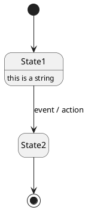
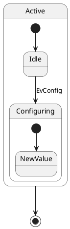
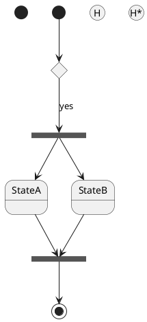
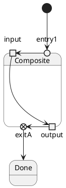
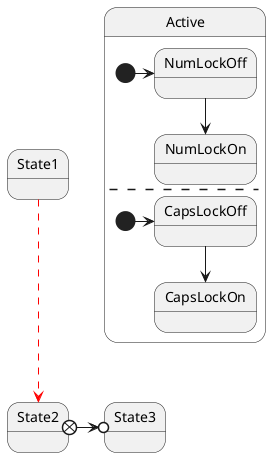
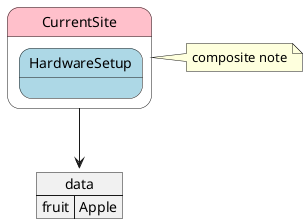

# Ticket: State-Diagramme mit vollständiger PlantUML-Unterstützung

## Ziel und Scope

State-Diagramme sollen Zustände, Pseudostates, Composite States, Transitions, Notes, Styling und JSON-Mixing vollständig unterstützen. Der Diagrammtyp ist graphbasiert, benötigt aber eigene Shapes für Start/End, History, Choice, Fork/Join, Entry/Exit/Pin/Expansion.

## Offizielle Quellen

- https://plantuml.com/de/state-diagram
- https://plantuml.com/de/style
- https://plantuml.com/de/skinparam
- https://plantuml.com/de/color
- https://plantuml.com/de/json

## Feature-Inventar mit PUML-Beispielen

### Einfache Zustände und Beschreibungen

Akzeptieren: `[*]`, `-->`, state descriptions, multiline descriptions and `hide empty description`.

### Composite States und Substates

Akzeptieren: nested `state {}`, substate-to-substate links, dotted qualified state names and parent-child containment.

### History, Fork, Join, Choice und weitere Pseudostates

Akzeptieren: `<<start>>`, `<<end>>`, `<<choice>>`, `<<fork>>`, `<<join>>`, `<<history>>`, `<<history*>>`, `[H]`, `[H*]`, `<<sdlreceive>>`.

### Entry/Exit Points, Pins und Expansion

Akzeptieren: `entryPoint`, `exitPoint`, `inputPin`, `outputPin`, `expansionInput`, `expansionOutput`.

### Concurrent States und Transitions

Akzeptieren: region separator `--` or `||`, arrow direction, line styles/colors and head/tail changes.

### Notes, Inline Style und JSON

Akzeptieren: anchored/floating notes, note on link, inline colors/styles, skinparam/style, JSON display.

## Parser-Plan

- State plugin set: declarations, composite blocks, pseudostates, transitions, notes, style, json mixing.
- Composite parser must support nested blocks without engine changes.
- Pseudostates normalized to `stateKind` rather than stereotypes only.

## Modell-Plan

- New `Box.kind` values for state, start, end, choice, fork, join, history, point, pin, expansion.
- Composite states as containers with region separators.
- Transitions as `Connection` using shared arrow metadata.

## Layout-Plan

- ELK for graph layout; composite states map to nested subgraphs.
- Fork/join bars and history/choice points need fixed dimensions.
- Concurrent regions require internal separators with stable orientation.

## Renderer-Plan

- Render pseudostates as UML state symbols, not generic boxes.
- Composite body and description compartments must be visually distinct.
- SVG escape for state descriptions, guards and actions.

## Dokumentation und Tests

- Examples: `basic`, `composite`, `pseudostates`, `concurrent`, `notes`, `styling`, `json`, `security`.
- Tests for nested substates and region separators are mandatory.

## Modul-eigene Artefaktstruktur

Dieses Ticket plant ein eigenes `state`-Diagrammtyp-Modul unter `src/diagrams/state/`. Parser, Layout, Renderer, Security-Profil, Tests, Doku, Szenarien und modulnahe Assets gehoeren physisch in diesen Modulbereich.

`ModuleDocsManifest` und `ModuleTestManifest` verweisen auf diese Modulpfade, statt zentrale Docs-/Testlisten als Quelle der Wahrheit zu verwenden. Generated Review-Artefakte werden modulgespiegelt unter `docs/ressources/generated/modules/state/{puml,excalidraw,svg,png}/<feature>/` erzeugt. Root-Tests bleiben fuer Public API, Cross-Module-Verhalten, Security-wide Gates und Migration reserviert.

## Architekturkompatibilitätsprüfung

- Compatible with graph pipeline but needs richer `Box.kind` and region metadata.
- Renderer-specific pseudostate symbols should derive from model kind, not raw stereotype text.

## Validierungsloop pro Ticket

1. Pseudostate table against official page.
2. Nested composite state render artifacts reviewed.
3. Transition style/head-tail tests added.
4. Run `npm test`, `npm run typecheck`, `npm run format:check`.

## Akzeptanzkriterien

- All documented state pseudostates and composite constructs are represented.
- Concurrent regions and notes render deterministically.
- State descriptions and guards are escaped and wrapped safely.
