# Ticket: CSS-Style und Skinparam-Kompatibilität

## Ziel und Scope

PlantUML's `<style>` system is the modern styling path; `skinparam` is deprecated but must remain a compatibility layer. This ticket plans one style cascade for all diagram types.

## Offizielle Quellen

- https://plantuml.com/de/style
- https://plantuml.com/de/skinparam

## Feature-Inventar mit PUML-Beispielen

### CSS-like Style Blocks

```plantuml
@startuml
<style>
element { BackGroundColor #EEE }
classDiagram {
  class { RoundCorner 8 }
  .entity { FontStyle bold; LineColor blue }
  arrow { LineStyle 4-2 }
}
</style>
class User <<entity>>
@enduml
```



Akzeptieren: global selectors, diagram selectors, element selectors, class selectors, nested selectors and last-value-wins behavior.

### Style Properties

```plantuml
@startuml
<style>
node {
  FontName Helvetica
  FontColor Coral
  FontSize 12
  FontStyle bold
  BackGroundColor Khaki
  LineColor lightblue
  LineThickness 2
  LineStyle 10-5
  Padding 12
  Margin 3
  MaximumWidth 100
  Shadowing 0
}
</style>
@enduml
```

Akzeptieren: typography, color/background, borders/corners, spacing/sizing, shadowing, hyperlink properties and horizontal alignment.

### Skinparam Compatibility

```plantuml
@startuml
skinparam backgroundColor transparent
skinparam monochrome true
skinparam shadowing false
skinparam class {
  BackgroundColor PaleGreen
  BorderColor SpringGreen
}
skinparam sequenceMessageAlign direction
@enduml
```

Akzeptieren: simple and nested skinparam, monochrome/reverse, shadowing, font name/color/size, sequence alignments and diagram-specific legacy params.

## Parser-Plan

- Parse `<style>` with a small CSS-like block parser, not regex-only.
- Parse `skinparam` into equivalent style tokens where possible and diagnostics where not.

## Modell-Plan

- Diagram models carry a style sheet/cascade object plus per-element style classes.

## Layout-Plan

- Style affects size through font, padding, margin, line thickness and maximum width.

## Renderer-Plan

- Renderers consume resolved styles, not raw skinparam/style strings.

## Architekturkompatibilitätsprüfung

- This is a shared foundation ticket; implementing any new diagram before this must use a compatible style adapter.

## Validierungsloop pro Ticket

1. Unit tests for parser/cascade/skinparam mapping.
2. Cross-diagram render tests for class, sequence, JSON, WBS and timing examples.
3. Security tests for malformed style blocks.
4. Run standard gate.

## Akzeptanzkriterien

- Style and skinparam resolve through one cascade.
- Diagram-specific styling does not fork into renderer hacks.
