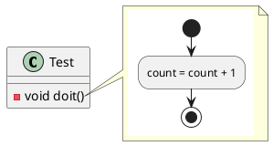
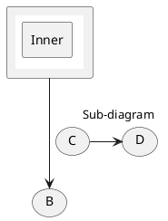

# Ticket: Subdiagramme und Diagramm-Mixing

## Ziel und Scope

Subdiagramme allow PlantUML diagrams inside notes, labels, rectangles and messages via `{{ ... }}`. This ticket plans nested parser dispatch, layout containment and safe rendering.

## Offizielle Quellen

- https://plantuml.com/de/sub-diagram
- https://plantuml.com/de/salt
- https://plantuml.com/de/json
- https://plantuml.com/de/yaml

## Feature-Inventar mit PUML-Beispielen

### Subdiagramm in Note



Akzeptieren: multiline `{{ }}` inside notes and transparent background handling.

### Subdiagramm in Element oder Message



Akzeptieren: subdiagram in elements and one-line subdiagram in messages.

### Inheritance of Handwritten/Skinparam

```plantuml
@startuml
!option handwritten true
component a
note right of a
{{
  a -> b : inherited handwritten
}}
end note
@enduml
```

Akzeptieren: documented inheritance of handwritten skinparam only; other styles resolved by explicit nested diagram rules.

## Parser-Plan

- Shared subdiagram block parser that captures balanced `{{ }}` without breaking braces in strings.
- Nested dispatch to `parsePlantUml` with depth and size limits.

## Modell-Plan

- Text/Note/Box content may contain `EmbeddedDiagram` nodes with child model and diagnostics.

## Layout-Plan

- Parent layout treats embedded diagram as measured content box.
- Child layout runs before parent measurement or through two-pass layout.

## Renderer-Plan

- Render embedded diagram into grouped Excalidraw/SVG elements with local coordinate transform.
- Background transparency handled explicitly.

## Architekturkompatibilitätsprüfung

- Cross-cutting but compatible if implemented as content node + recursive layout/render.
- Requires strict recursion limits.

## Validierungsloop pro Ticket

1. Nested parse tests for notes/elements/messages.
2. Recursion/size limit tests.
3. Render transparent background examples.
4. Run standard gate.

## Akzeptanzkriterien

- Subdiagrams render safely within host diagrams.
- Recursive or huge subdiagrams are bounded.
