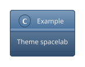
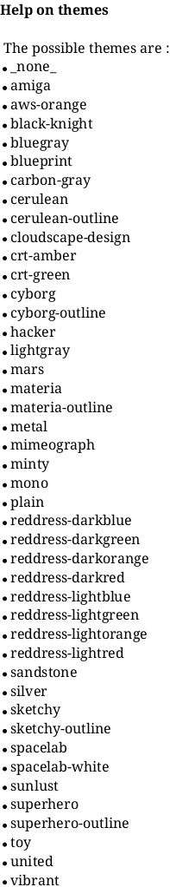
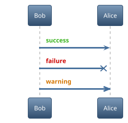

# Ticket: Themes

## Ziel und Scope

Themes (`!theme`) are preprocessor/style bundles. This ticket plans safe official theme support, local/remote theme policy and theme-provided helper procedures.

## Offizielle Quellen

- https://plantuml.com/de/theme
- https://plantuml.com/de/preprocessing
- https://plantuml.com/de/style

## Feature-Inventar mit PUML-Beispielen

### Built-in Themes und Listing





Akzeptieren: built-in `!theme`, `help themes`, `%get_all_theme()` through preprocessing.

### Theme Procedures



Akzeptieren: theme-defined procedures after preprocessing expansion.

### Local und Remote Themes

```plantuml
@startuml
!theme foo from /path/to/themes/folder
!theme amiga from https://example.invalid/themes
@enduml
```

Akzeptieren: local/remote theme directives only if sandbox policy explicitly allows them; otherwise clear diagnostics.

## Parser-Plan

- Themes implemented in preprocessing layer as include/style bundle expansion.
- Built-in theme registry can be vendored/static; remote fetch disabled by default.

## Modell-Plan

- Theme metadata on diagram for diagnostics; actual visual output through style cascade.

## Layout-Plan

- Theme affects layout through resolved style properties only.

## Renderer-Plan

- Renderers consume resolved style, not theme names.

## Architekturkompatibilitätsprüfung

- Depends on preprocessing and style cascade tickets.

## Validierungsloop pro Ticket

1. Built-in theme examples resolve deterministically.
2. Remote/local directives are sandbox-tested.
3. Theme procedure expansion tested.
4. Run standard gate.

## Akzeptanzkriterien

- Built-in themes work or are explicitly listed as unsupported until registry exists.
- No network/file access occurs without deliberate option.
