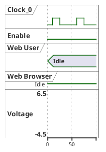
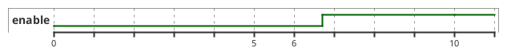
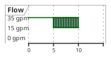
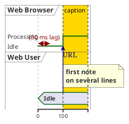

# Ticket: Timing-Diagramme mit vollständiger PlantUML-Unterstützung

## Ziel und Scope

Timing-Diagramme sollen Teilnehmer, Signaltypen, Zeitachsen, relative/absolute Zeiten, Messages, Constraints, Highlights, Notes und Styling unterstützen. Dieser Diagrammtyp benötigt ein tabellen-/zeitachsenbasiertes Modell und Layout, nicht ELK.

## Offizielle Quellen

- https://plantuml.com/de/timing-diagram
- https://plantuml.com/de/style
- https://plantuml.com/de/color
- https://plantuml.com/de/commons

## Feature-Inventar mit PUML-Beispielen

### Teilnehmer und Signaltypen



Akzeptieren: `clock`, `binary`, `concise`, `robust`, `analog`, `compact`, aliases, periods, pulse, offset, analog range.

### Zeiten, Anchors und participant-oriented Syntax



Akzeptieren: absolute time, relative `@+100`, negative time, decimal time, date/time formats, anchors, anchor offsets, participant-oriented blocks.

### Zustände, hidden/intricated und ordering



Akzeptieren: `has` ordering, labels, unknown/intricated `{a,b}`, `{hidden}`, `{-}`, color on states.

### Messages, Constraints, Highlights und Notes



Akzeptieren: messages with optional target times, constraints, captions, highlights, note top/bottom for concise/binary, annotations after state values.

### Axis, Scale, Compact und Styling

```plantuml
@startuml
hide time-axis
manual time-axis
scale 100 as 50 pixels
mode compact
<style>
timingDiagram {
  timeline { FontColor red; LineStyle 4-4 }
  constraintArrow { LineColor Blue; LineThickness 3 }
}
</style>
binary B
@0
B is low
@100
B is high
@enduml
```

Akzeptieren: hide/manual axis, scale, compact global/local, style classes, timeline/constraintArrow style, analog ticks and height.

## Parser-Plan

- Timing parser with declaration plugin, time marker plugin, participant block plugin, state transition plugin, message/constraint/highlight/note plugins.
- Date/time parsing must be bounded and deterministic; do not evaluate arbitrary expressions beyond documented anchor arithmetic.
- Anchors stored as symbolic time references resolved in layout.

## Modell-Plan

- New `TimingDiagram` model: participants, signal type, transitions, states, messages, constraints, highlights, notes, axis config.
- Time values represented as normalized numeric ticks plus original labels.
- Analog/binary/robust/concise rendering metadata stored per participant.

## Layout-Plan

- Dedicated timeline layout with x = time scale and y = participant rows.
- Hidden state segments reserve or collapse space according to PlantUML behavior.
- Manual time-axis labels and date format affect labels only, not model times.

## Renderer-Plan

- Render waveform shapes for binary/clock, stepped robust states, concise blocks and analog polylines.
- Messages and constraints reuse arrow renderer where possible.
- Highlights render as bounded background bands.

## Dokumentation und Tests

- Examples: `signals`, `anchors`, `participant-oriented`, `messages`, `constraints`, `highlights`, `analog`, `axis`, `security`.
- Tests verify time normalization and layout positions.

## Modul-eigene Artefaktstruktur

Dieses Ticket plant ein eigenes `timing`-Diagrammtyp-Modul unter `src/diagrams/timing/`. Parser, Layout, Renderer, Security-Profil, Tests, Doku, Szenarien und modulnahe Assets gehoeren physisch in diesen Modulbereich.

`ModuleDocsManifest` und `ModuleTestManifest` verweisen auf diese Modulpfade, statt zentrale Docs-/Testlisten als Quelle der Wahrheit zu verwenden. Generated Review-Artefakte werden modulgespiegelt unter `docs/ressources/generated/modules/timing/{puml,excalidraw,svg,png}/<feature>/` erzeugt. Root-Tests bleiben fuer Public API, Cross-Module-Verhalten, Security-wide Gates und Migration reserviert.

## Architekturkompatibilitätsprüfung

- Requires new timing-specific model/layout, but compatible with renderer layering.
- Shared style, color, text and arrow code should be reused.

## Validierungsloop pro Ticket

1. Parse each signal/time construct into normalized model.
2. Layout axis and waveforms deterministically.
3. Render SVG/Excalidraw for mixed-signal examples.
4. Run `npm test`, `npm run typecheck`, `npm run format:check`.

## Akzeptanzkriterien

- Timing diagrams support all documented participant/signal/time groups.
- Axis, highlights, constraints and notes render without overlap.
- Date/time and anchor parsing is bounded and secure.
