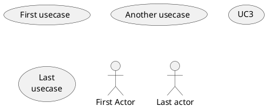
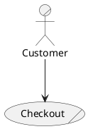
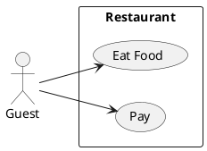
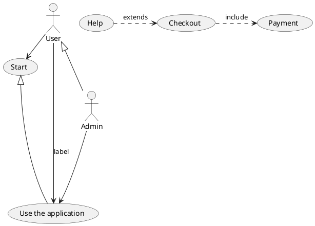
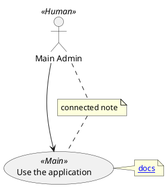

# Ticket: Use-Case-Diagramme mit vollständiger PlantUML-Unterstützung

## Ziel und Scope

Use-Case-Diagramme sollen Actor-, Usecase-, Package-, Relationship-, Note- und Styling-Syntax vollständig unterstützen. Der Diagrammtyp kann größtenteils auf dem bestehenden Box/Connection-Modell aufbauen, braucht aber eigene Shapes für Actor und Oval-Usecases.

## Offizielle Quellen

- https://plantuml.com/de/use-case-diagram
- https://plantuml.com/de/commons
- https://plantuml.com/de/style
- https://plantuml.com/de/skinparam
- https://plantuml.com/de/link
- https://plantuml.com/de/json

## Feature-Inventar mit PUML-Beispielen

### Usecases und Actors



Akzeptieren: Oval-Notation, `usecase`, Colon-Actor-Notation, `actor`, quoted labels, multiline labels, aliases und implizite Deklaration.

### Actor Styles und Business Usecases



Akzeptieren: default stick actor, `awesome`, `hollow`, business actor/usecase mit `/`.

### Packages und Systemgrenzen



Akzeptieren: `package`, `rectangle`, nested actor/usecase groups, `packageStyle rectangle` und Layoutorientierung.

### Beziehungen und Richtung



Akzeptieren: Association, extension/generalization, dashed include/extend, labels, arrow length, reversed arrows, direction keywords and inline arrow style.

### Notes, Stereotypes und Links



Akzeptieren: stereotypes, anchored notes, floating connected notes, links, Creole and note-on-link where accepted by common connection parsing.

### Inline Style, Skinparam und JSON

```plantuml
@startuml
skinparam usecase {
  BackgroundColor<<Main>> YellowGreen
  ActorBackgroundColor<<Human>> Gold
}
actor foo
foo --> (bar) #line:red;line.bold;text:red : red bold
usecase c #palegreen;line:green;line.dashed;text:green
allowmixing
json Payload { "ok": true }
foo --> Payload
@enduml
```

Akzeptieren: skinparam, inline element style, inline arrow style, stereotypes and JSON mixing.

## Parser-Plan

- Usecase-Plugin-Set mit declaration, package, relationship, note and style plugins.
- Actor-/Usecase-Shortforms quote-aware scannen, damit `:Actor:` und `(Use case)` robust funktionieren.
- `/`-Suffix als business flag speichern.
- Relationship parser an gemeinsame Arrow-Klassifikation anbinden.

## Modell-Plan

- `Box.kind` für `actor`, `usecase`, `businessActor`, `businessUsecase`, `packageBoundary`.
- Actor style als presentation metadata, nicht als eigener Parser-Sonderfall im Renderer.
- Packages als Container wie Component/Deployment.

## Layout-Plan

- ELK-Layout mit ovalen Usecase-Mindestgrößen und Actor-Fixed-Aspect-Sizing.
- Package boundaries dürfen Child-Layout nicht verdecken.
- Arrow length syntax beeinflusst Layout nur über rank hints, falls es sicher abbildbar ist.

## Renderer-Plan

- Actor als Excalidraw/SVG-Gruppe rendern; bei `awesome`/`hollow` klare Varianten.
- Usecase als Ellipse mit wrapped text.
- Business-Usecase/-Actor visuell unterscheidbar machen.

## Dokumentation und Tests

- Beispiele für `basic`, `business`, `packages`, `relationships`, `notes`, `styling`, `mixed-json`.
- Security-Tests für Colon-/Parenthesis-Namen, links and notes.

## Modul-eigene Artefaktstruktur

Dieses Ticket plant ein eigenes `use-case`-Diagrammtyp-Modul unter `src/diagrams/use-case/`. Parser, Layout, Renderer, Security-Profil, Tests, Doku, Szenarien und modulnahe Assets gehoeren physisch in diesen Modulbereich.

`ModuleDocsManifest` und `ModuleTestManifest` verweisen auf diese Modulpfade, statt zentrale Docs-/Testlisten als Quelle der Wahrheit zu verwenden. Generated Review-Artefakte werden modulgespiegelt unter `docs/ressources/generated/modules/use-case/{puml,excalidraw,svg,png}/<feature>/` erzeugt. Root-Tests bleiben fuer Public API, Cross-Module-Verhalten, Security-wide Gates und Migration reserviert.

## Architekturkompatibilitätsprüfung

- Gut kompatibel mit Box/Connection und ELK.
- Neue Actor-Zeichnung ist Rendererarbeit, nicht Parserarbeit.
- JSON mixing und style müssen gemeinsame Infrastruktur nutzen.

## Validierungsloop pro Ticket

1. Usecase-Featureliste gegen offizielle Seite abhaken.
2. Parser- und Render-Tests je Featuregruppe anlegen.
3. Actor-/Usecase-Style visuell prüfen.
4. `npm test`, `npm run typecheck`, `npm run format:check` ausführen.

## Akzeptanzkriterien

- Actors, usecases, business variants, packages, notes and relationships sind vollständig abgedeckt.
- Actor-Styles und inline styles sind deterministisch.
- JSON-Mixing und Links sind sicher gerendert.
