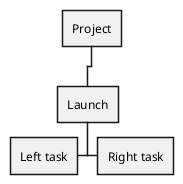
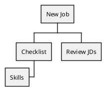
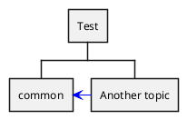

# Ticket: WBS-Diagramme mit vollständiger PlantUML-Unterstützung

## Ziel und Scope

WBS-Diagramme sollen Projektstruktur-Bäume mit OrgMode/arithmetic Syntax, directional branches, boxless nodes, depth styles, aliases and arrows between WBS elements unterstützen.

## Offizielle Quellen

- https://plantuml.com/de/wbs-diagram
- https://plantuml.com/de/style
- https://plantuml.com/de/creole

## Feature-Inventar mit PUML-Beispielen

### OrgMode, Direction und Arithmetic Notation





Akzeptieren: `*` depth, `<`/`>` direction, `+`/`-` arithmetic side notation.

### Multiline und Boxless

```plantuml
@startwbs
* Root
**:Linux Mint
Open Source;
***_ Boxless leaf
**_
*** Skip-layer child
@endwbs
```

Akzeptieren: `:...;`, `_` boxless nodes, underscore-only skip layer.

### Colors, Styles, Word Wrap

```plantuml
@startwbs
<style>
wbsDiagram {
  :depth(1) { BackGroundColor white }
  node { MaximumWidth 100 }
  boxless { FontColor darkgreen }
}
</style>
*[#SkyBlue] Partner workpackage
** Workpackage <<pink>>
@endwbs
```



Akzeptieren: inline colors, style classes, `:depth(n)`, `boxless`, node/arrow style and word wrap.

### Aliases und Cross-Arrows



Akzeptieren: `as` aliases, parenthesized aliases, links/arrows between nodes and styled arrows.

## Parser-Plan

- Share tree-prefix parser with Mindmap where practical.
- WBS-specific direction, alias and skip-layer syntax as extensions.

## Modell-Plan

- Reuse tree diagram model with WBS-specific node flags and aliases.
- Cross-arrows stored separately from tree parent edges.

## Layout-Plan

- Tree layout with left/right branch placement and depth-aware style hooks.
- Cross-arrows routed after tree node positions are known.

## Renderer-Plan

- Render boxes, boxless labels, connectors and cross-arrows.
- Creole and OpenIconic via shared text renderer.

## Modul-eigene Artefaktstruktur

Dieses Ticket plant ein eigenes `wbs`-Diagrammtyp-Modul unter `src/diagrams/wbs/`. Parser, Layout, Renderer, Security-Profil, Tests, Doku, Szenarien und modulnahe Assets gehoeren physisch in diesen Modulbereich.

`ModuleDocsManifest` und `ModuleTestManifest` verweisen auf diese Modulpfade, statt zentrale Docs-/Testlisten als Quelle der Wahrheit zu verwenden. Generated Review-Artefakte werden modulgespiegelt unter `docs/ressources/generated/modules/wbs/{puml,excalidraw,svg,png}/<feature>/` erzeugt. Root-Tests bleiben fuer Public API, Cross-Module-Verhalten, Security-wide Gates und Migration reserviert.

## Architekturkompatibilitätsprüfung

- Strong overlap with Mindmap; implement shared tree primitives to avoid duplication.

## Validierungsloop pro Ticket

1. Tree parser tests for OrgMode and arithmetic notation.
2. Layout tests for direction/skip-layer behavior.
3. Render tests for styles and cross-arrows.
4. Run standard gate.

## Akzeptanzkriterien

- WBS syntax variants, boxless nodes, aliases and cross-arrows are supported.
- Style depth selectors apply deterministically.
