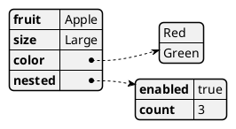
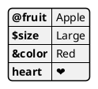
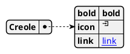

# Ticket: YAML-Diagramme mit vollständiger PlantUML-Unterstützung

## Ziel und Scope

YAML-Diagramme (`@startyaml`) sollen YAML mappings, sequences, scalars, symbolic keys, highlights, styles and Creole support. YAML parsing should use a structured parser dependency only after security review.

## Offizielle Quellen

- https://plantuml.com/de/yaml
- https://plantuml.com/de/style
- https://plantuml.com/de/creole

## Feature-Inventar mit PUML-Beispielen

### YAML Structures

Akzeptieren: mappings, sequences, scalars, booleans, numbers, quoted strings and indentation.

### Specific Keys und Unicode

Akzeptieren: keys with symbols/unicode while preserving source labels.

### Highlights und Styles

```plantuml
@startyaml
<style>
.h1 { BackGroundColor green; FontColor white }
yamlDiagram { node { RoundCorner 0; LineColor lightblue } }
</style>
#highlight "xmas-fifth-day" / "partridges" <<h1>>
xmas-fifth-day:
  partridges:
    count: 1
@endyaml
```

Akzeptieren: `#highlight`, path highlights, classed highlights, `yamlDiagram node/arrow/separator` styles.

### Creole in YAML Values

Akzeptieren: Creole/HTML-Creole where PlantUML renders it; unsafe image tags need safe fallback.

## Parser-Plan

- Evaluate adding a YAML parser dependency with audit; avoid custom indentation parser unless scope is deliberately limited.
- Extract style/highlight directives before YAML body parse.

## Modell-Plan

- Reuse `DataDiagram` from JSON with YAML-specific source labels and scalar types.

## Layout-Plan

- Same deterministic data-tree layout as JSON.

## Renderer-Plan

- Shared data renderer with YAML-specific separators and styles.

## Modul-eigene Artefaktstruktur

Dieses Ticket plant ein eigenes `yaml`-Diagrammtyp-Modul unter `src/diagrams/yaml/`. Parser, Layout, Renderer, Security-Profil, Tests, Doku, Szenarien und modulnahe Assets gehoeren physisch in diesen Modulbereich.

`ModuleDocsManifest` und `ModuleTestManifest` verweisen auf diese Modulpfade, statt zentrale Docs-/Testlisten als Quelle der Wahrheit zu verwenden. Generated Review-Artefakte werden modulgespiegelt unter `docs/ressources/generated/modules/yaml/{puml,excalidraw,svg,png}/<feature>/` erzeugt. Root-Tests bleiben fuer Public API, Cross-Module-Verhalten, Security-wide Gates und Migration reserviert.

## Architekturkompatibilitätsprüfung

- Compatible if JSON/YAML share data model.
- Dependency choice needs npm audit and package size review.

## Validierungsloop pro Ticket

1. YAML parser tests for mappings/sequences/special keys.
2. Highlight/style rendering tests.
3. Dependency audit if a parser package is introduced.
4. Run standard gate plus `npm audit --omit=dev --audit-level=high`.

## Akzeptanzkriterien

- YAML parses structurally and safely.
- Rendering is consistent with JSON diagrams.
