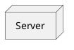
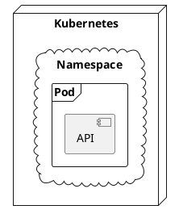
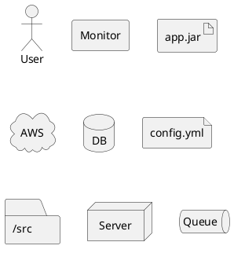
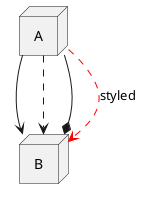
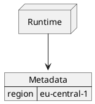

# Prompt: Deployment-Diagramm Implementierung (mit Feedback-Loop)

## Verzweigungslogik

```
IF (vorherige_aufgabe_abgeschlossen == true):
    → Starte mit Deployment-Diagramm Implementierung
ELSE:
    → Validiere vorherige Ergebnisse im Feedback-Loop
    → Prüfe, ob weitergemacht werden muss
    → Falls ja: Schließe vorherige Aufgabe ab
    → Falls nein: Starte Deployment-Diagramm Implementierung
```

---

## Aufgabenbeschreibung

**Ziel**: Implementiere das **Deployment-Diagramm** als nächsten Diagrammtyp gemäß dem Gigaticket (`plantuml-full-support-giga-master-ticket.md`).

**Priorität**: Deployment ist das erste Diagramm in **Phase 6** (Graph-UML-Familie) und baut direkt auf den bestehenden `GraphStructureModuleBase` aus Class/Component auf.

---

## Architektur-Übersicht (aus der detaillierten Analyse)

### 1. Modul-Struktur (folgt dem etablierten Pattern)

```
src/diagrams/deployment/
├── module.mjs              # DeploymentDiagramModule extends GraphModuleBase
├── parser.mjs              # Parser-Contract mit Deployment-spezifischen Plugins
├── layout.mjs              # ELK-basiertes Layout mit Port-Positionierung
├── render.mjs              # Excalidraw + SVG Renderer
├── security.mjs            # Security-Profile
├── assets.mjs              # Asset-Manifest
├── docs.mjs                # Dokumentations-Manifest
├── tests.mjs               # Test-Manifest
├── plugins/                # Parser-Plugins
│   ├── shapes.mjs          # 23 Deployment-Shapes
│   ├── containers.mjs      # node, cloud, database, etc.
│   ├── ports.mjs           # port, portin, portout
│   ├── connections.mjs     # Arrow-Varianten
│   └── notes.mjs           # Notizen
└── tests/                  # Modul-eigene Tests
    ├── unit.test.mjs
    ├── integration.test.mjs
    ├── security.test.mjs
    └── scenarios/
        ├── basic/
        ├── ports/
        ├── arrows/
        ├── styling/
        └── json/
```

### 2. Unterstützte Shapes (23 Stück)

| Shape       | Syntax                | Shape         | Syntax               |
| ----------- | --------------------- | ------------- | -------------------- |
| `actor`     | `actor "User"`        | `agent`       | `agent "Monitor"`    |
| `artifact`  | `artifact "app.jar"`  | `boundary`    | `boundary "API"`     |
| `card`      | `card "Info"`         | `circle`      | `circle "Start"`     |
| `cloud`     | `cloud "AWS"`         | `collections` | `collections "Data"` |
| `component` | `component "Service"` | `control`     | `control "Ctrl"`     |
| `database`  | `database "DB"`       | `entity`      | `entity "Entity"`    |
| `file`      | `file "config.yml"`   | `folder`      | `folder "/src"`      |
| `frame`     | `frame "Frame"`       | `hexagon`     | `hexagon "Hex"`      |
| `interface` | `interface "HTTP"`    | `label`       | `label "Text"`       |
| `node`      | `node "Server"`       | `package`     | `package "Pkg"`      |
| `person`    | `person "Admin"`      | `queue`       | `queue "Queue"`      |
| `rectangle` | `rectangle "Box"`     | `stack`       | `stack "Stack"`      |
| `storage`   | `storage "Disk"`      | `usecase`     | `usecase "UC"`       |

### 3. Port-Syntax

```plantuml
@startuml
node Server {
  portin http
  portout events
}
Server::http --> [Proxy]
Server::events --> queue Broker
@enduml
```

### 4. Arrow-Varianten

| Syntax | Bedeutung   | Syntax             | Bedeutung   |
| ------ | ----------- | ------------------ | ----------- |
| `-->`  | Solid       | `..>`              | Dashed      |
| `--*`  | Composition | `--o`              | Aggregation |
| `--+`  | Public port | `--#`              | Protected   |
| `-->>` | Thick       | `--0`              | Circle end  |
| `--^`  | Inheritance | `-[#red,dashed]->` | Styled      |

---

## Test-Diagramme (pro Feature ein kleines Testdiagramm)

### T1: Basic Node



### T2: Nested Containers



### T3: All Shapes



### T4: Ports

```plantuml
@startuml
node Server {
  portin http
  portout events
}
Server::http --> [Proxy]
@enduml
```

### T5: Arrow Styles



### T6: JSON Mixing



---

## Security-Anforderungen

- **XSS-Prevention**: Alle Labels/Names müssen escaped werden
- **Input-Limits**: Max 10MB, max 1000 Nodes, max 2000 Connections
- **Port-Validation**: Keine Code-Injection über Port-Namen
- **SVG-Escaping**: Alle Text-Elemente in SVG escapen

---

## Akzeptanzkriterien

- [ ] Alle 23 Deployment-Shapes können deklariert werden
- [ ] Container-Nesting funktioniert (beliebige Tiefe)
- [ ] Ports können deklariert und referenziert werden (`Node::port`)
- [ ] Alle Arrow-Styles werden unterstützt
- [ ] Excalidraw-Output ist deterministisch
- [ ] SVG-Output ist escaped und sicher
- [ ] Alle Tests passieren (`npm test`)
- [ ] Typecheck passiert (`npm run typecheck`)
- [ ] Format-Check passiert (`npm run format:check`)

---

## Implementierungs-Reihenfolge

1. **Phase 1**: Grundgerüst (module.mjs, parser.mjs, stubs)
2. **Phase 2**: Parser-Plugins (Shapes, Containers, Ports, Connections)
3. **Phase 3**: Layout (ELK-Integration, Port-Positionierung)
4. **Phase 4**: Renderer (Excalidraw + SVG für alle Shapes)
5. **Phase 5**: Tests (Unit, Integration, Security, Scenarios)
6. **Phase 6**: Dokumentation

---

## Referenzen

- **Gigaticket**: `docs/tickets/plantuml-full-support-giga-master-ticket.md`
- **Deployment-Ticket**: `docs/tickets/deployment-diagram-full-plantuml-support.md`
- **PlantUML-Doku**: https://plantuml.com/de/deployment-diagram
- **Bestehende Module**: `src/diagrams/class/`, `src/diagrams/component/`, `src/diagrams/sequence/`
- **Shared Plugins**: `src/diagrams/shared/graph_plugins/`

---

## Wichtige Hinweise

1. **Code-Location**: Alle neuen Dateien unter `src/diagrams/deployment/`
2. **Einheitliche Architektur**: Nutze bestehende `GraphModuleBase`, `GraphStructureModuleBase`
3. **Shared Plugins**: Wiederverwende Plugins aus `src/diagrams/shared/graph_plugins/` wo möglich
4. **Determinismus**: IDs müssen stabil sein (kein `Math.random()`)
5. **Security**: Alle Outputs müssen escaped werden (SVG-Injection-Prevention)

---

## Feedback-Loop Prozess

### Schritt 1: Validierung

- Prüfe, ob alle vorherigen Aufgaben abgeschlossen sind
- Überprüfe Test-Ergebnisse der bestehenden Module
- Validiere, ob die Architektur stabil ist

### Schritt 2: Entscheidung

```
WENN (alle Abhängigkeiten erfüllt):
    → Starte Deployment-Implementierung
SONST:
    → Dokumentiere offene Punkte
    → Schließe Blocker zuerst ab
```

### Schritt 3: Implementierung

- Folge der definierten Implementierungs-Reihenfolge
- Erstelle für jede Phase kleine Testdiagramme
- Validiere nach jeder Phase mit `npm test`

### Schritt 4: Abschluss-Validierung

- Führe vollständigen Test-Gate aus:
  ```bash
  npm test
  npm run typecheck
  npm run format:check
  npm audit --omit=dev --audit-level=high
  ```
- Erstelle modul-eigene Dokumentation
- Generiere Review-Artefakte

---

**Soll mit der Implementierung des Deployment-Diagramms begonnen werden?**
